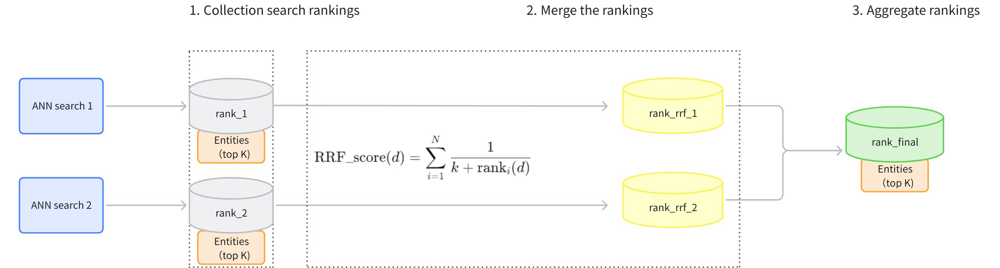

# RRF Ranker

Reciprocal Rank Fusion (RRF) Ranker is a reranking strategy for Milvus hybrid search that balances results from multiple vector search paths based on their ranking positions rather than their raw similarity scores. Like a sports tournament that considers players' rankings rather than individual statistics, RRF Ranker combines search results based on how highly each item ranks in different search paths, creating a fair and balanced final ranking.

## When to use RRF Ranker

RRF Ranker is specifically designed for hybrid search scenarios where you want to balance results from multiple vector search paths without assigning explicit importance weights. It's particularly effective for:

<table>
   <tr>
     <th><p>Use Case</p></th>
     <th><p>Example</p></th>
     <th><p>Why RRF Ranker Works Well</p></th>
   </tr>
   <tr>
     <td><p>Multimodal search with equal importance</p></td>
     <td><p>Image-text search where both modalities matter equally</p></td>
     <td><p>Balances results without requiring arbitrary weight assignments</p></td>
   </tr>
   <tr>
     <td><p>Ensemble vector search</p></td>
     <td><p>Combining results from different embedding models</p></td>
     <td><p>Democratically merges rankings without favoring any particular model's scoring distribution</p></td>
   </tr>
   <tr>
     <td><p>Cross-lingual search</p></td>
     <td><p>Finding documents across multiple languages</p></td>
     <td><p>Ranks results fairly regardless of language-specific embedding characteristics</p></td>
   </tr>
   <tr>
     <td><p>Expert recommendations</p></td>
     <td><p>Combining recommendations from multiple expert systems</p></td>
     <td><p>Creates consensus rankings when different systems use incomparable scoring methods</p></td>
   </tr>
</table>

If your hybrid search application requires balancing multiple search paths democratically without assigning explicit weights, RRF Ranker is your ideal choice.

## Mechanism of RRF Ranker

The main workflow of the RRFRanker strategy is as follows:

1. **Collect Search Rankings**: Collect the rankings of results from each path of vector search (rank_1, rank_2).

1. **Merge Rankings**: Convert the rankings from each path (rank_rrf_1, rank_rrf_2) according to a formula.

    The calculation formula involves *N*, which represents the number of retrievals. *ranki*(*d*) is the ranking position of document *d*  generated by the *i(th)* retriever. *k* is a smoothing parameter typically set at 60.

1. **Aggregate Rankings**: Re-rank the search results based on the combined rankings to produce the final results.



## Example of RRF Ranker

This example demonstrates a Hybrid Search (topK=5) on sparse-dense vectors and illustrates how the RRFRanker strategy reranks the results from two ANN searches.

- Results of ANN search on sparse vectors of texts （topK=5)：

    <table>
       <tr>
         <th><p><strong>ID</strong></p></th>
         <th><p><strong>Rank (sparse)</strong></p></th>
       </tr>
       <tr>
         <td><p>101</p></td>
         <td><p>1</p></td>
       </tr>
       <tr>
         <td><p>203</p></td>
         <td><p>2</p></td>
       </tr>
       <tr>
         <td><p>150</p></td>
         <td><p>3</p></td>
       </tr>
       <tr>
         <td><p>198</p></td>
         <td><p>4</p></td>
       </tr>
       <tr>
         <td><p>175</p></td>
         <td><p>5</p></td>
       </tr>
    </table>

- Results of ANN search on dense vectors of texts （topK=5)：

    <table>
       <tr>
         <th><p><strong>ID</strong></p></th>
         <th><p><strong>Rank (dense)</strong></p></th>
       </tr>
       <tr>
         <td><p>198</p></td>
         <td><p>1</p></td>
       </tr>
       <tr>
         <td><p>101</p></td>
         <td><p>2</p></td>
       </tr>
       <tr>
         <td><p>110</p></td>
         <td><p>3</p></td>
       </tr>
       <tr>
         <td><p>175</p></td>
         <td><p>4</p></td>
       </tr>
       <tr>
         <td><p>250</p></td>
         <td><p>5</p></td>
       </tr>
    </table>

- Use RRF to rearrange the rankings of the two sets of search results. Assume that the smoothing parameter `k` is set at 60.

    <table>
       <tr>
         <th><p><strong>ID</strong></p></th>
         <th><p><strong>Score (Sparse)</strong></p></th>
         <th><p><strong>Score (Dense)</strong></p></th>
         <th><p><strong>Final Score</strong></p></th>
       </tr>
       <tr>
         <td><p>101</p></td>
         <td><p>1</p></td>
         <td><p>2</p></td>
         <td><p>1/(60+1)+1/(60+2) = 0.03252247</p></td>
       </tr>
       <tr>
         <td><p>198</p></td>
         <td><p>4</p></td>
         <td><p>1</p></td>
         <td><p>1/(60+4)+1/(60+1) = 0.03201844</p></td>
       </tr>
       <tr>
         <td><p>175</p></td>
         <td><p>5</p></td>
         <td><p>4</p></td>
         <td><p>1/(60+5)+1/(60+4) = 0.03100962</p></td>
       </tr>
       <tr>
         <td><p>203</p></td>
         <td><p>2</p></td>
         <td><p>N/A</p></td>
         <td><p>1/(60+2) = 0.01612903</p></td>
       </tr>
       <tr>
         <td><p>150</p></td>
         <td><p>3</p></td>
         <td><p>N/A</p></td>
         <td><p>1/(60+3) = 0.01587302</p></td>
       </tr>
       <tr>
         <td><p>110</p></td>
         <td><p>N/A</p></td>
         <td><p>3</p></td>
         <td><p>1/(60+3) = 0.01587302</p></td>
       </tr>
       <tr>
         <td><p>250</p></td>
         <td><p>N/A</p></td>
         <td><p>5</p></td>
         <td><p>1/(60+5) = 0.01538462</p></td>
       </tr>
    </table>

- The final results after reranking（topK=5)：

    <table>
       <tr>
         <th><p><strong>Rank</strong></p></th>
         <th><p><strong>ID</strong></p></th>
         <th><p><strong>Final Score</strong></p></th>
       </tr>
       <tr>
         <td><p>1</p></td>
         <td><p>101</p></td>
         <td><p>0.03252247</p></td>
       </tr>
       <tr>
         <td><p>2</p></td>
         <td><p>198</p></td>
         <td><p>0.03201844</p></td>
       </tr>
       <tr>
         <td><p>3</p></td>
         <td><p>175</p></td>
         <td><p>0.03100962</p></td>
       </tr>
       <tr>
         <td><p>4</p></td>
         <td><p>203</p></td>
         <td><p>0.01612903</p></td>
       </tr>
       <tr>
         <td><p>5</p></td>
         <td><p>150</p></td>
         <td><p>0.01587302</p></td>
       </tr>
       <tr>
         <td><p>5</p></td>
         <td><p>110</p></td>
         <td><p>0.01587302</p></td>
       </tr>
    </table>

## Usage of RRF Ranker

When using the RRF reranking strategy, you need to configure the parameter `k`. It is a smoothing parameter that can effectively alter the relative weights of full-text search versus vector search. The default value of this parameter is 60, and it can be adjusted within a range of (0, 16384). The value should be floating-point numbers. The recommended value is between [10, 100]. While `k=60` is a common choice, the optimal `k` value can vary depending on your specific applications and datasets. We recommend testing and adjusting this parameter based on your specific use case to achieve the best performance.

### Create an RRF Ranker

After your collection is set up with multiple vector fields, create an RRF Ranker with an appropriate smoothing parameter:

<div class="alert note">

Milvus 2.6.x and later let you configure reranking strategies directly via the `Function` API. If you’re using an earlier release (before v2.6.0), refer to the [Reranking](https://milvus.io/docs/v2.5.x/reranking.md#Usage-of-RRFRanker) documentation for setup instructions.

</div>

<div class="multipleCode">
    <a href="#python">Python</a>
    <a href="#java">Java</a>
    <a href="#javascript">NodeJS</a>
    <a href="#go">Go</a>
    <a href="#bash">cURL</a>
</div>

```python
from pymilvus import Function, FunctionType

ranker = Function(
    name="rrf",
    input_field_names=[], # Must be an empty list
    function_type=FunctionType.RERANK,
    params={
        "reranker": "rrf", 
        "k": 100  # Optional
    }
)
```

```java
import io.milvus.common.clientenum.FunctionType;
import io.milvus.v2.service.collection.request.CreateCollectionReq;

CreateCollectionReq.Function rerank = CreateCollectionReq.Function.builder()
        .name("rrf")
        .functionType(FunctionType.RERANK)
        .param("reranker", "rrf")
        .param("k", "100")
        .build();
```

```javascript
import { FunctionType } from "@zilliz/milvus2-sdk-node";

const ranker = {
  name: "weight",
  input_field_names: [],
  function_type: FunctionType.RERANK,
  params: {
    reranker: "weighted",
    weights: [0.1, 0.9],
    norm_score: true,
  },
};

```

```go
// Go
```

```bash
# Restful
```

<table>
   <tr>
     <th><p>Parameter</p></th>
     <th><p>Required?</p></th>
     <th><p>Description</p></th>
     <th><p>Value/Example</p></th>
   </tr>
   <tr>
     <td><p><code>name</code></p></td>
     <td><p>Yes</p></td>
     <td><p>Unique identifier for this Function</p></td>
     <td><p><code>"rrf"</code></p></td>
   </tr>
   <tr>
     <td><p><code>input_field_names</code></p></td>
     <td><p>Yes</p></td>
     <td><p>List of vector fields to apply the function to (must be empty for RRF Ranker)</p></td>
     <td><p>[]</p></td>
   </tr>
   <tr>
     <td><p><code>function_type</code></p></td>
     <td><p>Yes</p></td>
     <td><p>The type of Function to invoke; use <code>RERANK</code> to specify a reranking strategy</p></td>
     <td><p><code>FunctionType.RERANK</code></p></td>
   </tr>
   <tr>
     <td><p><code>params.reranker</code></p></td>
     <td><p>Yes</p></td>
     <td><p>Specifies the reranking method to use.</p><p>Must be set to <code>rrf</code> to use RRF Ranker.</p></td>
     <td><p><code>"weighted"</code></p></td>
   </tr>
   <tr>
     <td><p><code>params.k</code></p></td>
     <td><p>No</p></td>
     <td><p>Smoothing parameter that controls the impact of document ranks; higher <code>k</code> reduces sensitivity to top ranks. Range: (0, 16384); default: <code>60</code>.</p><p>For details, refer to <a href="rrf-ranker.md#Mechanism-of-RRF-Ranker">Mechanism of RRF Ranker</a>.</p></td>
     <td><p><code>100</code></p></td>
   </tr>
</table>

### Apply to hybrid search

RRF Ranker is designed specifically for hybrid search operations that combine multiple vector fields. Here's how to use it in a hybrid search:

<div class="multipleCode">
    <a href="#python">Python</a>
    <a href="#java">Java</a>
    <a href="#javascript">NodeJS</a>
    <a href="#go">Go</a>
    <a href="#bash">cURL</a>
</div>

```python
from pymilvus import MilvusClient, AnnSearchRequest

# Connect to Milvus server
milvus_client = MilvusClient(uri="http://localhost:19530")

# Assume you have a collection setup

# Define text vector search request
text_search = AnnSearchRequest(
    data=["modern dining table"],
    anns_field="text_vector",
    param={},
    limit=10
)

# Define image vector search request
image_search = AnnSearchRequest(
    data=[image_embedding],  # Image embedding vector
    anns_field="image_vector",
    param={},
    limit=10
)

# Apply RRF Ranker to product hybrid search
# The smoothing parameter k controls the balance
hybrid_results = milvus_client.hybrid_search(
    collection_name,
    [text_search, image_search],  # Multiple search requests
    # highlight-next-line
    ranker=ranker,  # Apply the RRF ranker
    limit=10,
    output_fields=["product_name", "price", "category"]
)
```

```java
import io.milvus.v2.client.ConnectConfig;
import io.milvus.v2.client.MilvusClientV2;
import io.milvus.v2.service.vector.request.AnnSearchReq;
import io.milvus.v2.service.vector.request.HybridSearchReq;
import io.milvus.v2.service.vector.response.SearchResp;
import io.milvus.v2.service.vector.request.data.EmbeddedText;
import io.milvus.v2.service.vector.request.data.FloatVec;

MilvusClientV2 client = new MilvusClientV2(ConnectConfig.builder()
        .uri("http://localhost:19530")
        .build());
        
List<AnnSearchReq> searchRequests = new ArrayList<>();
searchRequests.add(AnnSearchReq.builder()
        .vectorFieldName("text_vector")
        .vectors(Collections.singletonList(new EmbeddedText("\"modern dining table\"")))
        .limit(10)
        .build());
searchRequests.add(AnnSearchReq.builder()
        .vectorFieldName("image_vector")
        .vectors(Collections.singletonList(new FloatVec(imageEmbedding)))
        .limit(10)
        .build());
        
HybridSearchReq hybridSearchReq = HybridSearchReq.builder()
                .collectionName(COLLECTION_NAME)
                .searchRequests(searchRequests)
                .ranker(ranker)
                .limit(10)
                .outputFields(Arrays.asList("product_name", "price", "category"))
                .build();
SearchResp searchResp = client.hybridSearch(hybridSearchReq);
```

```javascript
import { MilvusClient, FunctionType } from "@zilliz/milvus2-sdk-node";

const milvusClient = new MilvusClient({ address: "http://localhost:19530" });

const text_search = {
    data: ["modern dining table"],
    anns_field: "text_vector",
    param: {},
    limit: 10,
};

const image_search = {
  data: [image_embedding],
  anns_field: "image_vector",
  param: {},
  limit: 10,
};

const ranker = {
  name: "weight",
  input_field_names: [],
  function_type: FunctionType.RERANK,
  params: {
    reranker: "weighted",
    weights: [0.1, 0.9],
    norm_score: true,
  },
};

const search = await milvusClient.search({
  collection_name: collection_name,
  data: [text_search, image_search],
  output_fields: ["product_name", "price", "category"],
  limit: 10,
  rerank: ranker,
});
```

```go
// go
```

```bash
# restful
```

For more information on hybrid search, refer to [Multi-Vector Hybrid Search](multi-vector-search.md).