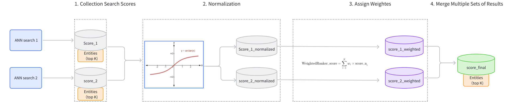

# Weighted Ranker

Weighted Ranker intelligently combines and prioritizes results from multiple search paths by assigning different importance weights to each. Similar to how a skilled chef balances multiple ingredients to create the perfect dish, Weighted Ranker balances different search results to deliver the most relevant combined outcomes. This approach is ideal when searching across multiple vector fields or modalities where certain fields should contribute more significantly to the final ranking than others.

## When to use Weighted Ranker

Weighted Ranker is specifically designed for hybrid search scenarios where you need to combine results from multiple vector search paths. It's particularly effective for:

<table>
   <tr>
     <th><p>Use Case</p></th>
     <th><p>Example</p></th>
     <th><p>Why Weighted Ranker Works Well</p></th>
   </tr>
   <tr>
     <td><p>E-commerce search</p></td>
     <td><p>Product search combining image similarity and text description</p></td>
     <td><p>Allows retailers to prioritize visual similarity for fashion items while emphasizing text descriptions for technical products</p></td>
   </tr>
   <tr>
     <td><p>Media content search</p></td>
     <td><p>Video retrieval using both visual features and audio transcripts</p></td>
     <td><p>Balances the importance of visual content versus spoken dialogue based on query intent</p></td>
   </tr>
   <tr>
     <td><p>Document retrieval</p></td>
     <td><p>Enterprise document search with multiple embeddings for different sections</p></td>
     <td><p>Gives higher weight to title and abstract embeddings while still considering full-text embeddings</p></td>
   </tr>
</table>

If your hybrid search application requires combining multiple search paths while controlling their relative importance, Weighted Ranker is your ideal choice.

## Mechanism of Weighted Ranker

The main workflow of the WeightedRanker strategy is as follows:

1. **Collect Search Scores**: Gather the results and scores from each path of vector search (score_1, score_2).

1. **Score Normalization**: Each search may use different similarity metrics, resulting in varied score distributions. For instance, using Inner Product (IP) as a similarity type could result in scores ranging from [−∞,+∞], while using Euclidean distance (L2) results in scores ranging from [0,+∞]. Because the score ranges from different searches vary and cannot be directly compared, it is necessary to normalize the scores from each path of search. Typically, `arctan` function is applied to transform the scores into a range between [0, 1] (score_1_normalized, score_2_normalized). Scores closer to 1 indicate higher similarity.

1. **Assign Weights**: Based on the importance assigned to different vector fields, weights (**wi**) are allocated to the normalized scores (score_1_normalized, score_2_normalized). The weights of each path should range between [0,1]. The resulting weighted scores are score_1_weighted and score_2_weighted.

1. **Merge Scores**: The weighted scores (score_1_weighted, score_2_weighted) are ranked from highest to lowest to produce a final set of scores (score_final).



## Example of Weighted Ranker

This example demonstrates a multimodal Hybrid Search (topK=5) involving images and text and illustrates how the WeightedRanker strategy reranks the results from two ANN searches.

- Results of ANN search on images （topK=5)：

    <table>
       <tr>
         <th><p><strong>ID</strong></p></th>
         <th><p><strong>Score (image)</strong></p></th>
       </tr>
       <tr>
         <td><p>101</p></td>
         <td><p>0.92</p></td>
       </tr>
       <tr>
         <td><p>203</p></td>
         <td><p>0.88</p></td>
       </tr>
       <tr>
         <td><p>150</p></td>
         <td><p>0.85</p></td>
       </tr>
       <tr>
         <td><p>198</p></td>
         <td><p>0.83</p></td>
       </tr>
       <tr>
         <td><p>175</p></td>
         <td><p>0.8</p></td>
       </tr>
    </table>

- Results of ANN search on texts （topK=5)：

    <table>
       <tr>
         <th><p><strong>ID</strong></p></th>
         <th><p><strong>Score (text)</strong></p></th>
       </tr>
       <tr>
         <td><p>198</p></td>
         <td><p>0.91</p></td>
       </tr>
       <tr>
         <td><p>101</p></td>
         <td><p>0.87</p></td>
       </tr>
       <tr>
         <td><p>110</p></td>
         <td><p>0.85</p></td>
       </tr>
       <tr>
         <td><p>175</p></td>
         <td><p>0.82</p></td>
       </tr>
       <tr>
         <td><p>250</p></td>
         <td><p>0.78</p></td>
       </tr>
    </table>

- Use WeightedRanker assign weights to image and text search results. Suppose the weight for the image ANN search is 0.6 and the weight for the text search is 0.4.

    <table>
       <tr>
         <th><p><strong>ID</strong></p></th>
         <th><p><strong>Score (image)</strong></p></th>
         <th><p><strong>Score (text)</strong></p></th>
         <th><p><strong>Weighted Score</strong></p></th>
       </tr>
       <tr>
         <td><p>101</p></td>
         <td><p>0.92</p></td>
         <td><p>0.87</p></td>
         <td><p>0.6×0.92+0.4×0.87=0.90</p></td>
       </tr>
       <tr>
         <td><p>203</p></td>
         <td><p>0.88</p></td>
         <td><p>N/A</p></td>
         <td><p>0.6×0.88+0.4×0=0.528</p></td>
       </tr>
       <tr>
         <td><p>150</p></td>
         <td><p>0.85</p></td>
         <td><p>N/A</p></td>
         <td><p>0.6×0.85+0.4×0=0.51</p></td>
       </tr>
       <tr>
         <td><p>198</p></td>
         <td><p>0.83</p></td>
         <td><p>0.91</p></td>
         <td><p>0.6×0.83+0.4×0.91=0.86</p></td>
       </tr>
       <tr>
         <td><p>175</p></td>
         <td><p>0.80</p></td>
         <td><p>0.82</p></td>
         <td><p>0.6×0.80+0.4×0.82=0.81</p></td>
       </tr>
       <tr>
         <td><p>110</p></td>
         <td><p>Not in Image</p></td>
         <td><p>0.85</p></td>
         <td><p>0.6×0+0.4×0.85=0.34</p></td>
       </tr>
       <tr>
         <td><p>250</p></td>
         <td><p>Not in Image</p></td>
         <td><p>0.78</p></td>
         <td><p>0.6×0+0.4×0.78=0.312</p></td>
       </tr>
    </table>

- The final results after reranking（topK=5)：

    <table>
       <tr>
         <th><p><strong>Rank</strong></p></th>
         <th><p><strong>ID</strong></p></th>
         <th><p><strong>Final Score</strong></p></th>
       </tr>
       <tr>
         <td><p>1</p></td>
         <td><p>101</p></td>
         <td><p>0.90</p></td>
       </tr>
       <tr>
         <td><p>2</p></td>
         <td><p>198</p></td>
         <td><p>0.86</p></td>
       </tr>
       <tr>
         <td><p>3</p></td>
         <td><p>175</p></td>
         <td><p>0.81</p></td>
       </tr>
       <tr>
         <td><p>4</p></td>
         <td><p>203</p></td>
         <td><p>0.528</p></td>
       </tr>
       <tr>
         <td><p>5</p></td>
         <td><p>150</p></td>
         <td><p>0.51</p></td>
       </tr>
    </table>

## Usage of Weighted Ranker

When using the WeightedRanker strategy, it is necessary to input weight values. The number of weight values to input should correspond to the number of basic ANN search requests in the Hybrid Search. The input weight values should fall in the range of [0,1], with values closer to 1 indicating greater importance.

### Create a Weighted Ranker

For example, suppose there are two basic ANN search requests in a Hybrid Search: text search and image search. If the text search is considered more important, it should be assigned a greater weight.

<div class="alert note">

Milvus 2.6.x and later let you configure reranking strategies directly via the `Function` API. If you’re using an earlier release (before v2.6.0), refer to the [Reranking](https://milvus.io/docs/v2.5.x/reranking.md#Usage-of-WeightedRanker) documentation for setup instructions.

</div>

<div class="multipleCode">
    <a href="#python">Python</a>
    <a href="#java">Java</a>
    <a href="#javascript">NodeJS</a>
    <a href="#go">Go</a>
    <a href="#bash">cURL</a>
</div>

```python
from pymilvus import Function, FunctionType

rerank = Function(
    name="weight",
    input_field_names=[], # Must be an empty list
    function_type=FunctionType.RERANK,
    params={
        "reranker": "weighted", 
        "weights": [0.1, 0.9],
        "norm_score": True  # Optional
    }
)
```

```java
import io.milvus.common.clientenum.FunctionType;
import io.milvus.v2.service.collection.request.CreateCollectionReq;

CreateCollectionReq.Function rerank = CreateCollectionReq.Function.builder()
                .name("weight")
                .functionType(FunctionType.RERANK)
                .param("reranker", "weighted")
                .param("weights", "[0.1, 0.9]")
                .param("norm_score", "true")
                .build();
```

```javascript
import { FunctionType } from '@zilliz/milvus2-sdk-node';

const rerank = {
    name: "weight",
    input_field_names: [],
    function_type: FunctionType.RERANK,
    params: {
        reranker: "weighted",
        weights: [0.1, 0.9],
        norm_score: true
    }
};
```

```go
// Go
```

```bash
# Restful
```

<table>
   <tr>
     <th><p>Parameter</p></th>
     <th><p>Required?</p></th>
     <th><p>Description</p></th>
     <th><p>Value/Example</p></th>
   </tr>
   <tr>
     <td><p><code>name</code></p></td>
     <td><p>Yes</p></td>
     <td><p>Unique identifier for this Function</p></td>
     <td><p><code>"weight"</code></p></td>
   </tr>
   <tr>
     <td><p><code>input_field_names</code></p></td>
     <td><p>Yes</p></td>
     <td><p>List of vector fields to apply the function to (must be empty for Weighted Ranker)</p></td>
     <td><p>[]</p></td>
   </tr>
   <tr>
     <td><p><code>function_type</code></p></td>
     <td><p>Yes</p></td>
     <td><p>The type of Function to invoke; use <code>RERANK</code> to specify a reranking strategy</p></td>
     <td><p><code>FunctionType.RERANK</code></p></td>
   </tr>
   <tr>
     <td><p><code>params.reranker</code></p></td>
     <td><p>Yes</p></td>
     <td><p>Specifies the reranking method to use.</p><p>Must be set to <code>weighted</code> to use Weighted Ranker.</p></td>
     <td><p><code>"weighted"</code></p></td>
   </tr>
   <tr>
     <td><p><code>params.weights</code></p></td>
     <td><p>Yes</p></td>
     <td><p>Array of weights corresponding to each search path; values ∈ [0,1].</p><p>For details, refer to <a href="weighted-ranker.md#Mechanism-of-Weighted-Ranker">Mechanism of Weighted Ranker</a>.</p></td>
     <td><p><code>[0.1, 0.9]</code></p></td>
   </tr>
   <tr>
     <td><p><code>params.norm_score</code></p></td>
     <td><p>No</p></td>
     <td><p>Whether to normalize raw scores (using arctan) before weighting.</p><p>For details, refer to <a href="weighted-ranker.md#Mechanism-of-Weighted-Ranker">Mechanism of Weighted Ranker</a>.</p></td>
     <td><p><code>True</code></p></td>
   </tr>
</table>

### Apply to hybrid search

Weighted Ranker is designed specifically for hybrid search operations that combine multiple vector fields. When performing hybrid search, you must specify the weights for each search path:

<div class="multipleCode">
    <a href="#python">Python</a>
    <a href="#java">Java</a>
    <a href="#javascript">NodeJS</a>
    <a href="#go">Go</a>
    <a href="#bash">cURL</a>
</div>

```python
from pymilvus import MilvusClient, AnnSearchRequest

# Connect to Milvus server
milvus_client = MilvusClient(uri="http://localhost:19530")

# Assume you have a collection setup

# Define text vector search request
text_search = AnnSearchRequest(
    data=["modern dining table"],
    anns_field="text_vector",
    param={},
    limit=10
)

# Define image vector search request
image_search = AnnSearchRequest(
    data=[image_embedding],  # Image embedding vector
    anns_field="image_vector",
    param={},
    limit=10
)

# Apply Weighted Ranker to product hybrid search
# Text search has 0.8 weight, image search has 0.3 weight
hybrid_results = milvus_client.hybrid_search(
    collection_name,
    [text_search, image_search],  # Multiple search requests
    # highlight-next-line
    ranker=rerank,  # Apply the weighted ranker
    limit=10,
    output_fields=["product_name", "price", "category"]
)
```

```java
import io.milvus.v2.client.ConnectConfig;
import io.milvus.v2.client.MilvusClientV2;
import io.milvus.v2.service.vector.request.AnnSearchReq;
import io.milvus.v2.service.vector.request.HybridSearchReq;
import io.milvus.v2.service.vector.response.SearchResp;
import io.milvus.v2.service.vector.request.data.EmbeddedText;
import io.milvus.v2.service.vector.request.data.FloatVec;

MilvusClientV2 client = new MilvusClientV2(ConnectConfig.builder()
        .uri("http://localhost:19530")
        .build());
        
List<AnnSearchReq> searchRequests = new ArrayList<>();
searchRequests.add(AnnSearchReq.builder()
        .vectorFieldName("text_vector")
        .vectors(Collections.singletonList(new EmbeddedText("\"modern dining table\"")))
        .limit(10)
        .build());
searchRequests.add(AnnSearchReq.builder()
        .vectorFieldName("image_vector")
        .vectors(Collections.singletonList(new FloatVec(imageEmbedding)))
        .limit(10)
        .build());
        
HybridSearchReq hybridSearchReq = HybridSearchReq.builder()
                .collectionName(COLLECTION_NAME)
                .searchRequests(searchRequests)
                .ranker(ranker)
                .limit(10)
                .outputFields(Arrays.asList("product_name", "price", "category"))
                .build();
SearchResp searchResp = client.hybridSearch(hybridSearchReq);
```

```javascript
import { MilvusClient, FunctionType } from "@zilliz/milvus2-sdk-node";

const milvusClient = new MilvusClient({ address: "http://localhost:19530" });

const text_search = {
  data: ["modern dining table"],
  anns_field: "text_vector",
  param: {},
  limit: 10,
};

const image_search = {
  data: [image_embedding],
  anns_field: "image_vector",
  param: {},
  limit: 10,
};

const rerank = {
  name: "weight",
  input_field_names: [],
  function_type: FunctionType.RERANK,
  params: {
    reranker: "weighted",
    weights: [0.1, 0.9],
    norm_score: true,
  },
};

const search = await milvusClient.search({
  collection_name: collection_name,
  limit: 10,
  data: [text_search, image_search],
  rerank: rerank,
  output_fields = ["product_name", "price", "category"],
});
```

```go
// go
```

```bash
# restful
```

For more information on hybrid search, refer to [Multi-Vector Hybrid Search](multi-vector-search.md).