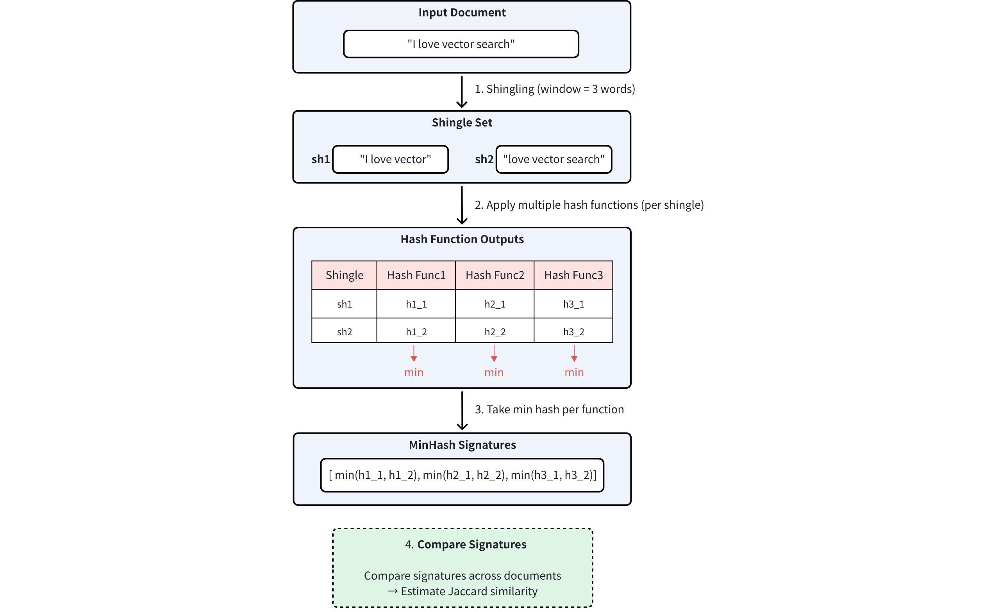
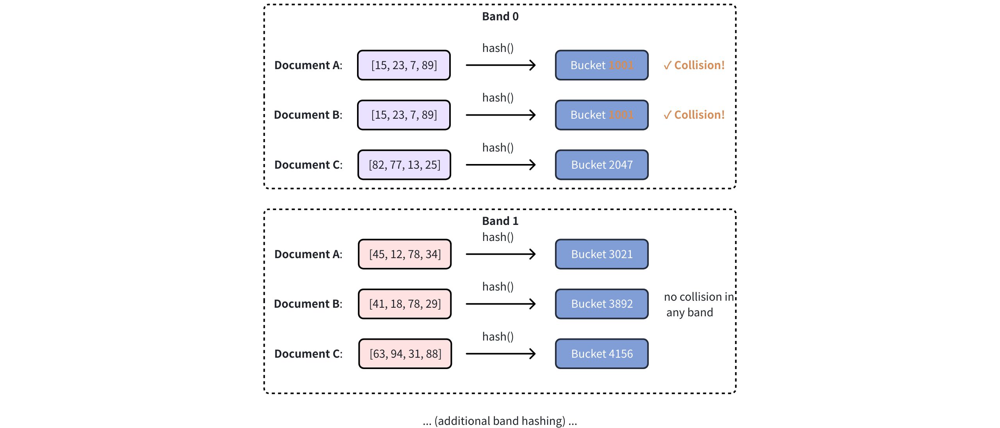
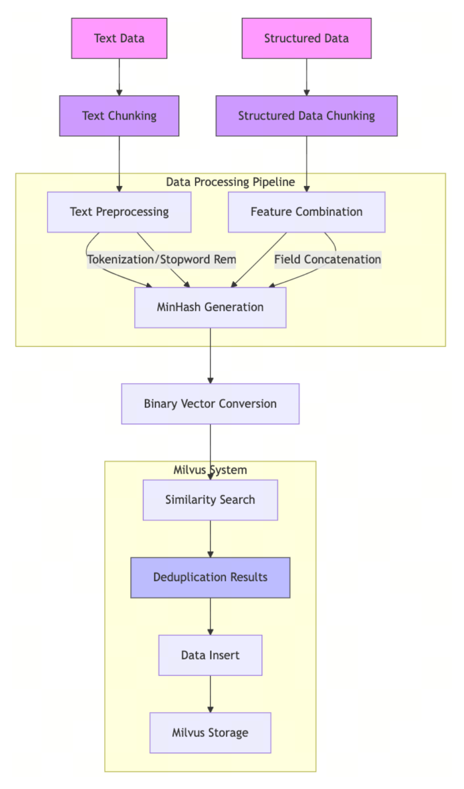

# MINHASH_LSH

Efficient deduplication and similarity search are critical for large-scale machine learning datasets, especially for tasks like cleaning training corpora for Large Language Models (LLMs). When dealing with millions or billions of documents, traditional exact matching becomes too slow and costly.

The **MINHASH_LSH** index in Milvus enables fast, scalable, and accurate approximate deduplication by combining two powerful techniques:

- [MinHash](https://en.wikipedia.org/wiki/MinHash): Quickly generates compact signatures (or "fingerprints") to estimate document similarity.

- [Locality-Sensitive Hashing (LSH)](https://en.wikipedia.org/wiki/Locality-sensitive_hashing): Rapidly finds groups of similar documents based on their MinHash signatures.

This guide walks you through the concepts, prerequisites, setup, and best practices for using MINHASH_LSH in Milvus.

## Overview

### Jaccard similarity

Jaccard similarity measures the overlap between two sets A and B, formally defined as:

$$
J(A, B) = \frac{|A \cap B|}{|A \cup B|}
$$

Where its value ranges from 0 (completely disjoint) to 1 (identical).

However, computing Jaccard similarity exactly between all document pairs in large-scale datasets is computationally expensive—**O(n²)** in time and memory when **n** is large. This makes it infeasible for use cases such as LLM training corpus cleaning or web-scale document analysis.

### MinHash signatures: Approximate Jaccard similarity

[MinHash](https://en.wikipedia.org/wiki/MinHash) is a probabilistic technique that offers an efficient way to estimate Jaccard similarity. It works by transforming each set into a compact **signature vector**, preserving enough information to approximate set similarity efficiently.

**The core idea**:

The more similar the two sets are, the more likely their MinHash signatures will match at the same positions. This property enables MinHash to approximate the Jaccard similarity between sets.

This property allows MinHash to **approximate the Jaccard similarity** between sets without needing to compare the full sets directly.

The MinHash process involves:

1. **Shingling**: Convert documents into sets of overlapping token sequences (shingles)

1. **Hashing**: Apply multiple independent hash functions to each shingle

1. **Min Selection**: For each hash function, record the **minimum** hash value across all shingles

You can see the entire process illustrated below:



<div class="alert note">

The number of hash functions used determines the dimensionality of the MinHash signature. Higher dimensions provide better approximation accuracy, at the cost of increased storage and computation.

</div>

### LSH for MinHash

While MinHash signatures significantly reduce the cost of computing exact Jaccard similarity between documents, exhaustively comparing every pair of signature vectors is still inefficient at scale.

To solve this, [LSH](https://zilliz.com/learn/Local-Sensitivity-Hashing-A-Comprehensive-Guide) is used. LSH enables fast approximate similarity search by ensuring that similar items are hashed into the same "bucket" with high probability — avoiding the need to compare every pair directly.

The process involves:

1. **Signature segmentation:**

    An *n*-dimensional MinHash signature is divided into *b* bands. Each band contains *r* consecutive hash values, so the total signature length satisfies: *n = b × r*.

    For example, if you have a 128-dimensional MinHash signature (*n = 128*) and divide it into 32 bands (*b = 32*), then each band contains 4 hash values (*r = 4*).

1. **Band-level hashing:**

    After segmentation, each band is independently processed using a standard hash function to assign it to a bucket. If two signatures produce the same hash value within a band—i.e., they fall into the same bucket—they are considered potential matches.

1. **Candidate selection:**

    Pairs that collide in at least one band are selected as similarity candidates.

<div class="alert note">

Why it works?

Mathematically, if two signatures have Jaccard similarity $s$,

- The probability they are identical in one row (hash position) is $s$

- The probability they match in all $r$ rows of a band is $s^r$

- The probability that they match in **at least one band** is $1 - (1 - s^r)^b$

For details, refer to [Locality-sensitive hashing](https://en.wikipedia.org/wiki/Locality-sensitive_hashing).

</div>

Consider three documents with 128-dimensional MinHash signatures:


First, LSH divides the 128-dimensional signature into 32 bands of 4 consecutive values each:


Then, each band is hashed into different buckets using a hash function. Document pairs sharing buckets are selected as similarity candidates. In the example below, Document A and Document B are selected as similarity candidates as their hash results collide in **Band 0**:



<div class="alert note">

The number of bands is controlled by the `mh_lsh_band` parameter. For more information, refer to [Index building params](minhash-lsh.md#Index-building-params).

</div>

### MHJACCARD: Comparing MinHash signatures

MinHash signatures approximate the Jaccard similarity between sets using fixed-length binary vectors. However, since these signatures do not preserve the original sets, standard metrics such as `JACCARD`, `L2`, or `COSINE` cannot be directly applied to compare them.

To address this, Milvus introduces a specialized metric type called `MHJACCARD`, designed specifically for comparing MinHash signatures.

When using MinHash in Milvus:

- The vector field must be of type `BINARY_VECTOR`

- The `index_type` must be `MINHASH_LSH` (or `BIN_FLAT`)

- The `metric_type` must be set to `MHJACCARD`

Using other metrics will either be invalid or yield incorrect results.

For more information about this metric type, refer to [MHJACCARD](metric.md#MHJACCARD).

### Deduplication workflow

The deduplication process powered by MinHash LSH allows Milvus to efficiently identify and filter out near-duplicate text or structured records before inserting them into the collection.



1. **Chunk & preprocess**: Split incoming text data or structured data (e.g., records, fields) into chunks; normalize text (lowercasing, punctuation removal), and remove stopwords as needed.

1. **Feature construction**: Build the token set used for MinHash (e.g., shingles from text; concatenated field tokens for structured data).

1. **MinHash signature generation**: Compute MinHash signatures for each chunk or record.

1. **Binary vector conversion**: Convert the signature to a binary vector compatible with Milvus.

1. **Search before insert**: Use the MinHash LSH index to search the target collection for near-duplicates of the incoming item.

1. **Insert & store**: Insert only unique items into the collection. They become searchable for future dedup checks.

## Prerequisites

Before using MinHash LSH in Milvus, you must first generate **MinHash signatures**. These compact binary signatures approximate Jaccard similarity between sets and are required for `MHJACCARD`-based search in Milvus.

### Choose a method to generate MinHash signatures

Depending on your workload, you can choose:

- Use Python's [`datasketch`](https://ekzhu.github.io/datasketch/) for simplicity (recommended for prototyping)

- Use distributed tools (e.g., Spark, Ray) for large-scale datasets

- Implement custom logic (NumPy, C++, etc.) if performance tuning is critical

In this guide, we use `datasketch` for simplicity and compatibility with Milvus input format.

### Install required libraries

Install the necessary packages for this example:

```bash
pip install pymilvus datasketch numpy
```

### Generate MinHash signatures

We'll generate 256-dimensional MinHash signatures, with each hash value represented as a 64-bit integer. This aligns with the expected vector format for `MINHASH_LSH`.

```python
from datasketch import MinHash
import numpy as np

MINHASH_DIM = 256
HASH_BIT_WIDTH = 64

def generate_minhash_signature(text, num_perm=MINHASH_DIM) -> bytes:
    m = MinHash(num_perm=num_perm)
    for token in text.lower().split():
        m.update(token.encode("utf8"))
    return m.hashvalues.astype('>u8').tobytes()  # Returns 2048 bytes
```

Each signature is 256 × 64 bits = 2048 bytes. This byte string can be directly inserted into a `BINARY_VECTOR` field. For more information on binary vectors used in Milvus, refer to [Binary Vector](binary-vector.md).

### (Optional) Prepare raw token sets (for refined search)

By default, Milvus uses only the MinHash signatures and LSH index to find approximate neighbors. This is fast but may return false positives or miss close matches.

If you want **accurate Jaccard similarity**, Milvus supports refined search that uses original token sets. To enable it:

- Store token sets as a separate `VARCHAR` field

- Set `"with_raw_data": True` when [building index parameters](minhash-lsh.md#Build-index-parameters-and-create-collection)

- And enable `"mh_search_with_jaccard": True` when [performing similarity search](minhash-lsh.md#Perform-similarity-search)

**Token set extraction example**:

```python
def extract_token_set(text: str) -> str:
    tokens = set(text.lower().split())
    return " ".join(tokens)
```

## Use MinHash LSH

Once your MinHash vectors and original token sets are ready, you can store, index, and search them using Milvus with `MINHASH_LSH`.

### Connect to your cluster

<div class="multipleCode">
    <a href="#python">Python</a>
    <a href="#java">Java</a>
    <a href="#javascript">NodeJS</a>
    <a href="#go">Go</a>
    <a href="#bash">cURL</a>
</div>

```python
from pymilvus import MilvusClient

client = MilvusClient(uri="http://localhost:19530")  # Update if your URI is different
```

```java
// java
```

```javascript
// nodejs
```

```go
// go
```

```bash
# restful
```

### Define collection schema

Define a schema with:

- The primary key

- A `BINARY_VECTOR` field for the MinHash signatures

- A `VARCHAR` field for the original token set (if refined search is enabled)

- Optionally, a `document` field for original text

<div class="multipleCode">
    <a href="#python">Python</a>
    <a href="#java">Java</a>
    <a href="#javascript">NodeJS</a>
    <a href="#go">Go</a>
    <a href="#bash">cURL</a>
</div>

```python
from pymilvus import DataType

VECTOR_DIM = MINHASH_DIM * HASH_BIT_WIDTH  # 256 × 64 = 8192 bits

schema = client.create_schema(auto_id=False, enable_dynamic_field=False)
schema.add_field("doc_id", DataType.INT64, is_primary=True)
schema.add_field("minhash_signature", DataType.BINARY_VECTOR, dim=VECTOR_DIM)
schema.add_field("token_set", DataType.VARCHAR, max_length=1000)  # required for refinement
schema.add_field("document", DataType.VARCHAR, max_length=1000)
```

```java
// java
```

```javascript
// nodejs
```

```go
// go
```

```bash
# restful
```

### Build index parameters and create collection

Build a `MINHASH_LSH` index with Jaccard refinement enabled:

<div class="multipleCode">
    <a href="#python">Python</a>
    <a href="#java">Java</a>
    <a href="#javascript">NodeJS</a>
    <a href="#go">Go</a>
    <a href="#bash">cURL</a>
</div>

```python
index_params = client.prepare_index_params()
index_params.add_index(
    field_name="minhash_signature",
    index_type="MINHASH_LSH",
    metric_type="MHJACCARD",
    params={
        "mh_element_bit_width": HASH_BIT_WIDTH,  # Must match signature bit width
        "mh_lsh_band": 16,                       # Band count (128/16 = 8 hashes per band)
        "with_raw_data": True                    # Required for Jaccard refinement
    }
)

client.create_collection("minhash_demo", schema=schema, index_params=index_params)
```

```java
// java
```

```javascript
// nodejs
```

```go
// go
```

```bash
# restful
```

For more information on index building parameters, refer to [Index building params](minhash-lsh.md#Index-building-params).

### Insert data

For each document, prepare:

- A binary MinHash signature

- A serialized token set string

- (Optionally) the original text

<div class="multipleCode">
    <a href="#python">Python</a>
    <a href="#java">Java</a>
    <a href="#javascript">NodeJS</a>
    <a href="#go">Go</a>
    <a href="#bash">cURL</a>
</div>

```python
documents = [
    "machine learning algorithms process data automatically",
    "deep learning uses neural networks to model patterns"
]

insert_data = []
for i, doc in enumerate(documents):
    sig = generate_minhash_signature(doc)
    token_str = extract_token_set(doc)
    insert_data.append({
        "doc_id": i,
        "minhash_signature": sig,
        "token_set": token_str,
        "document": doc
    })

client.insert("minhash_demo", insert_data)
client.flush("minhash_demo")
```

```java
// java
```

```javascript
// nodejs
```

```go
// go
```

```bash
# restful
```

### Perform similarity search

Milvus supports two modes of similarity search using MinHash LSH:

- **Approximate search** — uses only MinHash signatures and LSH for fast but probabilistic results.

- **Refined search** — re-computes Jaccard similarity using original token sets for improved accuracy.

#### 5.1 Prepare the query

To perform a similarity search, generate a MinHash signature for the query document. This signature must match the same dimension and encoding format used during data insertion.

<div class="multipleCode">
    <a href="#python">Python</a>
    <a href="#java">Java</a>
    <a href="#javascript">NodeJS</a>
    <a href="#go">Go</a>
    <a href="#bash">cURL</a>
</div>

```python
query_text = "neural networks model patterns in data"
query_sig = generate_minhash_signature(query_text)
```

```java
// java
```

```javascript
// nodejs
```

```go
// go
```

```bash
# restful
```

#### 5.2 Approximate search (LSH-only)

This is fast and scalable but may miss close matches or include false positives:

<div class="multipleCode">
    <a href="#python">Python</a>
    <a href="#java">Java</a>
    <a href="#javascript">NodeJS</a>
    <a href="#go">Go</a>
    <a href="#bash">cURL</a>
</div>

```python
# highlight-start
search_params={
    "metric_type": "MHJACCARD", 
    "params": {}
}
# highlight-end

approx_results = client.search(
    collection_name="minhash_demo",
    data=[query_sig],
    anns_field="minhash_signature",
    # highlight-next-line
    search_params=search_params,
    limit=3,
    output_fields=["doc_id", "document"],
    consistency_level="Strong"
)

for i, hit in enumerate(approx_results[0]):
    sim = 1 - hit['distance']
    print(f"{i+1}. Similarity: {sim:.3f} | {hit['entity']['document']}")
```

```java
// java
```

```javascript
// nodejs
```

```go
// go
```

```bash
# restful
```

#### 5.3 Refined search (recommended for accuracy):

This enables accurate Jaccard comparison using the original token sets stored in Milvus. It's slightly slower but recommended for quality-sensitive tasks:

<div class="multipleCode">
    <a href="#python">Python</a>
    <a href="#java">Java</a>
    <a href="#javascript">NodeJS</a>
    <a href="#go">Go</a>
    <a href="#bash">cURL</a>
</div>

```python
# highlight-start
search_params = {
    "metric_type": "MHJACCARD",
    "params": {
        "mh_search_with_jaccard": True,  # Enable real Jaccard computation
        "refine_k": 5                    # Refine top 5 candidates
    }
}
# highlight-end

refined_results = client.search(
    collection_name="minhash_demo",
    data=[query_sig],
    anns_field="minhash_signature",
    # highlight-next-line
    search_params=search_params,
    limit=3,
    output_fields=["doc_id", "document"],
    consistency_level="Strong"
)

for i, hit in enumerate(refined_results[0]):
    sim = 1 - hit['distance']
    print(f"{i+1}. Similarity: {sim:.3f} | {hit['entity']['document']}")
```

```java
// java
```

```javascript
// nodejs
```

```go
// go
```

```bash
# restful
```

## Index params

This section provides an overview of the parameters used for building an index and performing searches on the index.

### Index building params

The following table lists the parameters that can be configured in `params` when [building an index](minhash-lsh.md#Build-index-parameters-and-create-collection).

<table>
   <tr>
     <th><p>Parameter</p></th>
     <th><p>Description</p></th>
     <th><p>Value Range</p></th>
     <th><p>Tuning Suggestion</p></th>
   </tr>
   <tr>
     <td><p><code>mh_element_bit_width</code></p></td>
     <td><p>Bit width of each hash value in the MinHash signature. Must be divisible by 8.</p></td>
     <td><p>8, 16, 32, 64</p></td>
     <td><p>Use <code>32</code> for balanced performance and accuracy. Use <code>64</code> for higher precision with larger datasets. Use <code>16</code> to save memory with acceptable accuracy loss.</p></td>
   </tr>
   <tr>
     <td><p><code>mh_lsh_band</code></p></td>
     <td><p>Number of bands to divide the MinHash signature for LSH. Controls the recall-performance tradeoff.</p></td>
     <td><p>[1, <em>signature_length</em>]</p></td>
     <td><p>For 128-dim signatures: start with 32 bands (4 values/band). Increase to 64 for higher recall, decrease to 16 for better performance. Must divide signature length evenly.</p></td>
   </tr>
   <tr>
     <td><p><code>mh_lsh_code_in_mem</code></p></td>
     <td><p>Whether to store LSH hash codes in anonymous memory (<code>true</code>) or use memory mapping (<code>false</code>).</p></td>
     <td><p>true, false</p></td>
     <td><p>Use <code>false</code> for large datasets (&gt;1M sets) to reduce memory usage. Use <code>true</code> for smaller datasets requiring maximum search speed.</p></td>
   </tr>
   <tr>
     <td><p><code>with_raw_data</code></p></td>
     <td><p>Whether to store original MinHash signatures alongside LSH codes for refinement.</p></td>
     <td><p>true, false</p></td>
     <td><p>Use <code>true</code> when high precision is required and storage cost is acceptable. Use <code>false</code> to minimize storage overhead with slight accuracy reduction.</p></td>
   </tr>
   <tr>
     <td><p><code>mh_lsh_bloom_false_positive_prob</code></p></td>
     <td><p>False positive probability for Bloom filter used in LSH bucket optimization.</p></td>
     <td><p>[0.001, 0.1]</p></td>
     <td><p>Use <code>0.01</code> for balanced memory usage and accuracy. Lower values (<code>0.001</code>) reduce false positives but increase memory. Higher values (<code>0.05</code>) save memory but may reduce precision.</p></td>
   </tr>
</table>

### Index-specific search params

The following table lists the parameters that can be configured in `search_params.params` when [searching on the index](minhash-lsh.md#Perform-similarity-search).

<table>
   <tr>
     <th><p>Parameter</p></th>
     <th><p>Description</p></th>
     <th><p>Value Range</p></th>
     <th><p>Tuning Suggestion</p></th>
   </tr>
   <tr>
     <td><p><code>mh_search_with_jaccard</code></p></td>
     <td><p>Whether to perform exact Jaccard similarity computation on candidate results for refinement.</p></td>
     <td><p>true, false</p></td>
     <td><p>Use <code>true</code> for applications requiring high precision (e.g., deduplication). Use <code>false</code> for faster approximate search when slight accuracy loss is acceptable.</p></td>
   </tr>
   <tr>
     <td><p><code>refine_k</code></p></td>
     <td><p>Number of candidates to retrieve before Jaccard refinement. Only effective when <code>mh_search_with_jaccard</code> is <code>true</code>.</p></td>
     <td><p>[<em>top_k</em>, *top_k * 10*]</p></td>
     <td><p>Set to 2-5x the desired <em>top_k</em> for good recall-performance balance. Higher values improve recall but increase computation cost.</p></td>
   </tr>
   <tr>
     <td><p><code>mh_lsh_batch_search</code></p></td>
     <td><p>Whether to enable batch optimization for multiple simultaneous queries.</p></td>
     <td><p>true, false</p></td>
     <td><p>Use <code>true</code> when searching with multiple queries simultaneously for better throughput. Use <code>false</code> for single-query scenarios to reduce memory overhead.</p></td>
   </tr>
</table>
