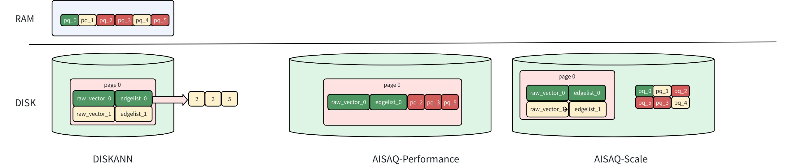

# AISAQ

AISAQ is a disk-based vector index that extends [DISKANN](diskann.md) to handle billion-scale datasets without exceeding RAM limits. Unlike DISKANN, which keeps compressed vectors in memory, AISAQ stores all data on disk—offering two modes to balance performance and storage costs.

Use AISAQ when your vector dataset is too large to fit comfortably in RAM, or when you need to optimize infrastructure costs by trading some query performance for reduced memory requirements.

## How AISAQ works

The diagram above compares the storage layouts of **DISKANN**, **AISAQ-Performance**, and **AISAQ-Scale**, showing how data (raw vectors, edge lists, and PQ codes) is distributed between RAM and disk.



### Foundation: DISKANN recap

In DISKANN, the raw vectors and edge lists are stored on disk, while PQ-compressed vectors are kept in memory (DRAM).

When DISKANN traverses to a node (e.g., *vector 0*):

- It loads the raw vector (**raw_vector_0**) and its edge list (**edgelist_0**) from disk.

- The edge list indicates which neighbors to visit next (nodes 2, 3, and 5 in this example).

- The raw vector is used to calculate the exact distance to the query vector for ranking.

- The PQ data in memory is used for approximate distance filtering to guide the next traversal.

Because the PQ data is already cached in DRAM, each node visit requires only one disk I/O, achieving high query speed with moderate memory usage.

For a detailed explanation of these components and parameters, refer to [DISKANN](diskann.md).

### AISAQ modes

AISAQ offers two disk-based storage strategies. The key difference is how PQ-compressed data is stored.

#### AISAQ-performance

**AISAQ-performance** achieves fully disk-based storage by moving PQ data from memory to disk while maintaining low IOPS through data colocation and redundancy.

In this mode:

- Each node’s raw vector, edge list, and its neighbors’ PQ data are stored together on disk.

- This layout ensures that visiting a node (e.g., *vector 0*) still requires only a single disk I/O.

- However, because PQ data is redundantly stored near multiple nodes, the index file size increases significantly, consuming more disk space.

#### AISAQ-scale

**AISAQ-scale** focuses on *reducing disk space usage* while keeping all data on disk.

In this mode:

- PQ data is stored separately on disk, without redundancy.

- This design minimizes index size but leads to more I/O operations during graph traversal.

- To mitigate the IOPS overhead, AISAQ introduces two optimizations:

    - A rearrange strategy that sorts PQ vectors by priority to improve data locality.

    - A PQ cache in DRAM (pq_cache_size) that caches frequently accessed PQ data.

As a result, AISAQ-scale achieves better storage efficiency but lower performance than DISKANN or AISAQ-Performance.

## Example configuration

```yaml
# milvus.yaml
knowhere:
  AISAQ:
    build:
      max_degree: 56 # Maximum degree of the Vamana graph
      pq_code_budget_gb_ratio: 0.125 # Size limit on the PQ code (compared with raw data)
      search_list_size: 100 # Size of the candidate list during building graph
    search:
      beam_width_ratio: 4 # Ratio between the maximum number of IO requests per search iteration and CPU number
```

## AISAQ-specific parameters

AISAQ inherits many parameters from DISKANN. To avoid redundancy, only AISAQ-specific parameters are detailed below. For descriptions of shared parameters such as `max_degree`, `pq_code_budget_gb_ratio`, `search_list_size`, and `beam_width_ratio`, refer to [DISKANN](diskann.md#DISKANN-params).

<table>
   <tr>
     <th><p>Parameter</p></th>
     <th><p>Description</p></th>
     <th><p>Value Range</p></th>
     <th><p>Tuning Suggestion</p></th>
   </tr>
   <tr>
     <td><p><code>inline_pq</code></p></td>
     <td><p>Number of PQ vectors stored inline per node. Determines storage layout (Performance vs. Scale mode).</p></td>
     <td><p><strong>Type</strong>: Integer</p><p><strong>Range</strong>: [0, <em>max_degree</em>]</p><p><strong>Default value</strong>: <code>-1</code></p></td>
     <td><p>The closer <code>inline_pq</code> is to <em>max_degree</em>, the better the performance tends to be, but the index file size increases significantly.</p><p>When <code>inline_pq</code> approaches 0, performance decreases, and the index size becomes similar to that of DISKANN.</p><p><strong>Note</strong>: It's highly dependent on disk performance. If the disk performance is poor, it’s not advised to enable this option, as limited disk bandwidth may become a bottleneck and degrade overall performance.</p></td>
   </tr>
   <tr>
     <td><p><code>rearrange</code></p></td>
     <td><p>Enables PQ vector sorting by priority to improve I/O locality.</p></td>
     <td><p><strong>Type</strong>: Boolean</p><p><strong>Range</strong>: [true, false]</p><p><strong>Default value</strong>: <code>false</code></p></td>
     <td><p>Reduces query I/O but increases index build time.</p></td>
   </tr>
   <tr>
     <td><p><code>pq_cache_size</code></p></td>
     <td><p>PQ cache size in DRAM (bytes).</p></td>
     <td><p><strong>Type</strong>: Integer</p><p><strong>Range</strong>: [0, 1&lt;&lt;30]</p><p><strong>Default value</strong>: <code>0</code></p></td>
     <td><p>Larger cache improves query performance but increases DRAM usage.</p></td>
   </tr>
</table>

## Considerations

- Disk performance matters. AISAQ depends heavily on SSD IOPS; poor storage can reduce QPS.

- AISAQ-performance mode ≈ DISKANN latency, but may require several times more disk space.

- AISAQ-scale mode suits offline search or data archival workloads where QPS is less critical.

