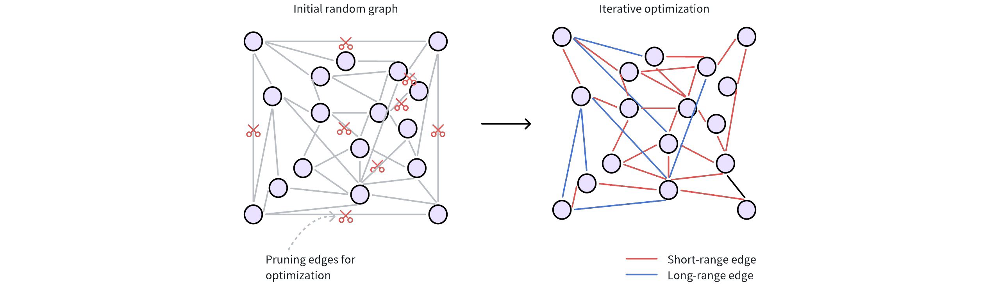
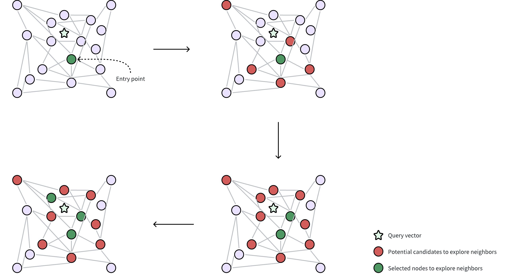

# DISKANN

In large-scale scenarios, where datasets can include billions or even trillions of vectors, standard in-memory indexing methods (e.g., [HNSW](hnsw.md), [IVF_FLAT](ivf-flat.md)) often fail to keep pace due to memory limitations. **DISKANN** offers a disk-based approach that addresses these challenges by maintaining high search accuracy and speed when the dataset size exceeds available RAM.

## Overview

**DISKANN** combines two key techniques for efficient vector search:

- **Vamana Graph** – A **disk-based**, **graph-based** index that connects data points (or vectors) for efficient navigation during search.

- **Product Quantization (PQ)** – An **in-memory** compression method that reduces the size of vectors, enabling quick approximate distance calculations between vectors.

### Index construction

#### Vamana graph

The Vamana graph is central to DISKANN’s disk-based strategy. It can handle very large datasets because it does not need to fully reside in memory during or after construction.

The following figure shows how a Vamana graph is constructed.



1. **Initial random connections:** Each data point (vector) is represented as a node in the graph. These nodes are initially connected randomly, forming a dense network. Typically, a node starts with around 500 edges (or connections) for broad connectivity.

1. **Refining for efficiency:** The initial random graph undergoes an optimization process to make it more efficient for searching. This involves two key steps:

    - **Pruning redundant edges:** The algorithm discards unnecessary connections based on distances between nodes. This step prioritizes higher-quality edges.

        The `max_degree` parameter restricts the maximum number of edges per node. A higher `max_degree` results in a denser graph, potentially finding more relevant neighbors (higher recall) but also increasing memory usage and search time.

    - **Adding strategic shortcuts:** Vamana introduces long-range edges, connecting data points that are far apart in the vector space. These shortcuts allow searches to quickly jump across the graph, bypassing intermediate nodes and significantly speeding up navigation.

        The `search_list_size` parameter determines the breadth of the graph refinement process. A higher `search_list_size` extends the search for neighbors during construction and can improve final accuracy, but increases index-building time.

To learn more about parameter tuning, refer to [DISKANN params](diskann.md#DISKANN-params).

#### PQ

DISKANN uses **PQ** to compress high-dimensional vectors into smaller representations (**PQ codes**), which are stored in memory for rapid approximate distance calculations. 

The `pq_code_budget_gb_ratio` parameter manages the memory footprint dedicated to storing these PQ codes. It represents a ratio between the total size of the vectors (in gigabytes) and the space allocated for storing the PQ codes. You can calculate the actual PQ code budget (in gigabytes) with this formula:

```plaintext
PQ Code Budget (GB) = vec_field_size_gb * pq_code_budget_gb_ratio
```

where:

- `vec_field_size_gb` is the total size of the vectors (in gigabytes).

- `pq_code_budget_gb_ratio` is a user-defined ratio, representing the fraction of the total data size reserved for PQ codes. This parameter allows for a trade-off between search accuracy and memory resources. For more information on parameter tuning, refer to [DISKANN configs](diskann.md#share-CEVtdKUBuou0g7xHU1uc1rmYnsd).

For technical details on the underlying PQ method, refer to [IVF_PQ](ivf-pq.md#share-MA6SdYG0io3EASxoSpyc7JW3nvc).

### Search process

Once the index (the Vamana graph on disk and PQ codes in memory) is built, DISKANN performs ANN searches as follows:



1. **Query and entry point:** A query vector is provided to locate its nearest neighbors. DISKANN starts from a selected entry point in the Vamana graph, often a node near the global centroid of the dataset. The global centroid represents the average of all vectors, which helps to minimize the traversal distance through the graph to find desired neighbors.

1. **Neighborhood exploration:** The algorithm gathers potential candidate neighbors (circles in red in the figure) from the edges of the current node, leveraging in-memory PQ codes to approximate the distances between these candidates and the query vector. These potential candidate neighbors are the nodes directly connected to the selected entry point through edges in the Vamana graph.

1. **Selecting nodes for accurate distance calculation:** From the approximate results, a subset of the most promising neighbors (circles in green in the figure) are selected for precise distance evaluations using their original, uncompressed vectors. This requires reading data from disk, which can be time-consuming. DISKANN uses two parameters to control this delicate balance between accuracy and speed:

    - `beam_width_ratio`: A ration that controls the breadth of the search, determining how many candidate neighbors are selected in parallel to explore their neighbors. A larger `beam_width_ratio` results in a wider exploration, potentially leading to higher accuracy but also increasing computational cost and disk I/O. The beam width, or the number of nodes selected, is determined using the formula: `Beam width = Number of CPU cores * beam_width_ratio`.

    - `search_cache_budget_gb_ratio`: The proportion of memory allocated for caching frequently accessed disk data. This caching helps to minimize disk I/O, making repeated searches faster as the data is already in memory.

    To learn more about parameter tuning, refer to [DISKANN configs](diskann.md#share-CEVtdKUBuou0g7xHU1uc1rmYnsd).

1. **Iterative exploration:** The search iteratively refines the set of candidates, repeatedly performing approximate evaluations (using PQ) followed by precise checks (using original vectors from disk) until a sufficient number of neighbors are found.

## Enable DISKANN in Milvus

By default, **DISKANN** is disabled in Milvus to prioritize the speed of in-memory indexes for datasets that fit comfortably in RAM. However, if you're working with massive datasets or want to take advantage of **DISKANN**'s scalability and SSD optimization, you can easily enable it.

Here's how to enable DISKANN in Milvus:

1. **Update the Milvus Configuration File**

    1. Locate your Milvus configuration file**.** (Refer to the Milvus documentation on Configuration for details on finding this file.)

    1. Find the `queryNode.enableDisk` parameter and set its value to `true`:

        ```yaml
         queryNode:
             enableDisk: true # Enables query nodes to load and search using the on-disk index
        ```

1. **Optimize Storage for DISKANN**

To ensure the best performance with DISKANN, it's recommended to store your Milvus data on a fast NVMe SSD. Here's how to do this for both Milvus Standalone and Cluster deployments:

- **Milvus Standalone**

    - Mount the Milvus data directory to an NVMe SSD within the Milvus container. You can do this in the `docker-compose.yml` file or using other container management tools.

    - For example, if your NVMe SSD is mounted at `/mnt/nvme`, you would update the `volumes`section of your `docker-compose.yml` like this:

    ```yaml
     volumes:
          - /mnt/nvme/volumes/milvus:/var/lib/milvus
    ```

- **Milvus Cluster**

    - Mount the Milvus data directory to an NVMe SSD in both the QueryNode and IndexNode containers. You can achieve this through your container orchestration setup.

    - By mounting the data on an NVMe SSD in both node types, you ensure fast read and write speeds for both search and indexing operations.

Once you've made these changes, restart your Milvus instance for the settings to take effect. Now, Milvus will leverage DISKANN's capabilities to handle large datasets, delivering efficient and scalable vector search.

## Configure DISKANN

DISKANN-related parameters can only be configured via your Milvus configuration file (`milvus.yaml`):

```yaml
# milvus.yaml
common:
  DiskIndex:
    MaxDegree: 56  # Maximum degree of the Vamana graph
    SearchListSize: 100  # Size of the candidate list during building graph
    PQCodeBudgetGBRatio: 0.125  # Size limit on the PQ code (compared with raw data)
    SearchCacheBudgetGBRatio: 0.1 # Ratio of cached node numbers to raw data
    BeamWidthRatio: 4 # Ratio between the maximum number of IO requests per search iteration and CPU number
```

For details on parameter descriptions, refer to [DISKANN params](diskann.md#DISKANN-params).

## DISKANN params

Fine-tuning DISKANN's parameters allows you to tailor its behavior to your specific dataset and search workload, striking the right balance between speed, accuracy, and memory usage.

### Index building params

These parameters influence how the DISKANN index is constructed. Adjusting them can affect the index size, build time, and search quality.

<div class="alert note">
    
All the index building params in the list below can only be configured via your Milvus configuration file (`milvus.yaml`)

</div>

<table>
   <tr>
     <th></th>
     <th><p>Parameter</p></th>
     <th><p>Description</p></th>
     <th><p>Value Range</p></th>
     <th><p>Tuning Suggestion</p></th>
   </tr>
   <tr>
     <td><p>Vamana</p></td>
     <td><p><code>MaxDegree</code></p></td>
     <td><p>Controls the maximum number of connections (edges) each data point can have in the Vamana graph.</p></td>
     <td><p><strong>Type</strong>: Integer
 <strong>Range</strong>: [1, 512]</p>
<p><strong>Default value</strong>: <code>56</code></p></td>
     <td><p>Higher values create denser graphs, potentially increasing recall (finding more relevant results) but also increasing memory usage and build time. 
 In most cases, we recommend you set a value within this range: [10, 100].</p></td>
   </tr>
   <tr>
     <td></td>
     <td><p><code>SearchListSize</code></p></td>
     <td><p>During index construction, this parameter defines the size of the candidate pool used when searching for the nearest neighbors for each node. For every node being added to the graph, the algorithm maintains a list of the <code>search_list_size</code> best candidates found so far. The search for neighbors stops when this list can no longer be improved. From this final candidate pool, the top <code>max_degree</code> nodes are selected to form the final edges.</p></td>
     <td><p><strong>Type</strong>: Integer
 <strong>Range</strong>: [1, <em>int_max</em>]</p>
<p><strong>Default value</strong>: <code>100</code></p></td>
     <td><p>A larger <code>search_list_size</code> increases the likelihood of finding the true nearest neighbors for each node, which can lead to a higher-quality graph and better search performance (recall). However, this comes at the cost of a significantly longer index build time. It should always be set to a value greater than or equal to <code>max_degree</code>.</p></td>
   </tr>
   <tr>
     <td></td>
     <td><p><code>SearchCacheBudgetGBRatio</code></p></td>
     <td><p>Controls the amount of memory allocated for caching frequently accessed parts of the graph during index construction.</p></td>
     <td><p><strong>Type</strong>: Float
 <strong>Range</strong>: [0.0, 0.3)</p>
<p><strong>Default value</strong>: <code>0.10</code></p></td>
     <td><p>A higher value allocates more memory for caching, significantly reducing disk I/O but consuming more system memory. A lower value uses less memory for caching, potentially increasing the need for disk access.
 In most cases, we recommend you set a value within this range: [0.0, 0.3).</p></td>
   </tr>
   <tr>
     <td><p>PQ</p></td>
     <td><p><code>PQCodeBudgetGBRatio</code></p></td>
     <td><p>Controls the size of the PQ codes (compressed representations of data points) compared to the size of the uncompressed data.</p></td>
     <td><p><strong>Type</strong>: Float
 <strong>Range</strong>: (0.0, 0.25]</p>
<p><strong>Default value</strong>: <code>0.125</code></p></td>
     <td><p>A higher ratio leads to more accurate search results by allocating a larger proportion of memory for PQ codes, effectively storing more information about the original vectors. However, this requires more memory, limiting the capacity for handling large datasets.
 A lower ratio reduces memory usage but potentially sacrifices accuracy, as smaller PQ codes retain less information. This approach is suitable for scenarios where memory constraints are a concern, potentially enabling the indexing of larger datasets.</p>
<p>In most cases, we recommend you set a value within this range: (0.0625, 0.25]</p></td>
   </tr>
</table>

### Index-specific search params

These parameters influence how DISKANN performs searches. Adjusting them can impact search speed, latency, and resource usage.

<div class="alert note">
    
The <code>BeamWidthRatio</code> in the list below can only be configured via your Milvus configuration file (`milvus.yaml`)

The <code>search_list</code> in the list below can only be configured in the search params in SDK.

</div>

<table>
   <tr>
     <th></th>
     <th><p>Parameter</p></th>
     <th><p>Description</p></th>
     <th><p>Value Range</p></th>
     <th><p>Tuning Suggestion</p></th>
   </tr>
   <tr>
     <td><p>Vamana</p></td>
     <td><p><code>BeamWidthRatio</code></p></td>
     <td><p>Controls the degree of parallelism during search by determining the maximum number of parallel disk I/O requests relative to the number of available CPU cores.</p></td>
     <td><p><strong>Type</strong>: Float
 <strong>Range</strong>: [1, max(128 / CPU number, 16)]</p>
<p><strong>Default value</strong>: <code>4.0</code></p></td>
     <td><p>Higher values increase parallelism, which can speed up search on systems with powerful CPUs and SSDs. However, setting it too high might lead to excessive resource contention.
 In most cases, we recommend you set a value within this range: [1.0, 4.0].</p></td>
   </tr>
   <tr>
     <td></td>
     <td><p><code>search_list</code></p></td>
     <td><p>During a search operation, this parameter determines the size of the candidate pool that the algorithm maintains as it traverses the graph. A larger value increases the chances of finding the true nearest neighbors (higher recall) but also increases search latency.</p></td>
     <td><p><strong>Type</strong>: Integer
 <strong>Range</strong>: [1, <em>int_max</em>]</p>
<p><strong>Default value</strong>: <code>100</code></p></td>
     <td><p>For a good balance between performance and accuracy, it is recommended to set this value to be equal to or slightly larger than the number of results you want to retrieve (top_k).</p></td>
   </tr>
</table>

