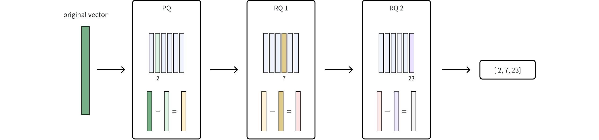

# HNSW_PRQ

**HNSW_PRQ** leverages Hierarchical Navigable Small World (HNSW) graphs with Product Residual Quantization (PRQ), offering an advanced vector indexing method that allows you to finely tune the trade-off between index size and accuracy. PRQ goes beyond traditional Product Quantization (PQ) by introducing a residual quantization (RQ) step to capture additional information, resulting in higher accuracy or more compact indexes compared to purely PQ-based methods. However, the extra steps can lead to higher computational overhead during index building and searching.

## Overview

HNSW_PRQ combines two indexing techniques: **HSNW** for fast graph-based navigation and **PRQ** for efficient vector compression.

### HNSW

HNSW constructs a multi-layer graph where each node corresponds to a vector in the dataset. In this graph, nodes are connected based on their similarity, enabling rapid traversal through the data space. The hierarchical structure allows the search algorithm to narrow down the candidate neighbors, significantly accelerating the search process in high-dimensional spaces.

For more information, refer to [HNSW](hnsw.md).

### PRQ

PRQ is a multi-stage vector compression approach that combines two complementary techniques: PQ and RQ. By first splitting a high-dimensional vector into smaller sub-vectors (via PQ) and then quantizing any remaining difference (via RQ), PRQ achieves a compact yet accurate representation of the original data.

The following figure shows how it works.



1. **Product Quantization (PQ)**

    In this phase, the original vector is divided into smaller sub-vectors, and each sub-vector is mapped to its nearest centroid in a learned codebook. This mapping significantly reduces data size but introduces some rounding error since each sub-vector is approximated by a single centroid. For more details, refer to [IVF_PQ](ivf-pq.md#PQ).

1. **Residual Quantization (RQ)**

    After the PQ stage, RQ quantizes the residual—the difference between the original vector and its PQ-based approximation—using additional codebooks. Because this residual is typically much smaller, it can be encoded more precisely without a large increase in storage.

    The parameter `nrq` determines how many times this residual is iteratively quantized, allowing you to fine-tune the balance between compression efficiency and accuracy.

1. **Final Compression Representation**

    Once RQ finishes quantizing the residual, the integer codes from both PQ and RQ are combined into a single compressed index. By capturing refined details that PQ alone might miss, RQ enhances accuracy without causing a significant increase in storage. This synergy between PQ and RQ is what defines PRQ.

### HNSW + PRQ

By combining HNSW with PRQ, **HNSW_PRQ** retains HNSW’s fast graph-based search while taking advantage of PRQ’s multi-stage compression. The workflow looks like this:

1. **Data Compression:** Each vector is first transformed via PQ to a coarse representation, and then residuals are quantized through RQ for further refinement. The result is a set of compact codes representing each vector.

1. **Graph Construction:** The compressed vectors (including both the PQ and RQ codes) form the basis for building the HNSW graph. Because data is stored in a compact form, the graph requires less memory, and navigation through it is accelerated.

1. **Candidate Retrieval:** During search, HNSW uses the compressed representations to traverse the graph and retrieve a pool of candidates. This dramatically cuts down the number of vectors needing consideration.

1. **(Optional) Result Refinement:** The initial candidate results can be refined for better accuracy, based on the following parameters:

    - `refine`: Controls whether this refinement step is activated. When set to `true`, the system recalculates distances using higher-precision or uncompressed representations.

    - `refine_type`: Specifies the precision level of data used during refinement (e.g., SQ6, SQ8, BF16). A higher-precision choice such as `FP32` can yield more accurate results but requires more memory. This must exceed the precision of the original compressed data set by `sq_type`.

    - `refine_k`: Acts as a magnification factor. For instance, if your top *k* is 100 and `refine_k` is 2, the system re-ranks the top 200 candidates and returns the best 100, enhancing overall accuracy.

For a full list of parameters and valid values, refer to [Index params](hnsw-prq.md#Index-params).

## Build index

To build an `HNSW_PRQ` index on a vector field in Milvus, use the `add_index()` method, specifying the `index_type`, `metric_type`, and additional parameters for the index.

```python
from pymilvus import MilvusClient

# Prepare index building params
index_params = MilvusClient.prepare_index_params()

index_params.add_index(
    field_name="your_vector_field_name", # Name of the vector field to be indexed
    index_type="HNSW_PRQ", # Type of the index to create
    index_name="vector_index", # Name of the index to create
    metric_type="L2", # Metric type used to measure similarity
    params={
        "M": 30, # Maximum number of neighbors each node can connect to in the graph
        "efConstruction": 360, # Number of candidate neighbors considered for connection during index construction
        "m": 384, 
        "nbits": 8,
        "nrq": 1,
        "refine": true, # Whether to enable the refinement step
        "refine_type": "SQ8" # Precision level of data used for refinement
    } # Index building params
)
```

In this configuration:

- `index_type`: The type of index to be built. In this example, set the value to `HNSW_PQ`.

- `metric_type`: The method used to calculate the distance between vectors. Supported values include `COSINE`, `L2`, and `IP`. For details, refer to [Metric Types](metric.md).

- `params`: Additional configuration options for building the index. For details, refer to [Index building params](hnsw-prq.md#Index-building-params).

Once the index parameters are configured, you can create the index by using the `create_index()` method directly or passing the index params in the `create_collection` method. For details, refer to [Create Collection](create-collection.md).

## Search on index

Once the index is built and entities are inserted, you can perform similarity searches on the index.

```python
search_params = {
    "params": {
        "ef": 10, # Parameter controlling query time/accuracy trade-off
        "refine_k": 1 # The magnification factor
    }
}

res = MilvusClient.search(
    collection_name="your_collection_name", # Collection name
    anns_field="vector_field",  # Vector field name
    data=[[0.1, 0.2, 0.3, 0.4, 0.5]],  # Query vector
    limit=3,  # TopK results to return
    search_params=search_params
)
```

In this configuration:

- `params`: Additional configuration options for searching on the index. For details, refer to [Index-specific search params](hnsw-prq.md#Index-specific-search-params).

## Index params

This section provides an overview of the parameters used for building an index and performing searches on the index.

### Index building params

The following table lists the parameters that can be configured in `params` when [building an index](hnsw-prq.md#Build-index).

<table>
   <tr>
     <th></th>
     <th><p>Parameter</p></th>
     <th><p>Description</p></th>
     <th><p>Value Range</p></th>
     <th><p>Tuning Suggestion</p></th>
   </tr>
   <tr>
     <td><p>HNSW</p></td>
     <td><p><code>M</code></p></td>
     <td><p>Maximum number of connections （or edges) each node can have in the graph, including both outgoing and incoming edges.
 This parameter directly affects both index construction and search.</p></td>
     <td><p><strong>Type</strong>: Integer
 <strong>Range</strong>: [2, 2048]</p>
<p><strong>Default value</strong>: <code>30</code> (up to 30 outgoing and 30 incoming edges per node)</p></td>
     <td><p>A larger <code>M</code> generally leads to <strong>higher accuracy</strong> but <strong>increases memory overhead</strong> and <strong>slows down both index building and search</strong>.
 Consider increasing <code>M</code> for datasets with high dimensionality or when high recall is crucial.</p>
<p>Consider decreasing <code>M</code> when memory usage and search speed are primary concerns.</p>
<p>In most cases, we recommend you set a value within this range: [5, 100].</p></td>
   </tr>
   <tr>
     <td></td>
     <td><p><code>efConstruction</code></p></td>
     <td><p>Number of candidate neighbors considered for connection during index construction.
 A larger pool of candidates is evaluated for each new element, but the maximum number of connections actually established is still limited by <code>M</code>.</p></td>
     <td><p><strong>Type</strong>: Integer
 <strong>Range</strong>: [1, <em>int_max</em>]</p>
<p><strong>Default value</strong>: <code>360</code></p></td>
     <td><p>A higher <code>efConstruction</code> typically results in a <strong>more accurate index</strong>, as more potential connections are explored. However, this also leads to <strong>longer indexing time and increased memory usage</strong> during construction.
 Consider increasing <code>efConstruction</code> for improved accuracy, especially in scenarios where indexing time is less critical.</p>
<p>Consider decreasing <code>efConstruction</code> to speed up index construction when resource constraints are a concern.</p>
<p>In most cases, we recommend you set a value within this range: [50, 500].</p></td>
   </tr>
   <tr>
     <td><p>PRQ</p></td>
     <td><p><code>m</code></p></td>
     <td><p>The number of sub-vectors (used for quantization) to divide each high-dimensional vector into during the quantization process.</p></td>
     <td><p><strong>Type</strong>: Integer
 <strong>Range</strong>: [1, 65536]</p>
<p><strong>Default value</strong>: None</p></td>
     <td><p>A higher <code>m</code> value can improve accuracy, but it also increases the computational complexity and memory usage.
 <code>m</code> must be a divisor of the vector dimension (<em>D</em>) to ensure proper decomposition. A commonly recommended value is <em>m = D/2</em>.</p>
<p>In most cases, we recommend you set a value within this range: [D/8, D].</p></td>
   </tr>
   <tr>
     <td></td>
     <td><p><code>nbits</code></p></td>
     <td><p>The number of bits used to represent each sub-vector's centroid index in the compressed form. It directly determines the size of each codebook.
 Each codebook will contain $2^{\textit{nbits}}$ centroids. For example, if <code>nbits</code> is set to 8, each sub-vector will be represented by an 8-bit centroid's index. This allows for $2^8$ (256) possible centroids in the codebook for that sub-vector.</p></td>
     <td><p><strong>Type</strong>: Integer
 <strong>Range</strong>: [1, 64]</p>
<p><strong>Default value</strong>: <code>8</code></p></td>
     <td><p>A higher <code>nbits</code> value allows for larger codebooks, potentially leading to more accurate representations of the original vectors. However, it also means using more bits to store each index, resulting in less compression.
 In most cases, we recommend you set a value within this range: [1, 16].</p></td>
   </tr>
   <tr>
     <td></td>
     <td><p><code>nrq</code></p></td>
     <td><p>Controls how many residual subquantizers are used in the RQ stage. More subquantizers potentially achieve greater compression but might introduce more information loss.</p></td>
     <td><p><strong>Type</strong>: Integer
 <strong>Range</strong>: [1, 16]</p>
<p><strong>Default value</strong>: <code>2</code></p></td>
     <td><p>A higher <code>nrq</code> value allows for additional residual subquantization steps, potentially leading to a more precise reconstruction of the original vectors. However, it also means storing and computing more subquantizers, resulting in a larger index size and greater computational overhead.</p></td>
   </tr>
   <tr>
     <td></td>
     <td><p><code>refine</code></p></td>
     <td><p>A boolean flag that controls whether a refinement step is applied during search. Refinement involves reranking the initial results by computing exact distances between the query vector and candidates.</p></td>
     <td><p><strong>Type</strong>: Boolean
 <strong>Range</strong>: [<code>true</code>, <code>false</code>]</p>
<p><strong>Default value</strong>: <code>false</code></p></td>
     <td><p>Set to <code>true</code> if high accuracy is essential and you can tolerate slightly slower search times. Use <code>false</code> if speed is a priority and a minor compromise in accuracy is acceptable.</p></td>
   </tr>
   <tr>
     <td></td>
     <td><p><code>refine_type</code></p></td>
     <td><p>Determines the precision of the data used during the refinement process.
 This precision must be higher than that of the compressed vectors (as set by <code>m</code> and <code>nbits</code> parameters).</p></td>
     <td><p><strong>Type</strong>: String
 <strong>Range</strong>:[ <code>SQ6</code>, <code>SQ8</code>, <code>BF16</code>, <code>FP16</code>, <code>FP32</code> ]</p>
<p><strong>Default value</strong>: None</p></td>
     <td><p>Use <code>FP32</code> for maximum precision at a higher memory cost, or <code>SQ6</code>/<code>SQ8</code> for better compression. <code>BF16</code> and <code>FP16</code> offer a balanced alternative.</p></td>
   </tr>
</table>

### Index-specific search params

The following table lists the parameters that can be configured in `search_params.params` when [searching on the index](hnsw-prq.md#Search-on-index).

<table>
   <tr>
     <th></th>
     <th><p>Parameter</p></th>
     <th><p>Description</p></th>
     <th><p>Value Range</p></th>
     <th><p>Tuning Suggestion</p></th>
   </tr>
   <tr>
     <td><p>HNSW</p></td>
     <td><p><code>ef</code></p></td>
     <td><p>Controls the breadth of search during nearest neighbor retrieval. It determines how many nodes are visited and evaluated as potential nearest neighbors. 
 This parameter affects only the search process and applies exclusively to the bottom layer of the graph.</p></td>
     <td><p><strong>Type</strong>: Integer
 <strong>Range</strong>: [1, <em>int_max</em>]</p>
<p><strong>Default value</strong>: <em>limit</em> (TopK nearest neighbors to return)</p></td>
     <td><p>A larger <code>ef</code> generally leads to <strong>higher search accuracy</strong> as more potential neighbors are considered. However, this also <strong>increases search time</strong>.
 Consider increasing <code>ef</code> when achieving high recall is critical and search speed is less of a concern.</p>
<p>Consider decreasing <code>ef</code> to prioritize faster searches, especially in scenarios where a slight reduction in accuracy is acceptable.</p>
<p>In most cases, we recommend you set a value within this range: [K, 10K].</p></td>
   </tr>
   <tr>
     <td><p>PRQ</p></td>
     <td><p><code>refine_k</code></p></td>
     <td><p>The magnification factor that controls how many extra candidates are examined during the refinement (reranking) stage, relative to the requested top K results.</p></td>
     <td><p><strong>Type</strong>: Float
 <strong>Range</strong>: [1, <em>float_max</em>)</p>
<p><strong>Default value</strong>: 1</p></td>
     <td><p>Higher values of <code>refine_k</code> can improve recall and accuracy but will also increase search time and resource usage. A value of 1 means the refinement process considers only the initial top K results.</p></td>
   </tr>
</table>

