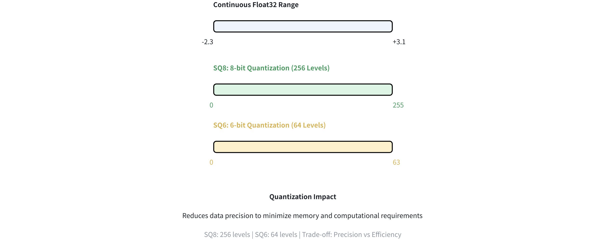

# HNSW_SQ

**HNSW_SQ** combines Hierarchical Navigable Small World (HNSW) graphs with Scalar Quantization (SQ), creating an advanced vector indexing method that offers a controllable size-versus-accuracy trade-off. Compared to standard [HNSW](hnsw.md), this index type maintains high query processing speed while introducing a slight increase in index construction time.

## Overview

HNSW_SQ combines two indexing techniques: **HNSW** for fast graph-based navigation and **SQ** for efficient vector compression.

### HNSW

HNSW constructs a multi-layer graph where each node corresponds to a vector in the dataset. In this graph, nodes are connected based on their similarity, enabling rapid traversal through the data space. The hierarchical structure allows the search algorithm to narrow down the candidate neighbors, significantly accelerating the search process in high-dimensional spaces.

For more information, refer to [HNSW](hnsw.md).

### SQ

SQ is a method for compressing vectors by representing them with fewer bits. For instance:

- **SQ8** uses 8 bits, mapping values into 256 levels.  For more information, refer to [IVF_SQ8](ivf-sq8.md#SQ8).

- **SQ6** uses 6 bits to represent each floating-point value, resulting in 64 discrete levels.



This reduction in precision dramatically decreases the memory footprint and speeds up the computation while retaining the essential structure of the data.

### HNSW + SQ

HNSW_SQ combines the strengths of HNSW and SQ to enable efficient approximate nearest neighbor search. Here’s how the process works:

1. **Data Compression:** SQ compresses the vectors using the `sq_type` (for example, SQ6 or SQ8), which reduces memory usage. This compression may lower precision, but it allows the system to handle larger datasets.

1. **Graph Construction:** The compressed vectors are used to build an HNSW graph. Because the data is compressed, the resulting graph is smaller and faster to search.

1. **Candidate Retrieval:** When a query vector is provided, the algorithm uses the compressed data to quickly identify a pool of candidate neighbors from the HNSW graph.

1. **(Optional) Result Refinement:** The initial candidate results can be refined for better accuracy, based on the following parameters:

    - `refine`: Controls whether this refinement step is activated. When set to `true`, the system recalculates distances using higher-precision or uncompressed representations.

    - `refine_type`: Specifies the precision level of data used during refinement (e.g., SQ6, SQ8, BF16). A higher-precision choice such as `FP32` can yield more accurate results but requires more memory. This must exceed the precision of the original compressed data set by `sq_type`.

    - `refine_k`: Acts as a magnification factor. For instance, if your top *k* is 100 and `refine_k` is 2, the system re-ranks the top 200 candidates and returns the best 100, enhancing overall accuracy.

For a full list of parameters and valid values, refer to [Index params](hnsw-sq.md#Index-params).

## Build index

To build an `HNSW_SQ` index on a vector field in Milvus, use the `add_index()` method, specifying the `index_type`, `metric_type`, and additional parameters for the index.

```python
from pymilvus import MilvusClient

# Prepare index building params
index_params = MilvusClient.prepare_index_params()

index_params.add_index(
    field_name="your_vector_field_name", # Name of the vector field to be indexed
    index_type="HNSW_SQ", # Type of the index to create
    index_name="vector_index", # Name of the index to create
    metric_type="L2", # Metric type used to measure similarity
    params={
        "M": 64, # Maximum number of neighbors each node can connect to in the graph
        "efConstruction": 100, # Number of candidate neighbors considered for connection during index construction
        "sq_type": "SQ6", # Scalar quantizer type
        "refine": true, # Whether to enable the refinement step
        "refine_type": "SQ8" # Precision level of data used for refinement
    } # Index building params
)
```

In this configuration:

- `index_type`: The type of index to be built. In this example, set the value to `HNSW_SQ`.

- `metric_type`: The method used to calculate the distance between vectors. Supported values include `COSINE`, `L2`, and `IP`. For details, refer to [Metric Types](metric.md).

- `params`: Additional configuration options for building the index. For details, refer to [Index building params](hnsw-sq.md#Index-building-params).

Once the index parameters are configured, you can create the index by using the `create_index()` method directly or passing the index params in the `create_collection` method. For details, refer to [Create Collection](create-collection.md).

## Search on index

Once the index is built and entities are inserted, you can perform similarity searches on the index.

```python
search_params = {
    "params": {
        "ef": 10, # Parameter controlling query time/accuracy trade-off
        "refine_k": 1 # The magnification factor
    }
}

res = MilvusClient.search(
    collection_name="your_collection_name", # Collection name
    anns_field="vector_field",  # Vector field name
    data=[[0.1, 0.2, 0.3, 0.4, 0.5]],  # Query vector
    limit=3,  # TopK results to return
    search_params=search_params
)
```

In this configuration:

- `params`: Additional configuration options for searching on the index. For details, refer to [Index-specific search params](hnsw-sq.md#Index-specific-search-params).

## Index params

This section provides an overview of the parameters used for building an index and performing searches on the index.

### Index building params

The following table lists the parameters that can be configured in `params` when [building an index](hnsw-sq.md#share-PRYPd4xBJonkoZxPpNWcdnebnNh).

<table>
   <tr>
     <th></th>
     <th><p>Parameter</p></th>
     <th><p>Description</p></th>
     <th><p>Value Range</p></th>
     <th><p>Tuning Suggestion</p></th>
   </tr>
   <tr>
     <td><p>HNSW</p></td>
     <td><p><code>M</code></p></td>
     <td><p>Maximum number of connections （or edges) each node can have in the graph, including both outgoing and incoming edges.
 This parameter directly affects both index construction and search.</p></td>
     <td><p><strong>Type</strong>: Integer
 <strong>Range</strong>: [2, 2048]</p>
<p><strong>Default value</strong>: <code>30</code> (up to 30 outgoing and 30 incoming edges per node)</p></td>
     <td><p>A larger <code>M</code> generally leads to <strong>higher accuracy</strong> but <strong>increases memory overhead</strong> and <strong>slows down both index building and search</strong>.
 Consider increasing <code>M</code> for datasets with high dimensionality or when high recall is crucial.</p>
<p>Consider decreasing <code>M</code> when memory usage and search speed are primary concerns.</p>
<p>In most cases, we recommend you set a value within this range: [5, 100].</p></td>
   </tr>
   <tr>
     <td></td>
     <td><p><code>efConstruction</code></p></td>
     <td><p>Number of candidate neighbors considered for connection during index construction.
 A larger pool of candidates is evaluated for each new element, but the maximum number of connections actually established is still limited by <code>M</code>.</p></td>
     <td><p><strong>Type</strong>: Integer
 <strong>Range</strong>: [1, <em>int_max</em>]</p>
<p><strong>Default value</strong>: <code>360</code></p></td>
     <td><p>A higher <code>efConstruction</code> typically results in a <strong>more accurate index</strong>, as more potential connections are explored. However, this also leads to <strong>longer indexing time and increased memory usage</strong> during construction.
 Consider increasing <code>efConstruction</code> for improved accuracy, especially in scenarios where indexing time is less critical.</p>
<p>Consider decreasing <code>efConstruction</code> to speed up index construction when resource constraints are a concern.</p>
<p>In most cases, we recommend you set a value within this range: [50, 500].</p></td>
   </tr>
   <tr>
     <td><p>SQ</p></td>
     <td><p><code>sq_type</code></p></td>
     <td><p>Specifies the scalar quantization method for compressing vectors. Each option offers a different balance between compression and accuracy:</p>
<ul>
<li><p><code>SQ6</code>: Encodes vectors using 6-bit integers.</p></li>
<li><p><code>SQ8</code>: Encodes vectors using 8-bit integers.</p></li>
<li><p><code>BF16</code>: Uses the Bfloat16 format.</p></li>
<li><p><code>FP16</code>: Uses the standard 16-bit floating-point format.</p></li>
</ul></td>
     <td><p><strong>Type</strong>: String
 <strong>Range</strong>: [ <code>SQ6</code>, <code>SQ8</code>, <code>BF16</code>, <code>FP16</code> ]</p>
<p><strong>Default value</strong>: <code>SQ8</code></p></td>
     <td><p>The choice of <code>sq_type</code> depends on the specific application's needs. If memory efficiency is a primary concern, <code>SQ6</code> or <code>SQ8</code> might be suitable. On the other hand, if accuracy is paramount, <code>BF16</code> or <code>FP16</code> could be preferred.</p></td>
   </tr>
   <tr>
     <td></td>
     <td><p><code>refine</code></p></td>
     <td><p>A boolean flag that controls whether a refinement step is applied during search. Refinement involves reranking the initial results by computing exact distances between the query vector and candidates.</p></td>
     <td><p><strong>Type</strong>: Boolean
 <strong>Range</strong>: [<code>true</code>, <code>false</code>]</p>
<p><strong>Default value</strong>: <code>false</code></p></td>
     <td><p>Set to <code>true</code> if high accuracy is essential and you can tolerate slightly slower search times. Use <code>false</code> if speed is a priority and a minor compromise in accuracy is acceptable.</p></td>
   </tr>
   <tr>
     <td></td>
     <td><p><code>refine_type</code></p></td>
     <td><p>Determines the precision of the data used for refinement.
 This precision must be higher than that of the compressed vectors (as set by <code>sq_type</code>), affecting both the accuracy of the re-ranked vectors and their memory footprint.</p></td>
     <td><p><strong>Type</strong>: String
 <strong>Range</strong>:[ <code>SQ6</code>, <code>SQ8</code>, <code>BF16</code>, <code>FP16</code>, <code>FP32</code> ]</p>
<p><strong>Default value</strong>: None</p></td>
     <td><p>Use <code>FP32</code> for maximum precision at a higher memory cost, or <code>SQ6</code>/<code>SQ8</code> for better compression. <code>BF16</code> and <code>FP16</code> offer a balanced alternative.</p></td>
   </tr>
</table>

### Index-specific search params

The following table lists the parameters that can be configured in `search_params.params` when [searching on the index](hnsw-sq.md#share-DeFldzMQQoc2W4x2YiIcYUbqnne).

<table>
   <tr>
     <th></th>
     <th><p>Parameter</p></th>
     <th><p>Description</p></th>
     <th><p>Value Range</p></th>
     <th><p>Tuning Suggestion</p></th>
   </tr>
   <tr>
     <td><p>HNSW</p></td>
     <td><p><code>ef</code></p></td>
     <td><p>Controls the breadth of search during nearest neighbor retrieval. It determines how many nodes are visited and evaluated as potential nearest neighbors. 
 This parameter affects only the search process and applies exclusively to the bottom layer of the graph.</p></td>
     <td><p><strong>Type</strong>: Integer
 <strong>Range</strong>: [1, <em>int_max</em>]</p>
<p><strong>Default value</strong>: <em>limit</em> (TopK nearest neighbors to return)</p></td>
     <td><p>A larger <code>ef</code> generally leads to <strong>higher search accuracy</strong> as more potential neighbors are considered. However, this also <strong>increases search time</strong>.
 Consider increasing <code>ef</code> when achieving high recall is critical and search speed is less of a concern.</p>
<p>Consider decreasing <code>ef</code> to prioritize faster searches, especially in scenarios where a slight reduction in accuracy is acceptable.</p>
<p>In most cases, we recommend you set a value within this range: [K, 10K].</p></td>
   </tr>
   <tr>
     <td><p>SQ</p></td>
     <td><p><code>refine_k</code></p></td>
     <td><p>The magnification factor that controls how many extra candidates are examined during the refinement stage, relative to the requested top K results.</p></td>
     <td><p><strong>Type</strong>: Float
 <strong>Range</strong>: [1, <em>float_max</em>)</p>
<p><strong>Default value</strong>: 1</p></td>
     <td><p>Higher values of <code>refine_k</code> can improve recall and accuracy but will also increase search time and resource usage. A value of 1 means the refinement process considers only the initial top K results.</p></td>
   </tr>
</table>

