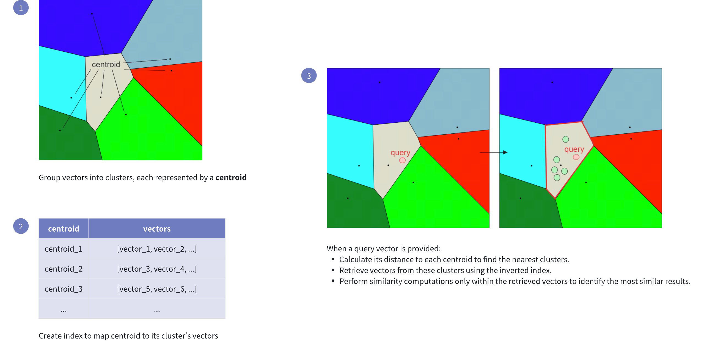

# IVF_FLAT

The **IVF_FLAT** index is an indexing algorithm that can improve search performance for floating-point vectors. 

This index type is ideal for large-scale datasets that require fast query responses and high accuracy, especially when clustering your dataset can reduce the search space and sufficient memory is available to store cluster data.

## Overview

The term **IVF_FLAT** stands for **Inverted File Flat**, which encapsulates its dual-layered approach to indexing and searching for floating-point vectors:

- **Inverted File (IVF):** Refers to clustering the vector space into manageable regions using [k-means clustering](https://en.wikipedia.org/wiki/K-means_clustering). Each cluster is represented by a **centroid**, serving as a reference point for the vectors within.

- **Flat:** Indicates that within each cluster, vectors are stored in their original form (flat structure), without any compression or quantization, for precise distance computations.

The following figure shows how it works:



This indexing method speeds up the search process, but it comes with a potential drawback: the candidate found as the nearest to the query embedding may not be the exact nearest one. This can happen if the nearest embedding to the query embedding resides in a cluster different from the one selected based on the nearest centroid (see visualization below).

To address this issue, **IVF_FLAT** provides two hyperparameters that we can tune:

- `nlist`: Specifies the number of partitions to create using the k-means algorithm.

- `nprobe`: Specifies the number of partitions to consider during the search for candidates.

Now if we set `nprobe` to 3 instead of 1, we get the following result:


By increasing the `nprobe` value, you can include more partitions in the search, which can help ensure that the nearest embedding to the query is not missed, even if it resides in a different partition. However, this comes at the cost of increased search time, as more candidates need to be evaluated. For more information on index parameter tuning, refer to [Index params](ivf-flat.md#Index-params).

## Build index

To build an `IVF_FLAT` index on a vector field in Milvus, use the `add_index()` method, specifying the `index_type`, `metric_type`, and additional parameters for the index.

```python
from pymilvus import MilvusClient

# Prepare index building params
index_params = MilvusClient.prepare_index_params()

index_params.add_index(
    field_name="your_vector_field_name", # Name of the vector field to be indexed
    index_type="IVF_FLAT", # Type of the index to create
    index_name="vector_index", # Name of the index to create
    metric_type="L2", # Metric type used to measure similarity
    params={
        "nlist": 64, # Number of clusters for the index
    } # Index building params
)
```

In this configuration:

- `index_type`: The type of index to be built. In this example, set the value to `IVF_FLAT`.

- `metric_type`: The method used to calculate the distance between vectors. Supported values include `COSINE`, `L2`, and `IP`. For details, refer to [Metric Types](metric.md).

- `params`: Additional configuration options for building the index.

    - `nlist`: Number of clusters to divide the dataset.

    To learn more building parameters available for the `IVF_FLAT` index, refer to [Index building params](ivf-flat.md#Index-building-params).

Once the index parameters are configured, you can create the index by using the `create_index()` method directly or passing the index params in the `create_collection` method. For details, refer to [Create Collection](create-collection.md).

## Search on index

Once the index is built and entities are inserted, you can perform similarity searches on the index.

```python
search_params = {
    "params": {
        "nprobe": 10, # Number of clusters to search
    }
}

res = MilvusClient.search(
    collection_name="your_collection_name", # Collection name
    anns_field="vector_field",
    data=[[0.1, 0.2, 0.3, 0.4, 0.5]],  # Query vector
    limit=3,  # TopK results to return
    search_params=search_params
)
```

In this configuration:

- `params`: Additional configuration options for searching on the index.

    - `nprobe`: Number of clusters to search for.

    To learn more search parameters available for the `IVF_FLAT` index, refer to [Index-specific search params](ivf-flat.md#Index-specific-search-params).

## Index params

This section provides an overview of the parameters used for building an index and performing searches on the index.

### Index building params

The following table lists the parameters that can be configured in `params` when [building an index](ivf-flat.md#Build-index).

<table>
   <tr>
     <th><p>Parameter</p></th>
     <th><p>Description</p></th>
     <th><p>Value Range</p></th>
     <th><p>Tuning Suggestion</p></th>
   </tr>
   <tr>
     <td><p><code>nlist</code></p></td>
     <td><p>The number of clusters to create using the k-means algorithm during index building. Each cluster, represented by a centroid, stores a list of vectors. Increasing this parameter reduces the number of vectors in each cluster, creating smaller, more focused partitions.</p></td>
     <td><p><strong>Type</strong>: Integer <strong>Range</strong>: [1, 65536]</p><p><strong>Default value</strong>: <code>128</code></p></td>
     <td><p>Larger <code>nlist</code> values improve recall by creating more refined clusters but increase index building time. Optimize based on dataset size and available resources. In most cases, we recommend you set a value within this range: [32, 4096].</p></td>
   </tr>
</table>

### Index-specific search params

The following table lists the parameters that can be configured in `search_params.params` when [searching on the index](ivf-flat.md#Search-on-index).

<table>
   <tr>
     <th><p>Parameter</p></th>
     <th><p>Description</p></th>
     <th><p>Value Range</p></th>
     <th><p>Tuning Suggestion</p></th>
   </tr>
   <tr>
     <td><p><code>nprobe</code></p></td>
     <td><p>The number of clusters to search for candidates. Higher values allow more clusters to be searched, improving recall by expanding the search scope but at the cost of increased query latency.</p></td>
     <td><p><strong>Type</strong>: Integer <strong>Range</strong>: [1, <em>nlist</em>]</p><p><strong>Default value</strong>: <code>8</code></p></td>
     <td><p>Increasing this value improves recall but may slow down the search. Set <code>nprobe</code> proportionally to <code>nlist</code> to balance speed and accuracy.</p><p>In most cases, we recommend you set a value within this range: [1, nlist].</p></td>
   </tr>
</table>

