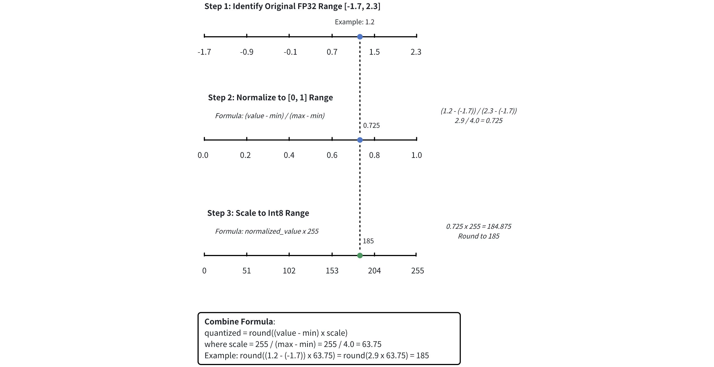

# IVF_SQ8

The **IVF_SQ8** index is a **quantization-based** indexing algorithm designed to tackle large-scale similarity search challenges. This index type achieves faster searches with a much smaller memory footprint compared to exhaustive search methods.

## Overview

The IVF_SQ8 index is built on two key components:

- **Inverted File (IVF)**: Organizes the data into clusters, enabling the search algorithm to focus only on the most relevant subsets of vectors.

- **Scalar Quantization (SQ8)**: Compresses the vectors to a more compact form, drastically reducing memory usage while maintaining enough precision for fast similarity calculations.

### IVF

IVF is like creating an index in a book. Instead of scanning every page (or, in our case, every vector), you look up specific keywords (clusters) in the index to quickly find the relevant pages (vectors). In our scenario, vectors are grouped into clusters, and the algorithm will search within a few clusters that are close to the query vector.

Here's how it works:

1. **Clustering:** Your vector dataset is divided into a specified number of clusters, using a clustering algorithm like k-means. Each cluster has a centroid (a representative vector for the cluster).

1. **Assignment:** Each vector is assigned to the cluster whose centroid is closest to it.

1. **Inverted Index:** An index is created, mapping each cluster centroid to the list of vectors assigned to that cluster.

1. **Search:** When you search for nearest neighbors, the search algorithm compares your query vector with the cluster centroids and selects the most promising cluster(s). The search is then narrowed down to the vectors within those selected clusters.

To learn more about its technical details , refer to [IVF_FLAT](ivf-flat.md).

### SQ8

Scalar Quantization (SQ) is a technique used to reduce the size of high-dimensional vectors by replacing their values with smaller, more compact representations. The **SQ8** variant uses 8-bit integers instead of the typical 32-bit floating point numbers to store each dimension value of a vector. This greatly reduces the amount of memory required to store the data.

Here's how SQ8 works:

1. **Range Identification:** First, identify the minimum and maximum values within the vector. This range defines the bounds for quantization.

1. **Normalization:** Normalize the vector values to a range between 0 and 1 using the formula: 

    $$
    \text{normalized\_value} = \frac{\text{value} - \text{min}}{\text{max} - \text{min}}
    $$

    This ensures all values are mapped proportionally within a standardized range, preparing them for compression.

1. **8-Bit Compression:** Multiply the normalized value by 255 (the maximum value for an 8-bit integer) and round the result to the nearest integer. This effectively compresses each value into an 8-bit representation.

Suppose you have a dimension value of 1.2, with a minimum value of -1.7 and a maximum value of 2.3. The following figure shows how SQ8 is applied to convert a float32 value to an int8 integer.



### IVF + SQ8

The IVF_SQ8 index combines IVF and SQ8 to efficiently perform similarity searches:

1. **IVF narrows the search scope**: The dataset is divided into clusters, and when a query is issued, IVF first compares the query to the cluster centroids, selecting the most relevant clusters.

1. **SQ8 speeds up distance calculations**: Within the selected clusters, SQ8 compresses the vectors into 8-bit integers, reducing memory usage and accelerating distance computations.

By using IVF to focus the search and SQ8 to speed up computations, IVF_SQ8 achieves both fast search times and memory efficiency.

## Build index

To build an `IVF_SQ8` index on a vector field in Milvus, use the `add_index()` method, specifying the `index_type`, `metric_type`, and additional parameters for the index.

```python
from pymilvus import MilvusClient

# Prepare index building params
index_params = MilvusClient.prepare_index_params()

index_params.add_index(
    field_name="your_vector_field_name", # Name of the vector field to be indexed
    index_type="IVF_SQ8", # Type of the index to create
    index_name="vector_index", # Name of the index to create
    metric_type="L2", # Metric type used to measure similarity
    params={
        "nlist": 64, # Number of clusters to create using the k-means algorithm during index building
    } # Index building params
)
```

In this configuration:

- `index_type`: The type of index to be built. In this example, set the value to `IVF_SQ8`.

- `metric_type`: The method used to calculate the distance between vectors. Supported values include `COSINE`, `L2`, and `IP`. For details, refer to [Metric Types](metric.md).

- `params`: Additional configuration options for building the index.

    - `nlist`: Number of clusters to create using the k-means algorithm during index building.

    To learn more building parameters available for the `IVF_SQ8` index, refer to [Index building params](ivf-sq8.md#share-BwprdWFCjoMBtMxorO0cWrUPnjb).

Once the index parameters are configured, you can create the index by using the `create_index()` method directly or passing the index params in the `create_collection` method. For details, refer to [Create Collection](create-collection.md).

## Search on index

Once the index is built and entities are inserted, you can perform similarity searches on the index.

```python
search_params = {
    "params": {
        "nprobe": 8, # Number of clusters to search for candidates
    }
}

res = MilvusClient.search(
    collection_name="your_collection_name", # Collection name
    anns_field="vector_field", # Vector field name
    data=[[0.1, 0.2, 0.3, 0.4, 0.5]],  # Query vector
    limit=10,  # TopK results to return
    search_params=search_params
)
```

In this configuration:

- `params`: Additional configuration options for searching on the index.

    - `nprobe`: Number of clusters to search for candidates.

    To learn more search parameters available for the `IVF_SQ8` index, refer to [Index-specific search params](ivf-sq8.md#share-PJhqdqNaNodKiexm6F1cD2IInbe).

## Index params

This section provides an overview of the parameters used for building an index and performing searches on the index.

### Index building params

The following table lists the parameters that can be configured in `params` when [building an index](ivf-sq8.md#share-X9Y9dTuhDohRRBxSvzBcXmIEnu4).

<table>
   <tr>
     <th></th>
     <th><p>Parameter</p></th>
     <th><p>Description</p></th>
     <th><p>Value Range</p></th>
     <th><p>Tuning Suggestion</p></th>
   </tr>
   <tr>
     <td><p>IVF</p></td>
     <td><p><code>nlist</code></p></td>
     <td><p>The number of clusters to create using the k-means algorithm during index building.</p></td>
     <td><p><strong>Type</strong>: Integer
 <strong>Range</strong>: [1, 65536]</p>
<p><strong>Default value</strong>: <code>128</code></p></td>
     <td><p>Larger <code>nlist</code> values improve recall by creating more refined clusters but increase index building time. Optimize based on dataset size and available resources.
 In most cases, we recommend you set a value within this range: [32, 4096].</p></td>
   </tr>
</table>

### Index-specific search params

The following table lists the parameters that can be configured in `search_params.params` when [searching on the index](ivf-sq8.md#share-TI73dmWBOoEnocxQ8H7clSYUnLg).

<table>
   <tr>
     <th></th>
     <th><p>Parameter</p></th>
     <th><p>Description</p></th>
     <th><p>Value Range</p></th>
     <th><p>Tuning Suggestion</p></th>
   </tr>
   <tr>
     <td><p>IVF</p></td>
     <td><p><code>nprobe</code></p></td>
     <td><p>The number of clusters to search for candidates.</p></td>
     <td><p><strong>Type</strong>: Integer
 <strong>Range</strong>: [1, <em>nlist</em>]</p>
<p><strong>Default value</strong>: <code>8</code></p></td>
     <td><p>Higher values allow more clusters to be searched, improving recall by expanding the search scope but at the cost of increased query latency.
 Set <code>nprobe</code> proportionally to <code>nlist</code> to balance speed and accuracy.</p>
<p>In most cases, we recommend you set a value within this range: [1, nlist].</p></td>
   </tr>
</table>

