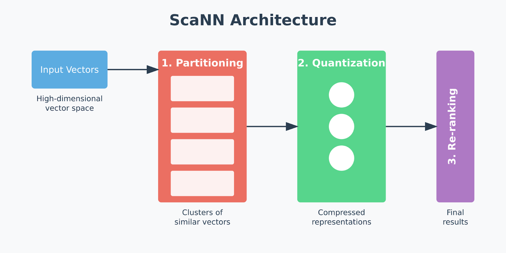

# SCANN

Powered by the [ScaNN](https://github.com/google-research/google-research/blob/master/scann%2FREADME.md) library from Google, the `SCANN` index in Milvus is designed to address scaling vector similarity search challenges, striking a balance between speed and accuracy, even on large datasets that would traditionally pose challenges for most search algorithms.

## Overview

ScaNN is built to solve one of the biggest challenges in vector search: efficiently finding the most relevant vectors in high-dimensional spaces, even as datasets grow larger and more complex. Its architecture breaks down the vector search process into distinct stages:



1. **Partitioning**: Divides the dataset into clusters. This method narrows the search space by focusing only on relevant data subsets instead of scanning the entire dataset, saving time and processing resources. ScaNN often uses clustering algorithms, such as [k-means](https://zilliz.com/blog/k-means-clustering), to identify clusters, which allows it to perform similarity searches more efficiently.

1. **Quantization**: ScaNN applies a quantization process known as [anisotropic vector quantization](https://arxiv.org/abs/1908.10396) after partitioning. Traditional quantization focuses on minimizing the overall distance between original and compressed vectors, which isn’t ideal for tasks like [Maximum Inner Product Search (MIPS)](https://papers.nips.cc/paper/5329-asymmetric-lsh-alsh-for-sublinear-time-maximum-inner-product-search-mips.pdf), where similarity is determined by the inner product of vectors rather than direct distance. Anisotropic quantization instead prioritizes preserving parallel components between vectors, or the parts most important for calculating accurate inner products. This approach allows ScaNN to maintain high MIPS accuracy by carefully aligning compressed vectors with the query, enabling faster, more precise similarity searches.

1. **Re-ranking**: The re-ranking phase is the final step, where ScaNN fine-tunes the search results from the partitioning and quantization stages. This re-ranking applies precise inner product calculations to the top candidate vectors, ensuring the final results are highly accurate. Re-ranking is crucial in high-speed recommendation engines or image search applications where the initial filtering and clustering serve as a coarse layer, and the final stage ensures that only the most relevant results are returned to the user.

The performance of `SCANN` is controlled by two key parameters that let you fine-tune the balance between speed and accuracy:

- `with_raw_data`: Controls whether original vector data is stored alongside quantized representations. Enabling this parameter improves accuracy during re-ranking but increases storage requirements.

- `reorder_k`: Determines how many candidates are refined during the final re-ranking phase. Higher values improve accuracy but increase search latency.

For detailed guidance on optimizing these parameters for your specific use case, refer to [Index params](scann.md#Index-params).

## Build index

To build a `SCANN` index on a vector field in Milvus, use the `add_index()` method, specifying the `index_type`, `metric_type`, and additional parameters for the index.

```python
from pymilvus import MilvusClient

# Prepare index building params
index_params = MilvusClient.prepare_index_params()

index_params.add_index(
    field_name="your_vector_field_name", # Name of the vector field to be indexed
    # highlight-next-line
    index_type="SCANN", # Type of the index to create
    index_name="vector_index", # Name of the index to create
    metric_type="L2", # Metric type used to measure similarity
    params={
        "with_raw_data": True, # Whether to hold raw data
    } # Index building params
)
```

In this configuration:

- `index_type`: The type of index to be built. In this example, set the value to `SCANN`.

- `metric_type`: The method used to calculate the distance between vectors. Supported values include `COSINE`, `L2`, and `IP`. For details, refer to [Metric Types](metric.md).

- `params`: Additional configuration options for building the index.

    - `with_raw_data`: Whether to store the original vector data alongside the quantized representation.

    To learn more building parameters available for the `SCANN` index, refer to [Index building params](scann.md#Index-building-params).

Once the index parameters are configured, you can create the index by using the `create_index()` method directly or passing the index params in the `create_collection` method. For details, refer to [Create Collection](create-collection.md).

## Search on index

Once the index is built and entities are inserted, you can perform similarity searches on the index.

```python
search_params = {
    "params": {
        "reorder_k": 10, # Number of candidates to refine
        "nprobe": 8 # Number of clusters to search
    }
}

res = MilvusClient.search(
    collection_name="your_collection_name", # Collection name
    anns_field="vector_field", # Vector field name
    data=[[0.1, 0.2, 0.3, 0.4, 0.5]],  # Query vector
    limit=10,  # TopK results to return
    search_params=search_params
)
```

In this configuration:

- `params`: Additional configuration options for searching on the index.

    - `reorder_k`: Number of candidates to refine during the re-ranking phase.
    - `nprobe`: Number of clusters to search for.

    To learn more search parameters available for the `SCANN` index, refer to [Index-specific search params](scann.md#Index-specific-search-params).

## Index params

This section provides an overview of the parameters used for building an index and performing searches on the index.

### Index building params

The following table lists the parameters that can be configured in `params` when [building an index](scann.md#Build-index).

<table>
   <tr>
     <th><p>Parameter</p></th>
     <th><p>Description</p></th>
     <th><p>Value Range</p></th>
     <th><p>Tuning Suggestion</p></th>
   </tr>
   <tr>
     <td><p><code>nlist</code></p></td>
     <td><p>Number of cluster units</p></td>
     <td><p>[1, 65536]</p></td>
     <td><p>A higher <em>nlist</em> increases pruning efficiency and typically speeds up coarse search, but partitions can get too small, which may reduce recall; a lower <em>nlist</em> scans larger clusters, improving recall but slowing search.</p></td>
   </tr>
   <tr>
     <td><p><code>with_raw_data</code></p></td>
     <td><p>Whether to store the original vector data alongside the quantized representation. When enabled, this allows for more accurate similarity calculations during the re-ranking phase by using the original vectors instead of quantized approximations.</p></td>
     <td><p><strong>Type</strong>: Boolean</p><p><strong>Range</strong>: <code>true</code>, <code>false</code></p><p><strong>Default value</strong>: <code>true</code></p></td>
     <td><p>Set to <code>true</code> for <strong>higher search accuracy</strong> and when storage space is not a primary concern. The original vector data enables more precise similarity calculations during re-ranking.</p><p>Set to <code>false</code> to <strong>reduce storage overhead</strong> and memory usage, especially for large datasets. However, this may result in slightly lower search accuracy as the re-ranking phase will use quantized vectors.</p><p><strong>Recommended</strong>: Use <code>true</code> for production applications where accuracy is critical.</p></td>
   </tr>
</table>

### Index-specific search params

The following table lists the parameters that can be configured in `search_params.params` when [searching on the index](scann.md#Search-on-index).

<table>
   <tr>
     <th><p>Parameter</p></th>
     <th><p>Description</p></th>
     <th><p>Value Range</p></th>
     <th><p>Tuning Suggestion</p></th>
   </tr>
   <tr>
     <td><p><code>reorder_k</code></p></td>
     <td><p>Controls the number of candidate vectors that are refined during the re-ranking phase. This parameter determines how many top candidates from the initial partitioning and quantization stages are re-evaluated using more precise similarity calculations.</p></td>
     <td><p><strong>Type</strong>: Integer</p><p><strong>Range</strong>: [1, <em>int_max</em>]</p><p><strong>Default value</strong>: None</p></td>
     <td><p>A larger <code>reorder_k</code> generally leads to <strong>higher search accuracy</strong> as more candidates are considered during the final refinement phase. However, this also <strong>increases search time</strong> due to additional computation.</p><p>Consider increasing <code>reorder_k</code> when achieving high recall is critical and search speed is less of a concern. A good starting point is 2-5x your desired <code>limit</code> (TopK results to return).</p><p>Consider decreasing <code>reorder_k</code> to prioritize faster searches, especially in scenarios where a slight reduction in accuracy is acceptable.</p><p>In most cases, we recommend you set a value within this range: [<em>limit</em>, <em>limit</em> * 5].</p></td>
   </tr>
   <tr>
     <td><p><code>nprobe</code></p></td>
     <td><p>The number of clusters to search for candidates.</p></td>
     <td><p><strong>Type</strong>: Integer</p><p><strong>Range</strong>: [1, <em>nlist</em>]</p><p><strong>Default value</strong>: <code>8</code></p></td>
     <td><p>Higher values allow more clusters to be searched, improving recall by expanding the search scope but at the cost of increased query latency.</p><p>Set <code>nprobe</code> proportionally to <code>nlist</code> to balance speed and accuracy.</p><p>In most cases, we recommend you set a value within this range: [1, nlist].</p></td>
   </tr>
</table>

