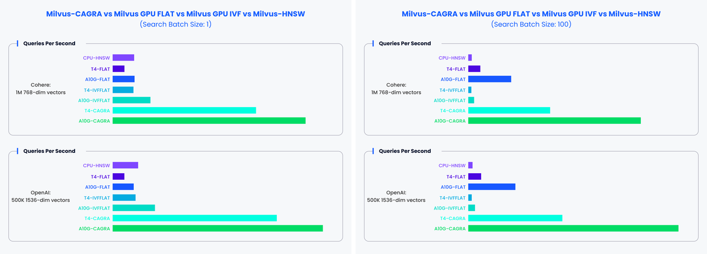

# GPU Index Overview

Building an index with GPU support in Milvus can significantly improve search performance in high-throughput and high-recall scenarios.

The following figure compares the query throughput (queries per second) of various index configurations across different hardware setups, vector datasets (Cohere and OpenAI), and search batch sizes, showing that `GPU_CAGRA` consistently outperforms other methods.



## Limits

- For `GPU_IVF_FLAT`, the maximum value for `limit` is 1,024.

- For `GPU_IVF_PQ` and `GPU_CAGRA`, the maximum value for `limit` is 1,024.

- While there is no set `limit` for `GPU_BRUTE_FORCE`, it is recommended not to exceed 4,096 to avoid potential performance issues.

- Currently, GPU indexes do not support `COSINE` distance. If `COSINE` distance is required, data should be normalized first, and then inner product (IP) distance can be used as a substitute.

- Loading OOM protection for GPU indexes is not fully supported, too much data might lead to QueryNode crashes.

- GPU indexes do not support search functions like [range search](range-search.md) and [grouping search](grouping-search.md).

## Supported GPU index types

The following table lists the GPU index types supported by Milvus.

<table>
   <tr>
     <th><p>Index Type</p></th>
     <th><p>Description</p></th>
     <th><p>Memory Usage</p></th>
   </tr>
   <tr>
     <td><p><a href="gpu-cagra.md">GPU_CAGRA</a></p></td>
     <td><p>GPU_CAGRA is a graph-based index optimized for GPUs, Using inference-grade GPUs to run the Milvus GPU version can be more cost-effective compared to using expensive training-grade GPUs.</p></td>
     <td><p>Memory usage is approximately 1.8 times that of the original vector data.</p></td>
   </tr>
   <tr>
     <td><p><a href="gpu-ivf-flat.md">GPU_IVF_FLAT</a></p></td>
     <td><p>GPU_IVF_FLAT is the most basic IVF index, and the encoded data stored in each unit is consistent with the original data. When conducting searches, note that you can set the top-k (<code>limit</code>) up to 256 for any search against a GPU_IVF_FLAT-indexed collection.</p></td>
     <td><p>Requires memory equal to the size of the original data.</p></td>
   </tr>
   <tr>
     <td><p><a href="gpu-ivf-pq.md">GPU_IVF_PQ</a></p></td>
     <td><p>GPU_IVF_PQ performs IVF index clustering before quantizing the product of vectors. When conducting searches, note that you can set the top-k (<code>limit</code>) up to 8,192 for any search against a GPU_IVF_FLAT-indexed collection.</p></td>
     <td><p>Utilizes a smaller memory footprint, which depends on the compression parameter settings.</p></td>
   </tr>
   <tr>
     <td><p><a href="gpu-brute-force.md">GPU_BRUTE_FORCE</a></p></td>
     <td><p>GPU_BRUTE_FORCE is tailored for cases where extremely high recall is crucial, guaranteeing a recall of 1 by comparing each query with all vectors in the dataset. It only requires the metric type (<code>metric_type</code>) and top-k (<code>limit</code>) as index building and search parameters.</p></td>
     <td><p>Requires memory equal to the size of the original data.</p></td>
   </tr>
</table>

## Configure Milvus settings for GPU memory control

Milvus uses a global graphics memory pool to allocate GPU memory. It supports two parameters `initMemSize` and `maxMemSize` in [Milvus config file](https://github.com/milvus-io/milvus/blob/master/configs/milvus.yaml#L767-L769). The pool size is initially set to `initMemSize`, and will be automatically expanded to `maxMemSize` after exceeding this limit.

The default `initMemSize` is 1/2 of the available GPU memory when Milvus starts, and the default `maxMemSize` is equal to all available GPU memory.

Up until Milvus 2.4.1, Milvus uses a unified GPU memory pool. For versions prior to 2.4.1, it was recommended to set both of the value to 0.

```yaml
gpu:
  initMemSize: 0 #set the initial memory pool size.
  maxMemSize: 0 #maxMemSize sets the maximum memory usage limit. When the memory usage exceed initMemSize, Milvus will attempt to expand the memory pool. 
```

From Milvus 2.4.1 onwards, the GPU memory pool is only used for temporary GPU data during searches. Therefore, it is recommended to set it to 2048 and 4096.

```yaml
gpu:
  initMemSize: 2048 #set the initial memory pool size.
  maxMemSize: 4096 #maxMemSize sets the maximum memory usage limit. When the memory usage exceed initMemSize, Milvus will attempt to expand the memory pool. 
```

To learn how to build a GPU index, refer to the specific guide for each index type.

## FAQ

- **When is it appropriate to utilize a GPU index?**

    A GPU index is particularly beneficial in situations that demand high throughput or high recall. For instance, when dealing with large batches, the throughput of GPU indexing can surpass that of CPU indexing by as much as 100 times. In scenarios with smaller batches, GPU indexes still significantly outshine CPU indexes in terms of performance. Furthermore, if there’s a requirement for rapid data insertion, incorporating a GPU can substantially speed up the process of building indexes.

- **In which scenarios are GPU indexes like GPU_CAGRA, GPU_IVF_PQ, GPU_IVF_FLAT, and GPU_BRUTE_FORCE most suitable?**

    `GPU_CAGRA` indexes are ideal for scenarios that demand enhanced performance, albeit at the cost of consuming more memory. For environments where memory conservation is a priority, the `GPU_IVF_PQ` index can help minimize storage requirements, though this comes with a higher loss in precision. The `GPU_IVF_FLAT` index serves as a balanced option, offering a compromise between performance and memory usage. Lastly, the `GPU_BRUTE_FORCE` index is designed for exhaustive search operations, guaranteeing a recall rate of 1 by performing traversal searches.

