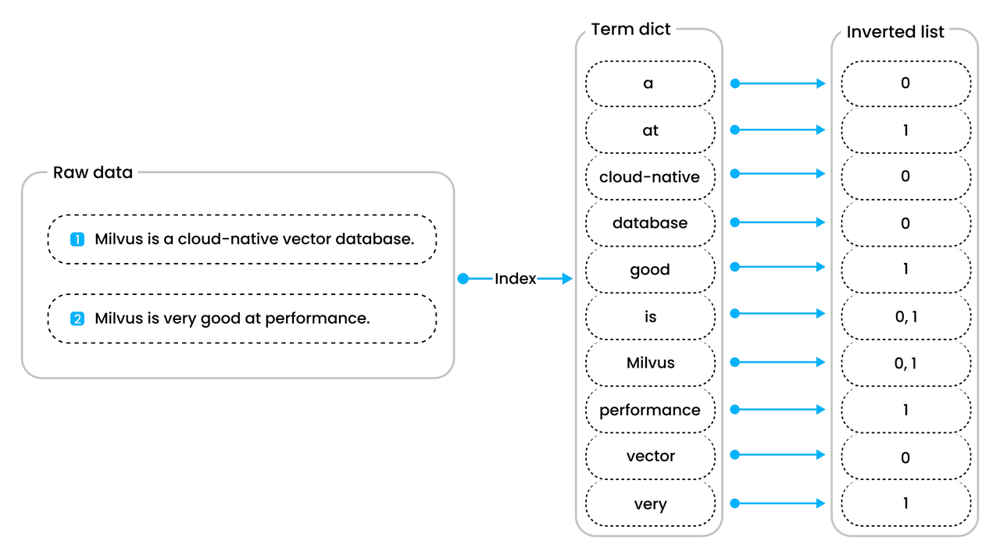

# INVERTED

When you need to perform frequent filter queries on your data, `INVERTED` indexes can dramatically improve query performance. Instead of scanning through all documents, Milvus uses inverted indexes to quickly locate the exact records that match your filter conditions.

## When to use INVERTED indexes

Use INVERTED indexes when you need to:

- **Filter by specific values**: Find all records where a field equals a specific value (e.g., `category == "electronics"`)

- **Filter text content**: Perform efficient searches on `VARCHAR` fields

- **Query JSON field values**: Filter on specific keys within JSON structures

**Performance benefit**: INVERTED indexes can reduce query time from seconds to milliseconds on large datasets by eliminating the need for full collection scans.

## How INVERTED indexes work

Milvus uses [Tantivy](https://github.com/quickwit-oss/tantivy) to implement inverted indexing. Here's the process:

1. **Tokenization**: Milvus breaks down your data into searchable terms

2. **Term dictionary**: Creates a sorted list of all unique terms

3. **Inverted lists**: Maps each term to the documents containing it

For example, given these two sentences:

- **"Milvus is a cloud-native vector database"**

- **"Milvus is very good at performance"**

The inverted index maps terms like **"Milvus"** → **[Document 0, Document 1]**, **"cloud-native"** → **[Document 0]**, and **"performance"** → **[Document 1]**.



When you filter by a term, Milvus looks up the term in the dictionary and instantly retrieves all matching documents.

INVERTED indexes support all scalar field types: **BOOL**, **INT8**, **INT16**, **INT32**, **INT64**, **FLOAT**, **DOUBLE**, **VARCHAR**, **JSON**, and **ARRAY**. However, the index parameters for indexing a JSON field are slightly different from regular scalar fields.

## Create indexes on non-JSON fields

To create an index on a non-JSON field, follow these steps:

1. Prepare your index parameters:

    ```python
    from pymilvus import MilvusClient
    
    client = MilvusClient(uri="http://localhost:19530") # Replace with your server address
    
    # Create an empty index parameter object
    index_params = client.prepare_index_params()
    ```

1. Add the `INVERTED` index:

    ```python
    index_params.add_index(
        field_name="category",           # Name of the field to index
        # highlight-next-line
        index_type="INVERTED",          # Specify INVERTED index type
        index_name="category_index"     # Give your index a name
    )
    ```

1. Create the index:

    ```python
    client.create_index(
        collection_name="my_collection", # Replace with your collection name
        index_params=index_params
    )
    ```

## Create indexes on JSON fields | Milvus 2.5.11+

You can also create INVERTED indexes on specific paths within JSON fields. This requires additional parameters to specify the JSON path and data type:

```python
# Build index params
index_params.add_index(
    field_name="metadata",                    # JSON field name
    # highlight-next-line
    index_type="INVERTED",
    index_name="metadata_category_index",
    # highlight-start
    params={
        "json_path": "metadata[\"category\"]",    # Path to the JSON key
        "json_cast_type": "varchar"              # Data type to cast to during indexing
    }
    # highlight-end
)

# Create index
client.create_index(
    collection_name="my_collection", # Replace with your collection name
    index_params=index_params
)
```

For detailed information about JSON field indexing, including supported paths, data types, and limitations, refer to [JSON Field](use-json-fields.md).

## Best practices

- **Create indexes after loading data**: Build indexes on collections that already contain data for better performance

- **Use descriptive index names**: Choose names that clearly indicate the field and purpose

- **Monitor index performance**: Check query performance before and after creating indexes

- **Consider your query patterns**: Create indexes on fields you frequently filter by

## Next steps

- Learn about [other index types](index-explained.md)

- See [JSON field indexing](use-json-fields.md#Index-values-inside-the-JSON-field) for advanced JSON indexing scenarios

