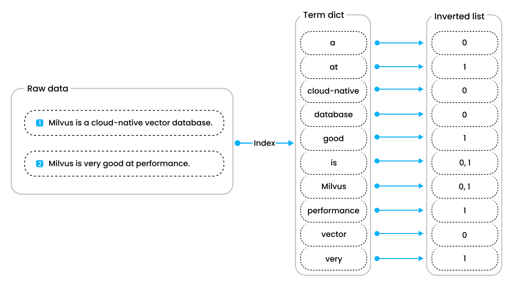

# INVERTED

The `INVERTED` index in Milvus is designed to accelerate filter queries on both scalar fields and structured JSON fields. By mapping terms to the documents or records that contain them, inverted indexes greatly improve query performance compared to brute-force searches.

## Overview

Powered by [Tantivy](https://github.com/quickwit-oss/tantivy), Milvus implements inverted indexing to accelerate filter queries, especially for textual data. Here’s how it works:

1. **Tokenize the Data**: Milvus takes your raw data—in this example, two sentences:

    - **"Milvus is a cloud-native vector database."**

    - **"Milvus is very good at performance."**

    and breaks them into unique words (e.g., *Milvus*, *is*, *cloud-native*, *vector*, *database*, *very*, *good*, *at*, *performance*).

1. **Build the Term Dictionary**: These unique words are stored in a sorted list called the **Term Dictionary**. This dictionary lets Milvus quickly check if a word exists and locate its position in the index.

1. **Create the Inverted List**: For each word in the Term Dictionary, Milvus keeps an **Inverted List** showing which documents contain that word. For instance, **"Milvus"** appears in both sentences, so its inverted list points to both document IDs.



Because the dictionary is sorted, term-based filtering can be handled efficiently. Instead of scanning all documents, Milvus just looks up the term in the dictionary and retrieves its inverted list—significantly speeding up searches and filters on large datasets.

## Index a regular scalar field

For scalar fields like **BOOL**, **INT8**, **INT16**, **INT32**, **INT64**, **FLOAT**, **DOUBLE**, **VARCHAR**, and **ARRAY**, creating an inverted index is straightforward. Use the `create_index()` method with the `index_type` parameter set to `"INVERTED"`.

```python
from pymilvus import MilvusClient

client = MilvusClient(
    uri="http://localhost:19530",
)

index_params = client.create_index_params() # Prepare an empty IndexParams object, without having to specify any index parameters
index_params.add_index(
    field_name="scalar_field_1", # Name of the scalar field to be indexed
    index_type="INVERTED", # Type of index to be created
    index_name="inverted_index" # Name of the index to be created
)

client.create_index(
    collection_name="my_collection", # Specify the collection name
    index_params=index_params
)
```

## Index a JSON field

Milvus extends its indexing capabilities to JSON fields, allowing you to efficiently filter on nested or structured data stored within a single column. Unlike scalar fields, when indexing a JSON field you must provide two additional parameters:

- `json_path`**:** Specifies the nested key to index.

- `json_cast_type`**:** Defines the data type (e.g., `"varchar"`, `"double"`, or `"bool"`) to which the extracted JSON value will be cast.

For example, consider a JSON field named `metadata` with the following structure:

```plaintext
{
  "metadata": {
    "product_info": {
      "category": "electronics",
      "brand": "BrandA"
    },
    "price": 99.99,
    "in_stock": true,
    "tags": ["summer_sale", "clearance"]
  }
}
```

To create inverted indexes on specific JSON paths, you can use the following approach:

```python
index_params = client.prepare_index_params()

# Example 1: Index the 'category' key inside 'product_info' as a string.
index_params.add_index(
    field_name="metadata",         # JSON field name
    index_type="INVERTED",         # Specify the inverted index type
    index_name="json_index_1",      # Custom name for this JSON index
    params={
        "json_path": "metadata[\"product_info\"][\"category\"]",  # Path to the 'category' key
        "json_cast_type": "varchar"   # Cast the value as a string
    }
)

# Example 2: Index the 'price' key as a numeric type (double).
index_params.add_index(
    field_name="metadata",         # JSON field name
    index_type="INVERTED",
    index_name="json_index_2",      # Custom name for this JSON index
    params={
        "json_path": "metadata[\"price\"]",  # Path to the 'price' key
        "json_cast_type": "double"           # Cast the value as a double
    }
)

```

<table>
   <tr>
     <th><p>Parameter</p></th>
     <th><p>Description</p></th>
     <th><p>Example Value</p></th>
   </tr>
   <tr>
     <td><p><code>field_name</code></p></td>
     <td><p>Name of the JSON field in your schema.</p></td>
     <td><p><code>"metadata"</code></p></td>
   </tr>
   <tr>
     <td><p><code>index_type</code></p></td>
     <td><p>Index type to create; currently only <code>INVERTED</code> is supported for JSON path indexing.</p></td>
     <td><p><code>"INVERTED"</code></p></td>
   </tr>
   <tr>
     <td><p><code>index_name</code></p></td>
     <td><p>(Optional) A custom index name. Specify different names if you create multiple indexes on the same JSON field.</p></td>
     <td><p><code>"json_index_1"</code></p></td>
   </tr>
   <tr>
     <td><p><code>params.json_path</code></p></td>
     <td><p>Specifies which JSON path to index. You can target nested keys, array positions, or both (e.g., <code>metadata["product_info"]["category"]</code> or <code>metadata["tags"][0]</code>).
 If the path is missing or the array element does not exist for a particular row, that row is simply skipped during indexing, and no error is thrown.</p></td>
     <td><p><code>"metadata[\"product_info\"][\"category\"]"</code></p></td>
   </tr>
   <tr>
     <td><p><code>params.json_cast_type</code></p></td>
     <td><p>Data type that Milvus will cast the extracted JSON values to when building the index. Valid values:</p>
<ul>
<li><p><code>"bool"</code> or <code>"BOOL"</code></p></li>
<li><p><code>"double"</code> or <code>"DOUBLE"</code></p></li>
<li><p><code>"varchar"</code> or <code>"VARCHAR"</code></p>
<p><strong>Note</strong>: For integer values, Milvus internally uses double for the index. Large integers above 2^53 lose precision. If the cast fails (due to type mismatch), no error is thrown, and that row’s value is not indexed.</p></li>
</ul></td>
     <td><p><code>"varchar"</code></p></td>
   </tr>
</table>

## Considerations on JSON indexing

- **Filtering logic**:

    - If you **create a double-type index** (`json_cast_type="double"`), only numeric-type filter conditions can use the index. If the filter compares a double index to a non-numeric condition, Milvus falls back to brute force search.

    - If you **create a varchar-type index** (`json_cast_type="varchar"`), only string-type filter conditions can use the index. Otherwise, Milvus falls back to brute force.

    - **Boolean** indexing behaves similarly to varchar-type.

- **Term expressions**:

    - You can use `json["field"] in [value1, value2, …]`. However, the index works only for scalar values stored under that path. If `json["field"]` is an array, the query falls back to brute force (array-type indexing is not yet supported).

- **Numeric precision**:

    - Internally, Milvus indexes all numeric fields as doubles. If a numeric value exceeds $2^{53}$, it loses precision, and queries on those out-of-range values may not match exactly.

- **Data integrity**:

    - Milvus does not parse or transform JSON keys beyond your specified casting. If the source data is inconsistent (for example, some rows store a string for key `"k"` while others store a number), some rows will not be indexed.

