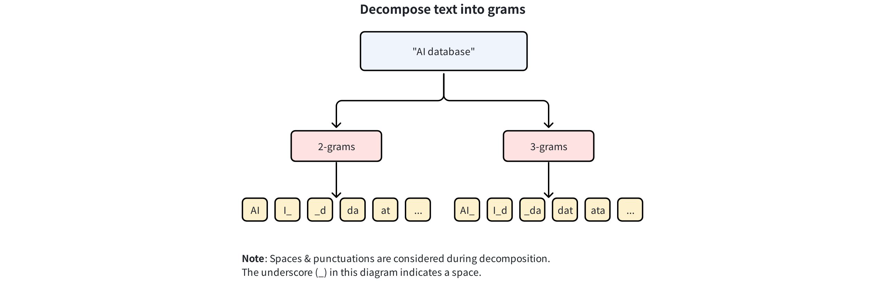
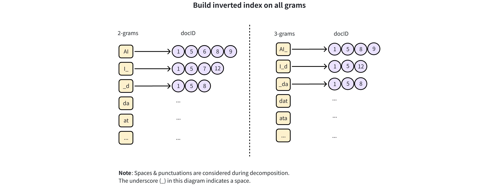
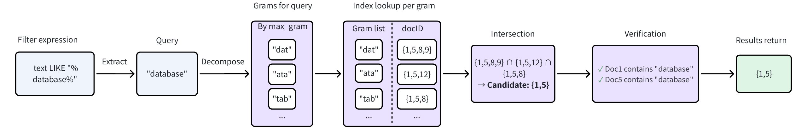

# NGRAM

The `NGRAM` index in Milvus is built to accelerate `LIKE` queries on `VARCHAR` fields or specific JSON paths within `JSON` fields. Before building the index, Milvus splits text into short, overlapping substrings of a fixed length *n*, known as *n-grams*. For example, with *n = 3*, the word *"Milvus"* is split into 3-grams: *"Mil"*, *"ilv"*, *"lvu"*, and *"vus"*. These n-grams are then stored in an inverted index that maps each gram to the document IDs in which it appears. At query time, this index allows Milvus to quickly narrow the search to a small set of candidates, resulting in much faster query execution.

Use it when you need fast prefix, suffix, infix, or wildcard filtering such as:

- `name LIKE "data%"`

- `title LIKE "%vector%"`

- `path LIKE "%json"`

<div class="alert note">

For details on filter expression syntax, refer to [Basic Operators](basic-operators.md#Range-operators).

</div>

## How it works

Milvus implements the `NGRAM` index in a two-phase process:

1. **Build index**: Generate n-grams for each document and build an inverted index during ingest.

1. **Accelerate queries** : Use the index to filter to a small candidate set, then verify exact matches.

### Phase 1: Build the index

During data ingestion, Milvus builds the NGRAM index by performing two main steps:

1. **Decompose text into n-grams**: Milvus slides a window of *n* across each string in the target field and extracts overlapping substrings, or *n-grams*. The length of these substrings falls within a configurable range, `[min_gram, max_gram]`.

    - `min_gram`: The shortest n-gram to generate. This also defines the minimum query substring length that can benefit from the index.

    - `max_gram`: The longest n-gram to generate. At query time, it is also used as the maximum window size when splitting long query strings.

    For example, with `min_gram=2` and `max_gram=3`, the string `"AI database"` is broken down as follows:

    - **2-grams:** `AI`, `I_`, `_d`, `da`, `at`, ...
    - **3-grams:** `AI_`, `I_d`, `_da`, `dat`, `ata`, ...

    

    > **Note**  
    > - For a range `[min_gram, max_gram]`, Milvus generates all n-grams for every length between the two values (inclusive).  
    >   Example: with `[2,4]` and the word `"text"`, Milvus generates:  
    >   - **2-grams:** `te`, `ex`, `xt`  
    >   - **3-grams:** `tex`, `ext`  
    >   - **4-grams:** `text`  
    >
    > - N-gram decomposition is character-based and language-agnostic. For example, in Chinese, `"向量数据库"` with `min_gram = 2` is decomposed into: `"向量"`, `"量数"`, `"数据"`, `"据库"`.  
    >
    > - Spaces and punctuation are treated as characters during decomposition.  
    >
    > - Decomposition preserves original case, and matching is case-sensitive. For example, `"Database"` and `"database"` will generate different n-grams and require exact case matching during queries.

1. **Build an inverted index**: An **inverted index** is created that maps each generated n-gram to a list of the document IDs containing it.

    For instance, if the 2-gram `"AI"` appears in documents with IDs 1, 5, 6, 8, and 9, the index records `{"AI": [1, 5, 6, 8, 9]}`. This index is then used at query time to quickly narrow the search scope.




<div class="alert note">
    
A wider `[min_gram, max_gram]` range creates more grams and larger mapping lists. If memory is tight, consider mmap mode for very large posting lists. For details, refer to [Use mmap](mmap.md).

</div>

### Phase 2: Accelerate queries

When a `LIKE` filter is executed, Milvus uses the NGRAM index to accelerate the query in the following steps:



1. **Extract the query term:** The contiguous substring without wildcards is extracted from the `LIKE` expression (e.g., `"%database%"` becomes `"database"`).

1. **Decompose the query term:** The query term is decomposed into *n-grams* based on its length (`L`) and the `min_gram` and `max_gram` settings.

    - If `L < min_gram`, the index cannot be used, and the query falls back to a full scan.

    - If `min_gram ≤ L ≤ max_gram`, the entire query term is treated as a single n-gram, and no further decomposition is necessary.

    - If `L > max_gram`, the query term is broken down into overlapping grams using a window size equal to `max_gram`.

    For example, if the `max_gram` is set to `3` and the query term is `"database"`, which has a length of **8**, it is decomposed into 3-gram substrings like `"dat"`, `"ata"`, `"tab"`, and so on.

1. **Look for each gram & intersect**: Milvus looks up each of the query grams in the inverted index and then intersects the resulting document ID lists to find a small set of candidate documents. These candidates contain all the grams from the query.

1. **Verify and return results:** The original `LIKE` filter is then applied as a final check on only the small candidate set to find the exact matches.

## Create an NGRAM index

You can create an NGRAM index on a `VARCHAR` field or on a specific path inside a `JSON` field.

### Example 1: Create on a VARCHAR field

For a `VARCHAR` field, you simply specify the `field_name` and configure `min_gram` and `max_gram`.

```python
from pymilvus import MilvusClient

client = MilvusClient(uri="http://localhost:19530") # Replace with your server address

# Assume you have defined a VARCHAR field named "text" in your collection schema

# Prepare index parameters
index_params = client.prepare_index_params()

# Add NGRAM index on the "text" field
# highlight-start
index_params.add_index(
    field_name="text",   # Target VARCHAR field
    index_type="NGRAM",           # Index type is NGRAM
    index_name="ngram_index",     # Custom name for the index
    min_gram=2,                   # Minimum substring length (e.g., 2-gram: "st")
    max_gram=3                    # Maximum substring length (e.g., 3-gram: "sta")
)
# highlight-end

# Create the index on the collection
client.create_index(
    collection_name="Documents",
    index_params=index_params
)
```

This configuration generates 2-grams and 3-grams for each string in `text` and stores them in the inverted index.

### Example 2: Create on a JSON path

For a `JSON` field, in addition to the gram settings, you must also specify:

- `params.json_path` – the JSON path that points to the value you want to index.

- `params.json_cast_type` – must be `"varchar"` (case-insensitive), because NGRAM indexing operates on strings.

```python
# Assume you have defined a JSON field named "json_field" in your collection schema, with a JSON path named "body"

# Prepare index parameters
index_params = client.prepare_index_params()

# Add NGRAM index on a JSON field
# highlight-start
index_params.add_index(
    field_name="json_field",              # Target JSON field
    index_type="NGRAM",                   # Index type is NGRAM
    index_name="json_ngram_index",        # Custom index name
    min_gram=2,                           # Minimum n-gram length
    max_gram=4,                           # Maximum n-gram length
    params={
        "json_path": "json_field[\"body\"]",  # Path to the value inside the JSON field
        "json_cast_type": "varchar"                  # Required: cast the value to varchar
    }
)
# highlight-end

# Create the index on the collection
client.create_index(
    collection_name="Documents",
    index_params=index_params
)
```

In this example:

- Only the value at `json_field["body"]` is indexed.

- The value is cast to `VARCHAR` before n-gram tokenization.

- Milvus generates substrings of length 2 to 4 and stores them in the inverted index.

For more information on how to index a JSON field, refer to [JSON Indexing](json-indexing.md).

## Queries accelerated by NGRAM

For the NGRAM index to be applied:

- The query must target a `VARCHAR` field (or JSON path) that has an `NGRAM` index.

- The literal part of the `LIKE` pattern must be at least `min_gram` characters long.
*(For example, if your shortest expected query term is 2 characters, set min_gram=2 when creating the index.)*

Supported query types:

- **Prefix match**

    ```python
    # Match any string that starts with the substring "database"
    filter = 'text LIKE "database%"'
    ```

- **Suffix match**

    ```python
    # Match any string that ends with the substring "database"
    filter = 'text LIKE "%database"'
    ```

- **Infix match**

    ```python
    # Match any string that contains the substring "database" anywhere
    filter = 'text LIKE "%database%"'
    ```

- **Wildcard match**

    Milvus supports both `%` (zero or more characters) and `_` (exactly one character).

    ```python
    # Match any string where "st" appears first, and "um" appears later in the text 
    filter = 'text LIKE "%st%um%"'
    ```

- **JSON path queries**

    ```python
    filter = 'json_field["body"] LIKE "%database%"'
    ```

For more information on filter expression syntax, refer to [Basic Operators](basic-operators.md).

## Drop an index

Use the `drop_index()` method to remove an existing index from a collection.

<div class="alert note">

- In **v2.6.3** or earlier, you must release the collection before dropping a scalar index.

- From **v2.6.4** or later, you can drop a scalar index directly once it’s no longer needed—no need to release the collection first.

</div>

```python
client.drop_index(
    collection_name="Documents",   # Name of the collection
    index_name="ngram_index" # Name of the index to drop
)
```

## Usage notes

- **Field types**: Supported on `VARCHAR` and `JSON` fields. For JSON, provide both `params.json_path` and `params.json_cast_type="varchar"`.

- **Unicode**: NGRAM decomposition is character-based and language-agnostic and includes whitespace and punctuation.

- **Space–time trade-off**: Wider gram ranges `[min_gram, max_gram]` produce more grams and larger indexes. If memory is tight, consider `mmap` mode for large posting lists. For more information, refer to [Use mmap](mmap.md).

- **Immutability**: `min_gram` and `max_gram` cannot be changed in place—rebuild the index to adjust them.

## Best practices

- **Choose min_gram and max_gram to match search behavior**

    - Start with `min_gram=2`, `max_gram=3`.

    - Set `min_gram` to the shortest literal you expect users to type.

    - Set `max_gram` near the typical length of meaningful substrings; larger `max_gram` improves filtering but increases space.

- **Avoid low-selectivity grams**

    Highly repetitive patterns (e.g., `"aaaaaa"`) provide weak filtering and may yield limited gains.

- **Normalize consistently**

    Apply the same normalization to ingested text and query literals (e.g., lowercasing, trimming) if your use case needs it.

