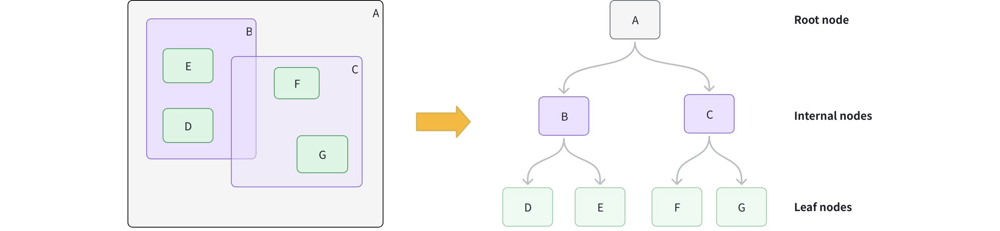

# RTREE

The `RTREE` index is a tree-based data structure that accelerates queries on `GEOMETRY` fields in Milvus. If your collection stores geometric objects such as points, lines, or polygans in [Well-known text (WKT)](https://en.wikipedia.org/wiki/Well-known_text_representation_of_geometry) format and you want to accelerate spatial filtering, `RTREE` is an ideal choice.

## How it works

Milvus uses an `RTREE` index to efficiently organize and filter geometry data, following a two-phase process:

### Phase 1: Build the index

1. **Create leaf nodes:** For each geometry object, calculate its [Minimum Bounding Rectangle](https://en.wikipedia.org/wiki/Minimum_bounding_rectangle) (MBR), which is the smallest rectangle that fully contains the object, and store it as a leaf node.

1. **Group into larger boxes:** Cluster nearby leaf nodes together and wrap each group with a new MBR, forming internal nodes. For example, group **B** contains **D** and **E**; group **C** contains **F** and **G**.

1. **Add the root node:** Add a root node whose MBR covers all internal groups, resulting in a height-balanced tree structure.



### Phase 2: Accelerate queries

1. **Form the query MBR:** Calculate the MBR for your query geometry.

1. **Prune branches:** Starting at the root, compare the query MBR to each internal node. Skip any branches whose MBR does not intersect with the query MBR.

1. **Collect candidates:** Descend into intersecting branches to gather candidate leaf nodes.

1. **Exact match:** For each candidate, perform an exact spatial predicate to determine true matches.

## Create an RTREE index

You can create an `RTREE` index on a `GEOMETRY` field defined in your collection schema.

```python
from pymilvus import MilvusClient

client = MilvusClient(uri="http://localhost:19530") # Replace with your server address

# Assume you have defined a GEOMETRY field named "geo" in your collection schema

# Prepare index parameters
index_params = client.prepare_index_params()

# Add RTREE index on the "geo" field
# highlight-start
index_params.add_index(
    field_name="geo",
    index_type="RTREE",      # Spatial index for GEOMETRY
    index_name="rtree_geo",  # Optional, name your index
    params={}                # No extra params needed
)
# highlight-end

# Create the index on the collection
client.create_index(
    collection_name="geo_demo",
    index_params=index_params
)
```

## Query with RTREE

You filter with geometry operators in the `filter` expression. When an `RTREE` exists on the target `GEOMETRY` field, Milvus uses it to prune candidates automatically. Without the index, the filter falls back to a full scan.

For a full list of available geometry-specific operators, refer to [Geometry Operators](geometry-operators.md).

### Example 1: Filter only

Find all geometric objects within a given polygon:

```python
filter_expr = "ST_CONTAINS(geo, 'POLYGON ((0 0, 10 0, 10 10, 0 10, 0 0))')"

res = client.query(
    collection_name="geo_demo",
    filter=filter_expr,
    output_fields=["id", "geo"],
    limit=10
)
print(res)   # Expected: a list of rows where geo is entirely inside the polygon
```

### Example 2: Vector search + spatial filter

Find the nearest vectors that also intersect a line:

```python
# Assume you've also created an index on "vec" and loaded the collection.
query_vec = [[0.1, 0.2, 0.3, 0.4, 0.5]]
filter_expr = "ST_INTERSECTS(geo, 'LINESTRING (1 1, 2 2)')"

hits = client.search(
    collection_name="geo_demo",
    data=query_vec,
    limit=5,
    filter=filter_expr,
    output_fields=["id", "geo"]
)
print(hits)  # Expected: top-k by vector similarity among rows whose geo intersects the line
```

For more information on how to use a `GEOMETRY` field, refer to [Geometry Field](geometry-field.md).

## Drop an index

Use the `drop_index()` method to remove an existing index from a collection.

<div class="alert note">

- In **v2.6.3** or earlier, you must release the collection before dropping a scalar index.

- From **v2.6.4** or later, you can drop a scalar index directly once it’s no longer needed—no need to release the collection first.

</div>

```python
client.drop_index(
    collection_name="geo_demo",   # Name of the collection
    index_name="rtree_geo" # Name of the index to drop
)
```