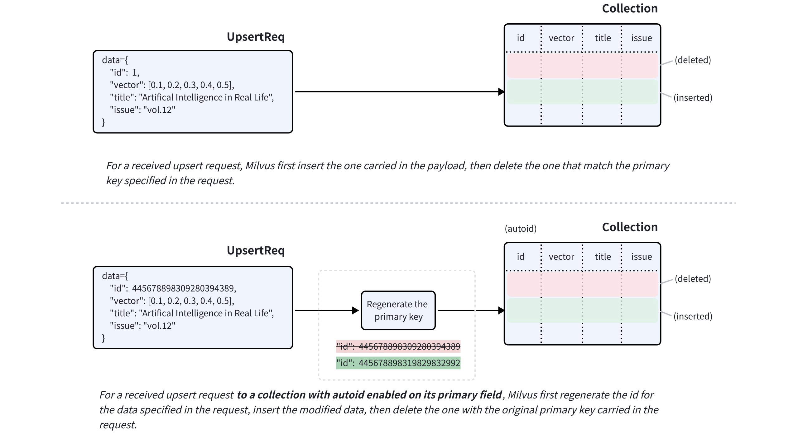
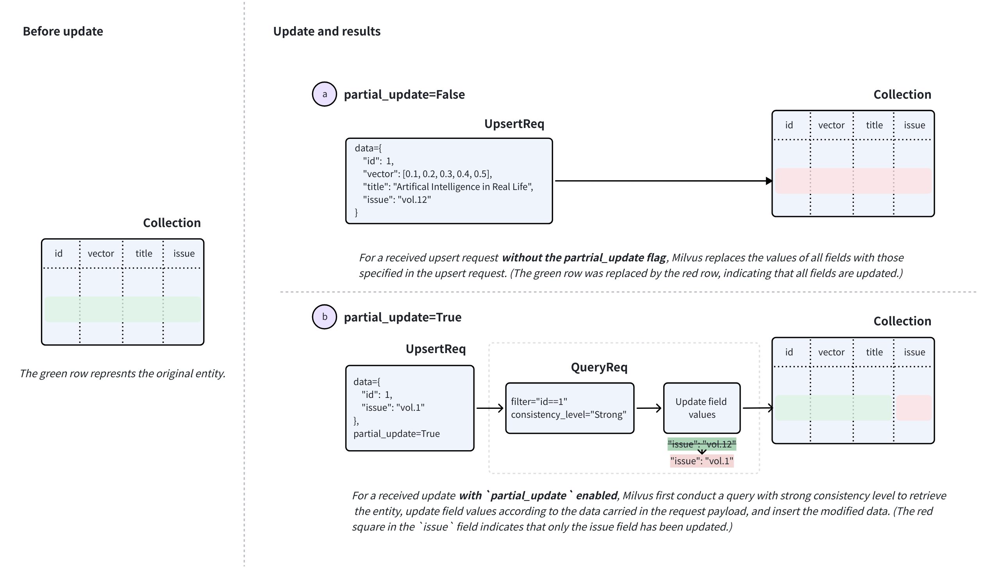

# Upsert Entities

The `upsert` operation provides a convenient way to insert or update entities in a collection. 

## Overview

You can use `upsert` to either insert a new entity or update an existing one, depending on whether the primary key provided in the upsert request exists in the collection. If the primary key is not found, an insert operation occurs. Otherwise, an update operation will be performed.

An upsert in Milvus works in either **override** or **merge** mode.

### Upsert in override mode

An upsert request that works in override mode combines an insert and a delete. When an `upsert` request for an existing entity is received, Milvus inserts the data carried in the request payload and deletes the existing entity with the original primary key specified in the data at the same time. 



If the target collection has `autoid` enabled on its primary field, Milvus will generate a new primary key for the data carried in the request payload before inserting it.

For fields with `nullable` enabled, you can omit them in the `upsert` request if they do not require any updates.

### Upsert in merge mode | Milvus v2.6.2+

You can also use the `partial_update` flag to make an upsert request work in merge mode. This allows you to include only the fields that need updating in the request payload.



To perform a merge, set `partial_update` to `True` in the `upsert` request along with the primary key and the fields to update with their new values. 

Upon receiving such a request, Milvus performs a query with strong consistency to retrieve the entity, updates the field values based on the data in the request, inserts the modified data, and then deletes the existing entity with the original primary key carried in the request.

### Upsert behaviors: special notes

There are several special notes you should consider before using the merge feature. The following cases assume that you have a collection with two scalar fields named `title` and `issue`, along with a primary key `id` and a vector field called `vector`. 

- **Upsert fields with** `nullable` **enabled.**

    Suppose that the `issue` field can be null. When you upsert these fields, note that:

    - If you omit the `issue` field in the `upsert` request and disable `partial_update`, the `issue` field will be updated to `null` instead of retaining its original value.

    - To preserve the original value of the `issue` field, you need either to enable `partial_update` and omit the `issue` field or include the `issue` field with its original value in the `upsert` request.

- **Upsert keys in the dynamic field**.

    Suppose that you have enabled the dynamic key in the example collection, and the key-value pairs in the dynamic field of an entity are similar to `{"author": "John", "year": 2020, "tags": ["fiction"]}`. 

    When you upsert the entity with keys, such as `author`, `year`, or `tags`, or add other keys, note that:

    - If you upsert with `partial_update` disabled, the default behavior is to **override**. It means that the value of the dynamic field will be overridden by all non-schema-defined fields included in the request and their values. 

        For example, if the data included in the request is `{"author": "Jane", "genre": "fantasy"}`, the key-value pairs in the dynamic field of the target entity will be updated to that.

    - If you upsert with `partial_update` enabled, the default behavior is to **merge**. It means that the value of the dynamic field will merge with all non-schema-defined fields included in the request and their values.

        For example, if the data included in the request is `{"author": "John", "year": 2020, "tags": ["fiction"]}`, the key-value pairs in the dynamic field of the target entity will become `{"author": "Jane", "year": 2020, "tags": ["fiction"], "genre": "fantasy"}` after the upsert.

- **Upsert a JSON field.**

    Suppose that the example collection has a schema-defined JSON field named `extras`, and the key-value pairs in this JSON field of an entity are similar to `{"author": "John", "year": 2020, "tags": ["fiction"]}`.

    When you upsert the `extras` field of an entity with modified JSON data, note that:

    - If you upsert with `partial_update` disabled, the default behavior is to **override**. It means the value of the JSON field included in the request will override the original value of the target entity's JSON field. 

        For example, if the data included in the request is `{extras: {"author": "Jane", "genre": "fantasy"}}`, the key-value pairs in the `extras` field of the target entity will be updated to `{"author": "Jane", "genre": "fantasy"}`.

    - If you upsert with `partial_update` enabled, the default behavior is to **merge**. It means the value of the JSON field included in the request will merge with the original value of the target entity's JSON field.

        For example, if the data included in the request is `{extras: {"author": "Jane", "genre": "fantasy"}}`, the key-value pairs in the `extras` field of the target entity will become `{"author": "Jane", "year": 2020, "tags": ["fiction"], "genre": "fantasy"}` after the udpate.

### Limits & Restrictions

Based on the above content, there are several limits and restrictions to follow:

- The `upsert` request must always include the primary keys of the target entities.

- The target collection must be loaded and available for queries.

- All fields specified in the request must exist in the schema of the target collection.

- The values of all fields specified in the request must match the data types defined in the schema.

- For any field derived from another using functions, Milvus will remove the derived field during the upsert to allow recalculation.

## Upsert entities in a collection

In this section, we will upsert entities into a collection named `my_collection`. This collection has only two fields, named `id`, `vector`, `title`, and `issue`. The `id` field is the primary field, while the `title` and `issue` fields are scalar fields.

The three entities, if exists in the collection, will be overridden by those included the upsert request.

<div class="multipleCode">
    <a href="#python">Python</a>
    <a href="#java">Java</a>
    <a href="#javascript">NodeJS</a>
    <a href="#go">Go</a>
    <a href="#bash">cURL</a>
</div>

```python
from pymilvus import MilvusClient

client = MilvusClient(
    uri="http://localhost:19530",
    token="root:Milvus"
)

data=[
    {
        "id": 0, 
        "vector": [-0.619954382375778, 0.4479436794798608, -0.17493894838751745, -0.4248030059917294, -0.8648452746018911],
        "title": "Artificial Intelligence in Real Life", 
        "issue": "vol.12"
    }, {
        "id": 1, 
        "vector": [0.4762662251462588, -0.6942502138717026, -0.4490002642657902, -0.628696575798281, 0.9660395877041965], 
        "title": "Hollow Man", 
        "issue": "vol.19"
    }, {
        "id": 2, 
        "vector": [-0.8864122635045097, 0.9260170474445351, 0.801326976181461, 0.6383943392381306, 0.7563037341572827], 
        "title": "Treasure Hunt in Missouri", 
        "issue": "vol.12"
    }
]

res = client.upsert(
    collection_name='my_collection',
    data=data
)

print(res)

# Output
# {'upsert_count': 3}
```

```java
import com.google.gson.Gson;
import com.google.gson.JsonObject;
import io.milvus.v2.client.ConnectConfig;
import io.milvus.v2.client.MilvusClientV2;
import io.milvus.v2.service.vector.request.UpsertReq;
import io.milvus.v2.service.vector.response.UpsertResp;

import java.util.*;

MilvusClientV2 client = new MilvusClientV2(ConnectConfig.builder()
        .uri("http://localhost:19530")
        .token("root:Milvus")
        .build());

Gson gson = new Gson();
List<JsonObject> data = Arrays.asList(
        gson.fromJson("{\"id\": 0, \"vector\": [-0.619954382375778, 0.4479436794798608, -0.17493894838751745, -0.4248030059917294, -0.8648452746018911], \"title\": \"Artificial Intelligence in Real Life\", \"issue\": \"\vol.12\"}", JsonObject.class),
        gson.fromJson("{\"id\": 1, \"vector\": [0.4762662251462588, -0.6942502138717026, -0.4490002642657902, -0.628696575798281, 0.9660395877041965], \"title\": \"Hollow Man\", \"issue\": \"vol.19\"}", JsonObject.class),
        gson.fromJson("{\"id\": 2, \"vector\": [-0.8864122635045097, 0.9260170474445351, 0.801326976181461, 0.6383943392381306, 0.7563037341572827], \"title\": \"Treasure Hunt in Missouri\", \"issue\": \"vol.12\"}", JsonObject.class),
);

UpsertReq upsertReq = UpsertReq.builder()
        .collectionName("my_collection")
        .data(data)
        .build();

UpsertResp upsertResp = client.upsert(upsertReq);
System.out.println(upsertResp);

// Output:
//
// UpsertResp(upsertCnt=3)
```

```javascript
const { MilvusClient, DataType } = require("@zilliz/milvus2-sdk-node")

const address = "http://localhost:19530";
const token = "root:Milvus";
const client = new MilvusClient({address, token});

data = [
    {id: 0, vector: [-0.619954382375778, 0.4479436794798608, -0.17493894838751745, -0.4248030059917294, -0.8648452746018911], title: "Artificial Intelligence in Real Life", issue: "vol.12"},
    {id: 1, vector: [0.4762662251462588, -0.6942502138717026, -0.4490002642657902, -0.628696575798281, 0.9660395877041965], title: "Hollow Man", issue: "vol.19"},
    {id: 2, vector: [-0.8864122635045097, 0.9260170474445351, 0.801326976181461, 0.6383943392381306, 0.7563037341572827], title: "Treasure Hunt in Missouri", issue: "vol.12"},
]

res = await client.upsert({
    collection_name: "my_collection",
    data: data,
})

console.log(res.upsert_cnt)

// Output
// 
// 3
// 
```

```go
import (
    "context"
    "fmt"

    "github.com/milvus-io/milvus/client/v2/column"
    "github.com/milvus-io/milvus/client/v2/milvusclient"
)

ctx, cancel := context.WithCancel(context.Background())
defer cancel()

milvusAddr := "localhost:19530"
client, err := milvusclient.New(ctx, &milvusclient.ClientConfig{
    Address: milvusAddr,
})
if err != nil {
    fmt.Println(err.Error())
    // handle error
}
defer client.Close(ctx)

titleColumn := column.NewColumnString("title", []string{
    "Artificial Intelligence in Real Life", "Hollow Man", "Treasure Hunt in Missouri", 
})

issueColumn := column.NewColumnString("issue", []string{
    "vol.12", "vol.19", "vol.12"
})

_, err = client.Upsert(ctx, milvusclient.NewColumnBasedInsertOption("my_collection").
    WithInt64Column("id", []int64{0, 1, 2, 3, 4, 5, 6, 7, 8, 9}).
    WithFloatVectorColumn("vector", 5, [][]float32{
        {0.3580376395471989, -0.6023495712049978, 0.18414012509913835, -0.26286205330961354, 0.9029438446296592},
        {0.19886812562848388, 0.06023560599112088, 0.6976963061752597, 0.2614474506242501, 0.838729485096104},
        {0.43742130801983836, -0.5597502546264526, 0.6457887650909682, 0.7894058910881185, 0.20785793220625592},
    }).
    WithColumns(titleColumn, issueColumn),
)
if err != nil {
    fmt.Println(err.Error())
    // handle err
}
```

```bash
export CLUSTER_ENDPOINT="http://localhost:19530"
export TOKEN="root:Milvus"

curl --request POST \
--url "${CLUSTER_ENDPOINT}/v2/vectordb/entities/upsert" \
--header "Authorization: Bearer ${TOKEN}" \
--header "Content-Type: application/json" \
-d '{
    "data": [
        {"id": 0, "vector": [0.3580376395471989, -0.6023495712049978, 0.18414012509913835, -0.26286205330961354, 0.9029438446296592], "title": "Artificial Intelligence in Real Life", "issue": "vol.12"},
        {"id": 1, "vector": [0.19886812562848388, 0.06023560599112088, 0.6976963061752597, 0.2614474506242501, 0.838729485096104], "title": "Hollow Man", "issue": "vol.19"},
        {"id": 2, "vector": [0.43742130801983836, -0.5597502546264526, 0.6457887650909682, 0.7894058910881185, 0.20785793220625592], "title": "Treasure Hunt in Missouri", "issue": "vol.12"},
],
    "collectionName": "my_collection"
}'

# {
#     "code": 0,
#     "data": {
#         "upsertCount": 3,
#         "upsertIds": [
#             0,
#             1,
#             2,
#         ]
#     }
# }
```

## Upsert entities in a partition

You can also upsert entities into a specified partition. The following code snippets assume that you have a partition named **PartitionA** in your collection.

The three entities, if exists in the partition, will be overridden by those included in the request. 

<div class="multipleCode">
    <a href="#python">Python</a>
    <a href="#java">Java</a>
    <a href="#javascript">NodeJS</a>
    <a href="#go">Go</a>
    <a href="#bash">cURL</a>
</div>

```python
data=[
    {
        "id": 10, 
        "vector": [0.06998888224297328, 0.8582816610326578, -0.9657938677934292, 0.6527905683627726, -0.8668460657158576], 
        "title": "Layour Design Reference", 
        "issue": "vol.34"
    },
    {
        "id": 11, 
        "vector": [0.6060703043917468, -0.3765080534566074, -0.7710758854987239, 0.36993888322346136, 0.5507513364206531], 
        "title": "Doraemon and His Friends", 
        "issue": "vol.2"
    },
    {
        "id": 12, 
        "vector": [-0.9041813104515337, -0.9610546012461163, 0.20033003106083358, 0.11842506351635174, 0.8327356724591011], 
        "title": "Pikkachu and Pokemon", 
        "issue": "vol.12"
    },
]

res = client.upsert(
    collection_name="my_collection",
    data=data,
    partition_name="partitionA"
)

print(res)

# Output
# {'upsert_count': 3}
```

```java
import io.milvus.v2.service.vector.request.UpsertReq;
import io.milvus.v2.service.vector.response.UpsertResp;

Gson gson = new Gson();
List<JsonObject> data = Arrays.asList(
        gson.fromJson("{\"id\": 10, \"vector\": [0.06998888224297328, 0.8582816610326578, -0.9657938677934292, 0.6527905683627726, -0.8668460657158576], \"title\": \"Layour Design Reference\", \"issue\": \"vol.34\"}", JsonObject.class),
        gson.fromJson("{\"id\": 11, \"vector\": [0.6060703043917468, -0.3765080534566074, -0.7710758854987239, 0.36993888322346136, 0.5507513364206531], \"title\": \"Doraemon and His Friends\", \"issue\": \"vol.2\"}", JsonObject.class),
        gson.fromJson("{\"id\": 12, \"vector\": [-0.9041813104515337, -0.9610546012461163, 0.20033003106083358, 0.11842506351635174, 0.8327356724591011], \"title\": \"Pikkachu and Pokemon\", \"issue\": \"vol.12\"}", JsonObject.class),
);

UpsertReq upsertReq = UpsertReq.builder()
        .collectionName("my_collection")
        .partitionName("partitionA")
        .data(data)
        .build();

UpsertResp upsertResp = client.upsert(upsertReq);
System.out.println(upsertResp);

// Output:
//
// UpsertResp(upsertCnt=3)
```

```javascript
const { MilvusClient, DataType } = require("@zilliz/milvus2-sdk-node")

// 6. Upsert data in partitions
data = [
    {id: 10, vector: [0.06998888224297328, 0.8582816610326578, -0.9657938677934292, 0.6527905683627726, -0.8668460657158576], title: "Layour Design Reference", issue: "vol.34"},
    {id: 11, vector: [0.6060703043917468, -0.3765080534566074, -0.7710758854987239, 0.36993888322346136, 0.5507513364206531], title: "Doraemon and His Friends", issue: "vol.2"},
    {id: 12, vector: [-0.9041813104515337, -0.9610546012461163, 0.20033003106083358, 0.11842506351635174, 0.8327356724591011], title: "Pikkachu and Pokemon", issue: "vol.12"},
]

res = await client.upsert({
    collection_name: "my_collection",
    data: data,
    partition_name: "partitionA"
})

console.log(res.upsert_cnt)

// Output
// 
// 3
// 
```

```go
titleColumn = column.NewColumnString("title", []string{
    "Layour Design Reference", "Doraemon and His Friends", "Pikkachu and Pokemon", 
})
issueColumn = column.NewColumnString("issue", []string{
    "vol.34", "vol.2", "vol.12", 
})

_, err = client.Upsert(ctx, milvusclient.NewColumnBasedInsertOption("my_collection").
    WithPartition("partitionA").
    WithInt64Column("id", []int64{10, 11, 12, 13, 14, 15, 16, 17, 18, 19}).
    WithFloatVectorColumn("vector", 5, [][]float32{
        {0.3580376395471989, -0.6023495712049978, 0.18414012509913835, -0.26286205330961354, 0.9029438446296592},
        {0.19886812562848388, 0.06023560599112088, 0.6976963061752597, 0.2614474506242501, 0.838729485096104},
        {0.43742130801983836, -0.5597502546264526, 0.6457887650909682, 0.7894058910881185, 0.20785793220625592},
    }).
    WithColumns(titleColumn, issueColumn),
)
if err != nil {
    fmt.Println(err.Error())
    // handle err
}
```

```bash
export CLUSTER_ENDPOINT="http://localhost:19530"
export TOKEN="root:Milvus"

curl --request POST \
--url "${CLUSTER_ENDPOINT}/v2/vectordb/entities/upsert" \
--header "Authorization: Bearer ${TOKEN}" \
--header "Content-Type: application/json" \
-d '{
    "data": [
        {"id": 10, "vector": [0.06998888224297328, 0.8582816610326578, -0.9657938677934292, 0.6527905683627726, -0.8668460657158576], "title": "Layour Design Reference", "issue": "vol.34"},
        {"id": 11, "vector": [0.6060703043917468, -0.3765080534566074, -0.7710758854987239, 0.36993888322346136, 0.5507513364206531], "title": "Doraemon and His Friends", "issue": "vol.2"},
        {"id": 12, "vector": [-0.9041813104515337, -0.9610546012461163, 0.20033003106083358, 0.11842506351635174, 0.8327356724591011], "title": "Pikkachu and Pokemon", "issue": "vol.12"},
    ],
    "collectionName": "my_collection",
    "partitionName": "partitionA"
}'

# {
#     "code": 0,
#     "data": {
#         "upsertCount": 3,
#         "upsertIds": [
#             10,
#             11,
#             12,
#         ]
#     }
# }
```

## Upsert entities in merge mode | Milvus v2.6.2+

The following code example demonstrates how to upsert entities with partial updates. Provide only the fields needing updates and their new values, along with the explicit partial update flag.

In the following example, the `issue` field of the entities specified in the upsert request will be updated to the values included in the request.

<div class="alert note">

When performing an upsert in merge mode, ensure that the entities involved in the request have the same set of fields. Suppose there are two or more entities to be upserted, as shown in the following code snippet, it is important that they include identical fields to prevent errors and maintain data integrity.

</div>

<div class="multipleCode">
    <a href="#python">Python</a>
    <a href="#java">Java</a>
    <a href="#go">Go</a>
    <a href="#javascript">NodeJS</a>
    <a href="#bash">cURL</a>
</div>

```python
data=[
    {
        "id": 1,
        "issue": "vol.14"
    },
    {
        "id": 2, 
        "issue": "vol.7"
    }
]

res = client.upsert(
    collection_name="my_collection",
    data=data,
    partial_update=True
)

print(res)

# Output
# {'upsert_count': 2}
```

```java
JsonObject row1 = new JsonObject();
row1.addProperty("id", 1);
row1.addProperty("issue", "vol.14");

JsonObject row2 = new JsonObject();
row2.addProperty("id", 2);
row2.addProperty("issue", "vol.7");

UpsertReq upsertReq = UpsertReq.builder()
        .collectionName("my_collection")
        .data(Arrays.asList(row1, row2))
        .partialUpdate(true)
        .build();

UpsertResp upsertResp = client.upsert(upsertReq);
System.out.println(upsertResp);

// Output:
//
// UpsertResp(upsertCnt=2)
```

```go
pkColumn := column.NewColumnInt64("id", []int64{1, 2})
issueColumn = column.NewColumnString("issue", []string{
    "vol.17", "vol.7",
})

_, err = client.Upsert(ctx, milvusclient.NewColumnBasedInsertOption("my_collection").
    WithColumns(pkColumn, issueColumn).
    WithPartialUpdate(true),
)
if err != nil {
    fmt.Println(err.Error())
    // handle err
}
```

```javascript
const data=[
    {
        "id": 1,
        "issue": "vol.14"
    },
    {
        "id": 2, 
        "issue": "vol.7"
    }
];

const res = await client.upsert({
    collection_name: "my_collection",
    data,
    partial_update: true
});

console.log(res)

// Output
// 
// 2
// 
```

```bash
export CLUSTER_ENDPOINT="http://localhost:19530"
export TOKEN="root:Milvus"

export COLLECTION_NAME="my_collection"
export UPSERT_DATA='[
  {
    "id": 1,
    "issue": "vol.14"
  },
  {
    "id": 2,
    "issue": "vol.7"
  }
]'

curl -X POST "http://localhost:19530/v2/vectordb/entities/upsert" \
  -H "Content-Type: application/json" \
  -H "Authorization: Bearer ${TOKEN}" \
  -d "{
    \"collectionName\": \"${COLLECTION_NAME}\",
    \"data\": ${UPSERT_DATA},
    \"partialUpdate\": true
  }"

# {
#     "code": 0,
#     "data": {
#         "upsertCount": 2,
#         "upsertIds": [
#              3,
#             12,
#         ]
#     }
# }
```

