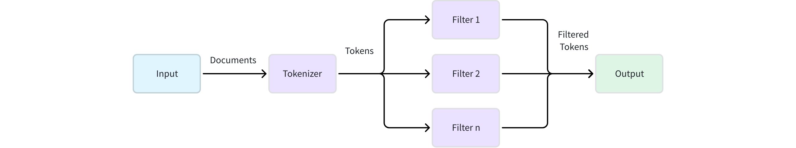

# Choose the Right Analyzer for Your Use Case

<div class="alert note">

This guide focuses on practical decision-making for analyzer selection. For technical details about analyzer components and how to add analyzer parameters, refer to [Analyzer Overview](analyzer-overview.md).

</div>

## Understand analyzers in 2 minutes

In Milvus, an analyzer processes the text stored in this field to make it searchable for features like [full text search](full-text-search.md) (BM25), [phrase match](phrase-match.md), or [text match](keyword-match.md). Think of it as a text processor that transforms your raw content into searchable tokens. 

An analyzer works in a simple, two-stage pipeline:



1. **Tokenization (required):** This initial stage applies a **tokenizer** to break a continuous string of text into discrete, meaningful units called tokens. The tokenization method can vary significantly depending on the language and content type.

1. **Token filtering (optional):** After tokenization, **filters** are applied to modify, remove, or refine the tokens. These operations can include converting all tokens to lowercase, removing common meaningless words (such as stopwords), or reducing words to their root form (stemming).

**Example**:

```plaintext
Input: "Hello World!" 
       1. Tokenization → ["Hello", "World", "!"]
       2. Lowercase & Punctuation Filtering → ["hello", "world"]
```

## Why the choice of analyzer matters

Choosing the wrong analyzer can make relevant documents unsearchable or return irrelevant results.

The following table summarizes common problems caused by improper analyzer selection and provides actionable solutions for diagnosing search issues.

<table>
   <tr>
     <th><p>Problem</p></th>
     <th><p>Symptom</p></th>
     <th><p>Example (Input &amp; Output)</p></th>
     <th><p>Cause (Bad Analyzer)</p></th>
     <th><p>Solution (Good Analyzer)</p></th>
   </tr>
   <tr>
     <td><p>Over-tokenization</p></td>
     <td><p>Text queries for technical terms, identifiers, or URLs fail to find relevant documents.</p></td>
     <td><ul><li><p><code>"user_id"</code> → <code>['user', 'id']</code></p></li><li><p><code>"C++"</code> → <code>['c']</code></p></li></ul></td>
     <td><p><a href="standard-analyzer.md"><code>standard</code></a> analyzer</p></td>
     <td><p>Use a <a href="whitespace-tokenizer.md"><code>whitespace</code></a> tokenizer; combine with an <a href="alphanumonly-filter.md"><code>alphanumonly</code></a> filter.</p></td>
   </tr>
   <tr>
     <td><p>Under-tokenization</p></td>
     <td><p>Search for a component of a multi-word phrase fails to return documents containing the full phrase.</p></td>
     <td><p><code>"state-of-the-art"</code> → <code>['state-of-the-art']</code></p></td>
     <td><p>Analyzer with a <a href="whitespace-tokenizer.md"><code>whitespace</code></a> tokenizer</p></td>
     <td><p>Use a <a href="standard-tokenizer.md"><code>standard</code></a> tokenizer to split on punctuation and spaces; use a custom <a href="regex-filter.md">regex</a> filter.</p></td>
   </tr>
   <tr>
     <td><p>Language Mismatches</p></td>
     <td><p>Search results for a specific language are nonsensical or nonexistent.</p></td>
     <td><p>Chinese text: <code>"机器学习"</code> → <code>['机器学习']</code> (one token)</p></td>
     <td><p><a href="english-analyzer.md"><code>english</code></a> analyzer</p></td>
     <td><p>Use a language-specific analyzer, such as <a href="chinese-analyzer.md"><code>chinese</code></a>.</p></td>
   </tr>
</table>

## First question: Do you need to choose an analyzer?

For many use cases, you don't need to do anything special. Let's determine if you're one of them.

### Default behavior: `standard` analyzer

If you don't specify an analyzer when using text retrieval features like full text search, Milvus automatically uses the [`standard`](standard-analyzer.md) analyzer.

The `standard` analyzer:

- Splits text on spaces and punctuation

- Converts all tokens to lowercase

- Removes a built-in set of common English stop words and most punctuation

**Example transformation**:

```plaintext
Input:  "The Milvus vector database is built for scale!"
Output: ['the', 'milvus', 'vector', 'database', 'is', 'built', 'scale']
```

### Decision criteria: A quick check

Use this table to quickly determine if the default `standard` analyzer meets your needs. If it doesn't, you'll need to choose a different path.

<table>
   <tr>
     <th><p>Your Content</p></th>
     <th><p>Standard Analyzer OK?</p></th>
     <th><p>Why</p></th>
     <th><p>What You Need</p></th>
   </tr>
   <tr>
     <td><p>English blog posts</p></td>
     <td><p>✅ Yes</p></td>
     <td><p>Default behavior is sufficient.</p></td>
     <td><p>Use the default (no configuration needed).</p></td>
   </tr>
   <tr>
     <td><p>Chinese documents</p></td>
     <td><p>❌ No</p></td>
     <td><p>Chinese words have no spaces and will be treated as one token.</p></td>
     <td><p>Use a built-in <a href="chinese-analyzer.md"><code>chinese</code></a> analyzer.</p></td>
   </tr>
   <tr>
     <td><p>Technical documentation</p></td>
     <td><p>❌ No</p></td>
     <td><p>Punctuation is stripped from terms like <code>C++</code>.</p></td>
     <td><p>Create a custom analyzer with a <a href="whitespace-tokenizer.md"><code>whitespace</code></a> tokenizer and an <a href="alphanumonly-filter.md"><code>alphanumonly</code></a> filter.</p></td>
   </tr>
   <tr>
     <td><p>Space-separated languages such as French/Spanish text</p></td>
     <td><p>⚠️ Maybe</p></td>
     <td><p>Accented characters (<code>café</code> vs. <code>cafe</code>) may not match.</p></td>
     <td><p>A custom analyzer with the <a href="ascii-folding-filter.md"><code>asciifolding</code></a> is recommended for better results.</p></td>
   </tr>
   <tr>
     <td><p>Multilingual or unknown languages</p></td>
     <td><p>❌ No</p></td>
     <td><p>The <code>standard</code> analyzer lacks the language-specific logic needed to handle different character sets and tokenization rules.</p></td>
     <td><p>Use a custom analyzer with the <a href="icu-tokenizer.md"><code>icu</code></a> tokenizer for unicode-aware tokenization. </p><p>Alternatively, consider configuring <a href="multi-language-analyzers.md">multi-language analyzers</a> or a <a href="language-identifier.md">language identifier</a> for more precise handling of multilingual content.</p></td>
   </tr>
</table>

If the default `standard` analyzer cannot meet your requirements, you need to implement a different one. You have two paths:

- [Using a built-in analyzer](choose-the-right-analyzer-for-your-use-case.md#Path-A-Use-built-in-analyzers) or

- [Creating a custom one](choose-the-right-analyzer-for-your-use-case.md#Path-B-Create-a-custom-analyzer)

## Path A: Use built-in analyzers

Built-in analyzers are pre-configured solutions for common languages. They are the easiest way to get started when the default standard analyzer isn't a perfect fit.

### Available built-in analyzers

<table>
   <tr>
     <th><p>Analyzer</p></th>
     <th><p>Language Support</p></th>
     <th><p>Components</p></th>
     <th><p>Notes</p></th>
   </tr>
   <tr>
     <td><p><a href="standard-analyzer.md"><code>standard</code></a></p></td>
     <td><p>Most space-separated languages (English, French, German, Spanish, etc.)</p></td>
     <td><ul><li><p>Tokenizer: <code>standard</code></p></li><li><p>Filters: <code>lowercase</code></p></li></ul></td>
     <td><p>General-purpose analyzer for initial text processing. For monolingual scenarios, language-specific analyzers (like <code>english</code>) provide better performance.</p></td>
   </tr>
   <tr>
     <td><p><a href="english-analyzer.md"><code>english</code></a></p></td>
     <td><p>Dedicated to English, which applies stemming and stop word removal for better English semantic matching</p></td>
     <td><ul><li><p>Tokenizer: <code>standard</code></p></li><li><p>Filters: <code>lowercase</code>, <code>stemmer</code>, <code>stop</code></p></li></ul></td>
     <td><p>Recommended for English-only content over <code>standard</code>.</p></td>
   </tr>
   <tr>
     <td><p><a href="chinese-analyzer.md"><code>chinese</code></a></p></td>
     <td><p>Chinese</p></td>
     <td><ul><li><p>Tokenizer: <code>jieba</code></p></li><li><p>Filters: <code>cnalphanumonly</code></p></li></ul></td>
     <td><p>Currently uses Simplified Chinese dictionary by default.</p></td>
   </tr>
</table>

### Implementation example

To use a built-in analyzer, simply specify its type in the `analyzer_params` when defining your field schema.

```python
# Using built-in English analyzer
analyzer_params = {
    "type": "english"
}

# Applying analyzer config to target VARCHAR field in your collection schema
schema.add_field(
    field_name='text',
    datatype=DataType.VARCHAR,
    max_length=200,
    enable_analyzer=True,
    # highlight-next-line
    analyzer_params=analyzer_params,
)
```

<div class="alert note">

For detailed usage, refer to [Full Text Search](full-text-search.md), [Text Match](keyword-match.md), or [Phrase Match](phrase-match.md).

</div>

## Path B: Create a custom analyzer

When [built-in options](choose-the-right-analyzer-for-your-use-case.md#Available-built-in-analyzers) don't meet your needs, you can create a custom analyzer by combining a tokenizer with a set of filters. This gives you full control over the text processing pipeline.

### Step 1: Select the tokenizer based on language

Choose your tokenizer based on your content's primary language:

#### Western languages

For space-separated languages, you have these options:

<table>
   <tr>
     <th><p>Tokenizer</p></th>
     <th><p>How It Works</p></th>
     <th><p>Best For</p></th>
     <th><p>Examples</p></th>
   </tr>
   <tr>
     <td><p><a href="standard-tokenizer.md"><code>standard</code></a></p></td>
     <td><p>Splits text based on spaces and punctuation marks</p></td>
     <td><p>General text, mixed punctuation</p></td>
     <td><ul><li><p>Input: <code>"Hello, world! Visit example.com"</code></p></li><li><p>Output: <code>['Hello', 'world', 'Visit', 'example', 'com']</code></p></li></ul></td>
   </tr>
   <tr>
     <td><p><a href="whitespace-tokenizer.md"><code>whitespace</code></a></p></td>
     <td><p>Splits only on whitespace characters</p></td>
     <td><p>Pre-processed content, user-formatted text</p></td>
     <td><ul><li><p>Input: <code>"user_id = get_user_data()"</code></p></li><li><p>Output: <code>['user_id', '=', 'get_user_data()']</code></p></li></ul></td>
   </tr>
</table>

#### East Asian languages

Dictionary-based languages require specialized tokenizers for proper word segmentation:

##### Chinese

<table>
   <tr>
     <th><p>Tokenizer</p></th>
     <th><p>How It Works</p></th>
     <th><p>Best For</p></th>
     <th><p>Examples</p></th>
   </tr>
   <tr>
     <td><p><a href="jieba-tokenizer.md"><code>jieba</code></a></p></td>
     <td><p>Chinese dictionary-based segmentation with intelligent algorithm</p></td>
     <td><p><strong>Recommended for Chinese content</strong> - combines dictionary with intelligent algorithms, specifically designed for Chinese</p></td>
     <td><ul><li><p>Input: <code>"机器学习是人工智能的一个分支"</code></p></li><li><p>Output: <code>['机器', '学习', '是', '人工', '智能', '人工智能', '的', '一个', '分支']</code></p></li></ul></td>
   </tr>
   <tr>
     <td><p><a href="lindera-tokenizer.md"><code>lindera</code></a></p></td>
     <td><p>Pure dictionary-based morphological analysis with Chinese dictionary (<a href="https://cc-cedict.org/wiki/">cc-cedict</a>)</p></td>
     <td><p>Compared to <code>jieba</code>, processes Chinese text in a more generic manner</p></td>
     <td><ul><li><p>Input: <code>"机器学习算法"</code></p></li><li><p>Output: <code>["机器", "学习", "算法"]</code></p></li></ul></td>
   </tr>
</table>

##### Japanese and Korean

<table>
   <tr>
     <th><p>Language</p></th>
     <th><p>Tokenizer</p></th>
     <th><p>Dictionary Options</p></th>
     <th><p>Best For</p></th>
     <th><p>Examples</p></th>
   </tr>
   <tr>
     <td><p>Japanese</p></td>
     <td><p><a href="lindera-tokenizer.md"><code>lindera</code></a></p></td>
     <td><p><a href="https://taku910.github.io/mecab/">ipadic</a> (general-purpose), <a href="https://github.com/neologd/mecab-ipadic-neologd">ipadic-neologd</a> (modern terms), <a href="https://clrd.ninjal.ac.jp/unidic/">unidic</a> (academic)</p></td>
     <td><p>Morphological analysis with proper noun handling</p></td>
     <td><ul><li><p>Input: <code>"東京都渋谷区"</code></p></li><li><p>Output: <code>["東京", "都", "渋谷", "区"]</code></p></li></ul></td>
   </tr>
   <tr>
     <td><p>Korean</p></td>
     <td><p><a href="lindera-tokenizer.md"><code>lindera</code></a></p></td>
     <td><p><a href="https://bitbucket.org/eunjeon/mecab-ko-dic/src/master/">ko-dic</a></p></td>
     <td><p>Korean morphological analysis</p></td>
     <td><ul><li><p>Input: <code>"안녕하세요"</code></p></li><li><p>Output: <code>["안녕", "하", "세요"]</code></p></li></ul></td>
   </tr>
</table>

#### Multilingual or unknown languages

For content where languages are unpredictable or mixed within documents:

<table>
   <tr>
     <th><p>Tokenizer</p></th>
     <th><p>How It Works</p></th>
     <th><p>Best For</p></th>
     <th><p>Examples</p></th>
   </tr>
   <tr>
     <td><p><a href="icu-tokenizer.md"><code>icu</code></a></p></td>
     <td><p>Unicode-aware tokenization (International Components for Unicode)</p></td>
     <td><p>Mixed scripts, unknown languages, or when simple tokenization is sufficient</p></td>
     <td><ul><li><p>Input: <code>"Hello 世界 مرحبا"</code></p></li><li><p>Output: <code>['Hello', ' ', '世界', ' ', 'مرحبا']</code></p></li></ul></td>
   </tr>
</table>

**When to use icu**:

- Mixed languages where language identification is impractical.

- You don't want the overhead of [multi-language analyzers](multi-language-analyzers.md) or the [language identifier](language-identifier.md).

- Content has a primary language with occasional foreign words that contribute little to the overall meaning (e.g., English text with sporadic brand names or technical terms in Japanese or French).

**Alternative approaches**: For more precise handling of multilingual content, consider using multi-language analyzers or the language identifier. For details, refer to [Multi-language Analyzers](multi-language-analyzers.md) or [Language Identifier](language-identifier.md).

### Step 2: Add filters for precision

After [selecting your tokenizer](choose-the-right-analyzer-for-your-use-case.md#Step-1-Select-the-tokenizer-based-on-language), apply filters based on your specific search requirements and content characteristics.

#### Commonly used filters

These filters are essential for most space-separated language configurations (English, French, German, Spanish, etc.) and significantly improve search quality:

<table>
   <tr>
     <th><p>Filter</p></th>
     <th><p>How It Works</p></th>
     <th><p>When to Use</p></th>
     <th><p>Examples</p></th>
   </tr>
   <tr>
     <td><p><a href="lowercase-filter.md"><code>lowercase</code></a></p></td>
     <td><p>Convert all tokens to lowercase</p></td>
     <td><p>Universal - applies to all languages with case distinctions</p></td>
     <td><ul><li><p>Input: <code>["Apple", "iPhone"]</code></p></li><li><p>Output: <code>[['apple'], ['iphone']]</code></p></li></ul></td>
   </tr>
   <tr>
     <td><p><a href="stemmer-filter.md"><code>stemmer</code></a></p></td>
     <td><p>Reduce words to their root form</p></td>
     <td><p>Languages with word inflections (English, French, German, etc.)</p></td>
     <td><p>For English:</p><ul><li><p>Input: <code>["running", "runs", "ran"]</code></p></li><li><p>Output: <code>[['run'], ['run'], ['ran']]</code></p></li></ul></td>
   </tr>
   <tr>
     <td><p><a href="stop-filter.md"><code>stop</code></a></p></td>
     <td><p>Remove common meaningless words</p></td>
     <td><p>Most languages - particularly effective for space-separated languages</p></td>
     <td><ul><li><p>Input: <code>["the", "quick", "brown", "fox"]</code></p></li><li><p>Output: <code>[[], ['quick'], ['brown'], ['fox']]</code></p></li></ul></td>
   </tr>
</table>

<div class="alert note">

For East Asian languages (Chinese, Japanese, Korean, etc.), focus on [language-specific filters](choose-the-right-analyzer-for-your-use-case.md#Language-specific-filters) instead. These languages typically use different approaches for text processing and may not benefit significantly from stemming.

</div>

#### Text normalization filters

These filters standardize text variations to improve matching consistency:

<table>
   <tr>
     <th><p>Filter</p></th>
     <th><p>How It Works</p></th>
     <th><p>When to Use</p></th>
     <th><p>Examples</p></th>
   </tr>
   <tr>
     <td><p><a href="ascii-folding-filter.md"><code>asciifolding</code></a></p></td>
     <td><p>Convert accented characters to ASCII equivalents</p></td>
     <td><p>International content, user-generated content</p></td>
     <td><ul><li><p>Input: <code>["café", "naïve", "résumé"]</code></p></li><li><p>Output: <code>[['cafe'], ['naive'], ['resume']]</code></p></li></ul></td>
   </tr>
</table>

#### Token filtering

Control which tokens are preserved based on character content or length:

<table>
   <tr>
     <th><p>Filter</p></th>
     <th><p>How It Works</p></th>
     <th><p>When to Use</p></th>
     <th><p>Examples</p></th>
   </tr>
   <tr>
     <td><p><a href="removepunct-filter.md"><code>removepunct</code></a></p></td>
     <td><p>Remove standalone punctuation tokens</p></td>
     <td><p>Clean output from <code>jieba</code>, <code>lindera</code>, <code>icu</code> tokenizers, which will return punctuations as single tokens</p></td>
     <td><ul><li><p>Input: <code>["Hello", "!", "world"]</code></p></li><li><p>Output: <code>[['Hello'], ['world']]</code></p></li></ul></td>
   </tr>
   <tr>
     <td><p><a href="alphanumonly-filter.md"><code>alphanumonly</code></a></p></td>
     <td><p>Keep only letters and numbers</p></td>
     <td><p>Technical content, clean text processing</p></td>
     <td><ul><li><p>Input: <code>["user123", "test@email.com"]</code></p></li><li><p>Output: <code>[['user123'], ['test', 'email', 'com']]</code></p></li></ul></td>
   </tr>
   <tr>
     <td><p><a href="length-filter.md"><code>length</code></a></p></td>
     <td><p>Remove tokens outside specified length range</p></td>
     <td><p>Filter noise (exccessively long tokens)</p></td>
     <td><ul><li><p>Input: <code>["a", "very", "extraordinarily"]</code></p></li><li><p>Output: <code>[['a'], ['very'], []]</code> (if <strong>max=10</strong>)</p></li></ul></td>
   </tr>
   <tr>
     <td><p><a href="regex-filter.md"><code>regex</code></a></p></td>
     <td><p>Custom pattern-based filtering</p></td>
     <td><p>Domain-specific token requirements</p></td>
     <td><ul><li><p>Input: <code>["test123", "prod456"]</code></p></li><li><p>Output: <code>[[], ['prod456']]</code> (if <strong>expr="^prod"</strong>)</p></li></ul></td>
   </tr>
</table>

#### Language-specific filters

These filters handle specific language characteristics:

<table>
   <tr>
     <th><p>Filter</p></th>
     <th><p>Language</p></th>
     <th><p>How It Works</p></th>
     <th><p>Examples</p></th>
   </tr>
   <tr>
     <td><p><a href="decompounder-filter.md"><code>decompounder</code></a></p></td>
     <td><p>German</p></td>
     <td><p>Splits compound words into searchable components</p></td>
     <td><ul><li><p>Input: <code>["dampfschifffahrt"]</code></p></li><li><p>Output: <code>[['dampf', 'schiff', 'fahrt']]</code></p></li></ul></td>
   </tr>
   <tr>
     <td><p><a href="cnalphanumonly-filter.md">cnalphanumonly</a></p></td>
     <td><p>Chinese</p></td>
     <td><p>Keeps Chinese characters + alphanumeric</p></td>
     <td><ul><li><p>Input: <code>["Hello", "世界", "123", "!@#"]</code></p></li><li><p>Output: <code>[['Hello'], ['世界'], ['123'], []]</code></p></li></ul></td>
   </tr>
   <tr>
     <td><p><a href="cncharonly-filter.md"><code>cncharonly</code></a></p></td>
     <td><p>Chinese</p></td>
     <td><p>Keeps only Chinese characters</p></td>
     <td><ul><li><p>Input: <code>["Hello", "世界", "123"]</code></p></li><li><p>Output: <code>[[], ['世界'], []]</code></p></li></ul></td>
   </tr>
</table>

### Step 3: Combine and implement

To create your custom analyzer, you define the tokenizer and a list of filters in the `analyzer_params` dictionary. The filters are applied in the order they are listed.

```python
# Example: A custom analyzer for technical content
analyzer_params = {
    "tokenizer": "whitespace",
    "filter": ["lowercase", "alphanumonly"]
}

# Applying analyzer config to target VARCHAR field in your collection schema
schema.add_field(
    field_name='text',
    datatype=DataType.VARCHAR,
    max_length=200,
    enable_analyzer=True,
    # highlight-next-line
    analyzer_params=analyzer_params,
)
```

### Final: Test with `run_analyzer`

Always validate your configuration before applying to a collection:

```python
# Sample text to analyze
sample_text = "The Milvus vector database is built for scale!"

# Run analyzer with the defined configuration
result = client.run_analyzer(sample_text, analyzer_params)
print("Analyzer output:", result)
```

Common issues to check:

- **Over-tokenization**: Technical terms being split incorrectly

- **Under-tokenization**: Phrases not being separated properly

- **Missing tokens**: Important terms being filtered out

For detailed usage, refer to [run_analyzer](https://milvus.io/api-reference/pymilvus/v2.6.x/MilvusClient/CollectionSchema/run_analyzer.md).

## Recommended configurations by use case

This section provides recommended tokenizer and filter configurations for common use cases when working with analyzers in Milvus. Choose the combination that best matches your content type and search requirements.

<div class="alert note">

Before applying an analyzer to your collection, we recommend you use [`run_analyzer`](https://milvus.io/api-reference/pymilvus/v2.6.x/MilvusClient/CollectionSchema/run_analyzer.md) to test and validate text analysis performance.

</div>

### Languages with accent marks (French, Spanish, German, etc.)

Use a `standard` tokenizer with lowercase conversion, language-specific stemming, and stopword removal. This configuration also works for other European languages by modifying the `language` and `stop_words` parameters.

```python
# French example
analyzer_params = {
    "tokenizer": "standard",
    "filter": [
        "lowercase", 
        "asciifolding",  # Handle accent marks
        {
            "type": "stemmer",
            "language": "french"
        },
        {
            "type": "stop",
            "stop_words": ["_french_"]
        }
    ]
}

# For other languages, modify the language parameter:
# "language": "spanish" for Spanish
# "language": "german" for German
# "stop_words": ["_spanish_"] or ["_german_"] accordingly
```

### English content

For English text processing with comprehensive filtering. You can also use the built-in [`english`](english-analyzer.md) analyzer:

```python
analyzer_params = {
    "tokenizer": "standard",
    "filter": [
        "lowercase",
        {
            "type": "stemmer",
            "language": "english"
        },
        {
            "type": "stop",
            "stop_words": ["_english_"]
        }
    ]
}

# Equivalent built-in shortcut:
analyzer_params = {
    "type": "english"
}
```

### Chinese content

Use the `jieba` tokenizer and apply a character filter to retain only Chinese characters, Latin letters, and digits.

```python
analyzer_params = {
    "tokenizer": "jieba",
    "filter": ["cnalphanumonly"]
}

# Equivalent built-in shortcut:
analyzer_params = {
    "type": "chinese"
}
```

<div class="alert note">

For Simplified Chinese, `cnalphanumonly` removes all tokens except Chinese characters, alphanumeric text, and digits. This prevents punctuation from affecting search quality.

</div>

### Japanese content

Use the `lindera` tokenizer with Japanese dictionary and filters to clean punctuation and control token length:

```python
analyzer_params = {
    "tokenizer": {
        "type": "lindera",
        "dict": "ipadic"  # Options: ipadic, ipadic-neologd, unidic
    },
    "filter": [
        "removepunct",  # Remove standalone punctuation
        {
            "type": "length",
            "min": 1,
            "max": 20
        }
    ]
}
```

### Korean content

Similar to Japanese, using `lindera` tokenizer with Korean dictionary:

```json
analyzer_params = {
    "tokenizer": {
        "type": "lindera",
        "dict": "ko-dic"
    },
    "filter": [
        "removepunct",
        {
            "type": "length",
            "min": 1,
            "max": 20
        }
    ]
}
```

### Mixed or multilingual content

When working with content that spans multiple languages or uses scripts unpredictably, start with the `icu` analyzer. This Unicode-aware analyzer handles mixed scripts and symbols effectively.

**Basic multilingual configuration (no stemming)**:

```python
analyzer_params = {
    "tokenizer": "icu",
    "filter": ["lowercase", "asciifolding"]
}
```

**Advanced multilingual processing**:

For better control over token behavior across different languages:

- Use a **multi-language analyzer** configuration. For details, refer to [Multi-language Analyzers](multi-language-analyzers.md).

- Implement a **language identifier** on your content. For details, refer to [Language Identifier](language-identifier.md).

## Integrate with text retrieval features

After selecting your analyzer, you can integrate it with text retrieval features provided by Milvus.

- **Full text search**

    Analyzers directly impact BM25-based full text search through sparse vector generation. Use the same analyzer for both indexing and querying to ensure consistent tokenization. Language-specific analyzers generally provide better BM25 scoring than generic ones. For implementation details, refer to [Full Text Search](full-text-search.md).

- **Text match**

    Text match operations perform exact token matching between queries and indexed content based on your analyzer output. For implementation details, refer to [Text Match](keyword-match.md).

- **Phrase match**

    Phrase match requires consistent tokenization across multi-word expressions to maintain phrase boundaries and meaning. For implementation details, refer to [Phrase Match](phrase-match.md).