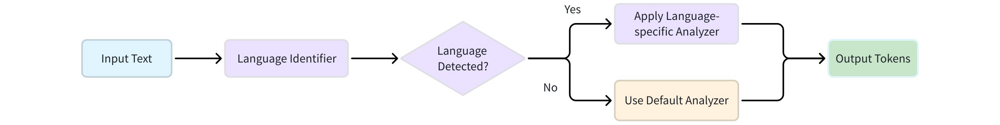

# Language Identifier

The `language_identifier` is a specialized tokenizer designed to enhance the text search capabilities of Milvus by automating the language analysis process. Its primary function is to detect the language of a text field and then dynamically apply a pre-configured analyzer that is most suitable for that language. This is particularly valuable for applications that handle a variety of languages, as it eliminates the need for manual language assignment on a per-input basis.

By intelligently routing text data to the appropriate processing pipeline, the `language_identifier` streamlines multilingual data ingestion and ensures accurate tokenization for subsequent search and retrieval operations.

## Language detection workflow

The `language_identifier` performs a series of steps to process a text string, a workflow that is critical for users to understand how to configure it correctly.



1. **Input:** The workflow begins with a text string as input.

1. **Language detection:** This string is first passed to a language detection engine, which attempts to identify the language. Milvus supports two engines: **whatlang** and **lingua**.

1. **Analyzer selection:**

    - **Success:** If the language is successfully detected, the system checks if the detected language name has a corresponding analyzer configured in your `analyzers` dictionary. If a match is found, the system applies the specified analyzer to the input text. For example, a detected "Mandarin" text would be routed to a `jieba` tokenizer.

    - **Fallback:** If detection fails, or if a language is successfully detected but you have not provided a specific analyzer for it, the system defaults to a pre-configured **default analyzer**. This is a crucial point of clarification; the `default` analyzer is a fallback for both detection failure and an absence of a matching analyzer.

After the appropriate analyzer is chosen, the text is tokenized and processed, completing the workflow.

## Available language detection engines

Milvus offers a choice between two language detection engines:

- [whatlang](https://github.com/greyblake/whatlang-rs)

- [lingua](https://github.com/pemistahl/lingua)

The selection depends on the specific performance and accuracy requirements of your application.

<table>
   <tr>
     <th><p>Engine</p></th>
     <th><p>Speed</p></th>
     <th><p>Accuracy</p></th>
     <th><p>Output Format</p></th>
     <th><p>Best For</p></th>
   </tr>
   <tr>
     <td><p><code>whatlang</code></p></td>
     <td><p>Fast</p></td>
     <td><p>Good for most languages</p></td>
     <td><p>Language names (e.g., <code>"English"</code>,  <code>"Mandarin"</code>, <code>"Japanese"</code>)</p><p><strong>Reference:</strong> <a href="https://github.com/greyblake/whatlang-rs/blob/master/SUPPORTED_LANGUAGES.md">Language column in supported languages table</a></p></td>
     <td><p>Real-time applications where speed is critical</p></td>
   </tr>
   <tr>
     <td><p><code>lingua</code></p></td>
     <td><p>Slower</p></td>
     <td><p>Higher precision, especially for short texts</p></td>
     <td><p>English language names (e.g., <code>"English"</code>, <code>"Chinese"</code>, <code>"Japanese"</code>)</p><p><strong>Reference:</strong> <a href="https://github.com/pemistahl/lingua?tab=readme-ov-file#3-which-languages-are-supported">Supported languages list</a></p></td>
     <td><p>Applications where accuracy is more important than speed</p></td>
   </tr>
</table>

A critical consideration is the engine's naming convention. While both engines return language names in English, they use different terms for some languages (e.g., `whatlang` returns `Mandarin`, while `lingua` returns `Chinese`). The analyzer's key must be an exact match to the name returned by the chosen detection engine.

## Configuration

To correctly use the `language_identifier` tokenizer, the following steps must be taken to define and apply its configuration.

### Step 1: Choose your languages and analyzers

The core of setting up the `language_identifier` is tailoring your analyzers to the specific languages you plan to support. The system works by matching the detected language with the correct analyzer, so this step is crucial for accurate text processing.

Below is a recommended mapping of languages to suitable Milvus analyzers. This table serves as a bridge between the output of the language detection engine and the best tool for the job.

<table>
   <tr>
     <th><p>Language (Detector Output)</p></th>
     <th><p>Recommended Analyzer</p></th>
     <th><p>Description</p></th>
   </tr>
   <tr>
     <td><p><code>English</code></p></td>
     <td><p><code>type: english</code></p></td>
     <td><p>Standard English tokenization with stemming and stop-word filtering.</p></td>
   </tr>
   <tr>
     <td><p><code>Mandarin</code> (via whatlang) or <code>Chinese</code> (via lingua)</p></td>
     <td><p><code>tokenizer: jieba</code></p></td>
     <td><p>Chinese word segmentation for non-space-delimited text.</p></td>
   </tr>
   <tr>
     <td><p><code>Japanese</code></p></td>
     <td><p><code>tokenizer: icu</code></p></td>
     <td><p>A robust tokenizer for complex scripts, including Japanese.</p></td>
   </tr>
   <tr>
     <td><p><code>French</code></p></td>
     <td><p><code>type: standard</code>, <code>filter: ["lowercase", "asciifolding"]</code></p></td>
     <td><p>A custom configuration that handles French accents and characters.</p></td>
   </tr>
</table>

<div class="alert note">

- **Matching is Key:** The name of your analyzer **must exactly match** the language output of the detection engine. For instance, if you're using `whatlang`, the key for Chinese text must be `Mandarin`.

- **Best practices:** The table above provides recommended configurations for a few common languages, but it is not an exhaustive list. For a more comprehensive guide on choosing analyzers, refer to [Choose the Right Analyzer for Your Use Case](choose-the-right-analyzer-for-your-use-case.md).

- **Detector output**: For a complete list of language names returned by the detection engines, refer to [Whatlang supported languages table](https://github.com/greyblake/whatlang-rs) and the [Lingua supported languages list](https://github.com/pemistahl/lingua-rs).

</div>

### Step 2: Define analyzer_params

To use the `language_identifier` tokenizer in Milvus, create a dictionary containing these key components:

**Required components:**

- `analyzers` config set – A dictionary containing all analyzer configurations, which must include:

    - `default` – The fallback analyzer used when language detection fails or no matching analyzer is found

    - **Language-specific analyzers** – Each defined as `<analyzer_name>: <analyzer_config>`, where:

        - `analyzer_name` matches your chosen detection engine's output (e.g., `"English"`, `"Japanese"`)

        - `analyzer_config` follows standard analyzer parameter format (see [Analyzer Overview](analyzer-overview.md#Analyzer-types))

**Optional components:**

- `identifier` – Specifies which language detection engine to use (`whatlang` or `lingua`). Defaults to `whatlang` if not specified

- `mapping` – Creates custom aliases for your analyzers, allowing you to use descriptive names instead of the detection engine's exact output format

The tokenizer works by first detecting the language of input text, then selecting the appropriate analyzer from your configuration. If detection fails or no matching analyzer exists, it automatically falls back to your `default` analyzer.

#### Recommended: Direct name matching

Your analyzer names should exactly match the output of your chosen language detection engine. This approach is simpler and avoids potential confusion.

For both `whatlang` and `lingua`, use the language names as shown in their respective documentation:

- [whatlang supported languages](https://github.com/greyblake/whatlang-rs/blob/master/SUPPORTED_LANGUAGES.md) (use the "**Language**" column)

- [lingua supported languages](https://github.com/pemistahl/lingua?tab=readme-ov-file#3-which-languages-are-supported)

```python
analyzer_params = {
    "tokenizer": {
        "type": "language_identifier",  # Must be `language_identifier`
        "identifier": "whatlang",  # or `lingua`
        "analyzers": {  # A set of analyzer configs
            "default": {
                "tokenizer": "standard"  # fallback if language detection fails
            },
            "English": {  # Analyzer name that matches whatlang output
                "type": "english"
            },
            "Mandarin": {  # Analyzer name that matches whatlang output
                "tokenizer": "jieba"
            }
        }
    }
}
```

#### Alternative approach: Custom names with mapping

If you prefer to use custom analyzer names or need to maintain compatibility with existing configurations, you can use the `mapping` parameter. This creates aliases for your analyzers—both the original detection engine names and your custom names will work.

```python
analyzer_params = {
    "tokenizer": {
        "type": "language_identifier",
        "identifier": "lingua",
        "analyzers": {
            "default": {
                "tokenizer": "standard"
            },
            "english_analyzer": {  # Custom analyzer name
                "type": "english"
            },
            "chinese_analyzer": {  # Custom analyzer name
                "tokenizer": "jieba"
            }
        },
        "mapping": {
            "English": "english_analyzer",   # Maps detection output to custom name
            "Chinese": "chinese_analyzer"
        }
    }
}
```

After defining `analyzer_params`, you can apply them to a `VARCHAR` field when defining a collection schema. This allows Milvus to process the text in that field using the specified analyzer for efficient tokenization and filtering. For details, refer to [Example use](analyzer-overview.md#Example-use).

## Examples

Here are some ready-to-use configurations for common scenarios. Each example includes both the configuration and verification code so you can test the setup immediately.

### English and Chinese detection

```python
from pymilvus import MilvusClient

# Configuration
analyzer_params = {
    "tokenizer": {
        "type": "language_identifier",
        "identifier": "whatlang",
        "analyzers": {
            "default": {"tokenizer": "standard"},
            "English": {"type": "english"},
            "Mandarin": {"tokenizer": "jieba"}
        }
    }
}

# Test the configuration
client = MilvusClient(
    uri="http://localhost:19530",
    token="root:Milvus"
)

# English text
result_en = client.run_analyzer("The Milvus vector database is built for scale!", analyzer_params)
print("English:", result_en)
# Output: 
# English: ['The', 'Milvus', 'vector', 'database', 'is', 'built', 'for', 'scale']

# Chinese text  
result_cn = client.run_analyzer("Milvus向量数据库专为大规模应用而设计", analyzer_params)
print("Chinese:", result_cn)
# Output: 
# Chinese: ['Milvus', '向量', '数据', '据库', '数据库', '专', '为', '大规', '规模', '大规模', '应用', '而', '设计']
```

### European languages with accent normalization

```python
# Configuration for French, German, Spanish, etc.
analyzer_params = {
    "tokenizer": {
        "type": "language_identifier",
        "identifier": "lingua", 
        "analyzers": {
            "default": {"tokenizer": "standard"},
            "English": {"type": "english"},
            "French": {
                "tokenizer": "standard",
                "filter": ["lowercase", "asciifolding"]
            }
        }
    }
}

# Test with accented text
result_fr = client.run_analyzer("Café français très délicieux", analyzer_params)
print("French:", result_fr)
# Output: 
# French: ['cafe', 'francais', 'tres', 'delicieux']
```

## Usage notes

- **Single-language per field:** It operates on a field as a single, homogenous unit of text. It is designed to handle different languages across different data records, such as one record containing an English sentence and the next containing a French sentence.

- **No mixed-language strings:** It is **not** designed to handle a single string that contains text from multiple languages. For example, a single `VARCHAR` field containing both an English sentence and a quoted Japanese phrase will be processed as a single language.

- **Dominant language processing:** In mixed-language scenarios, the detection engine will likely identify the dominant language, and the corresponding analyzer will be applied to the entire text. This will result in poor or no tokenization for the embedded foreign text.

