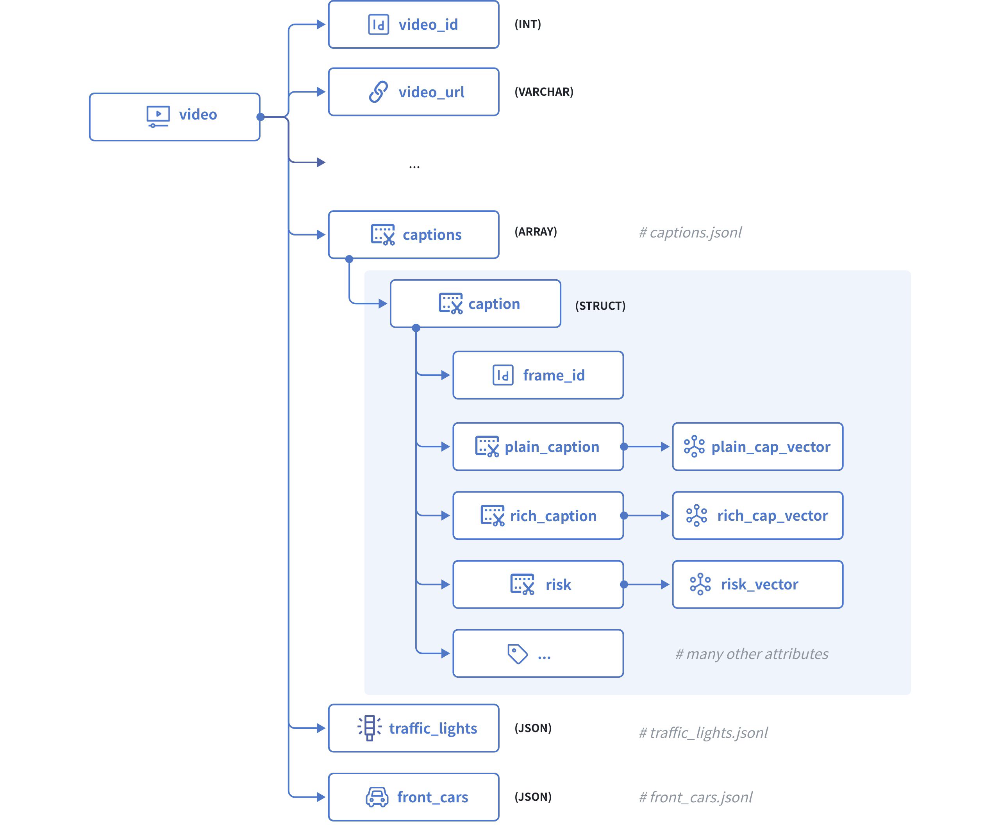

# Data Model Design with an Array of Structs

Modern AI applications, especially in the Internet of Things (IoT) and autonomous driving, typically reason over rich, structured events: a sensor reading with its timestamp and vector embedding, a diagnostic log with an error code and audio snippet, or a trip segment with location, speed, and scene context. These require the database to natively support the ingestion and search of nested data. 

Instead of asking the user to convert their atomic structural events into flat data models, Milvus introduces the Array of Structs, where each Struct in the array can hold scalars and vectors, preserving semantic integrity and enabling robust nested filtering and hybrid search.

## Why Array of Structs

Modern AI applications, from autonomous driving to multimodal retrieval, increasingly rely on nested, heterogeneous data. Traditional flat data models struggle to represent complex relationships like "**one document with many annotated chunks**" or "**one driving scene with multiple observed maneuvers**". This is where the Array of Structs data type in Milvus shines.

An Array of Structs allows you to store an ordered set of structured elements, where each Struct contains its own combination of scalar fields and vector embeddings. This makes it ideal for:

- **Hierarchical data**: Parent entities with multiple child records, such as a book with many text chunks, or a video with many annotated frames.

- **Multimodal embeddings**: Each Struct can hold multiple vectors, such as text embedding plus image embedding, alongside metadata.

- **Temporal or sequential data**: Structs in an Array field naturally represent time-series or step-by-step events.

Unlike traditional workarounds that store JSON blobs or split data across multiple collections, the Array of Structs provides native schema enforcement, vector indexing, and efficient storage within Milvus.

## Schema design guidelines

In addition to all the guidelines discussed in [Data Model Design for Search](schema-hands-on.md), you should also consider the following things before starting to use an Array of Structs in your data model design.

### Define the Struct schema

Before adding the Array field to your collection, define the inner Struct schema. Each field in the struct must be explicitly typed, scalar (**VARCHAR**, **INT**, **BOOLEAN**, etc.) or vector (**FLOAT_VECTOR**).

You are advised to keep the Struct schema lean by only including fields you'll use for retrieval or display. Avoid bloating with unused metadata.

### Set the max capacity thoughtfully

Each Array field has an attribute that specifies the maximum number of elements the Array field can hold for each entity. Set this based on your use case's upper bound. For example, there are 1,000 text chunks per document, or 100 maneuvers per driving scene. 

An excessively high value wastes memory, and you'll need to do some calculations to determine the maximum number of Structs in the Array field.

### Index vector fields in Structs

Indexing is mandatory for vector fields, including both the vector fields in a collection and those defined in a Struct. For vector fields in a Struct, you should use `EMB_LIST_HNSW` as the index type and `MAX_SIM` as the metric type.

For details on all applicable limits, refer to [the limits](array-of-structs.md#Limits).

## A real-world example: Modeling the CoVLA dataset for autonomous driving

The Comprehensive Vision-Language-Action (CoVLA) dataset, introduced by [Turing Motors](https://tur.ing/posts/s1QUA1uh) and accepted at the Winter Conference on Applications of Computer Vision (WACV) 2025, provides a rich foundation for training and evaluating Vision-Language-Action (VLA) models in autonomous driving. Each data point, which is usually a video clip, contains not just raw visual input but also structured captions describing:

- The **ego vehicle's behaviors** (e.g., “Merge left while yielding to oncoming traffic”),

- The **detected objects** present (e.g., leading vehicles, pedestrians, traffic lights), and

- A frame-level **caption** of the scene.

This hierarchical, multi-modal nature makes it an ideal candidate for the Array of Structs feature. For details on the CoVLA dataset, refer to the [CoVLA Dataset Website](https://turingmotors.github.io/covla-ad/).

### Step 1: Map the dataset into a collection schema

The CoVLA dataset is a large-scale, multimodal driving dataset comprising 10,000 video clips, totaling over 80 hours of footage. It samples frames at a rate of 20Hz and annotates each frame with detailed natural language captions along with information on vehicle states and the coordinates of detected objects.

The dataset structure is as follows:

```python
├── video_1                                       (VIDEO) # video.mp4
│   ├── video_id                                  (INT)
│   ├── video_url                                 (STRING)
│   ├── frames                                    (ARRAY)
│   │   ├── frame_1                               (STRUCT)
│   │   │   ├── caption                           (STRUCT) # captions.jsonl
│   │   │   │   ├── plain_caption                 (STRING)
│   │   │   │   ├── rich_caption                  (STRING)
│   │   │   │   ├── risk                          (STRING)
│   │   │   │   ├── risk_correct                  (BOOL)
│   │   │   │   ├── risk_yes_rate                 (FLOAT)
│   │   │   │   ├── weather                       (STRING)
│   │   │   │   ├── weather_rate                  (FLOAT)
│   │   │   │   ├── road                          (STRING)
│   │   │   │   ├── road_rate                     (FLOAT)
│   │   │   │   ├── is_tunnel                     (BOOL)
│   │   │   │   ├── is_tunnel_yes_rate            (FLOAT)
│   │   │   │   ├── is_highway                    (BOOL)
│   │   │   │   ├── is_highway_yes_rate           (FLOAT)
│   │   │   │   ├── has_pedestrain                (BOOL)
│   │   │   │   ├── has_pedestrain_yes_rate       (FLOAT)
│   │   │   │   ├── has_carrier_car               (BOOL)
│   │   │   ├── traffic_light                     (STRUCT) # traffic_lights.jsonl
│   │   │   │   ├── index                         (INT)
│   │   │   │   ├── class                         (STRING)
│   │   │   │   ├── bbox                          (LIST<FLOAT>)
│   │   │   ├── front_car                         (STRUCT) # front_cars.jsonl
│   │   │   │   ├── has_lead                      (BOOL)
│   │   │   │   ├── lead_prob                     (FLOAT)
│   │   │   │   ├── lead_x                        (FLOAT)
│   │   │   │   ├── lead_y                        (FLOAT)
│   │   │   │   ├── lead_speed_kmh                (FLOAT)
│   │   │   │   ├── lead_a                        (FLOAT)
│   │   ├── frame_2                               (STRUCT)
│   │   ├── ...                                   (STRUCT)
│   │   ├── frame_n                               (STRUCT)
├── video_2
├── ...
├── video_n
```

You can find that the structure of the CoVLA dataset is highly hierarchical, dividing the collected data into multiple `.jsonl` files, along with the video clips in the `.mp4` format.

In Milvus, you can use either a JSON field or an Array-of-Structs field to create nested structures within a collection schema. When vector embeddings are part of the nested format, only an Array-of-Structs field is supported. However, a Struct inside an Array cannot itself contain further nested structures. To store the CoVLA dataset while retaining essential relationships, you need to remove unnecessary hierarchy and flatten the data so it fits the Milvus collection schema.

The diagram below illustrates how we can model this dataset using the schema illustrated in the following schema:



The above diagram illustrates the structure of a video clip, which comprises the following fields:

- `video_id` serves as the primary key, which accepts integers of the INT64 type.

- `states` is a raw JSON body that contains the state of the ego vehicle in each frame of the current video.

- `captions` is an Array of Structs with each Struct having the following fields:

    - `frame_id` identifies a specific frame within the current video.

    - `plain_caption` is a description of the current frame without the ambient environment, such as weather, road condition, etc., and `plain_cap_vector` is its corresponding vector embeddings.

    - `rich_caption` is a description of the current frame with the ambient environment, and `rich_cap_vector` is its corresponding vector embeddings.

    - `risk` is a description of the risk that the ego vehicle faces in the current frame, and `risk_vector` is its corresponding vector embeddings, and

    - All the other attributes of the frame, such as `road`, `weather`, `is_tunnel`, `has_pedestrain`, etc..

- `traffic_lights` is a JSON body that contains all the traffic light signals identified in the current frame.

- `front_cars` is also a JSON body that contains all the leading cars identified in the current frame.

### Step 2: Initialize the schemas

To start, we need to initialize the schema for a caption Struct and the collection.

- Initialize the schema for the Caption Struct.

    ```python
    from pymilvus import MilvusClient, DataType
    
    # create the schema for the caption struct
    schema_for_caption = MilvusClient.create_struct_field_schema()
    
    schema_for_caption.add_field(
        field_name="frame_id",
        datatype=DataType.INT64,
        description="ID of the frame to which the ego vehicle's behavior belongs"
    )
    
    schema_for_caption.add_field(
        field_name="plain_caption",
        datatype=DataType.VARCHAR,
        description="plain description of the ego vehicle's behaviors"
    )
    
    schema_for_caption.add_field(
        field_name="plain_cap_vector",
        datatype=DataType.FLOAT_VECTOR,
        dim=768,
        description="vectors for the plain description of the ego vehicle's behaviors"
    )
    
    schema_for_caption.add_field(
        field_name="rich_caption",
        datatype=DataType.VARCHAR,
        description="rich description of the ego vehicle's behaviors"
    )
    
    schema_for_caption.add_field(
        field_name="rich_cap_vector",
        datatype=DataType.FLOAT_VECTOR,
        dim=768,
        description="vectors for the rich description of the ego vehicle's behaviors"
    )
    
    schema_for_caption.add_field(
        field_name="risk",
        datatype=DataType.VARCHAR,
        description="description of the ego vehicle's risks"
    )
    
    schema_for_caption.add_field(
        field_name="risk_vector",
        datatype=DataType.FLOAT_VECTOR,
        dim=768,
        description="vectors for the description of the ego vehicle's risks"
    )
    
    ...
    ```

- Initialize the schema for the collection

    ```python
    schema = MilvusClient.create_schema()
    
    schema.add_field(
        field_name="video_id",
        datatype=DataType.VARCHAR,
        description="primary key"
    )
    
    schema.add_field(
        field_name="video_url",
        datatype=DataType.VARCHAR,
        max_length=512,
        description="URL of the video"
    )
    
    schema.add_field(
        field_name="states",
        datatype=DataType.JSON,
        description="frame-specific state of the ego vehicle in the current video"
    )
    
    # highlight-start
    schema.add_field(
        field_name="captions",
        datatype=DataType.ARRAY,
        element_type=DataType.STRUCT,
        struct_schema=struct_for_caption,
        max_capacity=600,
        description="captions for the current video"
    )
    # highlight-end
    
    schema.add_field(
        field_name="traffic_lights",
        datatype=DataType.JSON,
        description="frame-specific traffic lights identified in the current video"
    )
    
    schema.add_field(
        field_name="front_cars",
        datatype=DataType.JSON,
        description="frame-specific leading cars identified in the current video"
    )
    ```

### Step 3: Set index parameters

All vector fields must be indexed. To index the vector fields in an element Struct, you need to use `EMB_LIST_HNSW` as the index type and the `MAX_SIM` metric type to measure the similarities between vector embeddings.

```python
index_params = MilvusClient.prepare_index_params()

index_params.add_index(
    field_name="plain_cap_vector",
    index_type="HNSW",
    metric_type="MAX_SIM_COSINE",
    params={
        "M": 16,
        "efConstruction": 128
    }
)

index_params.add_index(
    field_name="rich_cap_vector",
    index_type="HNSW",
    metric_type="MAX_SIM_COSINE",
    params={
        "M": 16,
        "efConstruction": 128
    }
)

index_params.add_index(
    field_name="risk_vector",
    index_type="HNSW",
    metric_type="MAX_SIM_COSINE",
    params={
        "M": 16,
        "efConstruction": 128
    }
)
```

You are advised to enable JSON shredding for JSON fields to accelerate filtering within these fields.

### Step 4: Create a collection

Once the schemas and indexes are ready, you can create the target collection as follows:

```python
client = MilvusClient("http://localhost:19530")

client.create_collection(
    collection_name="covla_dataset",
    schema=schema,
    index_params=index_params
)
```

### Step 5: Insert the data

Turing Motos organizes the CoVLA dataset in multiple files, including raw video clips (`.mp4`), states (`states.jsonl`), captions (`captions.jsonl`), traffic lights (`traffic_lights.jsonl`), and front cars (`front_cars.jsonl`).

You need to merge the data pieces for each video clip from these files and insert the data. The following is a merged entity for your reference.

```json
{
    "video_id": "0a0fc7a5db365174",
    "video_url": "videos/0a0fc7a5db365174.mp4",
    "states": {
        "0": {
            "trajectory": [[0.0, -0.0, 0.0], ...],
            "extrinsic_matrix": [[-0.016034273081459105, -0.9998714384933313, -8.280132118064406e-05, 0.0], ...],
            "intrinsic_matrix": [[2648.0, 0.0, 964.0], ...]
        },
        "1": {...}
        ...
        "599": {...}
    },
    "captions": [
        {
            "frame_id": 0,
            "plain_caption": "The ego vehicle is moving at a moderate speed with deceleration and turning right. There are 2 traffic lights;one which displays a red signal, and one which displays a right arrow, and straight arrow signal. Caution is required because the distance between the ego vehicle and the leading car is narrow.",
            "rich_caption": "The ego vehicle is moving at a moderate speed with deceleration and turning right. There are 2 traffic lights;one which displays a red signal, and one which displays a right arrow, and straight arrow signal. Caution is required because the distance between the ego vehicle and the leading car is narrow. It is cloudy. The car is driving on a wide road. No pedestrians appear to be present. What the driver of ego vehicle should be careful is to maintain a safe distance from the leading car and to be prepared to stop if necessary",
            "risk": "to maintain a safe distance from the leading car and to be prepared to stop if necessary",
            "risk_correct": true,
            "risk_yes_rate": 0.6062515935356961,
            ...
        },
        {
            "frame_id": 1
            ...
        }
        ...
        {
            "frame_id": 599
            ...
        }
    ],
    "traffic_lights": {
        "0": [
            {"0": {"index": 1, "class": "red", "bbox": [485.9914855957031, 294.18536376953125, 574.1666259765625, 360.3130798339844]}}
            {"1": {"index": 2, "class": "right", "bbox": [487.6523742675781, 294.0285339355469, 574.2948608398438, 359.5504455566406]}}
            {"2": {"index": 3, "class": "straight", "bbox": [487.6523742675781, 294.0285339355469, 574.2948608398438, 359.5504455566406]}}
        ],
        "1": [...],
        ...
        "599": [...]
    },
    "front_cars": {
        "0": [
            {"0": {"has_lead": true, "lead_prob": 0.967777669429779, "lead_x": 5.26953125, "lead_y": 1.07421875, "lead_speed_kmh": 23.6953125, "lead_a": 0.546875}}
        ],
        "1": [...]
        ...
        "599": [...]
    }
}
```

Once you have processed the data accordingly, you can insert it as follows:

```python
data = [
    {"video_id": "0a0fc7a5db365174", ...}
    ...
]

client.insert(
    collection_name="covla_dataset",
    data=data
)
```

