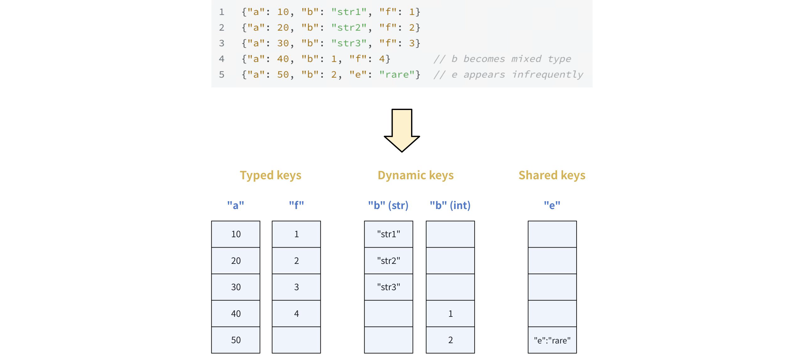
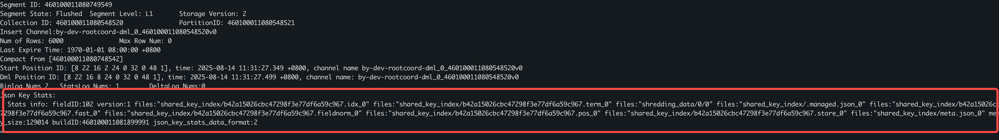

# JSON Shredding

JSON shredding accelerates JSON queries by converting traditional row-based storage into optimized columnar storage. While maintaining JSON's flexibility for data modeling, Milvus performs behind-the-scenes columnar optimization that dramatically improves access and query efficiency.

JSON shredding is effective for most JSON query scenarios. The performance benefits become more pronounced with:

- **Larger, more complex JSON documents** - Greater performance gains as document size increases

- **Read-heavy workloads** - Frequent filtering, sorting, or searching on JSON keys

- **Mixed query patterns** - Queries across different JSON keys benefit from the hybrid storage approach

## How it works

The JSON shredding process happens in three distinct phases to optimize data for fast retrieval.

### Phase 1: Ingestion & key classification

As new JSON documents are written, Milvus continuously samples and analyzes them to build statistics for each JSON key. This analysis includes the key's occurrence ratio and type stability (whether its data type is consistent across documents).

Based on these statistics, JSON keys are categorized into the following for optimal storage.

#### Categories of JSON keys

<table>
   <tr>
     <th><p>Key Type</p></th>
     <th><p>Description</p></th>
   </tr>
   <tr>
     <td><p>Typed keys</p></td>
     <td><p>Keys that exist in most documents and always have the same data type (e.g., all integers or all strings).</p></td>
   </tr>
   <tr>
     <td><p>Dynamic keys</p></td>
     <td><p>Keys that appear frequently but have a mixed data type (e.g., sometimes a string, sometimes an integer).</p></td>
   </tr>
   <tr>
     <td><p>Shared keys</p></td>
     <td><p>Infrequently appearing or nested keys that fall below a configurable frequency threshold<strong>.</strong></p></td>
   </tr>
</table>

#### Example classification

Consider the sample JSON data containing the following JSON keys:

```json
{"a": 10, "b": "str1", "f": 1}
{"a": 20, "b": "str2", "f": 2}  
{"a": 30, "b": "str3", "f": 3}
{"a": 40, "b": 1, "f": 4}       // b becomes mixed type
{"a": 50, "b": 2, "e": "rare"}  // e appears infrequently
```

Based on this data, the keys would be classified as follows:

- **Typed keys**: `a` and `f` (always an integer)

- **Dynamic keys**: `b` (mixed string/integer)

- **Shared keys**: `e` (infrequently appearing key)

### Phase 2: Storage optimization

The classification from [Phase 1](json-shredding.md#Phase-1-Ingestion--key-classification) dictates the storage layout. Milvus uses a columnar format optimized for queries.



- **Shredded columns**: For **typed** and **dynamic** **keys**, data is written to dedicated columns. This columnar storage allows for fast, direct scans during queries, as Milvus can read only the required data for a given key without processing the entire document.

- **Shared column**: All **shared keys** are stored together in a single, compact binary JSON column. A shared-key **inverted index** is built on this column. This index is crucial for accelerating queries on low-frequency keys by allowing Milvus to quickly prune the data, effectively narrowing down the search space to only those rows that contain the specified key.

### Phase 3: Query execution

The final phase leverages the optimized storage layout to intelligently select the fastest path for each query predicate.

- **Fast path**: Queries on typed/dynamic keys (e.g., `json['a'] < 100`) access dedicated columns directly

- **Optimized path**: Queries on shared keys (e.g., `json['e'] = 'rare'`) use inverted index to quickly locate relevant documents

## Enable JSON shredding

To activate the feature, set `common.enabledJSONShredding` to `true` in your `milvus.yaml` configuration file. New data will automatically trigger the shredding process.

```yaml
# milvus.yaml
...
common:
  enabledJSONShredding: true # Indicates whether to enable JSON key stats build and load processes
...
```

Once enabled, Milvus will begin analyzing and restructuring your JSON data upon ingestion without any further manual intervention.

## Parameter tuning

For most users, once JSON shredding is enabled, the default settings for other parameters are sufficient. However, you can fine-tune the behavior of JSON shredding using these parameters in `milvus.yaml`.

<table>
   <tr>
     <th><p>Parameter Name</p></th>
     <th><p>Description</p></th>
     <th><p>Default Value</p></th>
     <th><p>Tuning Advice</p></th>
   </tr>
   <tr>
     <td><p><code>common.enabledJSONShredding</code></p></td>
     <td><p>Controls whether the JSON shredding build and load processes are enabled.</p></td>
     <td><p>false</p></td>
     <td><p>Must be set to <strong>true</strong> to activate the feature.</p></td>
   </tr>
   <tr>
     <td><p><code>common.usingjsonShreddingForQuery</code></p></td>
     <td><p>Controls whether Milvus uses shredded data for acceleration.</p></td>
     <td><p>true</p></td>
     <td><p>Set to <strong>false</strong> as a recovery measure if queries fail, reverting to the original query path.</p></td>
   </tr>
   <tr>
     <td><p><code>queryNode.mmap.jsonShredding</code></p></td>
     <td><p>Determines whether Milvus uses mmap when loading shredding data.</p><p>For details, refer to <a href="mmap.md">Use mmap</a>.</p></td>
     <td><p>true</p></td>
     <td><p>This setting is generally optimized for performance. Only adjust it if you have specific memory management needs or constraints on your system.</p></td>
   </tr>
   <tr>
     <td><p><code>dataCoord.jsonShreddingMaxColumns</code></p></td>
     <td><p>The maximum number of JSON keys that will be stored in shredded columns. </p><p>If the number of frequently appearing keys exceeds this limit, Milvus will prioritize the most frequent ones for shredding, and the remaining keys will be stored in the shared column.</p></td>
     <td><p>1024</p></td>
     <td><p>This is sufficient for most scenarios. For JSON with thousands of frequently appearing keys, you may need to increase this, but monitor storage usage.</p></td>
   </tr>
   <tr>
     <td><p><code>dataCoord.jsonShreddingRatioThreshold</code></p></td>
     <td><p>The minimum occurrence ratio a JSON key must have to be considered for shredding into a shredded column.</p><p>A key is considered frequently appearing if its ratio is above this threshold.</p></td>
     <td><p>0.3</p></td>
     <td><p><strong>Increase</strong> (e.g., to 0.5) if the number of keys that meet the shredding criteria exceeds the <code>dataCoord.jsonShreddingMaxColumns</code> limit. This makes the threshold stricter, reducing the number of keys that qualify for shredding.</p><p><strong>Decrease</strong> (e.g., to 0.1) if you want to shred more keys that appear less frequently than the default 30% threshold.</p></td>
   </tr>
</table>

## Performance benchmarks

Our testing demonstrates significant performance improvements across different JSON key types and query patterns.

### Test environment and methodology

- **Hardware**: 1 core/8GB cluster

- **Dataset**: 1 million documents from [JSONBench](https://github.com/ClickHouse/JSONBench.git)

- **Average document size**: 478.89 bytes

- **Test duration**: 100 seconds measuring QPS and latency

### Results: typed keys

This test measured performance when querying a key present in most documents.

<table>
   <tr>
     <th><p>Query Expression</p></th>
     <th><p>Key Value Type</p></th>
     <th><p>QPS (without shredding)</p></th>
     <th><p>QPS (with shredding)</p></th>
     <th><p>Performance Boost</p></th>
   </tr>
   <tr>
     <td><p><code>json['time_us'] &gt; 0</code></p></td>
     <td><p>Integer</p></td>
     <td><p>8.69</p></td>
     <td><p>287.50</p></td>
     <td><p>33x</p></td>
   </tr>
   <tr>
     <td><p><code>json['kind'] == 'commit'</code></p></td>
     <td><p>String</p></td>
     <td><p>8.42</p></td>
     <td><p>126.1</p></td>
     <td><p>14.9x</p></td>
   </tr>
</table>

### Results: shared keys

This test focused on querying sparse, nested keys that fall into the "shared" category.

<table>
   <tr>
     <th><p>Query Expression</p></th>
     <th><p>Key Value Type</p></th>
     <th><p>QPS (without shredding)</p></th>
     <th><p>QPS (with shredding)</p></th>
     <th><p>Performance Boost</p></th>
   </tr>
   <tr>
     <td><p><code>json['identity']['seq'] &gt; 0</code></p></td>
     <td><p>Nested Integer</p></td>
     <td><p>4.33</p></td>
     <td><p>385</p></td>
     <td><p>88.9x</p></td>
   </tr>
   <tr>
     <td><p><code>json['identity']['did'] == 'xxxxx'</code></p></td>
     <td><p>Nested String</p></td>
     <td><p>7.6</p></td>
     <td><p>352</p></td>
     <td><p>46.3x</p></td>
   </tr>
</table>

### Key insights

- **Shared key queries** show the most dramatic improvements (up to 89x faster)

- **Typed key queries** provide consistent 15-30x performance gains

- **All query types** benefit from JSON Shredding with no performance regressions

## FAQ

- **How do I verify if JSON shredding works properly?**

    1. First, check if the data has been built by using the `show segment --format table` command in the [Birdwatcher](birdwatcher_usage_guides.md) tool. If successful, the output will contain `shredding_data/` and `shared_key_index/` under the **Json Key Stats** field.

        

    1. Next, verify that the data has been loaded by running `show loaded-json-stats` on the query node. The output will display details about the loaded shredded data for each query node.

- **What if I encounter an error?**

    If the build or load process fails, you can quickly disable the feature by setting `common.enabledJSONShredding=false`. To clear any remaining tasks, use the `remove stats-task <task_id>` command in [Birdwatcher](birdwatcher_usage_guides.md). If a query fails, set `common.usingjsonShreddingForQuery=false` to revert to the original query path, bypassing the shredded data.

- **How do I select between JSON shredding and JSON indexing?**

    - **JSON shredding** is ideal for keys that appear frequently in your documents, especially for complex JSON structures. It combines the benefits of columnar storage and inverted indexing, making it well-suited for read-heavy scenarios where you query many different keys. However, it is not recommended for very small JSON documents as the performance gain is minimal. The smaller the proportion of the key's value to the total size of the JSON document, the better the performance optimization from shredding.

    - **JSON indexing** is better for targeted optimization of specific key-based queries and has lower storage overhead. It's suitable for simpler JSON structures. Note that JSON shredding does not cover queries on keys inside arrays, so you need a JSON index to accelerate those.

    For details, refer to [JSON Field Overview](json-field-overview.md#Next-Accelerate-JSON-queries).

