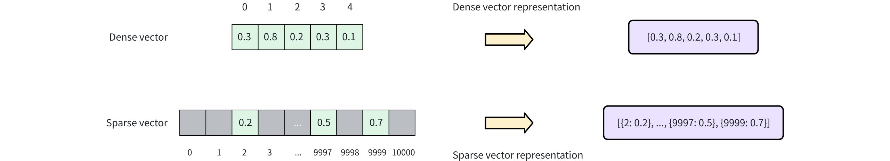

# Sparse Vector

Sparse vectors are an important method of capturing surface-level term matching in information retrieval and natural language processing. While dense vectors excel in semantic understanding, sparse vectors often provide more predictable matching results, especially when searching for special terms or textual identifiers.

## Overview

A sparse vector is a special high-dimensional vector where most elements are zero, and only a few dimensions have non-zero values. As shown in the diagram below, dense vectors are typically represented as continuous arrays where each position has a value (e.g., `[0.3, 0.8, 0.2, 0.3, 0.1]`). In contrast, sparse vectors store only non-zero elements and their indices of the dimension, often represented as key-value pairs of `{ index: value}` (e.g., `[{2: 0.2}, ..., {9997: 0.5}, {9999: 0.7}]`). 



With tokenization and scoring, documents can be represented as bag-of-words vectors, where each dimension corresponds to a specific word in the vocabulary. Only the words present in the document have non-zero values, creating a sparse vector representation. Sparse vectors can be generated using two approaches:

- **Traditional statistical techniques**, such as [TF-IDF](https://en.wikipedia.org/wiki/Tf%E2%80%93idf) (Term Frequency-Inverse Document Frequency) and [BM25](https://en.wikipedia.org/wiki/Okapi_BM25) (Best Matching 25), assign weights to words based on their frequency and importance across a corpus. These methods compute simple statistics as scores for each dimension, which represents a token.  Milvus provides built-in **full-text search** with the BM25 method, which automatically converts text into sparse vectors, eliminating the need for manual preprocessing. This approach is ideal for keyword-based search, where precision and exact matches are important. Refer to [Full Text Search](full-text-search.md) for more information.

- **Neural sparse embedding models** are learned methods to generate sparse representations by training on large datasets. They are typically deep learning models with Transformer architecture, able to expand and weigh terms based on semantic context. Milvus also supports externally generated sparse embeddings from models like [SPLADE](https://arxiv.org/abs/2109.10086). See [Embeddings](embeddings.md#Embedding-Overview) for details.</include>

Sparse vectors and the original text can be stored in Milvus for efficient retrieval. The diagram below outlines the overall process.


<div class="alert note">

In addition to sparse vectors, Milvus also supports dense vectors and binary vectors. Dense vectors are ideal for capturing deep semantic relationships, while binary vectors excel in scenarios like quick similarity comparisons and content deduplication. For more information, refer to [Dense Vector](dense-vector.md) and [Binary Vector](binary-vector.md).

</div>

## Data Formats

In the following sections, we demonstrate how to store vectors from learned sparse embedding models like SPLADE. If you are looking for something to complement dense-vector-based semantic search, we recommend [Full Text Search](full-text-search.md) with BM25 over SPLADE for simplicity. If you've ran quality evaluation and dediced to use SPLADE, you can refer to [Embeddings](embeddings.md#Embedding-Overview) on how to generate sparse vectors with SPLADE.

Milvus supports  sparse vector input with the following formats:

- **List of Dictionaries (formatted as `{dimension_index: value, ...}`)**

    ```python
    # Represent each sparse vector using a dictionary
    sparse_vectors = [{27: 0.5, 100: 0.3, 5369: 0.6} , {100: 0.1, 3: 0.8}]
    ```

- **Sparse Matrix (using the `scipy.sparse` class)**

    ```python
    from scipy.sparse import csr_matrix
    
    # First vector: indices [27, 100, 5369] with values [0.5, 0.3, 0.6]
    # Second vector: indices [3, 100] with values [0.8, 0.1]
    indices = [[27, 100, 5369], [3, 100]]
    values = [[0.5, 0.3, 0.6], [0.8, 0.1]]
    sparse_vectors = [csr_matrix((vals, ([0]*len(idx), idx)), shape=(1, 5369+1)) for idx, vals in zip(indices, values)]
    ```

- **List of Tuple Iterables (e.g. `[(dimension_index, value)]`)**

    ```python
    # Represent each sparse vector using a list of iterables (e.g. tuples)
    sparse_vector = [
        [(27, 0.5), (100, 0.3), (5369, 0.6)],
        [(100, 0.1), (3, 0.8)]
        ]
    ```

## Define Collection Schema

Before creating a collection, you need to specify the collection schema, which defines fields  and optionally a function to convert a text field into corresponding sparse vector representation.

### Add fields

To use sparse vectors in Milvus, you need to create a collection with a schema including the following fields:

- A `SPARSE_FLOAT_VECTOR` field reserved for storing sparse vectors, either auto-generated from a `VARCHAR` field or provided directly in the input data.

- Typically, the raw text that the sparse vector represents is also stored in the collection. You can use a `VARCHAR` field for storing the raw text.

<div class="multipleCode">
    <a href="#python">Python</a>
    <a href="#java">Java</a>
    <a href="#javascript">NodeJS</a>
    <a href="#go">Go</a>
    <a href="#bash">cURL</a>
</div>

```python
from pymilvus import MilvusClient, DataType

client = MilvusClient(uri="http://localhost:19530")

schema = client.create_schema(
    auto_id=True,
    enable_dynamic_fields=True,
)

schema.add_field(field_name="pk", datatype=DataType.VARCHAR, is_primary=True, max_length=100)
schema.add_field(field_name="sparse_vector", datatype=DataType.SPARSE_FLOAT_VECTOR)
schema.add_field(field_name="text", datatype=DataType.VARCHAR, max_length=65535, enable_analyzer=True)
```

```java
import io.milvus.v2.client.ConnectConfig;
import io.milvus.v2.client.MilvusClientV2;

import io.milvus.v2.common.DataType;
import io.milvus.v2.service.collection.request.AddFieldReq;
import io.milvus.v2.service.collection.request.CreateCollectionReq;

MilvusClientV2 client = new MilvusClientV2(ConnectConfig.builder()
        .uri("http://localhost:19530")
        .build());
        
CreateCollectionReq.CollectionSchema schema = client.createSchema();
schema.setEnableDynamicField(true);
schema.addField(AddFieldReq.builder()
        .fieldName("pk")
        .dataType(DataType.VarChar)
        .isPrimaryKey(true)
        .autoID(true)
        .maxLength(100)
        .build());
schema.addField(AddFieldReq.builder()
        .fieldName("sparse_vector")
        .dataType(DataType.SparseFloatVector)
        .build());
schema.addField(AddFieldReq.builder()
        .fieldName("text")
        .dataType(DataType.VarChar)
        .maxLength(65535)
        .enableAnalyzer(true)
        .build());
```

```javascript
import { DataType } from "@zilliz/milvus2-sdk-node";

const schema = [
  {
    name: "metadata",
    data_type: DataType.JSON,
  },
  {
    name: "pk",
    data_type: DataType.Int64,
    is_primary_key: true,
  },
  {
    name: "sparse_vector",
    data_type: DataType.SparseFloatVector,
  },
  {
    name: "text",
    data_type: "VarChar",
    enable_analyzer: true,
    enable_match: true,
    max_length: 65535,
  },
];

```

```go
import (
    "context"
    "fmt"

    "github.com/milvus-io/milvus/client/v2/column"
    "github.com/milvus-io/milvus/client/v2/entity"
    "github.com/milvus-io/milvus/client/v2/index"
    "github.com/milvus-io/milvus/client/v2/milvusclient"
)

ctx, cancel := context.WithCancel(context.Background())
defer cancel()

milvusAddr := "localhost:19530"
client, err := milvusclient.New(ctx, &milvusclient.ClientConfig{
    Address: milvusAddr,
})
if err != nil {
    fmt.Println(err.Error())
    // handle error
}
defer client.Close(ctx)

schema := entity.NewSchema()
schema.WithField(entity.NewField().
    WithName("pk").
    WithDataType(entity.FieldTypeVarChar).
    WithIsAutoID(true).
    WithIsPrimaryKey(true).
    WithMaxLength(100),
).WithField(entity.NewField().
    WithName("sparse_vector").
    WithDataType(entity.FieldTypeSparseVector),
).WithField(entity.NewField().
    WithName("text").
    WithDataType(entity.FieldTypeVarChar).
    WithEnableAnalyzer(true).
    WithMaxLength(65535),
)
```

```bash
export primaryField='{
    "fieldName": "pk",
    "dataType": "VarChar",
    "isPrimary": true,
    "elementTypeParams": {
        "max_length": 100
    }
}'

export vectorField='{
    "fieldName": "sparse_vector",
    "dataType": "SparseFloatVector"
}'

export textField='{
    "fieldName": "text",
    "dataType": "VarChar",
    "elementTypeParams": {
        "max_length": 65535,
        "enable_analyzer": true
    }
}'

export schema="{
    \"autoID\": true,
    \"fields\": [
        $primaryField,
        $vectorField,
        $textField
    ]
}"
```

In this example, three fields are added:

- `pk`: This field stores primary keys using the `VARCHAR` data type, which is auto-generated with a maximum length of 100 bytes.

- `sparse_vector`: This field stores sparse vectors using the `SPARSE_FLOAT_VECTOR` data type.

- `text`: This field stores text strings using the `VARCHAR` data type, with a maximum length of 65535 bytes.

<div class="alert note">

To enable Milvus or  to generate sparse vector embeddings from a specified text field during data insertion, an additional step involving a function must be taken. For more information, please refer to  [Full Text Search](full-text-search.md).

</div>

## Set Index Parameters

The process of creating an index for sparse vectors is similar to that for [dense vectors](dense-vector.md), but with differences in the specified index type (`index_type`), distance metric (`metric_type`), and index parameters (`params`).

<div class="multipleCode">
    <a href="#python">Python</a>
    <a href="#java">Java</a>
    <a href="#javascript">NodeJS</a>
    <a href="#go">Go</a>
    <a href="#bash">cURL</a>
</div>

```python
index_params = client.prepare_index_params()

index_params.add_index(
    field_name="sparse_vector",
    index_name="sparse_inverted_index",
    index_type="SPARSE_INVERTED_INDEX",
    metric_type="IP",
    params={"inverted_index_algo": "DAAT_MAXSCORE"}, # or "DAAT_WAND" or "TAAT_NAIVE"
)

```

```java
import io.milvus.v2.common.IndexParam;
import java.util.*;

List<IndexParam> indexes = new ArrayList<>();

Map<String,Object> extraParams = new HashMap<>();
extraParams.put("inverted_index_algo": "DAAT_MAXSCORE"); // Algorithm used for building and querying the index

indexes.add(IndexParam.builder()
        .fieldName("sparse_vector")
        .indexName("sparse_inverted_index")
        .indexType(IndexParam.IndexType.SPARSE_INVERTED_INDEX)
        .metricType(IndexParam.MetricType.IP)
        .extraParams(extraParams)
        .build());

```

```javascript

const indexParams = await client.createIndex({
    field_name: 'sparse_vector',
    metric_type: MetricType.IP,
    index_name: 'sparse_inverted_index',
    index_type: IndexType.SPARSE_INVERTED_INDEX,
    params: {
      inverted_index_algo: 'DAAT_MAXSCORE', 
    },
});

```

```go
idx := index.NewSparseInvertedIndex(entity.IP, 0.2)
indexOption := milvusclient.NewCreateIndexOption("my_collection", "sparse_vector", idx)
```

```bash

export indexParams='[
        {
            "fieldName": "sparse_vector",
            "metricType": "IP",
            "indexName": "sparse_inverted_index",
            "indexType": "SPARSE_INVERTED_INDEX",
            "params":{"inverted_index_algo": "DAAT_MAXSCORE"}
        }
    ]'

```

This example uses the `SPARSE_INVERTED_INDEX` index type with `IP` as the metric. For more details, see the following resources:

- [SPARSE_INVERTED_INDEX](sparse-inverted-index.md): Explained index and its parameters

- [Metric Types](metric.md): Supported metric types for different field types

- [Full Text Search](full-text-search.md): A detailed tutorial on full-text search

## Create Collection

Once the sparse vector and index settings are complete, you can create a collection that contains sparse vectors. The example below uses the [`create_collection`](create-collection.md) method to create a collection named `my_collection`.

<div class="multipleCode">
    <a href="#python">Python</a>
    <a href="#java">Java</a>
    <a href="#javascript">NodeJS</a>
    <a href="#go">Go</a>
    <a href="#bash">cURL</a>
</div>

```python
client.create_collection(
    collection_name="my_collection",
    schema=schema,
    index_params=index_params
)
```

```java
CreateCollectionReq requestCreate = CreateCollectionReq.builder()
        .collectionName("my_collection")
        .collectionSchema(schema)
        .indexParams(indexes)
        .build();
client.createCollection(requestCreate);
```

```javascript
import { MilvusClient } from "@zilliz/milvus2-sdk-node";

const client = new MilvusClient({
    address: 'http://localhost:19530'
});

await client.createCollection({
    collection_name: 'my_collection',
    schema: schema,
    index_params: indexParams
});
```

```go
err = client.CreateCollection(ctx,
    milvusclient.NewCreateCollectionOption("my_collection", schema).
        WithIndexOptions(indexOption))
if err != nil {
    fmt.Println(err.Error())
    // handle error
}
```

```bash
curl --request POST \
--url "${CLUSTER_ENDPOINT}/v2/vectordb/collections/create" \
--header "Authorization: Bearer ${TOKEN}" \
--header "Content-Type: application/json" \
-d "{
    \"collectionName\": \"my_collection\",
    \"schema\": $schema,
    \"indexParams\": $indexParams
}"
```

## Insert data

You must provide data for all fields defined during collection creation, except for fields that are auto-generated (such as the primary key with `auto_id` enabled). If you are using the built-in BM25 function to auto-generate sparse vectors, you should also omit the sparse vector field when inserting data.

<div class="multipleCode">
    <a href="#python">Python</a>
    <a href="#java">Java</a>
    <a href="#javascript">NodeJS</a>
    <a href="#go">Go</a>
    <a href="#bash">cURL</a>
</div>

```python
data = [
    {
        "text": "information retrieval is a field of study.",
        "sparse_vector": {1: 0.5, 100: 0.3, 500: 0.8}
    },
    {
        "text": "information retrieval focuses on finding relevant information in large datasets.",
        "sparse_vector": {10: 0.1, 200: 0.7, 1000: 0.9}
    }
]

client.insert(
    collection_name="my_collection",
    data=data
)
```

```java
import com.google.gson.Gson;
import com.google.gson.JsonObject;
import io.milvus.v2.service.vector.request.InsertReq;
import io.milvus.v2.service.vector.response.InsertResp;

import java.util.ArrayList;
import java.util.List;
import java.util.SortedMap;
import java.util.TreeMap;

Gson gson = new Gson();
List<JsonObject> rows = new ArrayList<>();

{
    JsonObject row = new JsonObject();
    row.addProperty("text", "information retrieval is a field of study.");
    
    SortedMap<Long, Float> sparse = new TreeMap<>();
    sparse.put(1L, 0.5f);
    sparse.put(100L, 0.3f);
    sparse.put(500L, 0.8f);
    row.add("sparse_vector", gson.toJsonTree(sparse));
    rows.add(row);
}
{
    JsonObject row = new JsonObject();
    row.addProperty("text", "information retrieval focuses on finding relevant information in large datasets.");
    
    SortedMap<Long, Float> sparse = new TreeMap<>();
    sparse.put(10L, 0.1f);
    sparse.put(200L, 0.7f);
    sparse.put(1000L, 0.9f);
    row.add("sparse_vector", gson.toJsonTree(sparse));
    rows.add(row);
}

InsertResp insertResp = client.insert(InsertReq.builder()
        .collectionName("my_collection")
        .data(rows)
        .build());
```

```javascript
const data = [
    {
        text: 'information retrieval is a field of study.',
        sparse_vector: {1: 0.5, 100: 0.3, 500: 0.8}
    {
        text: 'information retrieval focuses on finding relevant information in large datasets.',
        sparse_vector: {10: 0.1, 200: 0.7, 1000: 0.9}
    },
];

client.insert({
    collection_name: "my_collection",
    data: data
});
```

```go
texts := []string{
    "information retrieval is a field of study.",
    "information retrieval focuses on finding relevant information in large datasets.",
}
textColumn := entity.NewColumnVarChar("text", texts)

// Prepare sparse vectors
sparseVectors := make([]entity.SparseEmbedding, 0, 2)
sparseVector1, _ := entity.NewSliceSparseEmbedding([]uint32{1, 100, 500}, []float32{0.5, 0.3, 0.8})
sparseVectors = append(sparseVectors, sparseVector1)
sparseVector2, _ := entity.NewSliceSparseEmbedding([]uint32{10, 200, 1000}, []float32{0.1, 0.7, 0.9})
sparseVectors = append(sparseVectors, sparseVector2)
sparseVectorColumn := entity.NewColumnSparseVectors("sparse_vector", sparseVectors)

_, err = client.Insert(ctx, milvusclient.NewColumnBasedInsertOption("my_collection").
    WithColumns(
        sparseVectorColumn,
        textColumn
        
    ))
if err != nil {
    fmt.Println(err.Error())
    // handle err
}
```

```bash
curl --request POST \
--url "${CLUSTER_ENDPOINT}/v2/vectordb/entities/insert" \
--header "Authorization: Bearer ${TOKEN}" \
--header "Content-Type: application/json" \
-d '{
    "data": [
        {
            "text": "information retrieval is a field of study.",
            "sparse_vector": {"1": 0.5, "100": 0.3, "500": 0.8}
        },
        {
            "text": "information retrieval focuses on finding relevant information in large datasets.",
            "sparse_vector": {"10": 0.1, "200": 0.7, "1000": 0.9}
        }     
    ],
    "collectionName": "my_collection"
}'
```

## Perform Similarity Search

To perform a similarity search using sparse vectors, prepare both the query data and the search parameters. 

<div class="multipleCode">
    <a href="#python">Python</a>
    <a href="#java">Java</a>
    <a href="#go">Go</a>
    <a href="#javascript">NodeJS</a>
    <a href="#bash">cURL</a>
</div>

```python
# Prepare search parameters
search_params = {
    "params": {"drop_ratio_search": 0.2},  # A tunable drop ratio parameter with a valid range between 0 and 1
}

# Query with sparse vector
query_data = [{1: 0.2, 50: 0.4, 1000: 0.7}]
```

```java
import io.milvus.v2.service.vector.request.data.EmbeddedText;
import io.milvus.v2.service.vector.request.data.SparseFloatVec;

// Prepare search parameters
Map<String,Object> searchParams = new HashMap<>();
searchParams.put("drop_ratio_search", 0.2);

// Query with the sparse vector
SortedMap<Long, Float> sparse = new TreeMap<>();
sparse.put(1L, 0.2f);
sparse.put(50L, 0.4f);
sparse.put(1000L, 0.7f);
SparseFloatVec queryData = new SparseFloatVec(sparse);
```

```go
// Prepare search parameters
annSearchParams := index.NewCustomAnnParam()
annSearchParams.WithExtraParam("drop_ratio_search", 0.2)

// Query with the sparse vector
queryData, _ := entity.NewSliceSparseEmbedding([]uint32{1, 50, 1000}, []float32{0.2, 0.4, 0.7})
```

```javascript
// Prepare search parameters
const searchParams = {drop_ratio_search: 0.2}

// Query with the sparse vector
const queryData = [{1: 0.2, 50: 0.4, 1000: 0.7}]
```

```bash
# Prepare search parameters
export queryData='["What is information retrieval?"]'

# Query with the sparse vector
export queryData='[{1: 0.2, 50: 0.4, 1000: 0.7}]'
```

Then, execute the similarity search using the `search` method:

<div class="multipleCode">
    <a href="#python">Python</a>
    <a href="#java">Java</a>
    <a href="#javascript">NodeJS</a>
    <a href="#go">Go</a>
    <a href="#bash">cURL</a>
</div>

```python
res = client.search(
    collection_name="my_collection",
    data=query_data,
    limit=3,
    output_fields=["pk"],
    search_params=search_params,
    consistency_level="Strong"
)

print(res)

# Output
# data: ["[{'id': '453718927992172266', 'distance': 0.6299999952316284, 'entity': {'pk': '453718927992172266'}}, {'id': '453718927992172265', 'distance': 0.10000000149011612, 'entity': {'pk': '453718927992172265'}}]"]
```

```java
import io.milvus.v2.service.vector.request.SearchReq;
import io.milvus.v2.service.vector.response.SearchResp;

SparseFloatVec queryVector = new SparseFloatVec(sparse);

SearchResp searchR = client.search(SearchReq.builder()
        .collectionName("my_collection")
        .data(Collections.singletonList(queryData))
        .annsField("sparse_vector")
        .searchParams(searchParams)
        .consistencyLevel(ConsistencyLevel.STRONG)
        .topK(3)
        .outputFields(Collections.singletonList("pk"))
        .build());
        
System.out.println(searchR.getSearchResults());

// Output
//
// [[SearchResp.SearchResult(entity={pk=457270974427187729}, score=0.63, id=457270974427187729), SearchResp.SearchResult(entity={pk=457270974427187728}, score=0.1, id=457270974427187728)]]
```

```javascript
await client.search({
    collection_name: 'my_collection',
    data: queryData,
    limit: 3,
    output_fields: ['pk'],
    params: searchParams,
    consistency_level: "Strong"
});
```

```go
resultSets, err := client.Search(ctx, milvusclient.NewSearchOption(
    "my_collection",
    3, // limit
    []entity.Vector{queryData},
).WithANNSField("sparse_vector").
    WithOutputFields("pk").
    WithAnnParam(annSearchParams))
if err != nil {
    fmt.Println(err.Error())
    // handle err
}

for _, resultSet := range resultSets {
    fmt.Println("IDs: ", resultSet.IDs.FieldData().GetScalars())
    fmt.Println("Scores: ", resultSet.Scores)
    fmt.Println("Pks: ", resultSet.GetColumn("pk").FieldData().GetScalars())
}

// Results:
//   IDs:  string_data:{data:"457270974427187705"  data:"457270974427187704"}
//   Scores:  [0.63 0.1]
//   Pks:  string_data:{data:"457270974427187705"  data:"457270974427187704"}

```

```bash
export params='{
    "consistencyLevel": "Strong"
}'

curl --request POST \
--url "${CLUSTER_ENDPOINT}/v2/vectordb/entities/search" \
--header "Authorization: Bearer ${TOKEN}" \
--header "Content-Type: application/json" \
-d '{
    "collectionName": "my_collection",
    "data": $queryData,
    "annsField": "sparse_vector",
    "limit": 3,
    "searchParams": $searchParams,
    "outputFields": ["pk"],
    "params": $params
}'

## {"code":0,"cost":0,"data":[{"distance":0.63,"id":"453577185629572535","pk":"453577185629572535"},{"distance":0.1,"id":"453577185629572534","pk":"453577185629572534"}]}
```

For more information on similarity search parameters, refer to [Basic Vector Search](single-vector-search.md).

