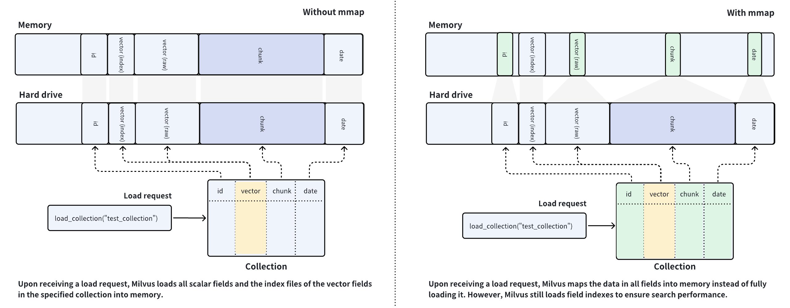

# Use mmap

Memory mapping (Mmap) enables direct memory access to large files on disk, allowing Milvus to store indexes and data in both memory and hard drives. This approach helps optimize data placement policy based on access frequency, expanding storage capacity for collections without significantly impacting search performance. This page helps you understand how Milvus uses mmap to enable fast and efficient data storage and retrieval.

## Overview

Milvus uses collections to organize vector embeddings and their metadata, and each row in the collection represents an entity. As shown in the left figure below, the vector field stores vector embeddings, and the scalar fields store their metadata. When you have created indexes on certain fields and loaded the collection, Milvus loads the created indexes and field raw data into memory.



Milvus is a memory-intensive database system, and the memory size available determines the capacity of a collection. Loading fields containing a large volume of data into memory is impossible if the data size exceeds the memory capacity, which is the usual case for AI-driven applications. 

To resolve such issues, Milvus introduces mmap to balance the loading of hot and cold data in collections. As shown in the right figure above, you can configure Milvus to memory-maps the raw data in certain fields instead of fully loading them into memory. This way, you can gain direct memory access to the fields without worrying about memory issues and extend the capacity of the collection.

By comparing the data placement procedures in the left and right figures, you can figure out that the memory usage is much higher in the left figure than in the right one. With mmap enabled, the data that should have been loaded into memory is offloaded into the hard drive and cached in the page cache of the operating system, reducing memory footprint. However, cache hit failures may result in performance degradation. For details, refer to [this article](https://en.wikipedia.org/wiki/Mmap).

When you configure mmap on Milvus, there is always a principle for you to adhere to: Always keep the frequently accessed data and indexes fully loaded into memory and use mmap for those in the remaining fields.

## Use mmap in Milvus

Milvus provides hierarchical mmap settings at global, field, index, and collection levels, where index and field levels take precedence over collection level, and collection level over global level. 

### Global mmap settings

The cluster-level setting is the global setting and has the lowest precedence. Milvus provides several mmap-related settings in `milvus.yaml`. These settings will apply to all collections in the cluster.

```yaml
...
queryNode:
  mmap:
    scalarField: false
    scalarIndex: false
    vectorField: false
    vectorIndex: false
    # The following should be a path on a high-performance disk
    mmapDirPath: any/valid/path 
....
```

<table>
   <tr>
     <th><p>Configure Item</p></th>
     <th><p>Description</p></th>
     <th><p>Default Value</p></th>
   </tr>
   <tr>
     <td><p><code>queryNode.mmap.scalarField</code></p></td>
     <td><p>Specifies whether to map the raw data of all scalar fields into memory. Setting this to <code>true</code> makes Milvus map the raw data of scalar field data of a collection into memory instead of fully loading it upon receiving a load request against this collection.</p></td>
     <td><p><code>false</code></p></td>
   </tr>
   <tr>
     <td><p><code>queryNode.mmap.scalarIndex</code></p></td>
     <td><p>Specifies whether to map all scalar field indexes into memory. Setting this to <code>true</code> makes Milvus map scalar field indexes of a collection into memory instead of fully loading them upon receiving a load request against this collection.</p><p>Currently, only the scalar field using the following index type is supported:</p><ul><li>INVERTED</li></ul></td>
     <td><p><code>false</code></p></td>
   </tr>
   <tr>
     <td><p><code>queryNode.mmap.vectorField</code></p></td>
     <td><p>Specifies whether to map the raw data of all vector fields into memory. Setting this to <code>true</code> makes Milvus map the raw data of vector field data of a collection into memory instead of fully loading it upon receiving a load request against this collection.</p></td>
     <td><p><code>false</code></p></td>
   </tr>
   <tr>
     <td><p><code>queryNode.mmap.vectorIndex</code></p></td>
     <td><p>Specifies whether to map all vector field indexes into memory. Setting this to <code>true</code> makes Milvus map vector field indexes of a collection into memory instead of fully loading them upon receiving a load request against this collection.</p><p>Currently, only the vector fields using the following index types are supported:</p><ul><li><p>FLAT</p></li><li><p>IVF_FLAT</p></li><li><p>IVF_SQ8</p></li><li><p>IVF_PQ</p></li><li><p>BIN_FLAT</p></li><li><p>BIN_IVF_FLAT</p></li><li><p>HNSW</p></li><li><p>SCANN</p></li><li><p>SPARSE_INVERTED_INDEX</p></li><li><p>SPARSE_WAND</p></li></ul></td>
     <td><p><code>false</code></p></td>
   </tr>
   <tr>
     <td><p><code>queryNode.mmap.mmapDirPath</code></p></td>
     <td><p>Specifies the path to the memory-mapped files. The default value applies if this is left unspecified. </p><p>The <code>localStorage.path</code> placeholder in the default value indicates the hard drive of Milvus QueryNodes. Ensure that your QueryNodes have a high-performance hard drive for optimal mmap advantages.</p></td>
     <td><p><code>{localStorage.path}/mmap</code></p></td>
   </tr>
</table>

To apply the above settings to your Milvus cluster, please follow the steps in [Configure Milvus with Helm](configure-helm.md#Configure-Milvus-via-configuration-file) and [Configure Milvus with Milvus Operators](configure_operator.md).

Sometimes, global mmap settings are not flexible when facing particular use cases. To apply alternate settings to a specific collection or its indexes, consider configuring mmap specific to a collection, a field, or an index. You need to release and load a collection before the changes to the mmap settings take effect.

### Field-specific mmap settings

To configure field-specific mmap, you need to include the `mmap_enabled` parameter when you add a field. You can enable mmap on this specific field by setting this parameter to `True`.

The following example demonstrates how to configure field-specific mmap when you add a field.

<div class="multipleCode">
    <a href="#python">Python</a>
    <a href="#java">Java</a>
    <a href="#javascript">NodeJS</a>
    <a href="#go">Go</a>
    <a href="#bash">cURL</a>
</div>

```python
from pymilvus import MilvusClient, DataType

CLUSTER_ENDPOINT="http://localhost:19530"
TOKEN="root:Milvus"

client = MilvusClient(
    uri=CLUSTER_ENDPOINT,
    token=TOKEN
)

schema = MilvusClient.create_schema()
schema.add_field("id", DataType.INT64, is_primary=True, auto_id=False)
schema.add_field("vector", DataType.FLOAT_VECTOR, dim=5)

schema = MilvusClient.create_schema()

# Add a scalar field and enable mmap
schema.add_field(
    field_name="doc_chunk",
    datatype=DataType.INT64,
    is_primary=True,
    mmap_enabled=True,
)

# Alter mmap settings on a specific field
# The following assumes that you have a collection named `my_collection`
client.alter_collection_field(
    collection_name="my_collection",
    field_name="doc_chunk",
    field_params={"mmap.enabled": True}
)
```

```java
import io.milvus.param.Constant;
import io.milvus.v2.client.ConnectConfig;
import io.milvus.v2.client.MilvusClientV2;
import io.milvus.v2.common.DataType;
import io.milvus.v2.service.collection.request.*;

import java.util.*;

String CLUSTER_ENDPOINT = "http://localhost:19530";
String TOKEN = "root:Milvus";
client = new MilvusClientV2(ConnectConfig.builder()
        .uri(CLUSTER_ENDPOINT)
        .token(TOKEN)
        .build());
        
CreateCollectionReq.CollectionSchema schema = client.createSchema();

schema.addField(AddFieldReq.builder()
        .fieldName("id")
        .dataType(DataType.Int64)
        .isPrimaryKey(true)
        .autoID(false)
        .build());

schema.addField(AddFieldReq.builder()
        .fieldName("vector")
        .dataType(DataType.FloatVector)
        .dimension(5)
        .build());

Map<String, String> typeParams = new HashMap<String, String>() {{
    put(Constant.MMAP_ENABLED, "false");
}};
schema.addField(AddFieldReq.builder()
        .fieldName("doc_chunk")
        .dataType(DataType.VarChar)
        .maxLength(512)
        .typeParams(typeParams)
        .build());

CreateCollectionReq req = CreateCollectionReq.builder()
        .collectionName("my_collection")
        .collectionSchema(schema)
        .build();
client.createCollection(req);

client.alterCollectionField(AlterCollectionFieldReq.builder()
        .collectionName("my_collection")
        .fieldName("doc_chunk")
        .property(Constant.MMAP_ENABLED, "true")
        .build());
```

```javascript
import { MilvusClient, DataType } from '@zilliz/milvus2-sdk-node';

const CLUSTER_ENDPOINT="YOUR_CLUSTER_ENDPOINT";
const TOKEN="YOUR_TOKEN";

const client = await MilvusClient({
    address: CLUSTER_ENDPOINT,
    token: TOKEN
});

const schema = [
{
    name: 'vector',
    data_type: DataType.FloatVector
},
{
    name: "doc_chunk",
    data_type: DataType.VarChar,
    max_length: 512,
    'mmap.enabled': false,
}
];

await client.createCollection({
    collection_name: "my_collection",
    schema: schema
});

await client.alterCollectionFieldProperties({
    collection_name: "my_collection",
    field_name: "doc_chunk",
    properties: {"mmap_enable": true}
});
```

```go
// go
```

```bash
#restful
export TOKEN="root:Milvus"
export CLUSTER_ENDPOINT="http://localhost:19530"

export idField='{
    "fieldName": "id",
    "dataType": "Int64",
    "elementTypeParams": {
        "max_length": 512
    },
    "isPrimary": true,
    "auto_id": false
}'

export vectorField='{
    "fieldName": "vector",
    "dataType": "FloatVector",
    "elementTypeParams": {
       "dim": 5
    }
}'

export docChunkField='{
    "fieldName": "doc_chunk",
    "dataType": "Int64",
    "elementTypeParams": {
        "max_length": 512,
        "mmap.enabled": false
    }
}'

export schema="{
    \"autoID\": false,
    \"fields\": [
        $idField,
        $docChunkField,
        $vectorField
    ]
}"

curl --request POST \
--url "${CLUSTER_ENDPOINT}/v2/vectordb/collections/create" \
--header "Authorization: Bearer ${TOKEN}" \
--header "Content-Type: application/json" \
--data "{
    \"collectionName\": \"my_collection\",
    \"schema\": $schema
}"

curl --request POST \
--url "${CLUSTER_ENDPOINT}/v2/vectordb/collections/fields/alter_properties" \
--header "Authorization: Bearer ${TOKEN}" \
--header "Content-Type: application/json" \
-d '{
    "collectionName": "my_collection",
    "fieldName": "doc_chunk",
    "fieldParams":{
        "mmap.enabled": true
    }
}'

```

<div class="alert note">

Consider enabling mmap for the fields that store large-volume data. Both scalar fields and vector fields are supported.

</div>

Then, you can create a collection using the above-created schema. Upon receiving a request to load the collection, Milvus uses memory-maps the raw data of the **doc_chunk** field into memory. 

### Index-specific mmap settings

To configure index-specific mmap, you need to include the `mmap.enable` property in the index parameters when you add the index. You can enable mmap on this specific index by setting the property to `true`.

The following example demonstrates how to configure index-specific mmap when you add an index.

<div class="multipleCode">
    <a href="#python">Python</a>
    <a href="#java">Java</a>
    <a href="#javascript">NodeJS</a>
    <a href="#go">Go</a>
    <a href="#bash">cURL</a>
</div>

```python
# Add a varchar field
schema.add_field(
    field_name="title",
    datatype=DataType.VARCHAR,
    max_length=512   
)

index_params = MilvusClient.prepare_index_params()

# Create index on the varchar field with mmap settings
index_params.add_index(
    field_name="title",
    index_type="AUTOINDEX",
    # highlight-next-line
    params={ "mmap.enabled": "false" }
)

# Change mmap settings for an index
# The following assumes that you have a collection named `my_collection`
client.alter_index_properties(
    collection_name="my_collection",
    index_name="title",
    properties={"mmap.enabled": True}
)
```

```java
schema.addField(AddFieldReq.builder()
        .fieldName("title")
        .dataType(DataType.VarChar)
        .maxLength(512)
        .build());
        
List<IndexParam> indexParams = new ArrayList<>();
Map<String, Object> extraParams = new HashMap<String, Object>() {{
    put(Constant.MMAP_ENABLED, false);
}};
indexParams.add(IndexParam.builder()
        .fieldName("title")
        .indexType(IndexParam.IndexType.AUTOINDEX)
        .extraParams(extraParams)
        .build());
        
client.alterIndexProperties(AlterIndexPropertiesReq.builder()
        .collectionName("my_collection")
        .indexName("title")
        .property(Constant.MMAP_ENABLED, "true")
        .build());
```

```javascript
// Create index on the varchar field with mmap settings
await client.createIndex({
    collection_name: "my_collection",
    field_name: "title",
    params: { "mmap.enabled": false }
});

// Change mmap settings for an index
// The following assumes that you have a collection named `my_collection`
await client.alterIndexProperties({
    collection_name: "my_collection",
    index_name: "title",
    properties:{"mmap.enabled": true}
});
```

```go
// go
```

```bash
# restful
export TOKEN="root:Milvus"

curl --request POST \
--url "${CLUSTER_ENDPOINT}/v2/vectordb/indexes/create" \
--header "Authorization: Bearer ${TOKEN}" \
--header "Content-Type: application/json" \
-d '{
    "collectionName": "my_collection",
    "indexParams": [
        {
            "fieldName": "doc_chunk",
            "params": {
                "index_type": "AUTOINDEX",
                "mmap.enabled": true
            }
        }
    ]
}'

curl --request POST \
--url "${CLUSTER_ENDPOINT}/v2/vectordb/indexes/alter_properties" \
--header "Authorization: Bearer ${TOKEN}" \
--header "Content-Type: application/json" \
-d '{
    "collectionName": "my_collection",
    "indexName": "doc_chunk",
    "properties": {
        "mmap.enabled": false
    }
}'
```

<div class="alert note">

This applies to the indexes of both vector and scalar fields.

</div>

Then you can reference the index parameters in a collection. Upon receiving a request to load the collection, Milvus memory-maps the index of the **title** field into memory. 

### Collection-specific mmap settings

To configure a collection-wide mmap strategy, you need to include the `mmap.enabled` property in the request to create a collection. You can enable mmap for a collection by setting this property to `true`.

The following example demonstrates how to enable mmap in a collection named **my_collection** upon its creation. Upon receiving a request to load the collection, Milvus memory-maps the raw data of all fields into memory.

<div class="multipleCode">
    <a href="#python">Python</a>
    <a href="#java">Java</a>
    <a href="#javascript">NodeJS</a>
    <a href="#go">Go</a>
    <a href="#bash">cURL</a>
</div>

```python
# Enable mmap when creating a collection
client.create_collection(
    collection_name="my_collection",
    schema=schema,
    properties={ "mmap.enabled": "true" }
)
```

```java
CreateCollectionReq req = CreateCollectionReq.builder()
        .collectionName("my_collection")
        .collectionSchema(schema)
        .property(Constant.MMAP_ENABLED, "false")
        .build();
client.createCollection(req);
```

```javascript
await client.createCollection({
    collection_name: "my_collection",
    scheme: schema,
    properties: { "mmap.enabled": false }
});
```

```go
// go
```

```bash
curl --request POST \
--url "${CLUSTER_ENDPOINT}/v2/vectordb/collections/create" \
--header "Authorization: Bearer ${TOKEN}" \
--header "Content-Type: application/json" \
--data "{
    \"collectionName\": \"my_collection\",
    \"schema\": $schema,
    \"params\": {
        \"mmap.enabled\": \"false\"
    }
}"
```

You can also change the mmap settings of an existing collection.

<div class="multipleCode">
    <a href="#python">Python</a>
    <a href="#java">Java</a>
    <a href="#javascript">NodeJS</a>
    <a href="#go">Go</a>
    <a href="#bash">cURL</a>
</div>

```python
# Release collection before change mmap settings
client.release_collection("my_collection")

# Ensure that the collection has already been released 
# and run the following
client.alter_collection_properties(
    collection_name="my_collection",
    properties={
        "mmap.enabled": false
    }
)

# Load the collection to make the above change take effect
client.load_collection("my_collection")
```

```java
client.releaseCollection(ReleaseCollectionReq.builder()
        .collectionName("my_collection")
        .build());
        
client.alterCollectionProperties(AlterCollectionPropertiesReq.builder()
        .collectionName("my_collection")
        .property(Constant.MMAP_ENABLED, "false")
        .build());

client.loadCollection(LoadCollectionReq.builder()
        .collectionName("my_collection")
        .build());
       
```

```javascript
// Release collection before change mmap settings
await client.releaseCollection({
    collection_name: "my_collection"
});

// Ensure that the collection has already been released 
// and run the following
await client.alterCollectionProperties({
    collection_name: "my_collection",
    properties: {
        "mmap.enabled": false
    }
});

// Load the collection to make the above change take effect
await client.loadCollection({
    collection_name: "my_collection"
});
```

```go
// go
```

```bash
# restful
export CLUSTER_ENDPOINT="http://localhost:19530"
export TOKEN="root:Milvus"

curl --request POST \
--url "${CLUSTER_ENDPOINT}/v2/vectordb/collections/release" \
--header "Authorization: Bearer ${TOKEN}" \
--header "Content-Type: application/json" \
-d '{
    "collectionName": "my_collection"
}'

curl --request POST \
--url "${CLUSTER_ENDPOINT}/v2/vectordb/collections/alter_properties" \
--header "Authorization: Bearer ${TOKEN}" \
--header "Content-Type: application/json" \
-d '{
    "collectionName": "my_collection",
    "properties": {
        "mmmap.enabled": false
    }
}'

curl --request POST \
--url "${CLUSTER_ENDPOINT}/v2/vectordb/collections/load" \
--header "Authorization: Bearer ${TOKEN}" \
--header "Content-Type: application/json" \
-d '{
    "collectionName": "my_collection"
}'
```

You need to release the collection to make changes to its properties and reload the collection to make the changes take effect.