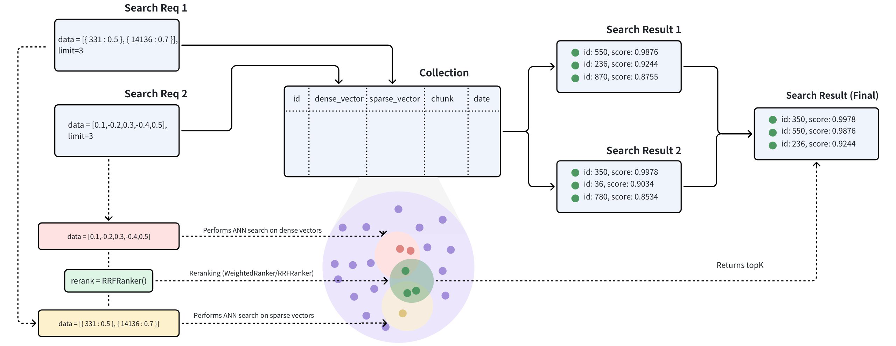

# Multi-Vector Hybrid Search

In many applications, an object can be searched by a rich set of information such as title and description, or with multiple modalities such as text, images, and audio. For example, a tweet with a piece of text and an image shall be searched if either the text or the image matches the semantic of the search query. Hybrid search enhances search experience by combining searches across these diverse fields. Milvus supports this by allowing search on multiple vector fields, conducting several Approximate Nearest Neighbor (ANN) searches simultaneously. Multi-vector hybrid search is particularly useful if you want to search both text and images, multiple text fields that describe the same object, or dense and sparse vectors to improve search quality. 



The multi-vector hybrid search integrates different search methods or spans embeddings from various modalities:

- **Sparse-Dense Vector Search**: [Dense Vector](dense-vector.md) are excellent for capturing semantic relationships, while [Sparse Vector](sparse_vector.md) are highly effective for precise keyword matching. Hybrid search combines these approaches to provide both a broad conceptual understanding and exact term relevance, thus improving search results. By leveraging the strengths of each method, hybrid search overcomes the limitations of indiviual approaches, offering better performance for complex queries. Here is more detailed [guide](full_text_search_with_milvus.md) on hybrid retrieval that combines semantic search with full-text search.

- **Multimodal Vector Search**: Multimodal vector search is a powerful technique that allows you to search across various data types, including text, images, audio, and others. The main advantage of this approach is its ability to unify different modalities into a seamless and cohesive search experience. For instance, in product search, a user might input a text query to find products described with both text and images. By combining these modalities through a hybrid search method, you can enhance search accuracy or enrich the search results.

## Example

Let's consider a real world use case where each product includes a text description and an image. Based on the available data, we can conduct three types of searches:

- **Semantic Text Search:** This involves querying the text description of the product using dense vectors. Text embeddings can be generated using models such as [BERT](https://zilliz.com/learn/explore-colbert-token-level-embedding-and-ranking-model-for-similarity-search?_gl=1*d243m9*_gcl_au*MjcyNTAwMzUyLjE3NDMxMzE1MjY.*_ga*MTQ3OTI4MDc5My4xNzQzMTMxNTI2*_ga_KKMVYG8YF2*MTc0NTkwODU0Mi45NC4xLjE3NDU5MDg4MzcuMC4wLjA.#A-Quick-Recap-of-BERT) and [Transformers](https://zilliz.com/learn/NLP-essentials-understanding-transformers-in-AI?_gl=1*d243m9*_gcl_au*MjcyNTAwMzUyLjE3NDMxMzE1MjY.*_ga*MTQ3OTI4MDc5My4xNzQzMTMxNTI2*_ga_KKMVYG8YF2*MTc0NTkwODU0Mi45NC4xLjE3NDU5MDg4MzcuMC4wLjA.) or services like [OpenAI](https://zilliz.com/learn/guide-to-using-openai-text-embedding-models).

- **Full-Text Search**: Here, we query the text description of the product using a keyword match with sparse vectors. Algorithms like [BM25](https://zilliz.com/learn/mastering-bm25-a-deep-dive-into-the-algorithm-and-application-in-milvus) or sparse embedding models such as [BGE-M3](https://zilliz.com/learn/bge-m3-and-splade-two-machine-learning-models-for-generating-sparse-embeddings?_gl=1*1cde1oq*_gcl_au*MjcyNTAwMzUyLjE3NDMxMzE1MjY.*_ga*MTQ3OTI4MDc5My4xNzQzMTMxNTI2*_ga_KKMVYG8YF2*MTc0NTkwODU0Mi45NC4xLjE3NDU5MDg4MzcuMC4wLjA.#BGE-M3) or [SPLADE](https://zilliz.com/learn/bge-m3-and-splade-two-machine-learning-models-for-generating-sparse-embeddings?_gl=1*ov2die*_gcl_au*MjcyNTAwMzUyLjE3NDMxMzE1MjY.*_ga*MTQ3OTI4MDc5My4xNzQzMTMxNTI2*_ga_KKMVYG8YF2*MTc0NTkwODU0Mi45NC4xLjE3NDU5MDg4MzcuMC4wLjA.#SPLADE) can be utilized for this purpose.

- **Multimodal Image Search:** This method queries over the image using a text query with dense vectors. Image embeddings can be generated with models like [CLIP](https://zilliz.com/learn/exploring-openai-clip-the-future-of-multimodal-ai-learning).

This guide will walk you through an example of a multimodal hybrid search combining the above search methods, given the raw text description and image embeddings of products. We will demonstrate how to store multi-vector data and perform hybrid searches with a reranking strategy.

## Create a collection with multiple vector fields

The process of creating a collection involves three key steps: defining the collection schema, configuring the index parameters, and creating the collection.

### Define schema

For multi-vector hybrid search, we should define multiple vector fields within a collection schema. For details about the limits on the number of vector fields allowed in a collection, see [Zilliz Cloud Limits](https://zilliverse.feishu.cn/wiki/PuxkwMWvbiHxvTkHsVkcMZP9n5f#E5yxdHM16okh57xV3WKcTJsYn0f).  However, if necessary, you can adjust the [`proxy.maxVectorFieldNum`](configure_proxy.md#proxymaxVectorFieldNum) to include up to 10 vector fields in a collection as needed.

This example incorporates the following fields into the schema:

- `id`: Serves as the primary key for storing text IDs. This field is of data type `INT64`.

- `text`: Used for storing textual content. This field is of the data type `VARCHAR` with a maximum length of 1000 bytes. The `enable_analyzer` option is set to `True` to facilitate full-text search.

- `text_dense`: Used to store dense vectors of the texts. This field is of the data type `FLOAT_VECTOR` with a vector dimension of 768.

- `text_sparse`: Used to store sparse vectors of the texts. This field is of the data type `SPARSE_FLOAT_VECTOR`.

- `image_dense`: Used to store dense vectors of the product images. This field is of the data type `FLOAT_VETOR` with a vector dimension of 512.

Since we will use the built-in BM25 algorithm to perform a full-text search on the text field, it is necessary to add the Milvus `Function` to the schema. For further details, please refer to [Full Text Search](full-text-search.md).

<div class="multipleCode">
    <a href="#python">Python</a>
    <a href="#java">Java</a>
    <a href="#go">Go</a>
    <a href="#javascript">NodeJS</a>
    <a href="#bash">cURL</a>
</div>

```python
from pymilvus import (
    MilvusClient, DataType, Function, FunctionType
)

client = MilvusClient(
    uri="http://localhost:19530",
    token="root:Milvus"
)

# Init schema with auto_id disabled
schema = client.create_schema(auto_id=False)

# Add fields to schema
schema.add_field(field_name="id", datatype=DataType.INT64, is_primary=True, description="product id")
schema.add_field(field_name="text", datatype=DataType.VARCHAR, max_length=1000, enable_analyzer=True, description="raw text of product description")
schema.add_field(field_name="text_dense", datatype=DataType.FLOAT_VECTOR, dim=768, description="text dense embedding")
schema.add_field(field_name="text_sparse", datatype=DataType.SPARSE_FLOAT_VECTOR, description="text sparse embedding auto-generated by the built-in BM25 function")
schema.add_field(field_name="image_dense", datatype=DataType.FLOAT_VECTOR, dim=512, description="image dense embedding")

# Add function to schema
bm25_function = Function(
    name="text_bm25_emb",
    input_field_names=["text"],
    output_field_names=["text_sparse"],
    function_type=FunctionType.BM25,
)
schema.add_function(bm25_function)
```

```java
import io.milvus.v2.client.ConnectConfig;
import io.milvus.v2.client.MilvusClientV2;
import io.milvus.v2.common.DataType;
import io.milvus.common.clientenum.FunctionType;
import io.milvus.v2.service.collection.request.AddFieldReq;
import io.milvus.v2.service.collection.request.CreateCollectionReq;
import io.milvus.v2.service.collection.request.CreateCollectionReq.Function;

import java.util.*;

MilvusClientV2 client = new MilvusClientV2(ConnectConfig.builder()
        .uri("http://localhost:19530")
        .token("root:Milvus")
        .build());

CreateCollectionReq.CollectionSchema schema = client.createSchema();

schema.addField(AddFieldReq.builder()
        .fieldName("id")
        .dataType(DataType.Int64)
        .isPrimaryKey(true)
        .autoID(false)
        .build());

schema.addField(AddFieldReq.builder()
        .fieldName("text")
        .dataType(DataType.VarChar)
        .maxLength(1000)
        .enableAnalyzer(true)
        .build());

schema.addField(AddFieldReq.builder()
        .fieldName("text_dense")
        .dataType(DataType.FloatVector)
        .dimension(768)
        .build());

schema.addField(AddFieldReq.builder()
        .fieldName("text_sparse")
        .dataType(DataType.SparseFloatVector)
        .build());

schema.addField(AddFieldReq.builder()
        .fieldName("image_dense")
        .dataType(DataType.FloatVector)
        .dimension(512)
        .build());

schema.addFunction(Function.builder()
        .functionType(FunctionType.BM25)
        .name("text_bm25_emb")
        .inputFieldNames(Collections.singletonList("text"))
        .outputFieldNames(Collections.singletonList("text_sparse"))
        .build());
```

```go
import (
    "context"
    "fmt"

    "github.com/milvus-io/milvus/client/v2/column"
    "github.com/milvus-io/milvus/client/v2/entity"
    "github.com/milvus-io/milvus/client/v2/index"
    "github.com/milvus-io/milvus/client/v2/milvusclient"
)

ctx, cancel := context.WithCancel(context.Background())
defer cancel()

milvusAddr := "localhost:19530"
client, err := milvusclient.New(ctx, &milvusclient.ClientConfig{
    Address: milvusAddr,
})
if err != nil {
    fmt.Println(err.Error())
    // handle error
}
defer client.Close(ctx)

function := entity.NewFunction().
    WithName("text_bm25_emb").
    WithInputFields("text").
    WithOutputFields("text_sparse").
    WithType(entity.FunctionTypeBM25)

schema := entity.NewSchema()

schema.WithField(entity.NewField().
    WithName("id").
    WithDataType(entity.FieldTypeInt64).
    WithIsPrimaryKey(true),
).WithField(entity.NewField().
    WithName("text").
    WithDataType(entity.FieldTypeVarChar).
    WithEnableAnalyzer(true).
    WithMaxLength(1000),
).WithField(entity.NewField().
    WithName("text_dense").
    WithDataType(entity.FieldTypeFloatVector).
    WithDim(768),
).WithField(entity.NewField().
    WithName("text_sparse").
    WithDataType(entity.FieldTypeSparseVector),
).WithField(entity.NewField().
    WithName("image_dense").
    WithDataType(entity.FieldTypeFloatVector).
    WithDim(512),
).WithFunction(function)
```

```javascript
import { MilvusClient, DataType } from "@zilliz/milvus2-sdk-node";

const address = "http://localhost:19530";
const token = "root:Milvus";
const client = new MilvusClient({address, token});

// Define fields
const fields = [
    {
        name: "id",
        data_type: DataType.Int64,
        is_primary_key: true,
        auto_id: false
    },
    {
        name: "text",
        data_type: DataType.VarChar,
        max_length: 1000,
        enable_match: true
    },
    {
        name: "text_dense",
        data_type: DataType.FloatVector,
        dim: 768
    },
    {
        name: "text_sparse",
        data_type: DataType.SPARSE_FLOAT_VECTOR
    },
    {
        name: "image_dense",
        data_type: DataType.FloatVector,
        dim: 512
    }
];

// define function
const functions = [
    {
      name: "text_bm25_emb",
      description: "text bm25 function",
      type: FunctionType.BM25,
      input_field_names: ["text"],
      output_field_names: ["text_sparse"],
      params: {},
    },
];
```

```bash
export bm25Function='{
    "name": "text_bm25_emb",
    "type": "BM25",
    "inputFieldNames": ["text"],
    "outputFieldNames": ["text_sparse"],
    "params": {}
}'

export schema='{
        "autoId": false,
        "functions": [$bm25Function],
        "fields": [
            {
                "fieldName": "id",
                "dataType": "Int64",
                "isPrimary": true
            },
            {
                "fieldName": "text",
                "dataType": "VarChar",
                "elementTypeParams": {
                    "max_length": 1000,
                    "enable_analyzer": true
                }
            },
            {
                "fieldName": "text_dense",
                "dataType": "FloatVector",
                "elementTypeParams": {
                    "dim": "768"
                }
            },
            {
                "fieldName": "text_sparse",
                "dataType": "SparseFloatVector"
            },
            {
                "fieldName": "image_dense",
                "dataType": "FloatVector",
                "elementTypeParams": {
                    "dim": "512"
                }
            }
        ]
    }'
```

### Create index

After defining the collection schema, the next step is to configure the vector indexes and specify the similarity metrics. In the given example:

- `text_dense_index`: an index of type `AUTOINDEX` with `IP` metric type is created for the text dense vector field.

- `text_sparse_index`: an index of type`SPARSE_INVERTED_INDEX`with `BM25` metric type is used for the text sparse vector field.

- `image_dense_index`: an index of type `AUTOINDEX` with `IP` metric type is created for the image dense vector field.

You can choose other index types as necessary to best suit your needs and data types. For further information on the supported index types, please refer to the documentation on [available index types](index-vector-fields.md).

<div class="multipleCode">
    <a href="#python">Python</a>
    <a href="#java">Java</a>
    <a href="#go">Go</a>
    <a href="#javascript">NodeJS</a>
    <a href="#bash">cURL</a>
</div>

```python
# Prepare index parameters
index_params = client.prepare_index_params()

# Add indexes
index_params.add_index(
    field_name="text_dense",
    index_name="text_dense_index",
    index_type="AUTOINDEX",
    metric_type="IP"
)

index_params.add_index(
    field_name="text_sparse",
    index_name="text_sparse_index",
    index_type="SPARSE_INVERTED_INDEX",
    metric_type="BM25",
    params={"inverted_index_algo": "DAAT_MAXSCORE"}, # or "DAAT_WAND" or "TAAT_NAIVE"
)

index_params.add_index(
    field_name="image_dense",
    index_name="image_dense_index",
    index_type="AUTOINDEX",
    metric_type="IP"
)
```

```java
import io.milvus.v2.common.IndexParam;
import java.util.*;

Map<String, Object> denseParams = new HashMap<>();

IndexParam indexParamForTextDense = IndexParam.builder()
        .fieldName("text_dense")
        .indexName("text_dense_index")
        .indexType(IndexParam.IndexType.AUTOINDEX)
        .metricType(IndexParam.MetricType.IP)
        .build();

Map<String, Object> sparseParams = new HashMap<>();
sparseParams.put("inverted_index_algo": "DAAT_MAXSCORE");
IndexParam indexParamForTextSparse = IndexParam.builder()
        .fieldName("text_sparse")
        .indexName("text_sparse_index")
        .indexType(IndexParam.IndexType.SPARSE_INVERTED_INDEX)
        .metricType(IndexParam.MetricType.BM25)
        .extraParams(sparseParams)
        .build();

IndexParam indexParamForImageDense = IndexParam.builder()
        .fieldName("image_dense")
        .indexName("image_dense_index")
        .indexType(IndexParam.IndexType.AUTOINDEX)
        .metricType(IndexParam.MetricType.IP)
        .build();

List<IndexParam> indexParams = new ArrayList<>();
indexParams.add(indexParamForTextDense);
indexParams.add(indexParamForTextSparse);
indexParams.add(indexParamForImageDense);
```

```go
indexOption1 := milvusclient.NewCreateIndexOption("my_collection", "text_dense",
    index.NewAutoIndex(index.MetricType(entity.IP)))
indexOption2 := milvusclient.NewCreateIndexOption("my_collection", "text_sparse",
    index.NewSparseInvertedIndex(entity.BM25, 0.2))
indexOption3 := milvusclient.NewCreateIndexOption("my_collection", "image_dense",
    index.NewAutoIndex(index.MetricType(entity.IP)))
)
```

```javascript
const index_params = [{
    field_name: "text_dense",
    index_name: "text_dense_index",
    index_type: "AUTOINDEX",
    metric_type: "IP"
},{
    field_name: "text_sparse",
    index_name: "text_sparse_index",
    index_type: "IndexType.SPARSE_INVERTED_INDEX",
    metric_type: "BM25",
    params: {
      inverted_index_algo: "DAAT_MAXSCORE", 
    }
},{
    field_name: "image_dense",
    index_name: "image_dense_index",
    index_type: "AUTOINDEX",
    metric_type: "IP"
}]
```

```bash
export indexParams='[
        {
            "fieldName": "text_dense",
            "metricType": "IP",
            "indexName": "text_dense_index",
            "indexType":"AUTOINDEX"
        },
        {
            "fieldName": "text_sparse",
            "metricType": "BM25",
            "indexName": "text_sparse_index",
            "indexType": "SPARSE_INVERTED_INDEX",
            "params":{"inverted_index_algo": "DAAT_MAXSCORE"}
        },
        {
            "fieldName": "image_dense",
            "metricType": "IP",
            "indexName": "image_dense_index",
            "indexType":"AUTOINDEX"
        }
    ]'
```

### Create collection

Create a collection named `demo` with the collection schema and indexes configured in the previous two steps.

<div class="multipleCode">
    <a href="#python">Python</a>
    <a href="#java">Java</a>
    <a href="#go">Go</a>
    <a href="#javascript">NodeJS</a>
    <a href="#bash">cURL</a>
</div>

```python
client.create_collection(
    collection_name="my_collection",
    schema=schema,
    index_params=index_params
)
```

```java
CreateCollectionReq createCollectionReq = CreateCollectionReq.builder()
        .collectionName("my_collection")
        .collectionSchema(schema)
        .indexParams(indexParams)
        .build();
client.createCollection(createCollectionReq);
```

```go
err = client.CreateCollection(ctx,
    milvusclient.NewCreateCollectionOption("my_collection", schema).
        WithIndexOptions(indexOption1, indexOption2))
if err != nil {
    fmt.Println(err.Error())
    // handle error
}
```

```javascript
res = await client.createCollection({
    collection_name: "my_collection",
    fields: fields,
    index_params: index_params,
})
```

```bash
export CLUSTER_ENDPOINT="http://localhost:19530"
export TOKEN="root:Milvus"

curl --request POST \
--url "${CLUSTER_ENDPOINT}/v2/vectordb/collections/create" \
--header "Authorization: Bearer ${TOKEN}" \
--header "Content-Type: application/json" \
-d "{
    \"collectionName\": \"my_collection\",
    \"schema\": $schema,
    \"indexParams\": $indexParams
}"
```

## Insert data

This section inserts data into the `my_collection` collection based on the schema defined earlier. During insert, ensure all fields, except those with auto-generated values, are provided with data in the correct format. In this example:

- `id`: an integer representing the product ID

- `text`: a string containing the product description

- `text_dense`: a list of 768 floating-point values representing the dense embedding of the text description

- `image_dense`: a list of 512 floating-point values representing the dense embedding of the product image

You may use the same or different models to generate dense embeddings for each field. In this example, the two dense embeddings have different dimensions, suggesting they were generated by different models. When defining each search later, be sure to use the corresponding model to generate the appropriate query embedding.

Since this example uses the built-in BM25 function to generate sparse embeddings from the text field, you do not need to supply sparse vectors manually. However, if you opt not to use BM25, you must precompute and provide the sparse embeddings yourself.

<div class="multipleCode">
    <a href="#python">Python</a>
    <a href="#java">Java</a>
    <a href="#go">Go</a>
    <a href="#javascript">NodeJS</a>
    <a href="#bash">cURL</a>
</div>

```python
import random

# Generate example vectors
def generate_dense_vector(dim):
    return [random.random() for _ in range(dim)]

data=[
    {
        "id": 0,
        "text": "Red cotton t-shirt with round neck",
        "text_dense": generate_dense_vector(768),
        "image_dense": generate_dense_vector(512)
    },
    {
        "id": 1,
        "text": "Wireless noise-cancelling over-ear headphones",
        "text_dense": generate_dense_vector(768),
        "image_dense": generate_dense_vector(512)
    },
    {
        "id": 2,
        "text": "Stainless steel water bottle, 500ml",
        "text_dense": generate_dense_vector(768),
        "image_dense": generate_dense_vector(512)
    }
]

res = client.insert(
    collection_name="my_collection",
    data=data
)

```

```java
import com.google.gson.Gson;
import com.google.gson.JsonObject;
import io.milvus.v2.service.vector.request.InsertReq;

Gson gson = new Gson();
JsonObject row1 = new JsonObject();
row1.addProperty("id", 0);
row1.addProperty("text", "Red cotton t-shirt with round neck");
row1.add("text_dense", gson.toJsonTree(text_dense1));
row1.add("image_dense", gson.toJsonTree(image_dense));

JsonObject row2 = new JsonObject();
row2.addProperty("id", 1);
row2.addProperty("text", "Wireless noise-cancelling over-ear headphones");
row2.add("text_dense", gson.toJsonTree(text_dense2));
row2.add("image_dense", gson.toJsonTree(image_dense2));

JsonObject row3 = new JsonObject();
row3.addProperty("id", 2);
row3.addProperty("text", "Stainless steel water bottle, 500ml");
row3.add("text_dense", gson.toJsonTree(dense3));
row3.add("image_dense", gson.toJsonTree(sparse3));

List<JsonObject> data = Arrays.asList(row1, row2, row3);
InsertReq insertReq = InsertReq.builder()
        .collectionName("my_collection")
        .data(data)
        .build();

InsertResp insertResp = client.insert(insertReq);
```

```go
_, err = client.Insert(ctx, milvusclient.NewColumnBasedInsertOption("my_collection").
    WithInt64Column("id", []int64{0, 1, 2}).
    WithVarcharColumn("text", []string{
        "Red cotton t-shirt with round neck",
        "Wireless noise-cancelling over-ear headphones",
        "Stainless steel water bottle, 500ml",
    }).
    WithFloatVectorColumn("text_dense", 768, [][]float32{
        {0.3580376395471989, -0.6023495712049978, 0.18414012509913835, ...},
        {0.19886812562848388, 0.06023560599112088, 0.6976963061752597, ...},
        {0.43742130801983836, -0.5597502546264526, 0.6457887650909682, ...},
    }).
    WithFloatVectorColumn("image_dense", 512, [][]float32{
        {0.6366019600530924, -0.09323198122475052, ...},
        {0.6414180010301553, 0.8976979978567611, ...},
        {-0.6901259768402174, 0.6100500332193755, ...},
    }).
if err != nil {
    fmt.Println(err.Error())
    // handle err
}
```

```javascript
const { MilvusClient, DataType } = require("@zilliz/milvus2-sdk-node")

var data = [
    {id: 0, text: "Red cotton t-shirt with round neck" , text_dense: [0.3580376395471989, -0.6023495712049978, 0.18414012509913835, ...], image_dense: [0.6366019600530924, -0.09323198122475052, ...]},
    {id: 1, text: "Wireless noise-cancelling over-ear headphones" , text_dense: [0.19886812562848388, 0.06023560599112088, 0.6976963061752597, ...], image_dense: [0.6414180010301553, 0.8976979978567611, ...]},
    {id: 2, text: "Stainless steel water bottle, 500ml" , text_dense: [0.43742130801983836, -0.5597502546264526, 0.6457887650909682, ...], image_dense: [-0.6901259768402174, 0.6100500332193755, ...]}
]

var res = await client.insert({
    collection_name: "my_collection",
    data: data,
})
```

```bash
curl --request POST \
--url "${CLUSTER_ENDPOINT}/v2/vectordb/entities/insert" \
--header "Authorization: Bearer ${TOKEN}" \
--header "Content-Type: application/json" \
-d '{
    "data": [
        {"id": 0, "text": "Red cotton t-shirt with round neck" , "text_dense": [0.3580376395471989, -0.6023495712049978, 0.18414012509913835, ...], "image_dense": [0.6366019600530924, -0.09323198122475052, ...]},
        {"id": 1, "text": "Wireless noise-cancelling over-ear headphones" , "text_dense": [0.19886812562848388, 0.06023560599112088, 0.6976963061752597, ...], "image_dense": [0.6414180010301553, 0.8976979978567611, ...]},
        {"id": 2, "text": "Stainless steel water bottle, 500ml" , "text_dense": [0.43742130801983836, -0.5597502546264526, 0.6457887650909682, ...], "image_dense": [-0.6901259768402174, 0.6100500332193755, ...]}
    ],
    "collectionName": "my_collection"
}'
```

## Perform Hybrid Search

### Step 1: Create multiple AnnSearchRequest instances

Hybrid Search is implemented by creating multiple `AnnSearchRequest` in the `hybrid_search()` function, where each `AnnSearchRequest` represents a basic ANN search request for a specific vector field. Therefore, before conducting a Hybrid Search, it is necessary to create an `AnnSearchRequest` for each vector field.

In addition, by configuring the `expr` parameter in an `AnnSearchRequest`, you can set the filtering conditions for your hybrid search. Please refer to [Filtered Search](filtered-search.md) and [Filtering Explained](boolean.md).

<div class="alert note">

In Hybrid Search, each `AnnSearchRequest` supports only one query data.

</div>

To demonstrate the capabilities of various search vector fields, we will construct three `AnnSearchRequest` search requests using a sample query. We will also use its pre-computed dense vectors for this process. The search requests will target the following vector fields:

- `text_dense` for semantic text search, allowing for contextual understanding and retrieval based on meaning rather than direct keyword matching.

- `text_sparse`for full-text search or keyword matching, focusing on exact word or phrase matches within the text.

- `image_dense`for multimodal text-to-image search, to retrieve relevant product images based on the semantic content of the query.

<div class="multipleCode">
    <a href="#python">Python</a>
    <a href="#java">Java</a>
    <a href="#go">Go</a>
    <a href="#javascript">NodeJS</a>
    <a href="#bash">cURL</a>
</div>

```python
from pymilvus import AnnSearchRequest

query_text = "white headphones, quiet and comfortable"
query_dense_vector = generate_dense_vector(768)
query_multimodal_vector = generate_dense_vector(512)

# text semantic search (dense)
search_param_1 = {
    "data": [query_dense_vector],
    "anns_field": "text_dense",
    "param": {"nprobe": 10},
    "limit": 2
}
request_1 = AnnSearchRequest(**search_param_1)

# full-text search (sparse)
search_param_2 = {
    "data": [query_text],
    "anns_field": "text_sparse",
    "limit": 2
}
request_2 = AnnSearchRequest(**search_param_2)

# text-to-image search (multimodal)
search_param_3 = {
    "data": [query_multimodal_vector],
    "anns_field": "image_dense",
    "param": {"nprobe": 10},
    "limit": 2
}
request_3 = AnnSearchRequest(**search_param_3)

reqs = [request_1, request_2, request_3]

```

```java
import io.milvus.v2.service.vector.request.AnnSearchReq;
import io.milvus.v2.service.vector.request.data.BaseVector;
import io.milvus.v2.service.vector.request.data.FloatVec;
import io.milvus.v2.service.vector.request.data.SparseFloatVec;
import io.milvus.v2.service.vector.request.data.EmbeddedText;

float[] queryDense = new float[]{-0.0475336798f,  0.0521207601f,  0.0904406682f, ...};
float[] queryMultimodal = new float[]{0.0158298651f, 0.5264158340f, ...}

List<BaseVector> queryTexts = Collections.singletonList(new EmbeddedText("white headphones, quiet and comfortable");)
List<BaseVector> queryDenseVectors = Collections.singletonList(new FloatVec(queryDense));
List<BaseVector> queryMultimodalVectors = Collections.singletonList(new FloatVec(queryMultimodal));

List<AnnSearchReq> searchRequests = new ArrayList<>();
searchRequests.add(AnnSearchReq.builder()
        .vectorFieldName("text_dense")
        .vectors(queryDenseVectors)
        .params("{\"nprobe\": 10}")
        .topK(2)
        .build());
searchRequests.add(AnnSearchReq.builder()
        .vectorFieldName("text_sparse")
        .vectors(queryTexts)
        .topK(2)
        .build());
searchRequests.add(AnnSearchReq.builder()
        .vectorFieldName("image_dense")
        .vectors(queryMultimodalVectors)
        .params("{\"nprobe\": 10}")
        .topK(2)
        .build());
```

```go
queryText := entity.Text({"white headphones, quiet and comfortable"})
queryVector := []float32{0.3580376395471989, -0.6023495712049978, 0.18414012509913835, ...}
queryMultimodalVector := []float32{0.015829865178701663, 0.5264158340734488, ...}

request1 := milvusclient.NewAnnRequest("text_dense", 2, entity.FloatVector(queryVector)).
    WithAnnParam(index.NewIvfAnnParam(10))

annParam := index.NewSparseAnnParam()
annParam.WithDropRatio(0.2)
request2 := milvusclient.NewAnnRequest("text_sparse", 2, queryText).
    WithAnnParam(annParam)

request3 := milvusclient.NewAnnRequest("image_dense", 2, entity.FloatVector(queryMultimodalVector)).
    WithAnnParam(index.NewIvfAnnParam(10))
```

```javascript
const query_text = "white headphones, quiet and comfortable"
const query_vector = [0.3580376395471989, -0.6023495712049978, 0.18414012509913835, ...]
const query_multimodal_vector = [0.015829865178701663, 0.5264158340734488, ...]

const search_param_1 = {
    "data": query_vector, 
    "anns_field": "text_dense", 
    "param": {"nprobe": 10},
    "limit": 2
}

const search_param_2 = {
    "data": query_text, 
    "anns_field": "text_sparse", 
    "limit": 2
}

const search_param_3 = {
    "data": query_multimodal_vector, 
    "anns_field": "image_dense", 
    "param": {"nprobe": 10},
    "limit": 2
}
```

```bash
export req='[
    {
        "data": [[0.3580376395471989, -0.6023495712049978, 0.18414012509913835, ...]],
        "annsField": "text_dense",
        "params": {"nprobe": 10},
        "limit": 2
    },
    {
        "data": ["white headphones, quiet and comfortable"],
        "annsField": "text_sparse",
        "limit": 2
    },
    {
        "data": [[0.015829865178701663, 0.5264158340734488, ...]],
        "annsField": "image_dense",
        "params": {"nprobe": 10},
        "limit": 2
    }
 ]'
```

Given that the parameter `limit` is set to 2, each `AnnSearchRequest` returns 2 search results. In this example, 3 `AnnSearchRequest` instances are created, resulting in a total of 6 search results.

### Step 2: Configure a reranking strategy

To merge and rerank the sets of ANN search results, selecting an appropriate reranking strategy is essential. Milvus offers several types of reranking strategies. For more details on these reranking mechanisms, please refer to [Weighted Ranker](weighted-ranker.md) or [RRF Ranker](rrf-ranker.md). 

In this example, since there is no particular emphasis on specific search queries, we will proceed with the RRFRanker strategy.

<div class="multipleCode">
    <a href="#python">Python</a>
    <a href="#java">Java</a>
    <a href="#javascript">NodeJS</a>
    <a href="#go">Go</a>
    <a href="#bash">cURL</a>
</div>

```python
ranker = Function(
    name="rrf",
    input_field_names=[], # Must be an empty list
    function_type=FunctionType.RERANK,
    params={
        "reranker": "rrf", 
        "k": 100  # Optional
    }
)
```

```java
import io.milvus.common.clientenum.FunctionType;
import io.milvus.v2.service.collection.request.CreateCollectionReq.Function;

Function ranker = Function.builder()
        .name("rrf")
        .functionType(FunctionType.RERANK)
        .param("reranker", "rrf")
        .param("k", "100")
        .build()
```

```javascript
const rerank = {
  name: 'rrf',
  description: 'bm25 function',
  type: FunctionType.RERANK,
  input_field_names: [],
  params: {
      "reranker": "rrf", 
      "k": 100
  },
};
```

```go
import (
    "github.com/milvus-io/milvus/client/v2/entity"
)

ranker := entity.NewFunction().
    WithName("rrf").
    WithType(entity.FunctionTypeRerank).
    WithParam("reranker", "rrf").
    WithParam("k", "100")
```

```bash
# Restful
export functionScore='{
    "functions": [
        {
            "name": "rrf",
            "type": "Rerank",
            "inputFieldNames": [],
            "params": {
                "reranker": "rrf",
                "k": 100
            }
        }
    ]
}'

```

### Step 3: Perform a Hybrid Search

Before initiating a Hybrid Search, ensure that the collection is loaded. If any vector fields within the collection lack an index or are not loaded into memory, an error will occur upon executing the Hybrid Search method.

<div class="multipleCode">
    <a href="#python">Python</a>
    <a href="#java">Java</a>
    <a href="#go">Go</a>
    <a href="#javascript">NodeJS</a>
    <a href="#bash">cURL</a>
</div>

```python
res = client.hybrid_search(
    collection_name="my_collection",
    reqs=reqs,
    ranker=ranker,
    limit=2
)
for hits in res:
    print("TopK results:")
    for hit in hits:
        print(hit)
```

```java
import io.milvus.v2.common.ConsistencyLevel;
import io.milvus.v2.service.vector.request.HybridSearchReq;
import io.milvus.v2.service.vector.response.SearchResp;

HybridSearchReq hybridSearchReq = HybridSearchReq.builder()
        .collectionName("my_collection")
        .searchRequests(searchRequests)
        .ranker(reranker)
        .topK(2)
        .build();

SearchResp searchResp = client.hybridSearch(hybridSearchReq);
```

```go
resultSets, err := client.HybridSearch(ctx, milvusclient.NewHybridSearchOption(
    "my_collection",
    2,
    request1,
    request2,
    request3,
).WithReranker(reranker))
if err != nil {
    fmt.Println(err.Error())
    // handle error
}

for _, resultSet := range resultSets {
    fmt.Println("IDs: ", resultSet.IDs.FieldData().GetScalars())
    fmt.Println("Scores: ", resultSet.Scores)
}
```

```javascript
const { MilvusClient, DataType } = require("@zilliz/milvus2-sdk-node")

res = await client.loadCollection({
    collection_name: "my_collection"
})

import { MilvusClient, RRFRanker, WeightedRanker } from '@zilliz/milvus2-sdk-node';

const search = await client.search({
  collection_name: "my_collection",
  data: [search_param_1, search_param_2, search_param_3],
  limit: 2,
  rerank: rerank
});
```

```bash
curl --request POST \
--url "${CLUSTER_ENDPOINT}/v2/vectordb/entities/hybrid_search" \
--header "Authorization: Bearer ${TOKEN}" \
--header "Content-Type: application/json" \
-d "{
    \"collectionName\": \"my_collection\",
    \"search\": ${req},
    \"rerank\": {
        \"strategy\":\"rrf\",
        \"params\": ${rerank}
    },
    \"limit\": 2
}"
```

The following is the output:

```python
["['id: 1, distance: 0.006047376897186041, entity: {}', 'id: 2, distance: 0.006422005593776703, entity: {}']"]
```

With the `limit=2` parameter specified for the Hybrid Search, Milvus will rerank the six results obtained from the three searches. Ultimately, they will return only the top two most similar results.

## Advanced usage

### Temporarily set a timezone for a hybrid search

If your collection has a `TIMESTAMPTZ` field, you can temporarily override the database or collection default timezone for a single operation by setting the `timezone` parameter in the hybrid search call. This controls how `TIMESTAMPTZ` values are displayed and compared during the operation.

The value of `timezone` must be a valid [IANA time zone identifier](https://en.wikipedia.org/wiki/List_of_tz_database_time_zones) (for example, **Asia/Shanghai**, **America/Chicago**, or **UTC**). For details on how to use a `TIMESTAMPTZ` field, refer to [TIMESTAMPTZ Field](timestamptz-field.md).

The example below shows how to temporarily set a timezone for a hybrid search operation:

```python
res = client.hybrid_search(
    collection_name="my_collection",
    reqs=reqs,
    ranker=ranker,
    limit=2,
    # highlight-next-line
    timezone="America/Havana",
)
```

