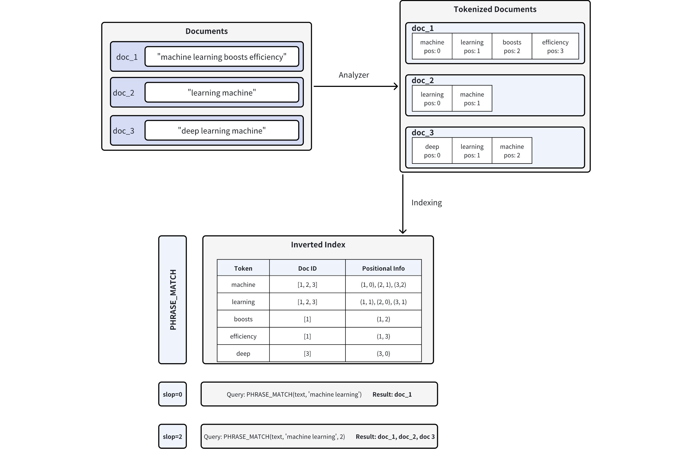

# Phrase Match

Phrase match lets you search for documents containing your query terms as an exact phrase. By default, the words must appear in the same order and directly adjacent to one another. For example, a query for **"robotics machine learning"** matches text like *"…typical robotics machine learning models…"*, where the words **"robotics"**, **"machine"**, and **"learning"** appear in sequence with no other words between them.

However, in real-world scenarios, strict phrase matching can be too rigid. You might want to match text like *"…machine learning models widely adopted in robotics…"*. Here, the same keywords are present but not side-by-side or in the original order. To handle this, phrase match supports a `slop` parameter, which introduces flexibility. The `slop` value defines how many positional shifts are allowed between the terms in the phrase. For example, with a `slop` of 1, a query for **"machine learning"** can match text like *"...machine deep learning..."*, where one word (**"deep"**) separates the original terms.

## Overview

Powered by the [Tantivy](https://github.com/quickwit-oss/tantivy) search engine library, phrase match works by analyzing the positional information of words within documents. The diagram below illustrates the process:



1. **Document Tokenization**: When you insert documents into Milvus, the text is split into tokens (individual words or terms) using an analyzer, with positional information recorded for each token. For example, **doc_1** is tokenized into **["machine" (pos=0), "learning" (pos=1), "boosts" (pos=2), "efficiency" (pos=3)]**. For more information on analyzers, refer to [Analyzer Overview](analyzer-overview.md).

1. **Inverted Index Creation**: Milvus builds an inverted index, mapping each token to the document(s) in which it appears and the token's positions in those documents.

1. **Phrase Matching**: When a phrase query is executed, Milvus looks up each token in the inverted index and checks their positions to determine if they appear in the correct order and proximity. The `slop` parameter controls the maximum number of positions allowed between matching tokens:

    - **slop = 0** means the tokens must appear **in the exact order and immediately adjacent** (i.e., no extra words in between).

        - In the example, only **doc_1** (**"machine"** at **pos=0**, **"learning"** at **pos=1**) matches exactly.

    - **slop = 2** allows up to two positions of flexibility or rearrangements between matching tokens.

        - This allows reversed order (**"learning machine"**) or a small gap between the tokens.

        - Consequently, **doc_1**, **doc_2** (**"learning"** at **pos=0**, **"machine"** at **pos=1**), and **doc_3** (**"learning"** at **pos=1**, **"machine"** at **pos=2**) all match.

## Enable phrase match

Phrase match works with the `VARCHAR` field type, the string data type in Milvus. To enable phrase matching, configure your collection schema by setting both `enable_analyzer` and `enable_match` parameters to `True`, similar to [text match](keyword-match.md).

### Set `enable_analyzer` and `enable_match`

To enable phrase match for a specific `VARCHAR` field, set both `enable_analyzer` and `enable_match` parameters to `True` when defining the field schema. This configuration instructs Milvus to tokenize the text and create an inverted index with positional information required for efficient phrase matching.

Here's an example schema definition to enable phrase match:

```python
from pymilvus import MilvusClient, DataType

# Create a schema for a new collection
schema = MilvusClient.create_schema(enable_dynamic_field=False)
schema.add_field(
    field_name="id",
    datatype=DataType.INT64,
    is_primary=True,
    auto_id=True
)
# Add a VARCHAR field configured for phrase matching
schema.add_field(
    field_name='text',                 # Name of the field
    datatype=DataType.VARCHAR,         # Field data type set as VARCHAR (string)
    max_length=1000,                   # Maximum length of the string
    enable_analyzer=True,              # Enables text analysis (tokenization)
    enable_match=True                  # Enables inverted indexing for phrase matching
)
schema.add_field(
    field_name="embeddings",
    datatype=DataType.FLOAT_VECTOR,
    dim=5
)
```

### Optional: Configure an analyzer

Phrase matching accuracy depends significantly on the analyzer used to tokenize your text data. Different analyzers suit different languages and text formats, affecting tokenization and positional accuracy. Selecting an appropriate analyzer for your specific use case will optimize your phrase matching results.

By default, Milvus uses the standard analyzer, which tokenizes text based on whitespace and punctuation, removes tokens longer than 40 characters, and converts text to lowercase. No additional parameters are required for default usage. Refer to [Standard Analyzer](standard-analyzer.md) for details.

If your application requires a specific analyzer, configure it using the `analyzer_params` parameter. For example, here's how to configure the `english` analyzer for phrase matching in English text:

```python
# Define analyzer parameters for English-language tokenization
analyzer_params = {
    "type": "english"
}

# Add the VARCHAR field with the English analyzer enabled
schema.add_field(
    field_name='text',                 # Name of the field
    datatype=DataType.VARCHAR,         # Field data type set as VARCHAR
    max_length=1000,                   # Maximum length of the string
    enable_analyzer=True,              # Enables text analysis
    analyzer_params=analyzer_params,   # Specifies the analyzer configuration
    enable_match=True                  # Enables inverted indexing for phrase matching
)
```

Milvus supports several analyzers tailored for different languages and use cases. For detailed information, refer to [Analyzer Overview](analyzer-overview.md).

## Use phrase match

Once you've enabled match for a `VARCHAR` field in your collection schema, you can perform phrase matches using the `PHRASE_MATCH` expression.

<div class="alert note">

The `PHRASE_MATCH` expression is case-insensitive. You can use either `PHRASE_MATCH` or `phrase_match`.

</div>

### PHRASE_MATCH expression syntax

Use the `PHRASE_MATCH` expression to specify the field, phrase, and optional flexibility (`slop`) when searching. The syntax is:

```python
PHRASE_MATCH(field_name, phrase, slop)
```

- `field_name`**:** The name of the `VARCHAR` field on which you perform phrase matches.

- `phrase`**:** The exact phrase to search for.

- `slop` (optional)**:** An integer specifying the maximum number of positions allowed in matching tokens.

    - `0` (default): Matches exact phrases only. Example: A filter for **"machine learning"** will match **"machine learning"** exactly, but not **"machine boosts learning"** or **"learning machine"**.

    - `1`: Allows minor variation, such as one extra term or minor shift in position. Example: A filter for **"machine learning"** will match **"machine boosts learning"** (one token between **"machine"** and **"learning"**) but not **"learning machine"** (terms reversed).

    - `2`: Allows more flexibility, including reversed term order or up to two tokens in between. Example: A filter for **"machine learning"** will match **"learning machine"** (terms reversed) or **"machine quickly boosts learning"** (two tokens between **"machine"** and **"learning"**).

### Example dataset

Suppose you have a collection named **tech_articles** containing the following five entities:

<table>
   <tr>
     <th><p><code>doc_id</code></p></th>
     <th><p><code>text</code></p></th>
   </tr>
   <tr>
     <td><p>1</p></td>
     <td><p>"Machine learning boosts efficiency in large-scale data analysis"</p></td>
   </tr>
   <tr>
     <td><p>2</p></td>
     <td><p>"Learning a machine-based approach is vital for modern AI progress"</p></td>
   </tr>
   <tr>
     <td><p>3</p></td>
     <td><p>"Deep learning machine architectures optimize computational loads"</p></td>
   </tr>
   <tr>
     <td><p>4</p></td>
     <td><p>"Machine swiftly improves model performance for ongoing learning"</p></td>
   </tr>
   <tr>
     <td><p>5</p></td>
     <td><p>"Learning advanced machine algorithms expands AI capabilities"</p></td>
   </tr>
</table>

### Query with phrase match

When using the `query()` method, **PHRASE_MATCH** acts as a scalar filter. Only documents that contain the specified phrase (subject to the allowed slop) are returned.

#### Example: slop = 0 (exact match)

This example returns documents containing the exact phrase **"machine learning"** without any extra tokens in between.

```python
# Match documents containing exactly "machine learning"
filter = "PHRASE_MATCH(text, 'machine learning')"

result = client.query(
    collection_name="tech_articles",
    filter=filter,
    output_fields=["id", "text"]
)
```

**Expected match results:**

<table>
   <tr>
     <th><p><code>doc_id</code></p></th>
     <th><p><code>text</code></p></th>
   </tr>
   <tr>
     <td><p>1</p></td>
     <td><p>"Machine learning boosts efficiency in large-scale data analysis"</p></td>
   </tr>
</table>

Only document 1 contains the exact phrase **"machine learning"** in the specified order with no additional tokens.

### Search with phrase match

In search operations, **PHRASE_MATCH** is used to filter documents before applying vector similarity ranking. This two-step approach first narrows the candidate set by textual matching and then re-ranks those candidates based on vector embeddings.

#### Example: slop = 1

Here, we allow a slop of 1. The filter is applied to documents that contain the phrase **"learning machine"** with slight flexibility.

```python
# Example: Filter documents containing "learning machine" with slop=1
filter_slop1 = "PHRASE_MATCH(text, 'learning machine', 1)"

result_slop1 = client.search(
    collection_name="tech_articles",
    anns_field="embeddings",
    data=[query_vector],
    filter=filter_slop1,
    search_params={"params": {"nprobe": 10}},
    limit=10,
    output_fields=["id", "text"]
)
```

**Match results:**

<table>
   <tr>
     <th><p><code>doc_id</code></p></th>
     <th><p><code>text</code></p></th>
   </tr>
   <tr>
     <td><p>2</p></td>
     <td><p>"Learning a machine-based approach is vital for modern AI progress"</p></td>
   </tr>
   <tr>
     <td><p>3</p></td>
     <td><p>"Deep learning machine architectures optimize computational loads"</p></td>
   </tr>
   <tr>
     <td><p>5</p></td>
     <td><p>"Learning advanced machine algorithms expands AI capabilities"</p></td>
   </tr>
</table>

#### Example: slop = 2

This example allows a slop of 2, meaning that up to two extra tokens (or reversed terms) are allowed between the words **"machine"** and **"learning"**.

```python
# Example: Filter documents containing "machine learning" with slop=2
filter_slop2 = "PHRASE_MATCH(text, 'machine learning', 2)"

result_slop2 = client.search(
    collection_name="tech_articles",
    anns_field="embeddings",             # Vector field name
    data=[query_vector],                 # Query vector
    filter=filter_slop2,                 # Filter expression
    search_params={"params": {"nprobe": 10}},
    limit=10,                            # Maximum results to return
    output_fields=["id", "text"]
)
```

**Match results:**

<table>
   <tr>
     <th><p><code>doc_id</code></p></th>
     <th><p><code>text</code></p></th>
   </tr>
   <tr>
     <td><p>1</p></td>
     <td><p>"Machine learning boosts efficiency in large-scale data analysis"</p></td>
   </tr>
   <tr>
     <td><p>3</p></td>
     <td><p>"Deep learning machine architectures optimize computational loads"</p></td>
   </tr>
</table>

#### Example: slop = 3

In this example, a slop of 3 provides even more flexibility. The filter searches for **"machine learning"** with up to three token positions allowed between the words.

```python
# Example: Filter documents containing "machine learning" with slop=3
filter_slop3 = "PHRASE_MATCH(text, 'machine learning', 3)"

result_slop2 = client.search(
    collection_name="tech_articles",
    anns_field="embeddings",             # Vector field name
    data=[query_vector],                 # Query vector
    filter=filter_slop3,                 # Filter expression
    search_params={"params": {"nprobe": 10}},
    limit=10,                            # Maximum results to return
    output_fields=["id", "text"]
)
```

**Match results:**

<table>
   <tr>
     <th><p><code>doc_id</code></p></th>
     <th><p><code>text</code></p></th>
   </tr>
   <tr>
     <td><p>1</p></td>
     <td><p>"Machine learning boosts efficiency in large-scale data analysis"</p></td>
   </tr>
   <tr>
     <td><p>2</p></td>
     <td><p>"Learning a machine-based approach is vital for modern AI progress"</p></td>
   </tr>
   <tr>
     <td><p>3</p></td>
     <td><p>"Deep learning machine architectures optimize computational loads"</p></td>
   </tr>
   <tr>
     <td><p>5</p></td>
     <td><p>"Learning advanced machine algorithms expands AI capabilities"</p></td>
   </tr>
</table>

## Considerations

- Enabling phrase matching for a field triggers the creation of an inverted index, which consumes storage resources. Consider storage impact when deciding to enable this feature, as it varies based on text size, unique tokens, and the analyzer used.

- Once you've defined an analyzer in your schema, its settings become permanent for that collection. If you decide that a different analyzer would better suit your needs, you may consider dropping the existing collection and creating a new one with the desired analyzer configuration.

- Phrase match performance depends on how text is tokenized. Before applying an analyzer to your entire collection, use the `run_analyzer` method to review the tokenization output. For more information, refer to [Analyzer Overview](analyzer-overview.md#share-DYZvdQ2vUowWEwx1MEHcdjNNnqT).

- Escape rules in `filter` expressions:

    - Characters enclosed in double quotes or single quotes within expressions are interpreted as string constants. If the string constant includes escape characters, the escape characters must be represented with escape sequence. For example, use `\\` to represent `\`, `\\t` to represent a tab `\t`, and `\\n` to represent a newline.

    - If a string constant is enclosed by single quotes, a single quote within the constant should be represented as `\\'` while a double quote can be represented as either `"` or `\\"`. Example: `'It\\'s milvus'`.

    - If a string constant is enclosed by double quotes, a double quote within the constant should be represented as `\\"` while a single quote can be represented as either `'` or `\\'`. Example: `"He said \\"Hi\\""`.

