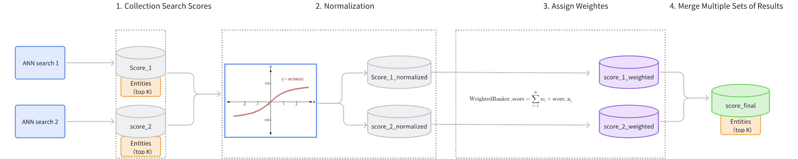
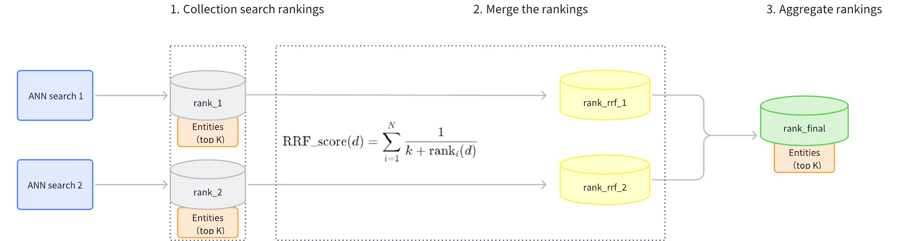

# Reranking

Hybrid Search achieves more precise search results through multiple simultaneous ANN searches. Multiple searches return several sets of results, which require a reranking strategy to help merge and reorder the results and return a single set of results. This guide will introduce the reranking strategies supported by Milvus and provide tips for selecting the appropriate reranking strategy.

## Overview

The following diagram shows the main workflow of conducting a Hybrid Search in a multi-modal search application . In the diagram, one path is basic ANN search on texts and the other path is basic ANN search on images. Each path generates a set of results based on the text and image similarity score respectively (**Limit 1** and **Limit 2**). Then a reranking strategy is applied to rerank two sets of results based on a unified standard, ultimately merging the two sets of results into a final set of search results, **Limit(final)**.


In Hybrid Search, reranking is a crucial step that integrates the results from multiple vector searches to ensure the final output is the most relevant and accurate. Currently, Milvus supports the following two reranking strategies:

- **[WeightedRanker](reranking.md#WeightedRanker)**: This strategy merges results by calculating a weighted score of scores (or distances) from different vector searches. Weights are assigned based on the importance of each vector field, allowing for customization according to specific use-case priorities.

- **[RRFRanker](reranking.md#RRFRanker) (Reciprocal Rank Fusion Ranker)**: This strategy combines results based on ranking. It uses a method that balances the ranks of results from different searches, often leading to a more fair and effective integration of diverse data types or modalities.

## WeightedRanker

The WeightedRanker strategy allocates different weights to the results of each path of vector search based on their importance. 

### Mechanism of WeightedRanker

The main workflow of the WeightedRanker strategy is as follows:

1. **Collect Search Scores**: Gather the results and scores from each path of vector search (score_1, score_2).

1. **Score Normalization**: Each search may use different similarity metrics, resulting in varied score distributions. For instance, using Inner Product (IP) as a similarity type could result in scores ranging from [−∞,+∞], while using Euclidean distance (L2) results in scores ranging from [0,+∞]. Because the score ranges from different searches vary and cannot be directly compared, it is necessary to normalize the scores from each path of search. Typically, `arctan` function is applied to transform the scores into a range between [0, 1] (score_1_normalized, score_2_normalized). Scores closer to 1 indicate higher similarity.

1. **Assign Weights**: Based on the importance assigned to different vector fields, weights (**wi**) are allocated to the normalized scores (score_1_normalized, score_2_normalized). The weights of each path should range between [0,1]. The resulting weighted scores are score_1_weighted and score_2_weighted.

1. **Merge Scores**: The weighted scores (score_1_weighted, score_2_weighted) are ranked from highest to lowest to produce a final set of scores (score_final).



### Example of WeightedRanker

This example demonstrates a multimodal Hybrid Search (topK=5) involving images and text and illustrates how the WeightedRanker strategy reranks the results from two ANN searches.

- Results of ANN search on images （topK=5)：

<table>
   <tr>
     <th><p><strong>ID</strong></p></th>
     <th><p><strong>Score (image)</strong></p></th>
   </tr>
   <tr>
     <td><p>101</p></td>
     <td><p>0.92</p></td>
   </tr>
   <tr>
     <td><p>203</p></td>
     <td><p>0.88</p></td>
   </tr>
   <tr>
     <td><p>150</p></td>
     <td><p>0.85</p></td>
   </tr>
   <tr>
     <td><p>198</p></td>
     <td><p>0.83</p></td>
   </tr>
   <tr>
     <td><p>175</p></td>
     <td><p>0.8</p></td>
   </tr>
</table>

- Results of ANN search on texts （topK=5)：

<table>
   <tr>
     <th><p><strong>ID</strong></p></th>
     <th><p><strong>Score (text)</strong></p></th>
   </tr>
   <tr>
     <td><p>198</p></td>
     <td><p>0.91</p></td>
   </tr>
   <tr>
     <td><p>101</p></td>
     <td><p>0.87</p></td>
   </tr>
   <tr>
     <td><p>110</p></td>
     <td><p>0.85</p></td>
   </tr>
   <tr>
     <td><p>175</p></td>
     <td><p>0.82</p></td>
   </tr>
   <tr>
     <td><p>250</p></td>
     <td><p>0.78</p></td>
   </tr>
</table>

- Use WeightedRanker assign weights to image and text search results. Suppose the weight for the image ANN search is 0.6 and the weight for the text search is 0.4.

<table>
   <tr>
     <th><p><strong>ID</strong></p></th>
     <th><p><strong>Score (image)</strong></p></th>
     <th><p><strong>Score (text)</strong></p></th>
     <th><p><strong>Weighted Score</strong></p></th>
   </tr>
   <tr>
     <td><p>101</p></td>
     <td><p>0.92</p></td>
     <td><p>0.87</p></td>
     <td><p>0.6×0.92+0.4×0.87=0.90</p></td>
   </tr>
   <tr>
     <td><p>203</p></td>
     <td><p>0.88</p></td>
     <td><p>N/A</p></td>
     <td><p>0.6×0.88+0.4×0=0.528</p></td>
   </tr>
   <tr>
     <td><p>150</p></td>
     <td><p>0.85</p></td>
     <td><p>N/A</p></td>
     <td><p>0.6×0.85+0.4×0=0.51</p></td>
   </tr>
   <tr>
     <td><p>198</p></td>
     <td><p>0.83</p></td>
     <td><p>0.91</p></td>
     <td><p>0.6×0.83+0.4×0.91=0.86</p></td>
   </tr>
   <tr>
     <td><p>175</p></td>
     <td><p>0.80</p></td>
     <td><p>0.82</p></td>
     <td><p>0.6×0.80+0.4×0.82=0.81</p></td>
   </tr>
   <tr>
     <td><p>110</p></td>
     <td><p>Not in Image</p></td>
     <td><p>0.85</p></td>
     <td><p>0.6×0+0.4×0.85=0.34</p></td>
   </tr>
   <tr>
     <td><p>250</p></td>
     <td><p>Not in Image</p></td>
     <td><p>0.78</p></td>
     <td><p>0.6×0+0.4×0.78=0.312</p></td>
   </tr>
</table>

- The final results after reranking（topK=5)：

<table>
   <tr>
     <th><p><strong>Rank</strong></p></th>
     <th><p><strong>ID</strong></p></th>
     <th><p><strong>Final Score</strong></p></th>
   </tr>
   <tr>
     <td><p>1</p></td>
     <td><p>101</p></td>
     <td><p>0.90</p></td>
   </tr>
   <tr>
     <td><p>2</p></td>
     <td><p>198</p></td>
     <td><p>0.86</p></td>
   </tr>
   <tr>
     <td><p>3</p></td>
     <td><p>175</p></td>
     <td><p>0.81</p></td>
   </tr>
   <tr>
     <td><p>4</p></td>
     <td><p>203</p></td>
     <td><p>0.528</p></td>
   </tr>
   <tr>
     <td><p>5</p></td>
     <td><p>150</p></td>
     <td><p>0.51</p></td>
   </tr>
</table>

### Usage of WeightedRanker

When using the WeightedRanker strategy, it is necessary to input weight values. The number of weight values to input should correspond to the number of basic ANN search requests in the Hybrid Search. The input weight values should fall in the range of [0,1], with values closer to 1 indicating greater importance.

For example, suppose there are two basic ANN search requests in a Hybrid Search: text search and image search. If the text search is considered more important, it should be assigned a greater weight.

<div class="multipleCode">
    <a href="#python">Python</a>
    <a href="#java">Java</a>
    <a href="#go">Go</a>
    <a href="#javascript">NodeJS</a>
    <a href="#bash">cURL</a>
</div>

```python
from pymilvus import WeightedRanker

rerank= WeightedRanker(0.8, 0.3) 
```

```java
import io.milvus.v2.service.vector.request.ranker.WeightedRanker;

WeightedRanker rerank = new WeightedRanker(Arrays.asList(0.8f, 0.3f))
```

```go
import "github.com/milvus-io/milvus/client/v2/milvusclient"

reranker := milvusclient.NewWeightedReranker([]float64{0.8, 0.3})
```

```javascript
rerank: WeightedRanker(0.8, 0.3)
```

```bash
export rerank='{
        "strategy": "ws",
        "params": {"weights": [0.8,0.3]}
    }'
```

## RRFRanker

Reciprocal Rank Fusion (RRF) is a data fusion method that combines ranked lists based on the reciprocal of their rankings. This reranking strategy effectively balances the importance of each path of vector search.

### Mechanism of RRFRanker

The main workflow of the RRFRanker strategy is as follows:

1. **Collect Search Rankings**: Collect the rankings of results from each path of vector search (rank_1, rank_2).

1. **Merge Rankings**: Convert the rankings from each path (rank_rrf_1, rank_rrf_2) according to a formula .

    The calculation formula involves *N*, which represents the number of retrievals. *ranki*(*d*) is the ranking position of document *d*  generated by the *i(th)* retriever. *k* is a smoothing parameter typically set at 60.

1. **Aggregate Rankings**: Re-rank the search results based on the combined rankings to produce the final results.



### Example of RRFRanker

This example demonstrates a Hybrid Search (topK=5) on sparse-dense vectors and illustrates how the RRFRanker strategy reranks the results from two ANN searches.

- Results of ANN search on sparse vectors of texts （topK=5)：

<table>
   <tr>
     <th><p><strong>ID</strong></p></th>
     <th><p><strong>Rank (sparse)</strong></p></th>
   </tr>
   <tr>
     <td><p>101</p></td>
     <td><p>1</p></td>
   </tr>
   <tr>
     <td><p>203</p></td>
     <td><p>2</p></td>
   </tr>
   <tr>
     <td><p>150</p></td>
     <td><p>3</p></td>
   </tr>
   <tr>
     <td><p>198</p></td>
     <td><p>4</p></td>
   </tr>
   <tr>
     <td><p>175</p></td>
     <td><p>5</p></td>
   </tr>
</table>

- Results of ANN search on dense vectors of texts （topK=5)：

<table>
   <tr>
     <th><p><strong>ID</strong></p></th>
     <th><p><strong>Rank (dense)</strong></p></th>
   </tr>
   <tr>
     <td><p>198</p></td>
     <td><p>1</p></td>
   </tr>
   <tr>
     <td><p>101</p></td>
     <td><p>2</p></td>
   </tr>
   <tr>
     <td><p>110</p></td>
     <td><p>3</p></td>
   </tr>
   <tr>
     <td><p>175</p></td>
     <td><p>4</p></td>
   </tr>
   <tr>
     <td><p>250</p></td>
     <td><p>5</p></td>
   </tr>
</table>

- Use RRF to rearrange the rankings of the two sets of search results. Assume that the smoothing parameter `k` is set at 60.

<table>
   <tr>
     <th><p><strong>ID</strong></p></th>
     <th><p><strong>Score (Sparse)</strong></p></th>
     <th><p><strong>Score (Dense)</strong></p></th>
     <th><p><strong>Final Score</strong></p></th>
   </tr>
   <tr>
     <td><p>101</p></td>
     <td><p>1</p></td>
     <td><p>2</p></td>
     <td><p>1/(60+1)+1/(60+2) = 0.01639</p></td>
   </tr>
   <tr>
     <td><p>198</p></td>
     <td><p>4</p></td>
     <td><p>1</p></td>
     <td><p>1/(60+4)+1/(60+1) = 0.01593</p></td>
   </tr>
   <tr>
     <td><p>175</p></td>
     <td><p>5</p></td>
     <td><p>4</p></td>
     <td><p>1/(60+5)+1/(60+4) = 0.01554</p></td>
   </tr>
   <tr>
     <td><p>203</p></td>
     <td><p>2</p></td>
     <td><p>N/A</p></td>
     <td><p>1/(60+2) = 0.01613</p></td>
   </tr>
   <tr>
     <td><p>150</p></td>
     <td><p>3</p></td>
     <td><p>N/A</p></td>
     <td><p>1/(60+3) = 0.01587</p></td>
   </tr>
   <tr>
     <td><p>110</p></td>
     <td><p>N/A</p></td>
     <td><p>3</p></td>
     <td><p>1/(60+3) = 0.01587</p></td>
   </tr>
   <tr>
     <td><p>250</p></td>
     <td><p>N/A</p></td>
     <td><p>5</p></td>
     <td><p>1/(60+5) = 0.01554</p></td>
   </tr>
</table>

- The final results after reranking（topK=5)：

<table>
   <tr>
     <th><p><strong>Rank</strong></p></th>
     <th><p><strong>ID</strong></p></th>
     <th><p><strong>Final Score</strong></p></th>
   </tr>
   <tr>
     <td><p>1</p></td>
     <td><p>101</p></td>
     <td><p>0.01639</p></td>
   </tr>
   <tr>
     <td><p>2</p></td>
     <td><p>203</p></td>
     <td><p>0.01613</p></td>
   </tr>
   <tr>
     <td><p>3</p></td>
     <td><p>198</p></td>
     <td><p>0.01593</p></td>
   </tr>
   <tr>
     <td><p>4</p></td>
     <td><p>150</p></td>
     <td><p>0.01587</p></td>
   </tr>
   <tr>
     <td><p>5</p></td>
     <td><p>110</p></td>
     <td><p>0.01587</p></td>
   </tr>
</table>

### Usage of RRFRanker

When using the RRF reranking strategy, you need to configure the parameter `k`. It is a smoothing parameter that can effectively alter the relative weights of full-text search versus vector search. The default value of this parameter is 60, and it can be adjusted within a range of (0, 16384). The value should be floating-point numbers. The recommended value is between [10, 100]. While `k=60` is a common choice, the optimal `k` value can vary depending on your specific applications and datasets. We recommend testing and adjusting this parameter based on your specific use case to achieve the best performance.

<div class="multipleCode">
    <a href="#python">Python</a>
    <a href="#java">Java</a>
    <a href="#go">Go</a>
    <a href="#javascript">NodeJS</a>
    <a href="#bash">cURL</a>
</div>

```python
from pymilvus import RRFRanker

ranker = RRFRanker(100)
```

```java
import io.milvus.v2.service.vector.request.ranker.RRFRanker;

RRFRanker ranker = new RRFRanker(100);
```

```go
reranker := milvusclient.NewRRFReranker().WithK(100)
```

```javascript
rerank: RRFRanker("100")
```

```bash
"rerank": {
    "strategy": "rrf",
    "params": {
        "k": 100
    }
}
export rerank='{
        "strategy": "rrf",
        "params": {"k": 100}
    }'
```

## Select the right reranking strategy

When choosing a reranking strategy, one thing to consider is whether to there is any emphasis for one or more basic ANN search on the vector fields.

- **WeightedRanker**: This strategy is recommended if you require the results to emphasize a particular vector field. The WeightedRanker allows you to assign higher weights to certain vector fields, emphasizing them more. For instance, in multimodal searches, textual descriptions of an image might be considered more important than the colors in this image.

- **RRFRanker (Reciprocal Rank Fusion Ranker)**: This strategy is recommended when there is no specific emphasis. The RRF can effectively balance the importance of each vector field.

