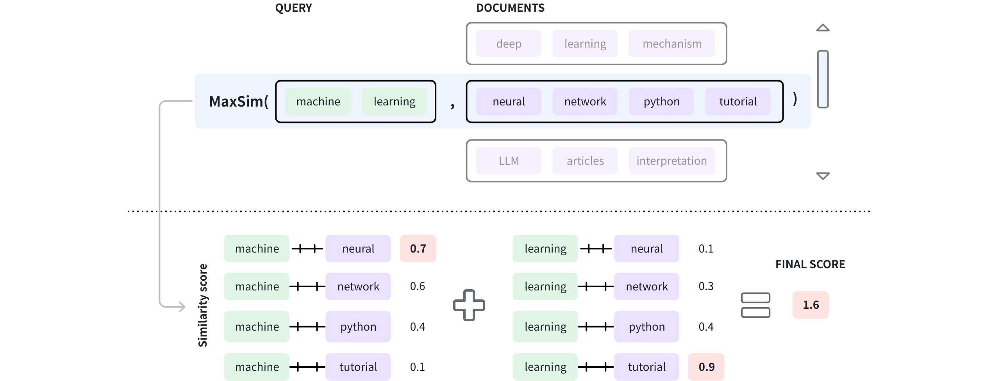
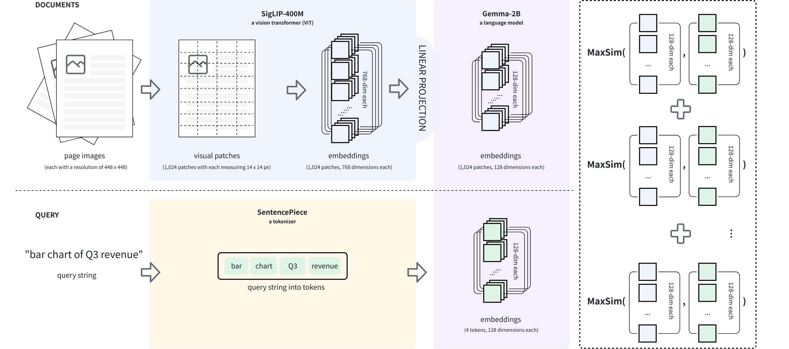

# Search with Embedding Lists

This page explains how to set up a ColBERT text retrieval system and a ColPali text retrieval system using the array of structs in Milvus, which enables you to store a document along with its vectorized chunks in embedding lists. 

## Overview

To build a text retrieval system, you might need to split documents into chunks and store each chunk along with its embeddings as an entity in a vector database to ensure precision and accuracy, especially for long documents where full-text embeddings could dilute semantic specificity or exceed model input limits. 

However, storing data in chunks leads to chunk-wise search results, meaning that retrieval initially identifies relevant *segments* rather than cohesive *documents*. To address this, you should perform additional post-search processing.

ColBERT (arXiv: [2004.12832](https://arxiv.org/abs/2004.12832)) is a text-text retrieval system that offers efficient and effective passage searching through contextualized late interactions over BERT. It enables independent token-wise encoding of queries and documents and computes their similarity.

### Token-wise encoding

During data ingestion in ColBERT, each document is split into tokens, which are then vectorized and stored as an embedding list, as in $d \rightarrow E_d = [e_{d1}, e_{d2}, \dots, e_{dn}] ∈ \R^{n×d}$. When a query arrives, it is also tokenized, vectorized, and stored as an embedding list, as in $q \rightarrow E_q = [e_{q1}, e_{q2}, \dots, e_{qm}] ∈ \R^{m×d}$.

In the above formulae, 

- $d$: a document

- $q$: the query

- $E_d$: the embedding list that represents the document.

- $E_q$: the embedding list that represents the query.

- $[e_{d1}, e_{d2}, \dots, e_{dn}] ∈ \R^{n×d}$: the number of vector embeddings in the embedding list representing the document is within the range of $\R^{n×d}$.

- $[e_{q1}, e_{q2}, \dots, e_{qm}] ∈ \R^{m×d}$: the number of vector embeddings in the embedding list representing the query is within the range of $\R^{m×d}$.

### Late interaction

Once vectorization is complete, the query embedding list is compared with each document embedding list, token by token, to determine the final similarity score.



As shown in the diagram above, the query contains two tokens, namely `machine` and `learning`, and the document in the window has four tokens: `neural`, `network`, `python`, and `tutorial`. Once these tokens are vectorized, the vector embeddings of each query token are compared with those in the document to get a list of similarity scores. Then the highest scores from each score list are summed to produce the final score. The process for determining a document's final score is known as maximum similarity (**MAX_SIM**). For details on maximum similarity, refer to [Maximum similarity](metric.md#Maximum-similarity).

<div class="alert note">

When implementing a ColBERT-like text retrieval system in Milvus, you are not limited to splitting documents into tokens. 

Instead, you can divide the documents into segments of any appropriate size, embed each segment to create an embedding list, and store the document along with its embedded segments in an entity.

</div>

### ColPali extension

Based on ColBERT, ColPali (arXiv: [2407.01449](https://arxiv.org/abs/2407.01449?spm=a2ty_o01.29997173.0.0.31c4c9217HFv28&file=2407.01449)) proposes a novel approach to visually rich document retrieval that leverages Vision-Language Models (VLMs). During data ingestion, each document page is rendered into a high-resolution image, then split into patches, rather than tokenized. For example, a document page image of 448 x 448 pixels can produce 1,024 patches, each measuring 14 x 14 pixels.

This method preserves non-textual information, such as the document layout, images, and table structures, which are lost when using text-only retrieval systems.



The VLM used in ColPali is called PaliGemma (arXiv: [2407.07726](https://arxiv.org/html/2407.07726v2#S1)), which comprises an image encoder (**SigLIP-400M**), a decoder-only language model (**Gemma2-2B**), and a linear layer that projects the image encoder's output into the language model's vector space, as shown in the above diagram.

During data ingestion, a document page, represented as a raw image, is divided into multiple visual patches, each of which is embedded to generate a list of vector embeddings. Then they are projected into the language model's vector space to obtain the final embedding list, as in $d \rightarrow E_d = [e_{d1}, e_{d2}, \dots, e_{dn}] ∈ \R^{n×d}$. When a query arrives, it is tokenized, and each token is embedded to generate a list of vector embeddings, as in $q \rightarrow E_q = [e_{q1}, e_{q2}, \dots, e_{qm}] ∈ \R^{m×d}$. Then, **MAX_SIM** has been applied to compare the two embedding lists and obtain the final score between the query and the document page. 

## ColBERT text retrieval system

In this section, we are going to set up a ColBERT text retrieval system using Milvus' Array of Structs. Before that, set up a Milvus v2.6.x instanceZilliz Cloud cluster compatible with Milvus v2.6.x, obtain a Cohere access token.

### Step 1: Install the dependencies

Run the following command to install the dependencies.

```shell
pip install --upgrade huggingface-hub transformers datasets pymilvus cohere
```

### Step 2: Load the Cohere dataset

In this example, we are going to use Cohere's Wikipedia dataset and retrieve the first 10,000 records. You can find information about this dataset on [this page](https://huggingface.co/datasets/Cohere/wikipedia-2023-11-embed-multilingual-v3).

```python
from datasets import load_dataset

lang = "simple"
docs = load_dataset(
    "Cohere/wikipedia-2023-11-embed-multilingual-v3", 
    lang, 
    split="train[:10000]"
)
```

Running the above scripts will download the dataset if it is not available locally. Each record in the dataset is a paragraph from a Wikipedia page. The following table shows the structure of this dataset.

<table>
   <tr>
     <th><p>Column Name</p></th>
     <th><p>Description</p></th>
   </tr>
   <tr>
     <td><p><code>_id</code></p></td>
     <td><p>A record ID</p></td>
   </tr>
   <tr>
     <td><p><code>url</code></p></td>
     <td><p>The URL of the current record.</p></td>
   </tr>
   <tr>
     <td><p><code>title</code></p></td>
     <td><p>The title of the source document.</p></td>
   </tr>
   <tr>
     <td><p><code>text</code></p></td>
     <td><p>A paragraph from the source document.</p></td>
   </tr>
   <tr>
     <td><p><code>emb</code></p></td>
     <td><p>Embeddings of the text from the source document.</p></td>
   </tr>
</table>

### Step 3: Group paragraphs by title

To search for documents rather than paragraphs, we should group paragraphs by title.

```python
df = docs.to_pandas()
groups = df.groupby('title')

data = []

for title, group in groups:
  data.append({
      "title": title,
      "paragraphs": [{
          "text": row['text'],
          'emb': row['emb']
      } for _, row in group.iterrows()]
  })
```

In this code, we store the grouped paragraphs as documents and include them in the `data` list. Each document has a `paragraphs` key, which is a list of paragraphs; each paragraph object contains a `text` and `emb` keys.

### Step 4: Create a collection for the Cohere dataset

Once the data is ready, we will create a collection. In the collection, there is a field named `paragraphs`, which is an Array of Structs.

```python
from pymilvus import MilvusClient, DataType

client = MilvusClient(
    uri="http://localhost:19530",
    token="root:Milvus"
)

# Create collection schema
schema = client.create_schema()

schema.add_field('id', DataType.INT64, is_primary=True, auto_id=True)
schema.add_field('title', DataType.VARCHAR, max_length=512)

# Create struct schema
struct_schema = client.create_struct_field_schema()
struct_schema.add_field('text', DataType.VARCHAR, max_length=65535)
struct_schema.add_field('emb', DataType.FLOAT_VECTOR, dim=512)

schema.add_field('paragraphs', DataType.ARRAY,
                 element_type=DataType.STRUCT,
                 struct_schema=struct_schema, max_capacity=200)

# Create index parameters
index_params = client.prepare_index_params()
index_params.add_index(
    field_name="paragraphs[emb]",
    index_type="AUTOINDEX",
    metric_type="MAX_SIM_COSINE"
)

# Create a collection
client.create_collection(
    collection_name='wiki_documents', 
    schema=schema, 
    index_params=index_params
)
```

### Step 5: Insert Cohere dataset into the collection

Now we can insert the prepared data into the collection we created above.

```python
client.insert(
    collection_name='wiki_documents', 
    data=data
)
```

### Step 6: Search within the Cohere dataset

According to ColBERT's design, the query text should be tokenized and then embedded into an EmbeddingList. In this step, we will use the same model that Cohere used to generate embeddings for the paragraphs in the Wikipedia dataset.

```python
import cohere

co = cohere.ClientV2("COHERE_API_KEY")

query_inputs = [
    {
        'content': [
            {'type': 'text', 'text': 'Adobe'},
        ]
    },
    {
        'content': [
            {'type': 'text', 'text': 'software'}
        ]
    }
]

embeddings = co.embed(
    inputs=query_inputs,
    model='embed-multilingual-v3.0',
    input_type="classification",
    embedding_types=["float"],
)
```

In the code, the query texts are organized into tokens in `query_inputs` and embedded into a list of float vectors. Then you can use Milvus' EmbeddingList to conduct a similarity search as follows.

```python
from pymilvus.client.embedding_list import EmbeddingList

query_emb_list = EmbeddingList()

if (embeddings.embeddings.float):
  query_emb_list.add_batch(embeddings.embeddings.float)

results = client.search(
    collection_name="wiki_documents",
    data=[query_emb_list],
    anns_field="paragraphs[emb]",
    search_params={
        "metric_type": "MAX_SIM_COSINE"
    },
    limit=10,
    output_fields=["title"]
)

for hit in results[0]:
  print(f"Document {hit['entity']['title']}: {hit['distance']:.4f}")
```

The output of the above code is similar to the following:

```python
# Document Software: 2.3035
# Document Application: 2.1875
# Document Adobe Illustrator: 2.1167
# Document Open source: 2.0542
# Document Computer: 1.9811
# Document Microsoft: 1.9784
# Document Web browser: 1.9655
# Document Program: 1.9627
# Document Website: 1.9594
# Document Computer science: 1.9460
```

The cosine similarity score ranges from `-1` to `1`, and the similarity scores in the above output clearly demonstrate the sum of multiple token-level similarity scores.

## ColPali text retrieval system

In this section, we will set up a ColPali-based text retrieval system using Milvus' Array of Structs. Before that, set up a Milvus v2.6.x instanceZilliz Cloud cluster compatible with Milvus v2.6.x.

### Step 1: Install the dependencies

```shell
pip install --upgrade huggingface-hub transformers datasets pymilvus 'colpali-engine>=0.3.0,<0.4.0'
```

### Step 2: Load the Vidore dataset

In this section, we will use a Vidore dataset named **vidore_v2_finance_en**. This dataset is a corpus of annual reports from the banking sector, intended for long-document understanding tasks. It is one of the 10 corpora comprising the ViDoRe v3 Benchmark. You can find details about this dataset on [this page](https://huggingface.co/datasets/vidore/vidore_v3_finance_en). 

```python
from datasets import load_dataset

ds = load_dataset("vidore/vidore_v3_finance_en", "corpus")
df = ds['test'].to_pandas()
```

Running the above scripts will download the dataset if it is not available locally. Each record in the dataset is a page from a financial report. The following table shows the structure of this dataset.

<table>
   <tr>
     <th><p>Column Name</p></th>
     <th><p>Description</p></th>
   </tr>
   <tr>
     <td><p><code>corpus_id</code></p></td>
     <td><p>A record in the corpus</p></td>
   </tr>
   <tr>
     <td><p><code>image</code></p></td>
     <td><p>The page image in bytes.</p></td>
   </tr>
   <tr>
     <td><p><code>doc_id</code></p></td>
     <td><p>The descriptive document ID.</p></td>
   </tr>
   <tr>
     <td><p><code>page_number_in_doc</code></p></td>
     <td><p>The page number of the current page in the doc.</p></td>
   </tr>
</table>

### Step 3: Generate embeddings for the page images

As illustrated in the [Overview](search-with-embedding-lists.md#ColPali-extension) section, the ColPali model is a VLM that projects images into the vector space of a text model. In this step, we will use the latest ColPali model **vidore/colpali-v1.3**. You can find details about this model on [this page](https://huggingface.co/vidore/colpali-v1.3). 

```python
import torch
from typing import cast
from colpali_engine.models import ColPali, ColPaliProcessor

model_name = "vidore/colpali-v1.3"

model = ColPali.from_pretrained(
    model_name,
    torch_dtype=torch.bfloat16,
    device_map="cuda:0",  # or "mps" if on Apple Silicon
).eval()

processor = ColPaliProcessor.from_pretrained(model_name)
```

Once the model is ready, you can try to generate patches for a specific image as follows.

```python
from PIL import Image
from io import BytesIO

# Use the iterrow() generator to get the first row
row = next(df.iterrows())[1]

# Include the image in the above row in a list
images = [ Image.open(row['image']['bytes'] ]
patches = processor.process_images(images).to(model.device)
patches_embeddings = model(**patches_in_pixels)[0]

# Check the shape of the embeddings generated for the patches
print(patches_embeddings.shape)

# [1031, 128]
```

In the code above, the ColPali model resizes the image to 448 x 448 pixels, then divides it into patches, each measuring 14 x 14 pixels. Lastly, these patches are embedded into 1,031 embeddings, each with 128 dimensions.

You can generate embeddings for all the images using a loop as follows:

```python
data = []

for index, row in df.iterrows():
  row = next(df.iterrows())[1]
  corpus_id = row['corpus_id']
  
  images = [Image.open(BytesIO(row['image']['bytes']))]
  batch_images = processor.process_images(images).to(model.device)
  patches = model(**batch_images)[0]

  doc_id = row['doc_id']
  markdown = row['markdown']
  page_number_in_doc = row['page_number_in_doc']

  data.append({
      "corpus_id": corpus_id,
      "patches": [ {"emb": emb} for emb in patches ],
      "doc_id": markdown,
      "page_number_in_doc": row['page_number_in_doc']
  })
```

<div class="alert note">

This step is relatively time-consuming due to the large amount of data that needs to be embedded.

</div>

### Step 4: Create a collection for the financial reports dataset

Once the data is ready, we will create a collection. In the collection, a field named `patches` is an Array of Structs.

```python
from pymilvus import MilvusClient, DataType

client = MilvusClient(
    uri=YOUR_CLUSTER_ENDPOINT,
    token=YOUR_API_KEY
)

schema = client.create_schema()

schema.add_field(
    field_name="corpus_id",
    datatype=DataType.INT64,
    is_primary=True
)

patch_schema = client.create_struct_field_schema()

patch_schema.add_field(
    field_name="emb",
    datatype=DataType.FLOAT_VECTOR,
    dim=128
)

schema.add_field(
    field_name="patches",
    datatype=DataType.ARRAY,
    element_type=DataType.STRUCT,
    struct_schema=patch_schema,
    max_capacity=1031
)

schema.add_field(
    field_name="doc_id",
    datatype=DataType.VARCHAR,
    max_length=512
)

schema.add_field(
    field_name="page_number_in_doc",
    datatype=DataType.INT64
)

index_params = client.prepare_index_params()

index_params.add_index(
    field_name="patches[emb]",
    index_type="AUTOINDEX",
    metric_type="MAX_SIM_COSINE"
)

client.create_collection(
    collection_name="financial_reports",
    schema=schema,
    index_params=index_params
)
```

### Step 5: Insert the financial reports into the collection

Now we can insert the prepared financial reports into the collection.

```python
client.insert(
    collection_name="financial_reports",
    data=data
)
```

From the output, you can find that all pages from the Vidore dataset are inserted.

### Step 6: Search within the financial reports

Once the data is ready, we can conduct searches against the data in the collection as follows:

```python
from pymilvus.client.embedding_list import EmbeddingList

queries = [
    "quarterly revenue growth chart"
]

batch_queries = processor.process_queries(queries).to(model.device)

with torch.no_grad():
  query_embeddings = model(**batch_queries)

query_emb_list = EmbeddingList()
query_emb_list.add_batch(query_embeddings[0].cpu())

results = client.search(
    collection_name="financial_reports",
    data=[query_emb_list],
    anns_field="patches[emb]",
    search_params={
        "metric_type": "MAX_SIM_COSINE"
    },
    limit=10,
    output_fields=["doc_id", "page_number_in_doc"]
)

```