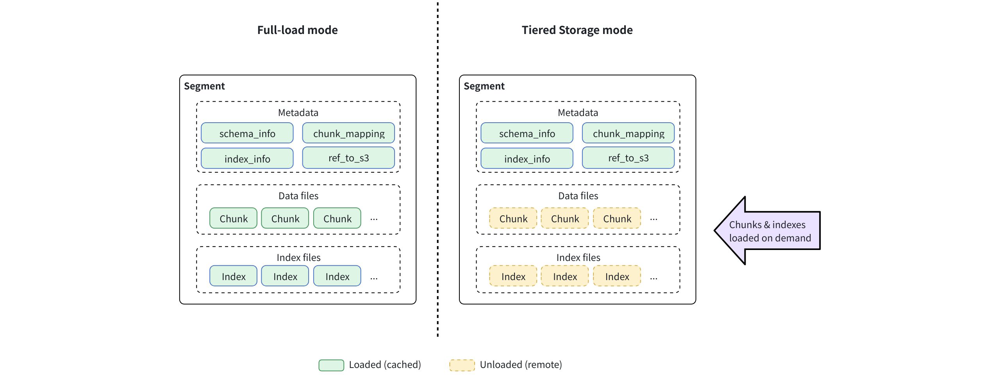

# Tiered Storage Overview

In Milvus, the traditional **full-load mode** requires each QueryNode to load all schema fields and indexes of a [segment](https://zilliverse.feishu.cn/wiki/IBX3w5p4Tipy1KkNxI6cbEOwnGf) at initialization, even data that may never be accessed. This ensures immediate data availability but often leads to wasted resources, including high memory usage, heavy disk activity, and significant I/O overhead, especially when handling large-scale datasets.

**Tiered Storage** addresses this challenge by decoupling data caching from segment loading. Instead of loading all data at once, Milvus introduces a caching layer that distinguishes between hot data (cached locally) and cold data (stored remotely). The QueryNode now loads only lightweight metadata initially and dynamically pulls or evicts data on demand. This significantly reduces load time, optimizes local resource utilization, and enables QueryNodes to process datasets that far exceed their physical memory or disk capacity.

You can consider enabling Tiered Storage in scenarios such as:

- Collections that exceed the available memory or NVMe capacity of a single QueryNode

- Analytical or batch workloads where faster loading is more important than the first-query latency

- Mixed workloads that can tolerate occasional cache misses for less frequently accessed data

<div class="alert note">

For more details on segments and chunks, refer to [Segment Explained](https://zilliverse.feishu.cn/wiki/IBX3w5p4Tipy1KkNxI6cbEOwnGf).

</div>

## How it works

Tiered Storage changes how QueryNode manages segment data. Instead of caching every field and index at load time, QueryNode now loads **metadata** only and uses a caching layer to fetch and evict data dynamically.

<div class="alert note">

**Metadata** includes schema, index definitions, chunk maps, row counts, and references to remote objects. This data is small, always cached, and never evicted.

</div>

### Full-load mode vs. Tiered Storage mode

While both full-load and Tiered Storage modes handle the same data, they differ in when and how QueryNode caches these components.

- **Full-load mode**: At load time, QueryNode caches full collection data, including metadata, field data, and indexes, from object storage.

- **Tiered Storage mode**: At load time, QueryNode caches metadata only. Field data is pulled on demand at chunk granularity. Index files remain remote until the first query needs them; then the entire per-segment index is fetched and cached.

The diagram below shows these differences.



### QueryNode loading workflow

Under Tiered Storage, the workflow has three phases:


#### Lazy load

At initialization, Milvus performs a lazy load, caching only **metadata** that contains schema definitions, index information, chunk mappings, and row counts.

No field data or index files are downloaded at this stage. This makes collections queryable quickly and minimizes startup resource use.

**Benefits**

- Significantly faster collection load time

- Minimal memory and disk footprint

- Enables QueryNodes to handle more segments concurrently

**Configuration**

Automatically applied when Tiered Storage is enabled. No manual setting is required.

#### Partial load

When a query or search operation begins, the QueryNode performs a partial load, fetching only the required field chunks or indexes from object storage and temporarily caching them for reuse.

- **Fields**: Loaded on demand at the **chunk** level

- **Indexes:** Loaded the first time they are accessed at the **segment** level

**Benefits**

- Reduces memory and disk pressure

- Allows Milvus to query large datasets efficiently

- Balances query latency and resource efficiency

**Configuration**

Partial load is the default behavior when Tiered Storage is enabled. To minimize first-hit latency for critical fields or indexes, use **Warm Up** to preload data before queries. See [Warm Up](warm-up.md) for configuration examples.

#### Eviction

To maintain healthy resource usage, Milvus automatically releases unused cached data when thresholds are reached.

Eviction follows a [Least Recently Used (LRU)](https://en.wikipedia.org/wiki/Cache_replacement_policies) policy and is governed by configurable parameters:

- **Watermarks:** Define start and stop thresholds for eviction

- **Cache TTL:** Removes stale cached items after a defined duration

- **Overcommit ratio:** Allows temporary oversubscription before eviction accelerates

**Benefits**

- Keeps cache usage stable across workloads

- Maximizes cache reuse while preventing crashes

- Maintains predictable performance over time

**Configuration**

Enable and tune eviction parameters in `milvus.yaml`. See [Eviction](eviction.md) for detailed configuration.

## Getting started

### Prerequisites

- Milvus 2.6.4+

- QueryNodes with dedicated memory and disk resources

- Object storage backend (S3, MinIO, etc.)

<div class="alert warning">

QueryNode resources should not be shared with other workloads. Shared resources can cause Tiered Storage to misjudge available capacity, leading to crashes.

</div>

### Basic configuration template

Edit the Milvus configuration file (`milvus.yaml`) to configure Tiered Storage settings:

```yaml
# milvus.yaml
queryNode:
  segcore:
    tieredStorage:
      # Warm Up Configuration
      warmup:
        scalarField: sync      # Preload scalar field data
        scalarIndex: sync      # Preload scalar indexes
        vectorField: disable   # Don't preload vector field data (large)
        vectorIndex: sync      # Preload vector indexes
      
      # Eviction Configuration
      evictionEnabled: true
      backgroundEvictionEnabled: true
      
      # Memory Watermarks
      memoryLowWatermarkRatio: 0.75   # Stop evicting at 75%
      memoryHighWatermarkRatio: 0.80  # Start evicting at 80%
      
      # Disk Watermarks  
      diskLowWatermarkRatio: 0.75
      diskHighWatermarkRatio: 0.80
      
      # Cache TTL (7 days)
      cacheTtl: 604800
      
      # Overcommit Ratios
      evictableMemoryCacheRatio: 0.3
      evictableDiskCacheRatio: 0.3
```

### Next steps

1. **Configure Warm Up** - Optimize preloading for your access patterns. See [Warm Up](warm-up.md).

1. **Tune Eviction** - Set appropriate watermarks and TTL for your resource constraints. See [Eviction](eviction.md).

1. **Monitor Performance** - Track cache hit rates, eviction frequency, and query latency patterns.

1. **Iterate Configuration** - Adjust settings based on observed workload characteristics.

## FAQ

### Can I change Tiered Storage parameters at runtime?

No. All parameters must be set in `milvus.yaml` before starting Milvus. Changes require a restart to take effect.

### Does Tiered Storage affect data durability?

No. Data persistence is still handled by remote object storage. Tiered Storage only manages caching on QueryNodes.

### Will queries always be faster with Tiered Storage?

Not necessarily. Tiered Storage reduces load time and resource usage, but queries that touch uncached (cold) data may see higher latency. For latency-sensitive workloads, full-load mode is recommended.

### Why does a QueryNode still run out of resources even with Tiered Storage enabled?

Two common causes:

- The QueryNode was configured with too few resources. Watermarks are relative to available resources, so under-provisioning amplifies misjudgment.

- QueryNode resources are shared with other workloads, so Tiered Storage cannot correctly assess actual available capacity.

### Why do some queries fail under high concurrency?

If too many queries hit hot data at the same time, QueryNode resource limits may still be exceeded. Some threads may fail due to resource reservation timeouts. Retrying after the load decreases, or allocating more resources, can resolve this.

### Why does search/query latency increase after enabling Tiered Storage?

Possible causes include:

- Frequent queries to cold data, which must be fetched from storage.

- An overcommit ratio that is too high, leading to frequent eviction.

- Watermarks set too close together, causing frequent synchronous eviction.

### Can Tiered Storage handle unlimited data by overcommitting cache?

No. Overcommit ratios allow QueryNodes to work with more segments than physical memory permits, but excessively high ratios can lead to frequent eviction, cache thrashing, or query failures.

