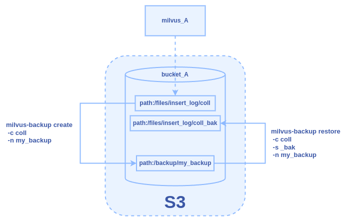

# Backup and Restore in One Instance

This topic details the process of backing up a collection and restoring
it from the backup within the same Milvus instance.

## Overview

The diagram below illustrates the backup and restore process within a
single Milvus instance.



Assume we have a Milvus instance, `milvus_A`, using a bucket named
`bucket_A` for data storage. In this example, our goal is to complete the
following tasks:

1. Create a backup (`my_backup`) for collection coll in `bucket_A`.

2. Restore from the backup and name the restored collection `coll_bak`.

## Prerequisites

- Ensure the **milvus-backup** tool is installed.

- Familiarize yourself with configuring Milvus object storage settings.
For details, refer to [Object
Storage](https://milvus.io/docs/deploy_s3.md).

## Back up the collection

### Step 1: Prepare configuration

Go to the directory of the milvus-backup project and create a directory
named `configs`:

```shell
mkdir configs
cd configs
```

Download the backup config file backup.yaml:

```shell
wget https://raw.githubusercontent.com/zilliztech/milvus-backup/main/configs/backup.yaml
```

The file structure looks like this:

```
├── configs
│   └── backup.yaml
├── milvus-backup
└── README.md
```

### Step 2: Edit configuration file

Modify the backup.yaml file to set the appropriate configurations for
`milvus_A`. Below is the sample storage configuration:

```yaml
# Related configuration of minio, which is responsible for data persistence for Milvus.
minio:
  # cloudProvider: "minio" # deprecated use storageType instead
  storageType: "minio" # support storage type: local, minio, s3, aws, gcp, ali(aliyun), azure, tc(tencent)
  
  address: localhost # Address of MinIO/S3
  port: 9000   # Port of MinIO/S3
  accessKeyID: minioadmin  # accessKeyID of MinIO/S3
  secretAccessKey: minioadmin # MinIO/S3 encryption string
  useSSL: false # Access to MinIO/S3 with SSL
  useIAM: false
  iamEndpoint: ""
  
  bucketName: "bucket_A" # Milvus Bucket name in MinIO/S3, make it the same as your milvus instance
  rootPath: "files" # Milvus storage root path in MinIO/S3, make it the same as your milvus instance

  # only for azure
  backupAccessKeyID: minioadmin  # accessKeyID of MinIO/S3
  backupSecretAccessKey: minioadmin # MinIO/S3 encryption string
  
  backupBucketName: "bucket_A" # Bucket name to store backup data. Backup data will store to backupBucketName/backupRootPath
  backupRootPath: "backup" # Rootpath to store backup data. Backup data will store to backupBucketName/backupRootPath
```

### Step 3: Create backup

Once backup.yaml is saved, create a backup named `my_backup`:

```shell
./milvus-backup create -c coll -n my_backup
```

This command creates the backup `bucket_A/backup/my_backup` in the object
storage of `milvus_A`.

## Restore from the backup within milvus_A

Once the backup is created, you can restore from it using the command
below:

```shell
./milvus-backup restore -c coll -n my_backup -s _bak
```

This command restores from the backup and creates a new collection named
coll_bak in `milvus_A`, with data stored in `bucket_A/files/insert_log/[ID of new collection]`.
