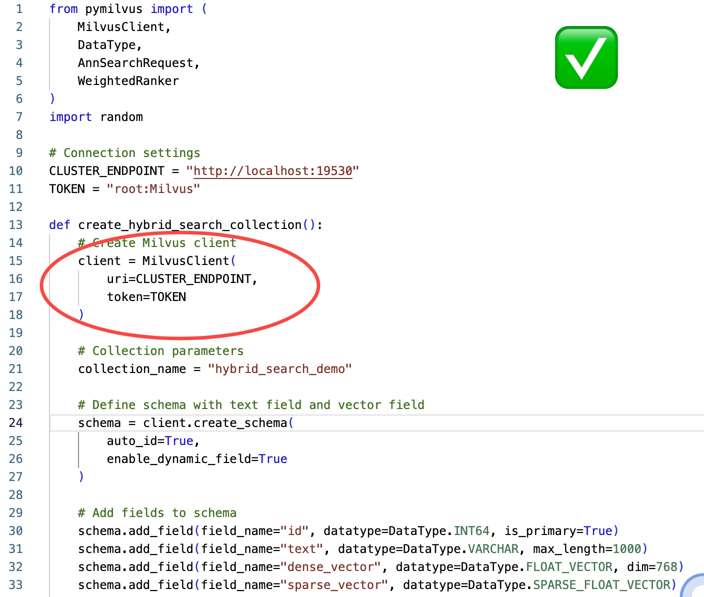
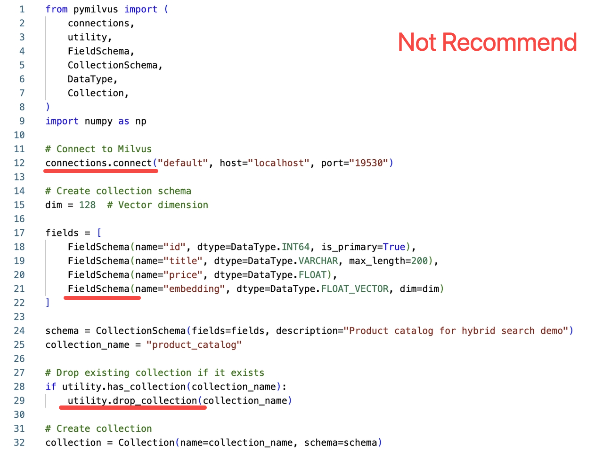
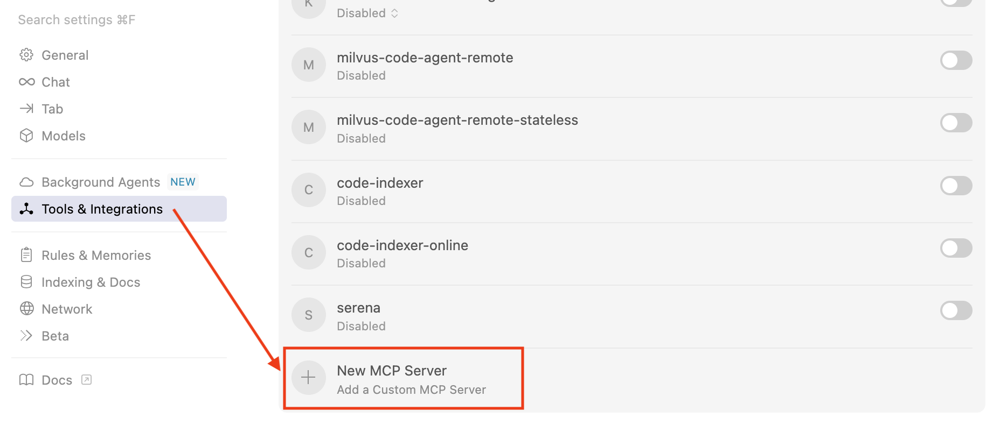
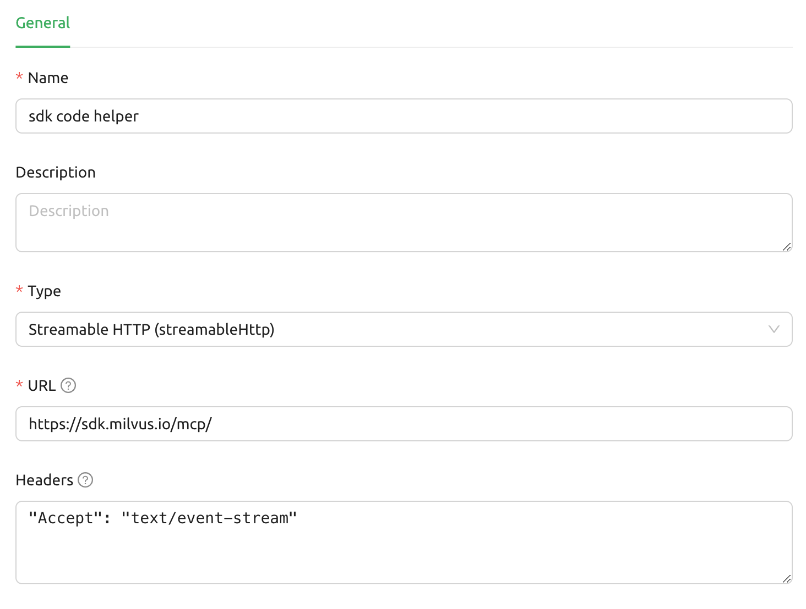

# Milvus SDK Code Helper Guide

# Overview

⚡️ Configure once, boost efficiency forever!

Still frustrated by outdated results from LLM? Tired of LLM outputting obsolete content even after versions are updated? Try this mcp to solve the information lag issue when developing Milvus-related code once and for all!

Milvus official SDK Code Helper is now online — just find the corresponding AI IDE, configure it once, and let AI write **officially recommended** Milvus code for you. Say goodbye to outdated frameworks completely!

➡️ Jump now: [QuickStart](#Quickstart)

# Effect display

The following figure compares the effects of generating code with and without the Milvus SDK code helper. If the Milvus SDK code helper is not used, the code written follows the old ORM SDK approach, which is no longer recommended. The following is a comparison of code screenshots with and without the Code Helper MCP:

<table>
   <tr>
     <th><p>MCP code helper <strong>enabled</strong></p></th>
     <th><p>MCP code helper <strong>disabled</strong></p></th>
   </tr>
   <tr>
     <td><p></p></td>
     <td><p></p></td>
   </tr>
   <tr>
     <td><p>Use the officially recommended latest MilvusClient interface to create a Collection</p></td>
     <td><p>Creating a Collection using the old ORM interface is not recommended.</p></td>
   </tr>
</table>

# Quickstart

Find your AI IDE, configure it with one click, and unlock a worry-free coding journey.

## Cursor

Go to: `Settings` -> `Cursor Settings` -> `Tools & Intergrations` -> `Add new global MCP server`



Pasting the following configuration into your Cursor `~/.cursor/mcp.json` file is the recommended approach. You may also install a specific project by creating `.cursor/mcp.json` in your project folder. See [Cursor MCP docs](https://docs.cursor.com/context/model-context-protocol) for more info.

```json
{
  "mcpServers": {
    "sdk-code-helper": {
      "url": "https://sdk.milvus.io/mcp/",
      "headers": {
        "Accept": "text/event-stream"
      }
    }
  }
}
```

## Claude Desktop

Add to your Claude Desktop configuration:

```json
{
  "mcpServers": {
    "sdk-code-helper": {
      "url": "https://sdk.milvus.io/mcp/",
      "headers": {
        "Accept": "text/event-stream"
      }
    }
  }
}
```

## Claude Code

Claude Code supports adding MCP servers directly through JSON configuration, including servers of the remote URL type. Use following command to add configuration to Claude Code:

```sql
claude mcp add-json sdk-code-helper --json '{
  "url": "https://sdk.milvus.io/mcp/",
  "headers": {
    "Accept": "text/event-stream"
  }
}'
```

## Windsurf

Windsurf supports MCP configuration through a JSON file. Add the following configuration to your Windsurf MCP settings:

```json
{
  "mcpServers": {
    "sdk-code-helper": {
      "url": "https://sdk.milvus.io/mcp/",
      "headers": {
        "Accept": "text/event-stream"
      }
    }
  }
}
```

## VS Code

The CodeIndexer MCP server can be used with VS Code through MCP-compatible extensions. Add the following configuration to your VS Code MCP settings:

```json
{
  "mcpServers": {
    "sdk-code-helper": {
      "url": "https://sdk.milvus.io/mcp/",
      "headers": {
        "Accept": "text/event-stream"
      }
    }
  }
}
```

## Cherry Studio

Cherry Studio allows for visual MCP server configuration through its settings interface. While it doesn't directly support manual JSON configuration, you can add a new server via the GUI:

1. Navigate to Settings → MCP Servers → Add Server.

1. Fill in the server details:

    - Name: `sdk code helper`

    - Type: `Streamable HTTP`

    - URL: `https://sdk.milvus.io/mcp/`

    - Headers: `"Accept": "text/event-stream"`

1. Save the configuration to activate the server.



## Cline

Cline uses a JSON configuration file to manage MCP servers. To integrate the provided MCP server configuration:

1. Open Cline and click on the MCP Servers icon in the top navigation bar.

1. Select the Installed tab, then click Advanced MCP Settings.

1. In the `cline_mcp_settings.json` file, add the following configuration:

```json
{
  "mcpServers": {
    "sdk-code-helper": {
      "url": "https://sdk.milvus.io/mcp/",
      "headers": {
        "Accept": "text/event-stream"
      }
    }
  }
}
```

## Augment

1. Press Cmd/Ctrl Shift P or go to the hamburger menu in the Augment panel

1. Select Edit Settings

1. Under Advanced, click Edit in settings.json

1. Add the server configuration to the `mcpServers` array in the `augment.advanced` object:

```markdown
{
  "mcpServers": {
    "sdk-code-helper": {
      "url": "https://sdk.milvus.io/mcp/",
      "headers": {
        "Accept": "text/event-stream"
      }
    }
  }
}
```

## Gemini CLI

Gemini CLI requires manual configuration through a JSON file:

1. Create or edit the `~/.gemini/settings.json` file.

1. Add the following configuration:

```json
{
  "mcpServers": {
    "sdk-code-helper": {
      "url": "https://sdk.milvus.io/mcp/",
      "headers": {
        "Accept": "text/event-stream"
      }
    }
  }
}
```

1. Save the file and restart Gemini CLI to apply the changes.

## Roo Code

Roo Code

Roo Code utilizes a JSON configuration file for MCP servers:

1. Open Roo Code and navigate to Settings → MCP Servers → Edit Global Config.

1. In the `mcp_settings.json` file, add the following configuration:

```json
{
  "mcpServers": {
    "sdk-code-helper": {
      "url": "https://sdk.milvus.io/mcp/",
      "headers": {
        "Accept": "text/event-stream"
      }
    }
  }
}
```

1. Save the file to activate the server.

