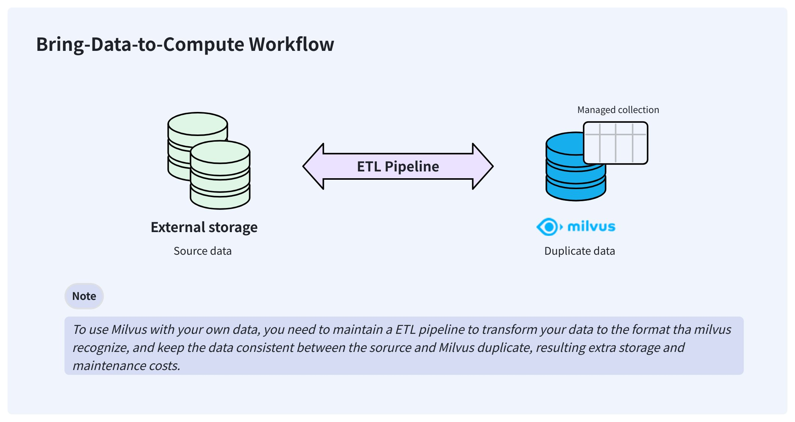

# Create an External Collection

An external collection is a type of data collection in Milvus that accesses data from external storage systems such as AWS S3 and Iceberg without copying it into Milvus. It acts as a query layer over data lakes while maintaining compatibility with Milvus query interfaces.

## Overview

In a typical AI data pipeline, users may already have stored their data in Parquet or other formats on their storage system, such as AWS S3. To make Milvus consume this externally stored data, users usually need to import it into Milvus' own storage using Extract-Transform-Load (ETL) pipelines.

This bring-your-data-to-Milvus workflow creates redundant data that is hard to synchronize and adds to the engineering maintenance burden to ensure data consistency.



To resolve these issues, Milvus delivers external collections that let you access your externally stored data from Milvus without worrying about data synchronization and ETL pipelines.


Once created, an external collection can access your data directly and keep it in the same place where you store it. In the background, Milvus creates manifest files to record the mappings between the Milvus metadata and the rows in external data files. After the manifest files are ready, you can create indexes in the external collection as you would in any managed collection.

When your data changes, manually triggering a sub-second refresh updates the metadata, keeping Milvus always up to date.

## Limits & restrictions

Since Milvus does not store raw data and only maintains a mapping between the metadata and raw data, external collections are read-only. That means you cannot insert, upsert, delete, import, flush, and compact data at the Milvus side.

When compared with managed collections, external collections have the following limits:

- You cannot set the primary key and its AutoID attributes.

- You cannot enable the dynamic field.

- You cannot set the partition key and clustering key, because partitions are not available.

- You cannot define functions in the schema.

- You cannot change the schema of an external collection once you create it.

- You cannot use the text match with BM25.

- You must trigger a refresh operation before creating indexes.

## Step 1: Create schema

As with creating a managed collection, you also need to create a schema before creating an external collection. However, the schema is slightly different from that of a managed collection.

<div class="multipleCode">
    <a href="#python">Python</a>
    <a href="#java">Java</a>
    <a href="#go">Go</a>
    <a href="#javascript">NodeJS</a>
    <a href="#bash">cURL</a>
</div>

```python
from pymilvus import MilvusClient, DataType

schema = MilvusClient.create_schema(
    external_source='s3://s3.<region-id>.amazonaws.com/<bucket>/',
    external_spec='{
        "format": "parquet"，
        "extfs": {
            ...
        }
    }'
)
```

```java
// Java
```

```go
import (
    "github.com/milvus-io/milvus/client/v2/entity"
    client "github.com/milvus-io/milvus/client/v2/milvusclient"
)

schema := entity.NewSchema().
    WithName("product_embeddings").
    WithExternalSource("s3://my-bucket/embeddings/").
    WithExternalSpec(`{"format": "parquet", "extfs": { ... }}`)
```

```javascript
// node
```

```bash
# restful
```

To create the schema for an external collection, you need to specify the source data URI, the data format, and authentication settings.

<details summary="Authentication Options">

You have the following options to set the authentication settings:

### Use AWS AK/SK

This option applies to self-hosted MinIO or the scenario where you have AK/SK for work.

```json
{
    "format": "...",
    "extfs": {
        "access_key_id":     "AKIA..",
        "access_key_value":  "u4Lh...",
        "region":            "us-west-2",
        "cloud_provider":    "aws",
        "use_ssl":           "true",
        "use_virtual_host":  "true"
    }
}
```

<table>
   <tr>
     <th><p>Parameter Name</p></th>
     <th><p>Parameter Description</p></th>
     <th><p>Example Value</p></th>
   </tr>
   <tr>
     <td><p><code>format</code></p></td>
     <td><p>Format of the target source data files.</p><p>Possible values are <code>parquet</code>, <code>vortex</code>, <code>lance-table</code>, and <code>iceberg-table</code>.</p></td>
     <td><p><code>parquet</code></p></td>
   </tr>
   <tr>
     <td><p><code>extfs</code></p></td>
     <td><p>External file system settings in a stringified JSON structure.</p></td>
     <td><p>--</p></td>
   </tr>
   <tr>
     <td><p><code>extfs.access_key_id</code></p></td>
     <td><p>Access key ID</p></td>
     <td><p><code>AKIA...</code></p></td>
   </tr>
   <tr>
     <td><p><code>extfs.access_key_value</code></p></td>
     <td><p>Access key value</p></td>
     <td><p><code>u7LH...</code></p></td>
   </tr>
   <tr>
     <td><p><code>extfs.region</code></p></td>
     <td><p>Cloud region ID</p></td>
     <td><p><code>us-west-2</code></p></td>
   </tr>
   <tr>
     <td><p><code>extfs.cloud_provider</code></p></td>
     <td><p>Cloud provider ID</p></td>
     <td><p><code>aws</code></p></td>
   </tr>
   <tr>
     <td><p><code>extfs.use_ssl</code></p></td>
     <td><p>Whether SSL is used to establish connections.</p></td>
     <td><p><code>true</code></p></td>
   </tr>
   <tr>
     <td><p><code>extfs.use_virtual_host</code></p></td>
     <td><p>Whether to use virtual hosting for access to your bucket.</p><p>For details, refer to <a href="https://docs.aws.amazon.com/AmazonS3/latest/userguide/VirtualHosting.html">this article</a>.</p></td>
     <td><p><code>true</code></p></td>
   </tr>
</table>

### Use AWS IAM

This option applies to the scenario where Milvus runs on an EC2 instance or an EKS cluster. In this case, you do not need to hardcode the AK/SK.

```json
{
    "format": "...",
    "extfs": {
        "use_iam":           "true",
        "iam_endpoint":      "https://sts.<region>.amazonaws.com",
        "region":            "us-west-2",
        "cloud_provider":    "aws",
        "use_ssl":           "true"
    }
}
```

<table>
   <tr>
     <th><p>Parameter Name</p></th>
     <th><p>Parameter Description</p></th>
     <th><p>Example Value</p></th>
   </tr>
   <tr>
     <td><p><code>format</code></p></td>
     <td><p>Format of the target source data.</p><p>Possible values are <code>parquet</code>, <code>vortex</code>, <code>lance-table</code>, and <code>iceberg-table</code></p></td>
     <td><p><code>parquet</code></p></td>
   </tr>
   <tr>
     <td><p><code>extfs</code></p></td>
     <td><p>External file system settings</p></td>
     <td><p>--</p></td>
   </tr>
   <tr>
     <td><p><code>extfs.use_iam</code></p></td>
     <td><p>Whether to use AWS IAM.</p><p>Set this to <code>"true"</code> for this option.</p></td>
     <td><p><code>true</code></p></td>
   </tr>
   <tr>
     <td><p><code>extfs.iam_endpoint</code></p></td>
     <td><p>A valid AWS STS endpoint. </p><p>For details, refer to <a href="https://docs.aws.amazon.com/IAM/latest/UserGuide/id_credentials_temp_region-endpoints.html">this article</a>.</p></td>
     <td><p><code>https:&ast;//&ast;sts.&lt;region&gt;.amazonaws.com</code></p></td>
   </tr>
   <tr>
     <td><p><code>extfs.region</code></p></td>
     <td><p>Cloud region ID</p></td>
     <td><p><code>us-west-2</code></p></td>
   </tr>
   <tr>
     <td><p><code>extfs.cloud_provider</code></p></td>
     <td><p>Cloud provider ID</p></td>
     <td><p><code>aws</code></p></td>
   </tr>
   <tr>
     <td><p><code>extfs.use_ssl</code></p></td>
     <td><p>Whether SSL is used to establish connections.</p></td>
     <td><p><code>true</code></p></td>
   </tr>
</table>

### Use Milvus global credentials

This option applies when you store external data in the Milvus bucket, and the global MinIO settings specified in `milvus.yaml` can be used directly to access the data.

```json
{
    "format": "...",
    "extfs": {
        "storage_type": "remote"
    }
}
```

### Use IAM Role ARN

This option applies when your organization uses different AWS accounts to manage the Milvus cluster and the bucket that holds the target data files.

In this case, the bucket owner should create an IAM role that

- Attaches `AmazonS3FullAccess` or a more fine-grained policy for bucket access.

- Includes a self-defined `sts:ExternalId` in the Condition field of the role's Trust Policy.

Then, the bucket owner should provide you with the IAM role ARN and the External ID so you can call `sts:AssumeRole` with those values to assume the IAM Role.

The following is an example permission policy to be attached to the IAM role with the allowed permissions. You can adjust this to meet your requirements.

```json
{
    "Version": "2012-10-17",
    "Statement": [
        {
            "Effect": "Allow",
            "Action": [
                "s3:ListBucket",
                "s3:GetBucketLocation"
            ],
            "Resource": "arn:aws:s3:::SOURCE-DATA-BUCKET"
        },
        {
            "Effect": "Allow",
            "Action": [
                "s3:GetObject",
                "s3:PutObject",
                "s3:DeleteObject"
            ],
            "Resource": "arn:aws:s3:::SOURCE-DATA-BUCKET/*"
        }
    ]
}
```

And the trust policy associated with the IAM role defines who is allowed to assume it.

```json
{
  "Version": "2012-10-17",
  "Statement": [
    {
      "Effect": "Allow",
      "Principal": {
        "AWS": "arn:aws:iam::ACCOUNT_RUNNING_MILVUS:root"
      },
      "Action": "sts:AssumeRole",
      "Condition": {
        "StringEquals": {
          "sts:ExternalId": "YOUR_UNIQUE_EXTERNAL_ID"
        }
      }
    }
  ]
}
```

Once you have obtained the IAM Role ARN and the External ID, you can set up the `external_spec` parameter as follows:

```json
{
    "format": "...",
    "extfs": {
        "cloud_provider": "aws",
        "region": "us-west-2",
        "storage_type": "remote",
        "use_ssl": "true",
        "use_iam": "true",
        "role_arn": "arn:aws:iam::306787000000:role/lentitude-bucket-role",
        "external_id": "YOUR_UNIQUE_EXTERNAL_ID",
        "load_frequency": "900"
    }
}
```

<table>
   <tr>
     <th><p>Parameter Name</p></th>
     <th><p>Parameter Description</p></th>
     <th><p>Example Value</p></th>
   </tr>
   <tr>
     <td><p><code>format</code></p></td>
     <td><p>Format of the target source data.</p><p>Possible values are <code>parquet</code>, <code>vortex</code>, <code>lance-table</code>, and <code>iceberg-table</code></p></td>
     <td><p><code>parquet</code></p></td>
   </tr>
   <tr>
     <td><p><code>extfs</code></p></td>
     <td><p>External file system settings</p></td>
     <td><p>--</p></td>
   </tr>
   <tr>
     <td><p><code>extfs.cloud_provider</code></p></td>
     <td><p>Cloud provider ID</p></td>
     <td><p><code>aws</code></p></td>
   </tr>
   <tr>
     <td><p><code>extfs.region</code></p></td>
     <td><p>Cloud region ID</p></td>
     <td><p><code>us-west-2</code></p></td>
   </tr>
   <tr>
     <td><p><code>extfs.use_ssl</code></p></td>
     <td><p>Whether SSL is used to establish connections.</p></td>
     <td><p><code>true</code></p></td>
   </tr>
   <tr>
     <td><p><code>extfs.use_iam</code></p></td>
     <td><p>Whether to use AWS IAM.</p><p>Set this to <code>"true"</code> for this option.</p></td>
     <td><p><code>true</code></p></td>
   </tr>
   <tr>
     <td><p><code>extfs.role_arn</code></p></td>
     <td><p>IAM Role ARN obtained from the bucket owner.</p></td>
     <td><p><code>arn:aws:iam::306787000000:role/...</code></p></td>
   </tr>
   <tr>
     <td><p><code>extfs.external_id</code></p></td>
     <td><p>External ID obtained from the bucket owner.</p></td>
     <td><p>--</p></td>
   </tr>
   <tr>
     <td><p><code>extfs.load_frequency</code></p></td>
     <td><p>Interval at which Milvus retrieves temporary authentication credentials in seconds.</p></td>
     <td><p><code>900</code></p></td>
   </tr>
</table>

</details>

## Step 2: Add fields

Once the schema is ready, you can add fields as follows:

<div class="multipleCode">
    <a href="#python">Python</a>
    <a href="#java">Java</a>
    <a href="#go">Go</a>
    <a href="#javascript">NodeJS</a>
    <a href="#bash">cURL</a>
</div>

```python
schema.add_field(
    field_name="product_id",
    datatype=DataType.INT64,
    # highlight-next
    external_field="id" # field name in the external data file
)

schema.add_field(
    field_name="product_name",
    datatype=DataType.VARCHAR,
    max_length=256,
    # highlight-next
    external_field="name"
)

schema.add_field(
    field_name="embedding",
    datatype=DataType.FLOAT_VECTOR,
    dim=768,
    # highlight-next
    external_field="vector"
)
```

```java
// Java
```

```go
import (
    "github.com/milvus-io/milvus/client/v2/entity"
    client "github.com/milvus-io/milvus/client/v2/milvusclient"
)

schema = schema.
    WithField(
        entity.NewField().
            WithName("product_id").
            WithDataType(entity.FieldTypeInt64).
            WithExternalField("id"),
    ).
    WithField(
        entity.NewField().
            WithName("product_name").
            WithDataType(entity.FieldTypeVarChar).
            WithMaxLength(512).
            WithExternalField("name"),
    ).
    WithField(
        entity.NewField().
            WithName("embedding").
            WithDataType(entity.FieldTypeFloatVector).
            WithDim(768).
            WithExternalField("vector"),
    )
```

```javascript
// node
```

```bash
# restful
```

## Step 3: Create a collection

After adding all the fields to the schema, you can create the collection.

<div class="multipleCode">
    <a href="#python">Python</a>
    <a href="#java">Java</a>
    <a href="#go">Go</a>
    <a href="#javascript">NodeJS</a>
    <a href="#bash">cURL</a>
</div>

```python
client = MilvusClient(
    uri="http://localhost:19530",
    token="root:Milvus"
)

client.create_collection(
    collection_name="test_collection",
    schema=schema
)
```

```java
// Java
```

```go
import (
    "github.com/milvus-io/milvus/client/v2/entity"
    client "github.com/milvus-io/milvus/client/v2/milvusclient"
)

ctx, cancel := context.WithCancel(context.Background())
defer cancel()

milvusAddr := "http://localhost:19530"
token := "root:Milvus"

client, err := milvusclient.New(ctx, &milvusclient.ClientConfig{
    Address: milvusAddr,
    APIKey: token
})

err = client.CreateCollection(ctx, milvusclient.NewCreateCollectionOption("test_collection", schema).
    WithIndexOptions(indexOptions...))

if err != nil {
    fmt.Println(err.Error())
    // handle error
}
```

```javascript
// node
```

```bash
# restful
```

## Step 4: Refresh data

Once the collection is ready, you need to perform a refresh to synchronize the metadata from your data to Milvus.

<div class="multipleCode">
    <a href="#python">Python</a>
    <a href="#java">Java</a>
    <a href="#go">Go</a>
    <a href="#javascript">NodeJS</a>
    <a href="#bash">cURL</a>
</div>

```python
job_id = client.refresh_external_collection(
    collection_name="test_collection"
)

while True:
    progress = client.get_refresh_external_collection_progress(job_id=job_id)
    print(f"  {progress.state}: {progress.progress}%")

    if progress.state == "RefreshCompleted":
        elapsed = progress.end_time - progress.start_time
        print(f"  Completed in {elapsed}ms")
        return job_id
    elif progress.state == "RefreshFailed":
        print(f"  Failed: {progress.reason}")
        return job_id

    time.sleep(2)
```

```java
// Java
```

```go
refreshResult, err := client.RefreshExternalCollection(ctx,
    client.NewRefreshExternalCollectionOption("test_collection"))

jobID := refreshResult.JobID

for {
    progress, _ := client.GetRefreshExternalCollectionProgress(ctx,
        client.NewGetRefreshExternalCollectionProgressOption(jobID))

    fmt.Printf("State: %s\n", progress.State)

    if progress.State == entity.RefreshStateCompleted {
        fmt.Println("Refresh completed!")
        break
    }
    if progress.State == entity.RefreshStateFailed {
        fmt.Printf("Refresh failed: %s\n", progress.Reason)
        break
    }
    time.Sleep(2 * time.Second)
}
```

```javascript
// node
```

```bash
# restful
```

The refresh operation is asynchronous, so you need to set up an iteration to monitor its progress.

<div class="alert note">

- The refresh operation scans the metadata of the data files and generates the manifest files accordingly. It usually takes 150-250 ms.

- The manifest files record the mapping between the metadata in Milvus and the rows in external files.

- If there is an update to your source data, you need to manually call refresh again to keep Milvus up to date.

- You cannot index an external collection only after the refresh is complete. However, the way to create indexes is the same as that for a managed collection.

- A refresh requiring removing all active metadata without any insertions results in a denial.

</div>

## Follow-ups

Once you have conducted a refresh operation on the external collection and the manifest files are available, you can create indexes, load/release collections, and conduct similarity searches and queries in the external collection as you would in any managed collections.
