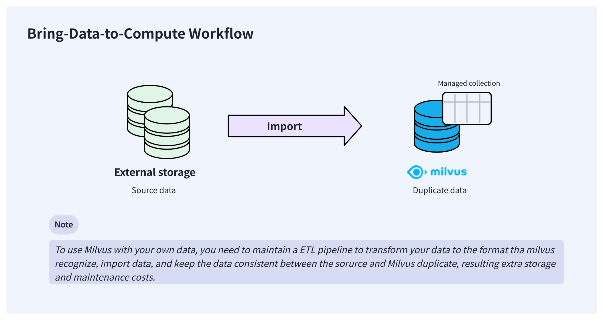
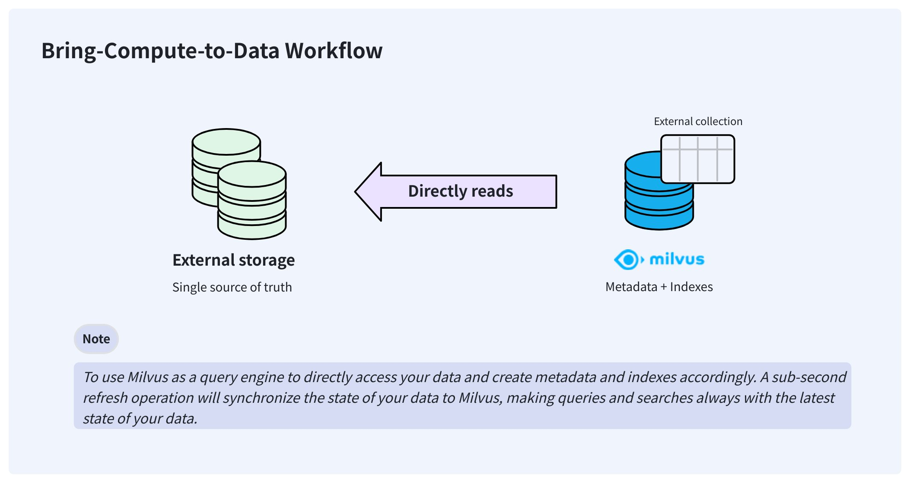

# Create an External Collection

An external collection is a type of data collection in Milvus that accesses data from external storage systems or database tables such as AWS S3 and Iceberg without copying it into Milvus. It acts as a query layer over data lakes while maintaining compatibility with Milvus query interfaces.

<div class="alert note">

This feature requires Storage V3. For enablement instructions and compatibility considerations, see [Storage V3](storage-v3.md).

</div>


## Overview

In a typical AI data pipeline, users may already have stored their data in Parquet or other formats on their storage system, such as AWS S3. To make Milvus consume this externally stored data, users usually need to import it into Milvus' own storage using Extract-Transform-Load (ETL) pipelines.

This bring-your-data-to-Milvus workflow creates redundant data that is hard to synchronize and adds to the engineering maintenance burden to ensure data consistency.



To resolve these issues, Milvus delivers external collections that let you access your externally stored data from Milvus without worrying about data synchronization and ETL pipelines.



Once created, an external collection can access your data directly and keep it in the same place where you store it. In the background, Milvus creates manifest files to record the mappings between the Milvus metadata and the rows in external data files. After the manifest files are ready, you can create indexes in the external collection as you would in any managed collection.

When your data changes, manually triggering a sub-second refresh updates the metadata, keeping Milvus always up to date.

## Step 1: Create schema

As with creating a managed collection, you also need to create a schema before creating an external collection. However, the schema is slightly different from that of a managed collection.

<div class="multipleCode">
    <a href="#python">Python</a>
    <a href="#java">Java</a>
    <a href="#go">Go</a>
    <a href="#javascript">NodeJS</a>
    <a href="#cpp">C++</a>
    <a href="#rust">Rust</a>
    <a href="#bash">cURL</a>
</div>

```python
from pymilvus import MilvusClient, DataType

schema = MilvusClient.create_schema(
    external_source='s3://s3.<region-id>.amazonaws.com/<bucket>/',
    external_spec='{
        "format": "parquet",
        "extfs": {
            ...
        }
    }'
)
```

```java
import com.google.gson.JsonObject;
import io.milvus.v2.service.collection.request.CreateCollectionReq;

JsonObject externalSpec = new JsonObject();
externalSpec.addProperty("format", "parquet");
externalSpec.add("extfs", new JsonObject());

CreateCollectionReq.CollectionSchema schema = CreateCollectionReq.CollectionSchema.builder()
        .externalSource("s3://s3.<region-id>.amazonaws.com/<bucket>/")
        .externalSpec(externalSpec)
        .build();
```

```go
import (
    "github.com/milvus-io/milvus/client/v2/entity"
    client "github.com/milvus-io/milvus/client/v2/milvusclient"
)

schema := entity.NewSchema().
    WithName("product_embeddings").
    WithExternalSource("s3://my-bucket/embeddings/").
    WithExternalSpec(`{"format": "parquet", "extfs": { ... }}`)
```

```javascript
// node
```

```cpp
#include "milvus/MilvusClientV2.h"

milvus::CollectionSchemaPtr schema = std::make_shared<milvus::CollectionSchema>();
schema->WithExternalSource("s3://s3.<region-id>.amazonaws.com/<bucket>/");
schema->WithExternalSpec({
    {"format", "parquet"},
    {"extfs", nlohmann::json::object()}
});
```

```rust
use milvus::v2 as sdk;
use milvus::v2::prelude::*;

let schema = sdk::CollectionSchema::new()
    .external_source("s3://s3.<region-id>.amazonaws.com/<bucket>/")
    .external_spec(serde_json::json!({
        "format": "parquet",
        "extfs": {}
    }));
```

```bash
export fields='[
        {
            "fieldName": "product_id",
            "dataType": "Int64",
            "isPrimary": true
        },
        {
            "fieldName": "embedding",
            "dataType": "FloatVector",
            "elementTypeParams": {
                "dim": "768"
            }
        },
        {
            "fieldName": "product_name",
            "dataType": "VarChar",
            "elementTypeParams": {
                "max_length": 512
            }
        }
    ]'
```

To create the schema for an external collection, you need to specify the source data URI, the data format, and authentication settings.

<table>
   <tr>
     <th><p>Parameter Name</p></th>
     <th><p>Parameter Description</p></th>
     <th><p>Example Value</p></th>
   </tr>
   <tr>
     <td><p><code>format</code></p></td>
     <td><p>Format of the target source data files.</p></td>
     <td><p><code>parquet</code></p></td>
   </tr>
   <tr>
     <td><p><code>snapshot_id</code></p></td>
     <td><p>A valid Iceberg table snapshot ID. This parameter applies only when you set <code>format</code> to <code>iceberg_table</code>.</p></td>
     <td><p><code>473984310232959286</code></p></td>
   </tr>
   <tr>
     <td><p><code>extfs</code></p></td>
     <td><p>External file system settings in a stringified JSON structure.</p></td>
     <td><p>--</p></td>
   </tr>
</table>

<details summary="Authentication Options">

You have the following options to set the authentication settings:

### Use AWS AK/SK

This option applies to self-hosted MinIO or the scenario where you have AK/SK for work.

```json
{
    "format": "...",
    "extfs": {
        "access_key_id":     "AKIA..",
        "access_key_value":  "u4Lh...",
        "region":            "us-west-2",
        "cloud_provider":    "aws",
        "use_ssl":           "true",
        "use_virtual_host":  "true"
    }
}
```

<table>
   <tr>
     <th><p>Parameter Name</p></th>
     <th><p>Parameter Description</p></th>
     <th><p>Example Value</p></th>
   </tr>
   <tr>
     <td><p><code>extfs.access_key_id</code></p></td>
     <td><p>Access key ID</p></td>
     <td><p><code>AKIA...</code></p></td>
   </tr>
   <tr>
     <td><p><code>extfs.access_key_value</code></p></td>
     <td><p>Access key value</p></td>
     <td><p><code>u7LH...</code></p></td>
   </tr>
   <tr>
     <td><p><code>extfs.region</code></p></td>
     <td><p>Cloud region ID</p></td>
     <td><p><code>us-west-2</code></p></td>
   </tr>
   <tr>
     <td><p><code>extfs.cloud_provider</code></p></td>
     <td><p>Cloud provider ID</p></td>
     <td><p><code>aws</code></p></td>
   </tr>
   <tr>
     <td><p><code>extfs.use_ssl</code></p></td>
     <td><p>Whether SSL is used to establish connections.</p></td>
     <td><p><code>true</code></p></td>
   </tr>
   <tr>
     <td><p><code>extfs.use_virtual_host</code></p></td>
     <td><p>Whether to use virtual hosting for access to your bucket.</p><p>For details, refer to <a href="https://docs.aws.amazon.com/AmazonS3/latest/userguide/VirtualHosting.html">this article</a>.</p></td>
     <td><p><code>true</code></p></td>
   </tr>
</table>

### Use AWS IAM

This option applies to the scenario where Milvus runs on an EC2 instance or an EKS cluster. In this case, you do not need to hardcode the AK/SK.

```json
{
    "format": "...",
    "extfs": {
        "use_iam":           "true",
        "iam_endpoint":      "https://sts.<region>.amazonaws.com",
        "region":            "us-west-2",
        "cloud_provider":    "aws",
        "use_ssl":           "true"
    }
}
```

<table>
   <tr>
     <th><p>Parameter Name</p></th>
     <th><p>Parameter Description</p></th>
     <th><p>Example Value</p></th>
   </tr>
   <tr>
     <td><p><code>extfs.use_iam</code></p></td>
     <td><p>Whether to use AWS IAM.</p><p>Set this to <code>"true"</code> for this option.</p></td>
     <td><p><code>true</code></p></td>
   </tr>
   <tr>
     <td><p><code>extfs.iam_endpoint</code></p></td>
     <td><p>A valid AWS STS endpoint. </p><p>For details, refer to <a href="https://docs.aws.amazon.com/IAM/latest/UserGuide/id_credentials_temp_region-endpoints.html">this article</a>.</p></td>
     <td><p><code>https:&ast;//&ast;sts.&lt;region&gt;.amazonaws.com</code></p></td>
   </tr>
   <tr>
     <td><p><code>extfs.region</code></p></td>
     <td><p>Cloud region ID</p></td>
     <td><p><code>us-west-2</code></p></td>
   </tr>
   <tr>
     <td><p><code>extfs.cloud_provider</code></p></td>
     <td><p>Cloud provider ID</p></td>
     <td><p><code>aws</code></p></td>
   </tr>
   <tr>
     <td><p><code>extfs.use_ssl</code></p></td>
     <td><p>Whether SSL is used to establish connections.</p></td>
     <td><p><code>true</code></p></td>
   </tr>
</table>

### Use Milvus global credentials

This option applies when you store external data in the Milvus bucket, and the global MinIO settings specified in `milvus.yaml` can be used directly to access the data.

```json
{
    "format": "...",
    "extfs": {
        "storage_type": "remote"
    }
}
```

### Use IAM Role ARN

This option applies when your organization uses different AWS accounts to manage the Milvus cluster and the bucket that holds the target data files.

In this case, the bucket owner should create an IAM role that

- Attaches `AmazonS3FullAccess` or a more fine-grained policy for bucket access.

- Includes a self-defined `sts:ExternalId` in the Condition field of the role's Trust Policy.

Then, the bucket owner should provide you with the IAM role ARN and the External ID so you can call `sts:AssumeRole` with those values to assume the IAM Role.

The following is an example permission policy to be attached to the IAM role with the allowed permissions. You can adjust this to meet your requirements.

```json
{
    "Version": "2012-10-17",
    "Statement": [
        {
            "Effect": "Allow",
            "Action": [
                "s3:ListBucket",
                "s3:GetBucketLocation"
            ],
            "Resource": "arn:aws:s3:::SOURCE-DATA-BUCKET"
        },
        {
            "Effect": "Allow",
            "Action": [
                "s3:GetObject",
                "s3:PutObject",
                "s3:DeleteObject"
            ],
            "Resource": "arn:aws:s3:::SOURCE-DATA-BUCKET/*"
        }
    ]
}
```

And the trust policy associated with the IAM role defines who is allowed to assume it.

```json
{
  "Version": "2012-10-17",
  "Statement": [
    {
      "Effect": "Allow",
      "Principal": {
        "AWS": "arn:aws:iam::ACCOUNT_RUNNING_MILVUS:root"
      },
      "Action": "sts:AssumeRole",
      "Condition": {
        "StringEquals": {
          "sts:ExternalId": "YOUR_UNIQUE_EXTERNAL_ID"
        }
      }
    }
  ]
}
```

Once you have obtained the IAM Role ARN and the External ID, you can set up the `external_spec` parameter as follows:

```json
{
    "format": "...",
    "extfs": {
        "cloud_provider": "aws",
        "region": "us-west-2",
        "storage_type": "remote",
        "use_ssl": "true",
        "use_iam": "true",
        "role_arn": "arn:aws:iam::306787000000:role/lentitude-bucket-role",
        "external_id": "YOUR_UNIQUE_EXTERNAL_ID",
        "load_frequency": "900"
    }
}
```

<table>
   <tr>
     <th><p>Parameter Name</p></th>
     <th><p>Parameter Description</p></th>
     <th><p>Example Value</p></th>
   </tr>
   <tr>
     <td><p><code>extfs.cloud_provider</code></p></td>
     <td><p>Cloud provider ID</p></td>
     <td><p><code>aws</code></p></td>
   </tr>
   <tr>
     <td><p><code>extfs.region</code></p></td>
     <td><p>Cloud region ID</p></td>
     <td><p><code>us-west-2</code></p></td>
   </tr>
   <tr>
     <td><p><code>extfs.use_ssl</code></p></td>
     <td><p>Whether SSL is used to establish connections.</p></td>
     <td><p><code>true</code></p></td>
   </tr>
   <tr>
     <td><p><code>extfs.use_iam</code></p></td>
     <td><p>Whether to use AWS IAM.</p><p>Set this to <code>"true"</code> for this option.</p></td>
     <td><p><code>true</code></p></td>
   </tr>
   <tr>
     <td><p><code>extfs.role_arn</code></p></td>
     <td><p>IAM Role ARN obtained from the bucket owner.</p></td>
     <td><p><code>arn:aws:iam::306787000000:role/...</code></p></td>
   </tr>
   <tr>
     <td><p><code>extfs.external_id</code></p></td>
     <td><p>External ID obtained from the bucket owner.</p></td>
     <td><p>--</p></td>
   </tr>
   <tr>
     <td><p><code>extfs.load_frequency</code></p></td>
     <td><p>Interval at which Milvus retrieves temporary authentication credentials in seconds.</p></td>
     <td><p><code>900</code></p></td>
   </tr>
</table>

</details>

## Step 2: Add fields

Once the schema is ready, you can add fields as follows:

<div class="multipleCode">
    <a href="#python">Python</a>
    <a href="#java">Java</a>
    <a href="#go">Go</a>
    <a href="#javascript">NodeJS</a>
    <a href="#cpp">C++</a>
    <a href="#rust">Rust</a>
    <a href="#bash">cURL</a>
</div>

```python
schema.add_field(
    field_name="product_id",
    datatype=DataType.INT64,
    # highlight-next-line
    external_field="id" # field name in the external data file
)
schema.add_field(
    field_name="product_name",
    datatype=DataType.VARCHAR,
    max_length=512,
    # highlight-next-line
    external_field="name"
)
schema.add_field(
    field_name="embedding",
    datatype=DataType.FLOAT_VECTOR,
    dim=768,
    # highlight-next-line
    external_field="vector"
)
```

```java
import io.milvus.v2.common.DataType;
import io.milvus.v2.service.collection.request.AddFieldReq;

schema.addField(AddFieldReq.builder()
        .fieldName("product_id")
        .dataType(DataType.Int64)
        .externalField("id")
        .build());
schema.addField(AddFieldReq.builder()
        .fieldName("product_name")
        .dataType(DataType.VarChar)
        .maxLength(512)
        .externalField("name")
        .build());
schema.addField(AddFieldReq.builder()
        .fieldName("embedding")
        .dataType(DataType.FloatVector)
        .dimension(768)
        .externalField("vector")
        .build());
```

```go
import (
    "github.com/milvus-io/milvus/client/v2/entity"
    client "github.com/milvus-io/milvus/client/v2/milvusclient"
)

schema = schema.
    WithField(
        entity.NewField().
            WithName("product_id").
            WithDataType(entity.FieldTypeInt64).
            WithExternalField("id"),
    ).
    WithField(
        entity.NewField().
            WithName("product_name").
            WithDataType(entity.FieldTypeVarChar).
            WithMaxLength(512).
            WithExternalField("name"),
    ).
    WithField(
        entity.NewField().
            WithName("embedding").
            WithDataType(entity.FieldTypeFloatVector).
            WithDim(768).
            WithExternalField("vector"),
    )
```

```javascript
// node
```

```cpp
schema->AddField(milvus::FieldSchema("product_id", milvus::DataType::INT64)
                     .WithExternalField("id"));
schema->AddField(milvus::FieldSchema("product_name", milvus::DataType::VARCHAR)
                     .WithMaxLength(512)
                     .WithExternalField("name"));
schema->AddField(milvus::FieldSchema("embedding", milvus::DataType::FLOAT_VECTOR)
                     .WithDimension(768)
                     .WithExternalField("vector"));
```

```rust
let schema = schema
    .add_field(
        sdk::FieldSchema::new()
            .name("product_id")
            .data_type(sdk::DataType::Int64)
            .external_field("id"),
    )
    .add_field(
        sdk::FieldSchema::new()
            .name("product_name")
            .data_type(sdk::DataType::VarChar)
            .max_length(512)
            .external_field("name"),
    )
    .add_field(
        sdk::FieldSchema::new()
            .name("embedding")
            .data_type(sdk::DataType::FloatVector)
            .dimension(768)
            .external_field("vector"),
    );
```

```bash
export schema="{
    \"externalSource\": \"volume://my_volume/path/to/a/folder\",
    \"externalSpec\": \"{\\\"format\\\": \\\"parquet\\\"}\",
    \"fields\": $fields
}"
```

## Step 3: Create a collection

After adding all the fields to the schema, you can create the external collection.

<div class="multipleCode">
    <a href="#python">Python</a>
    <a href="#java">Java</a>
    <a href="#go">Go</a>
    <a href="#javascript">NodeJS</a>
    <a href="#cpp">C++</a>
    <a href="#rust">Rust</a>
    <a href="#bash">cURL</a>
</div>

```python
client = MilvusClient(
    uri="http://localhost:19530",
    token="root:Milvus"
)

client.create_collection(
    collection_name="test_collection",
    schema=schema
)
```

```java
import io.milvus.v2.client.ConnectConfig;
import io.milvus.v2.client.MilvusClientV2;

ConnectConfig connectConfig = ConnectConfig.builder()
        .uri("http://localhost:19530")
        .token("root:Milvus")
        .build();

MilvusClientV2 client = new MilvusClientV2(connectConfig);

CreateCollectionReq createReq = CreateCollectionReq.builder()
        .collectionName("test_collection")
        .collectionSchema(schema)
        .build();
client.createCollection(createReq);
```

```go
import (
    "github.com/milvus-io/milvus/client/v2/entity"
    client "github.com/milvus-io/milvus/client/v2/milvusclient"
)

ctx, cancel := context.WithCancel(context.Background())
defer cancel()

milvusAddr := "http://localhost:19530"
token := "root:Milvus"

client, err := milvusclient.New(ctx, &milvusclient.ClientConfig{
    Address: milvusAddr,
    APIKey: token
})

err = client.CreateCollection(ctx, milvusclient.NewCreateCollectionOption("test_collection", schema))

if err != nil {
    fmt.Println(err.Error())
    // handle error
}
```

```javascript
// node
```

```cpp
auto client = milvus::MilvusClientV2::Create();
milvus::ConnectParam connect_param{"http://localhost:19530", "root:Milvus"};
auto status = client->Connect(connect_param);
if (!status.IsOk()) {
    std::cerr << status.Message() << std::endl;
    return;
}

milvus::CreateCollectionRequest create_request;
create_request.WithCollectionName("test_collection")
    .WithCollectionSchema(schema);
status = client->CreateCollection(create_request);
if (!status.IsOk()) {
    std::cerr << status.Message() << std::endl;
    return;
}
```

```rust
let client = ClientV2::new(
    &ConnectConfig::new()
        .uri("http://localhost:19530")
        .token("root:Milvus"),
)
.await?;

client
    .create_collection(
        CreateCollectionRequest::builder()
            .collection_name("test_collection")
            .schema(schema)
            .build()?,
    )
    .await?;
```

```bash
curl --request POST \
--url "${PROJECT_ENDPOINT}/v2/vectordb/collections/create" \
--header "Authorization: Bearer ${TOKEN}" \
--header "Content-Type: application/json" \
--header "Request-Timeout: 10" \
-d "{
    \"dbName\": \"my_database\",
    \"collectionName\": \"test_collection\",
    \"schema\": $schema
}"
```

## Step 4: Create indexes

You can create indexes for external collection fields as you do in managed collections.

<div class="multipleCode">
    <a href="#python">Python</a>
    <a href="#java">Java</a>
    <a href="#go">Go</a>
    <a href="#javascript">NodeJS</a>
    <a href="#cpp">C++</a>
    <a href="#rust">Rust</a>
    <a href="#bash">cURL</a>
</div>

```python
index_params = client.prepare_index_params()
# Add indexes
index_params.add_index(
    field_name="embedding",
    index_type="AUTOINDEX",
    metric_type="COSINE"
)
index_params.add_index(
    field_name="product_name",
    index_type="AUTOINDEX"
)
client.create_index(
    db_name="my_database",
    collection_name="test_collection",
    index_params=index_params
)
```

```java
import io.milvus.v2.common.IndexParam;
import io.milvus.v2.service.index.request.CreateIndexReq;
import java.util.*;

IndexParam indexParamForIdField = IndexParam.builder()
        .fieldName("product_name")
        .indexType(IndexParam.IndexType.AUTOINDEX)
        .build();
IndexParam indexParamForVectorField = IndexParam.builder()
        .fieldName("embedding")
        .indexType(IndexParam.IndexType.AUTOINDEX)
        .metricType(IndexParam.MetricType.COSINE)
        .build();
List<IndexParam> indexParams = new ArrayList<>();
indexParams.add(indexParamForIdField);
indexParams.add(indexParamForVectorField);
CreateIndexReq createIndexReq = CreateIndexReq.builder()
        .dbName("my_database")
        .collectionName("test_collection")
        .indexParams(indexParams)
        .build();
client.createIndex(createIndexReq);
```

```go
import (
    "github.com/milvus-io/milvus/client/v2/entity"
    "github.com/milvus-io/milvus/client/v2/index"
    "github.com/milvus-io/milvus/client/v2/milvusclient"
)

collectionName := "test_collection"
indexOptions := []milvusclient.CreateIndexOption{
    milvusclient.NewCreateIndexOption(collectionName, "embedding", index.NewAutoIndex(entity.COSINE)),
    milvusclient.NewCreateIndexOption(collectionName, "product_name", index.NewAutoIndex(index.AUTOINDEX)),
}
indexTask, err := client.CreateIndex(ctx, indexOptions)
if err != nil {
    // handler err
}
err = indexTask.Await(ctx)
if err != nil {
    // handler err
}
```

```javascript
client.createIndex({
    db_name: "my_database",
    collection_name: "test_collection",
    field_name: "product_name",
    index_type: "AUTOINDEX"
})
client.createIndex({
    db_name: "my_database",
    collection_name: "test_collection",
    field_name: "embedding",
    index_type: "AUTOINDEX",
    metric_type: "COSINE"
})
```

```cpp
std::vector<milvus::IndexDesc> indexes;
indexes.emplace_back(milvus::IndexDesc(
    "embedding", "my_vector", milvus::IndexType::AUTOINDEX, milvus::MetricType::COSINE));
indexes.emplace_back(milvus::IndexDesc(
    "product_name", "my_id", milvus::IndexType::AUTOINDEX));
milvus::CreateIndexRequest create_index_request;
create_index_request.WithDatabaseName("my_database")
    .WithCollectionName("test_collection")
    .WithIndexes(std::move(indexes));
status = client->CreateIndex(create_index_request);
if (!status.IsOk()) {
    std::cerr << status.Message() << std::endl;
    return;
}
```

```rust
client
    .create_index(
        CreateIndexRequest::builder()
            .collection_name("test_collection")
            .index_params(vec![
                IndexParam::new()
                    .field_name("embedding")
                    .index_type(IndexType::AutoIndex)
                    .metric_type(MetricType::Cosine),
                IndexParam::new()
                    .field_name("product_name")
                    .index_type(IndexType::AutoIndex),
            ])
            .build()?,
    )
    .await?;
```

```bash
export indexParams='[
        {
            "fieldName": "embedding",
            "indexName": "my_vector",
            "indexType": "AUTOINDEX"
        },
        {
            "fieldName": "product_name",
            "indexName": "my_id",
            "indexType": "AUTOINDEX"
        }
    ]'

curl --request POST \
--url "${PROJECT_ENDPOINT}/v2/vectordb/indexes/create" \
--header "Authorization: Bearer ${TOKEN}" \
--header "Content-Type: application/json" \
--header "Request-Timeout: 10" \
-d "{
    \"dbName\": \"my_database\",
    \"collectionName\": \"test_collection\",
    \"indexParams\": $indexParams
}"
```

## Step 5: Refresh data

Once the collection is ready, refresh it to create the metadata and indexes for your data.

<div class="multipleCode">
    <a href="#python">Python</a>
    <a href="#java">Java</a>
    <a href="#go">Go</a>
    <a href="#javascript">NodeJS</a>
    <a href="#cpp">C++</a>
    <a href="#rust">Rust</a>
    <a href="#bash">cURL</a>
</div>

```python
job_id = client.refresh_external_collection(
    db_name="my_database",
    collection_name="test_collection"
)
while True:
    progress = client.get_refresh_external_collection_progress(job_id=job_id)
    print(f"  {progress.state}: {progress.progress}%")
    if progress.state == "RefreshCompleted":
        elapsed = progress.end_time - progress.start_time
        print(f"  Completed in {elapsed}ms")
        break
    elif progress.state == "RefreshFailed":
        print(f"  Failed: {progress.reason}")
        break
    time.sleep(2)
```

```java
import io.milvus.v2.service.utility.request.GetRefreshExternalCollectionProgressReq;
import io.milvus.v2.service.utility.request.ListRefreshExternalCollectionJobsReq;
import io.milvus.v2.service.utility.request.RefreshExternalCollectionReq;
import io.milvus.v2.service.utility.response.GetRefreshExternalCollectionProgressResp;
import io.milvus.v2.service.utility.response.ListRefreshExternalCollectionJobsResp;
import io.milvus.v2.service.utility.response.RefreshExternalCollectionJobInfo;
import io.milvus.v2.service.utility.response.RefreshExternalCollectionResp;

while (true) {
    GetRefreshExternalCollectionProgressResp resp = client.getRefreshExternalCollectionProgress(
            GetRefreshExternalCollectionProgressReq.builder()
                    .jobId(jobId)
                    .build());
    RefreshExternalCollectionJobInfo jobInfo = resp.getJobInfo();
    if ("RefreshCompleted".equals(jobInfo.getState())) {
        long elapsed = jobInfo.getEndTime() - jobInfo.getStartTime();
        System.out.printf("  Refresh completed in %dms%n", elapsed);
        break;
    } else if ("RefreshFailed".equals(jobInfo.getState())) {
        System.out.printf("  Refresh failed: %s%n", jobInfo.getReason());
    }
    TimeUnit.SECONDS.sleep(2);
}
```

```go
refreshResult, err := client.RefreshExternalCollection(ctx,
    client.NewRefreshExternalCollectionOption("test_collection"))
jobID := refreshResult.JobID
for {
    progress, _ := client.GetRefreshExternalCollectionProgress(ctx,
        client.NewGetRefreshExternalCollectionProgressOption(jobID))
    fmt.Printf("State: %s\n", progress.State)
    if progress.State == entity.RefreshStateCompleted {
        fmt.Println("Refresh completed!")
        break
    }
    if progress.State == entity.RefreshStateFailed {
        fmt.Printf("Refresh failed: %s\n", progress.Reason)
        break
    }
    time.Sleep(2 * time.Second)
}
```

```javascript
// node
```

```cpp
milvus::RefreshExternalCollectionRequest refresh_request;
refresh_request.WithDatabaseName("my_database")
    .WithCollectionName("test_collection");
milvus::RefreshExternalCollectionResponse refresh_response;
status = client->RefreshExternalCollection(refresh_request, refresh_response);
if (!status.IsOk()) {
    std::cerr << status.Message() << std::endl;
    return;
}
int64_t job_id = refresh_response.JobID();

while (true) {
    milvus::GetRefreshExternalCollectionProgressRequest progress_request;
    progress_request.WithJobID(job_id);
    milvus::GetRefreshExternalCollectionProgressResponse progress_response;
    status = client->GetRefreshExternalCollectionProgress(progress_request, progress_response);
    if (!status.IsOk()) {
        std::cerr << status.Message() << std::endl;
        return;
    }
    const auto& job_info = progress_response.JobInfo();
    std::cout << "  " << std::to_string(job_info.State()) << ": " << job_info.Progress() << "%" << std::endl;
    if (job_info.State() == milvus::RefreshExternalCollectionStateCode::COMPLETED) {
        auto elapsed = job_info.EndTime() - job_info.StartTime();
        std::cout << "  Completed in " << elapsed << "ms" << std::endl;
        break;
    } else if (job_info.State() == milvus::RefreshExternalCollectionStateCode::FAILED) {
        std::cout << "  Failed: " << job_info.Reason() << std::endl;
        break;
    }
    std::this_thread::sleep_for(std::chrono::seconds(2));
}
```

```rust
let refresh = client
    .refresh_external_collection(
        RefreshExternalCollectionRequest::builder()
            .database_name("my_database")
            .collection_name("test_collection")
            .build()?,
    )
    .await?;
let job_id = refresh.job_id();
loop {
    let progress = client
        .get_refresh_external_collection_progress(
            GetRefreshExternalCollectionProgressRequest::builder()
                .job_id(job_id)
                .build()?,
        )
        .await?;
    let job_info = progress.job_info();
    println!(
        "  {}: {}%",
        job_info.get_state().as_str(),
        job_info.get_progress()
    );
    match job_info.get_state() {
        RefreshExternalCollectionStateCode::Completed => {
            let elapsed = job_info.get_end_time() - job_info.get_start_time();
            println!("  Completed in {}ms", elapsed);
            break;
        }
        RefreshExternalCollectionStateCode::Failed => {
            println!("  Failed: {}", job_info.get_reason());
            break;
        }
        _ => tokio::time::sleep(std::time::Duration::from_secs(2)).await,
    }
}
```

```bash
curl --request POST \
--url "${PROJECT_ENDPOINT}/v2/vectordb/jobs/external_collection/refresh" \
--header "Authorization: Bearer ${TOKEN}" \
--header "Content-Type: application/json" \
--header "Request-Timeout: 10" \
-d "{
    \"dbName\": \"my_database\",
    \"collectionName\": \"test_collection\",
    \"externalSource\": \"volume://my_volume/path/to/a/folder\",
    \"externalSpec\": \"{\\\"format\\\": \\\"parquet\\\"}\"
}"
```

The refresh operation is asynchronous, so you need to set up an iteration to monitor its progress.

<div class="alert note">

- The refresh operation scans the metadata of the data files and generates the manifest files accordingly. It usually takes 150-250 ms.

- The manifest files record the mapping between the metadata in Milvus and the rows in external files.

- If there is an update to your source data, you need to manually call refresh again to keep Milvus up to date.

- A refresh that requires removing all active metadata without any insertions results in a denial.

</div>

## Next steps

Once you have refreshed the external collection, you can load and release the collection and perform similarity searches and queries in the external collection as you would in any managed collection, except that collections in a database for on-demand computing must be attached to an on-demand cluster for searches and queries.

Before conducting DQL operations, such as search, query, get, and hybrid search, you need to create a session to attach the compute resources of an on-demand cluster.

If the external data source later contains another field that you want to expose in Milvus, add a field to the external collection schema and refresh the external collection again. For details, refer to [Alter External Collection Schema](alter-external-collection-schema.md).
