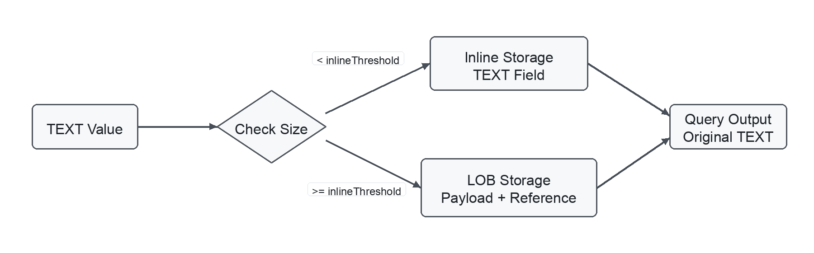

# Text Field

In AI search applications, vector search helps you find semantically similar entities, but the application often also needs the original source text behind each match. An LLM or agent can use that text as context to read, cite, summarize, or include the result in a prompt.

Milvus provides the `TEXT` scalar field type for storing long source text directly with entities. Typical values include passages, long documents, article bodies, tickets, and logs. Unlike `VARCHAR`, which requires a fixed `max_length`, `TEXT` does not require you to set a maximum byte length in the collection schema.

To define a `TEXT` field, set `datatype` to `DataType.TEXT`.

```python
schema.add_field(
    field_name="content",
    # highlight-next-line
    datatype=DataType.TEXT,
)
```

After the field is defined, each entity can include a string value in that field. You insert `TEXT` values like other scalar fields and return them from query or search results by listing the field in `output_fields`.

<div class="alert note">

`TEXT` fields support null values. To enable this feature, set `nullable` to `True`. For details, refer to [Nullable Field](nullable-and-default.md).

</div>

## Limits

- A `TEXT` field cannot be a primary field. Primary fields support `INT64` and `VARCHAR`.
- In Milvus 3.0.0, `TEXT` fields do not support `PHRASE_MATCH`.
- In Milvus 3.0.0, `TEXT` fields do not support default values.
- In Milvus 3.0.0, `TEXT` fields are not supported in external collections.
- In Milvus 3.0.0, `TEXT` fields do not support scalar indexes.
- `TEXT` is not intended for regular metadata filtering. If you need to filter on short string metadata and the field value fits within the `VARCHAR` length limit, use `VARCHAR`.

## Choose TEXT or VARCHAR

`TEXT` and `VARCHAR` both store string values, but they support different application needs. Use `VARCHAR` for short, bounded metadata that identifies, categorizes, or filters entities. Use `TEXT` for longer source content that gives an LLM or agent enough context to read, cite, summarize, or build a prompt.

| Aspect                | `VARCHAR`                                                                                                                  | `TEXT`                                                                                                                                                 |
| --------------------- | -------------------------------------------------------------------------------------------------------------------------- | ------------------------------------------------------------------------------------------------------------------------------------------------------ |
| Best for              | Short metadata used to identify, categorize, or filter entities, such as `title`, `tag`, `category`, or `external_id`.     | Longer source content used by LLM or agent workflows, such as `content`, `passage`, `article_body`, or `log_message`.                                  |
| Length setting        | Requires `max_length`, which defines the maximum number of bytes the field can store. The maximum value is `65,535` bytes. If a value may exceed this limit, use `TEXT`. | Does not require `max_length`, so the schema does not need a fixed byte limit for the text value. |
| Storage behavior      | Stores each value within the field's configured `max_length`.                                                              | Uses automatic storage selection for larger text values. For details, see [How Milvus stores large TEXT values](#how-milvus-stores-large-text-values). |
| Primary field support | Can be used as a primary field.                                                                                            | Cannot be used as a primary field.                                                                                                                     |
| Filtering             | Use for short string metadata that needs to appear in filter expressions, such as `category == "news"` or `tag in ["ai", "database"]`. | Not intended for regular metadata filtering.                                                                                                           |

For details about `VARCHAR` fields, refer to [VarChar Field](string.md).

## How Milvus stores large TEXT values

<details>

<summary>Expand to see how it works</summary>

When you insert an entity, the string you provide for a `TEXT` field is the `TEXT` value. Milvus compares the size of that value with [dataNode.text.inlineThreshold](configure_datanode.md#dataNodetextinlineThreshold), which is `65,536` bytes by default, and then chooses one of two internal storage paths.



- **Inline storage**: If a `TEXT` value is smaller than `dataNode.text.inlineThreshold`, Milvus stores the original text value directly in the `TEXT` field data.
- **LOB storage**: If a `TEXT` value is greater than or equal to `dataNode.text.inlineThreshold`, Milvus treats the value as a large object and stores the original text separately in object storage, such as MinIO. The `TEXT` field data stores an internal reference to the separately stored text. When the `TEXT` field is requested in query or search results, Milvus uses the reference to retrieve and return the original text.

This storage selection is internal. You insert, query, and search the `TEXT` field in the same way regardless of which storage path Milvus uses. To tune the threshold or related storage, compaction, and garbage-collection behavior, refer to [dataNode-related Configurations](configure_datanode.md) and [dataCoord-related Configurations](configure_datacoord.md).

If your deployment uses object storage, large `TEXT` values may appear as Milvus-managed objects under paths such as `lobs/...`. These objects are implementation details and should not be moved, copied, or deleted manually. After you delete entities, drop partitions, or compact data, object storage usage may decrease only after Milvus garbage collection removes unreferenced large-object data after its safety window.

</details>

A common use of `TEXT` is Full Text Search with BM25. In this pattern, the `TEXT` field stores the original source content, and BM25 analyzes the text and generates sparse vectors for ranking keyword-based matches. Search results can then return the matched `TEXT` value as context for LLM or agent workflows. The following example shows how to use a `TEXT` field as the input field for BM25. To learn about Full Text Search concepts and query options, refer to [Full Text Search](full-text-search.md).

## Step 1: Create a collection with a TEXT field

The following example creates a collection with a `TEXT` field for source content and a sparse vector field for BM25-generated sparse vectors. The BM25 function converts the tokenized text from `content` into sparse vectors stored in `sparse`.

For BM25 full text search, the input `TEXT` field must set `enable_analyzer=True`.

```python
from pymilvus import DataType, Function, FunctionType, MilvusClient

client = MilvusClient(uri="http://localhost:19530")
COLLECTION_NAME = "text_bm25_collection"

if client.has_collection(COLLECTION_NAME):
    client.drop_collection(COLLECTION_NAME)

schema = client.create_schema(auto_id=False, enable_dynamic_field=False)
schema.add_field(field_name="id", datatype=DataType.INT64, is_primary=True)
# highlight-start
schema.add_field(
    field_name="content",
    datatype=DataType.TEXT,
    enable_analyzer=True,
)
# highlight-end
schema.add_field(field_name="sparse", datatype=DataType.SPARSE_FLOAT_VECTOR)

# highlight-start
bm25_function = Function(
    name="content_bm25",
    input_field_names=["content"],
    output_field_names=["sparse"],
    function_type=FunctionType.BM25,
)
schema.add_function(bm25_function)
# highlight-end
```

## Step 2: Create a sparse vector index

Create an index on the sparse vector field generated by the BM25 function. The metric type must be set to `BM25`.

```python
index_params = client.prepare_index_params()
# highlight-start
index_params.add_index(
    field_name="sparse",
    index_type="SPARSE_INVERTED_INDEX",
    metric_type="BM25",
    params={
        "inverted_index_algo": "DAAT_MAXSCORE",
        "bm25_k1": 1.2,
        "bm25_b": 0.75,
    },
)
# highlight-end

client.create_collection(
    collection_name=COLLECTION_NAME,
    schema=schema,
    index_params=index_params,
)
```

## Step 3: Insert TEXT data

Insert text directly into the `TEXT` field. Do not provide values for the `sparse` field. Milvus generates the sparse vectors internally by applying the BM25 function to `content`.

```python
data = [
    {
        "id": 1,
        "content": "Milvus stores vector embeddings and scalar fields in collections. It supports vector search, full text search, and metadata filtering for retrieval applications.",
    },
    {
        "id": 2,
        "content": "Long documents are often split into passages before embedding. Store each passage in a TEXT field so search results can return the source text.",
    },
    {
        "id": 3,
        "content": "Operational logs and support tickets often contain long natural-language text. TEXT fields can store these values without a fixed max_length setting.",
    },
]

client.insert(collection_name=COLLECTION_NAME, data=data)
client.load_collection(collection_name=COLLECTION_NAME)
```

## Step 4: Perform BM25 full text search

Use raw query text as the search data and search against the sparse vector field. Milvus converts the query text into a sparse vector, ranks matches with BM25, and returns the requested `TEXT` field in `output_fields`.

```python
results = client.search(
    collection_name=COLLECTION_NAME,
    # highlight-start
    data=["how does Milvus store source text for retrieval"],
    anns_field="sparse",
    limit=2,
    output_fields=["content"],
    # highlight-end
)
```

## Step 5: Read the returned TEXT values

Each search hit includes the BM25 score and the original `TEXT` value.

```python
for hit in results[0]:
    print(f"id: {hit['id']}, score: {hit['distance']}")
    print(hit["entity"]["content"])
```

For more information about BM25 functions, sparse vector indexes, and query syntax for full text search, refer to [Full Text Search](full-text-search.md).
