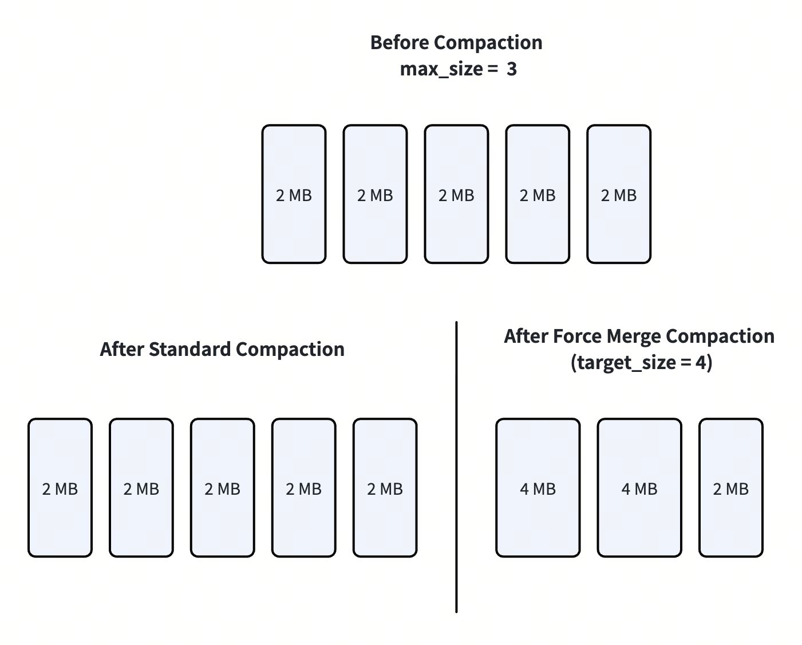

# Force Merge Compaction

Force Merge is designed to consolidate small and fragmented segments into fewer and larger ones to improve query performance and storage efficiency. This guide explains how to use force merge compaction.

<div class="alert note">

This feature is in public preview. Do not use it in production environments.

</div>

## Overview

Standard [compaction](https://milvus.io/api-reference/pymilvus/v2.6.x/MilvusClient/Management/compact.md) keeps segment sizes near the configured `maxSize` through many-to-one merges, but it can still leave mid-sized fragments that cannot be merged further without exceeding limits. For example, as illustrated below, if a collection has five 2 MB segments and `maxSize` is 3 MB, merging any two segments would exceed the limit, so standard compaction cannot further reduce the segment count and the fragmented layout remains.

Force merge adds a `target_size` parameter and supports reorganizing segments toward the desired size within a tight tolerance when possible. As illustrated below, if the specified `target_size` is 4 MB, the five 2 MB small segments can be further merged into fewer larger segments. This reduces excess segment counts, supports targets larger than the default `maxSize` settings, and, when the target is very large, lets the system choose a practical output size and segment count for the current hardware and QueryNode topology.

To understand which compaction method to use, see [FAQ](#faq).



Force merge compaction extends the existing [`Compaction`](https://milvus.io/api-reference/pymilvus/v2.6.x/MilvusClient/Management/compact.md) API with a `target_size` parameter. It is fully backward-compatible: existing compaction calls without `target_size` continue to work as before.

Force merge operates asynchronously. It does not block search or query operations, though it consumes I/O and memory resources during execution.

## Use Force Merge Compaction

### Prerequisites

- Milvus version 3.0 or later

- PyMilvus 3.0 or later

### Global Configuration

The following configuration parameters control Force Merge behavior. Set them in the Milvus configuration file or via environment variables.

```yaml
dataCoord:
  segment:
    maxSize: 512         # Default segment max size (MB).
                         # Used when target_size is 0 or omitted.
  compaction:
    maxFullSegmentThreshold: 100
                         # When segment count exceeds this threshold,
                         # a faster greedy algorithm is used instead
                         # of the standard merge algorithm.
    forceMerge:
      datanodeMemoryFactor: 4.0
                         # DataNode memory divided by this factor
                         # determines the the largest segment
                         # size the system can allow.
      querynodeMemoryFactor: 4.0
                         # Minimum QueryNode memory divided by this
                         # factor. Used in automatic size calculation
                         # to ensure merged segments can be loaded.
```

<table>
   <tr>
     <th><p>Parameter</p></th>
     <th><p>Default Value</p></th>
     <th><p>Description</p></th>
   </tr>
   <tr>
     <td><p><code>dataCoord.segment.maxSize</code></p></td>
     <td><p>512</p></td>
     <td><p>Default segment max size in MB. Used as the target when <code>target_size</code> is 0 or omitted. Also serves as the minimum allowed value for explicit <code>target_size</code>.</p></td>
   </tr>
   <tr>
     <td><p><code>dataCoord.compaction.maxFullSegmentThreshold</code></p></td>
     <td><p>100</p></td>
     <td><p>Segment count threshold for algorithm selection. When the number of segments exceeds this value, Milvus uses a faster greedy algorithm for merge planning.</p><ul><li><p><strong>Standard algorithm</strong> (used when segment count &lt;= <code>dataCoord.compaction.maxFullSegmentThreshold</code>): produces more optimal merge results but takes longer to compute.</p></li><li><p><strong>Greedy algorithm</strong> (used when segment count &gt; <code>dataCoord.compaction.maxFullSegmentThreshold</code>): completes planning much faster at the cost of slightly less optimal segment grouping.</p></li></ul></td>
   </tr>
   <tr>
     <td><p><code>dataCoord.compaction.forceMerge.datanodeMemoryFactor</code></p></td>
     <td><p>4.0</p></td>
     <td><p>DataNode memory is divided by this factor to calculate the largest segment size the system can allow.</p><ul><li><p>A larger value allocates less memory to merging but leaves more for other DataNode operations, improving  node stability.</p></li><li><p>A smaller value allows larger merges but increases memory pressure.</p></li><li><p>For example, with the default factor of 4.0 and a DataNode with 16 GB memory, the merge budget is 4 GB. This means the total size of segments being merged in a single operation cannot exceed 4 GB.</p></li></ul></td>
   </tr>
   <tr>
     <td><p><code>dataCoord.compaction.forceMerge.querynodeMemoryFactor</code></p></td>
     <td><p>4.0</p></td>
     <td><p>The minimum QueryNode memory is divided by this factor. Used during automatic size calculation (<code>target_size=max_int64</code>) to ensure that merged segments can be loaded by QueryNodes.</p><ul><li><p>A larger value produces smaller segments that are easier for QueryNodes to load.</p></li><li><p>A smaller value allows larger segments but may cause load failures on memory-constrained QueryNodes.</p></li><li><p>For example, with the default factor of 4.0 and the smallest QueryNode having 16 GB memory, the auto-calculated target size will not exceed 4 GB. This prevents Force Merge from producing segments so large that QueryNodes cannot load them.</p></li></ul></td>
   </tr>
</table>

To apply the above changes to your Milvus cluster, please follow the steps in [Configure Milvus with Helm](configure-helm.md#Configure-Milvus-via-configuration-file) and [Configure Milvus with Milvus Operators](configure_operator.md).

### Trigger Force Merge Compaction

You trigger Force Merge compaction by calling `compact()` with the `target_size` parameter. For parameter details, see [Parameter reference](#parameter-reference) below.

Three force merge compaction modes are available:

```plaintext
compact("my_collection", target_size=?)
│
├─ Mode 1: target_size = 0 (or omitted)
│  Uses config maxSize (default 512 MB)
│  Equivalent to standard compaction
│
├─ Mode 2: target_size = 2048
│  Merges segments to ~2 GB each
│  Must be >= config maxSize
│
└─ Mode 3: target_size = max_int64
   Auto-calculates optimal size based on
   segment distribution and node memory
```

The following are examples to show how to use each force merge compaction mode.

#### Default (standard compaction)

```python
from pymilvus import MilvusClient

client = MilvusClient(
    uri="http://localhost:19530",
    token="root:Milvus"
)

# Standard compaction — uses config maxSize (default 512 MB)
job_id = client.compact("target_collection")
```

#### Explicit target size

```python
# Merge segments to approximately 2 GB each
job_id = client.compact(
    "target_collection",
    target_size="2048"  # The unit is MB
)
```

#### Automatic size calculation

```python
# Let Milvus determine the optimal segment size
max_int64 = (1 << 63) - 1
job_id = client.compact(
    "target_collection",
    target_size=max_int64
)
```

<a id="parameter-reference"></a>

#### Parameter reference

The following table explains the parameters.

<table>
   <tr>
     <th><p><strong>Parameter</strong></p></th>
     <th><p><strong>Type</strong></p></th>
     <th><p><strong>Description</strong></p></th>
   </tr>
   <tr>
     <td><p><code>collection_name</code></p></td>
     <td><p>str</p></td>
     <td><p>Required. The name of the collection to compact.</p></td>
   </tr>
   <tr>
     <td><p><code>target_size</code></p></td>
     <td><p>int</p></td>
     <td><p>Optional. The target segment size in MB. There are 3 options of the parameter value:</p><ul><li><p><strong>0 or omitted</strong>: Uses the configured <code>dataCoord.segment.maxSize</code> (default: 512 MB). Equivalent to standard compaction.</p></li><li><p><strong>Explicit value</strong> : Merges segments to approximately the specified size in MB (eg. 2048). Must be greater than or equal to the configured <code>dataCoord.segment.maxSize</code>.</p></li><li><p><strong>max_int64 ((1 << 63) - 1)</strong>: Automatically calculates the optimal size based on current segment distribution and available node resources.</p></li></ul></td>
   </tr>
</table>

<div class="alert note">

If the specified `target_size` is less than the configured `dataCoord.segment.maxSize`, the request is rejected with an error.

</div>

### Check Compaction Progress

Force Merge compaction runs asynchronously. Use the returned job ID to check progress:

```python
# Check compaction state
state = client.get_compaction_state(job_id)
print(f"State: {state}")
```

## Best practices

- **Do not use force merge compaction in production environments.**

- **Use automatic size calculation mode for most cases.** Setting `target_size` to `max_int64` lets Milvus analyze your segment distribution and node resources to determine the best size. This is the recommended approach unless you have specific sizing requirements.

- **Consider the performance trade-off.** Force Merge compaction is a resource-intensive operation. It reads, merges, and rewrites segment data. Schedule it during low-traffic periods to minimize impact on query latency.

- **Monitor segment count before and after.** Use `get_compaction_state()` and `list_persistent_segments` to verify that the compaction produced fewer, larger segments as expected.

<a id="faq"></a>

## FAQ

**How is Force Merge different from standard compaction?**

These two types of compaction operations serve different purposes.

- Standard compaction (targetSize=0 or omitted) is a best-effort, incremental cleanup path.

- Force merge (targetSize>0) is a collection-level repacking path to produce fewer, larger, near-target segments.

The key difference is merge shape: standard compaction is effectively m → 1 per task, while force merge is m → n across grouped inputs. This is why force merge can solve segment layouts that standard compaction cannot. The following table compares the 2 types of operations.

<table>
   <tr>
     <th><p><strong>Dimension</strong></p></th>
     <th><p><strong>Standard compaction (default)</strong></p></th>
     <th><p><strong>Force merge</strong></p></th>
   </tr>
   <tr>
     <td><p>API trigger</p></td>
     <td><p>targetSize=0 (or not set), no Major/L0 flag</p></td>
     <td><p>targetSize&gt;0 (MB)</p></td>
   </tr>
   <tr>
     <td><p>Primary goal</p></td>
     <td><p>Incremental cleanup of obvious fragments; routine maintenance</p></td>
     <td><p>Collection-wide consolidation for search and balance</p></td>
   </tr>
   <tr>
     <td><p>Segment size source</p></td>
     <td><p>Fixed dataCoord.segment.maxSize (server config)</p></td>
     <td><p>User targetSize, then safety-clamped by maxSafeSize</p></td>
   </tr>
   <tr>
     <td><p>Parameter validity</p></td>
     <td><p>No user size tuning</p></td>
     <td><p>User targetSize must be &gt;= dataCoord.segment.maxSize; otherwise rejected</p></td>
   </tr>
   <tr>
     <td><p>Safety upper bound</p></td>
     <td><p>Config cap only</p></td>
     <td><p>maxSafeSize = min(QueryNode mem, DataNode mem) / memory_factor (standalone non-pooling: further halved)</p></td>
   </tr>
   <tr>
     <td><p>Merge shape</p></td>
     <td><p>m → 1 per task, output &lt;= configMaxSize</p></td>
     <td><p>m → n, outputs near targetSize</p></td>
   </tr>
   <tr>
     <td><p>Medium-segment behavior</p></td>
     <td><p>Can get stuck permanently (for example, two 60% segments cannot legally become one 120% segment)</p></td>
     <td><p>Repack + split works; no “stuck at 60%” pattern</p></td>
   </tr>
   <tr>
     <td><p>Collection flattening ability</p></td>
     <td><p>Limited; repeated runs may still leave many medium segments</p></td>
     <td><p>Strong; designed to reduce segment count and push fullness higher</p></td>
   </tr>
   <tr>
     <td><p>Topology awareness</p></td>
     <td><p>None</p></td>
     <td><p>Yes; uses QueryNode/replica/shard layout</p></td>
   </tr>
   <tr>
     <td><p>Read-path parallelism tuning</p></td>
     <td><p>None</p></td>
     <td><p>Adjusts output count using queryNodeCount / (replicas × shards) when valid</p></td>
   </tr>
   <tr>
     <td><p>Typical use case</p></td>
     <td><p>High-churn daily cleanup after writes/deletes</p></td>
     <td><p>Benchmark prep, search optimization, load-parallelism alignment</p></td>
   </tr>
   <tr>
     <td><p>Scope expectation</p></td>
     <td><p>Do not expect full-collection repack</p></td>
     <td><p>Intended for collection-level repack outcome</p></td>
   </tr>
</table>

**Selection guidance:**

- Choose standard compaction for low-risk, incremental cleanup.

- Choose force merge when you explicitly want to reshape the collection into fewer, larger segments aligned with search and loading behavior.

**How is Force Merge different from clustering compaction?**

[Clustering compaction](clustering-compaction.md) (`is_clustering=True`) reorganizes data within segments based on a clustering key to improve search pruning. Force Merge (`target_size=N`) optimizes segment sizes without changing data distribution. They serve different purposes and can be used together — run clustering compaction first to organize data, then Force Merge to consolidate the resulting segments.

**Can I run Force Merge on a collection that is being queried?**

Yes. Force Merge runs asynchronously and does not block queries. However, it consumes DataNode and disk I/O resources, so query latency may increase during compaction. Schedule Force Merge during low-traffic periods for best results.

**What happens if I set a target_size smaller than maxSize?**

The request is rejected with an error. The target size must be greater than or equal to the configured `dataCoord.segment.maxSize`.
