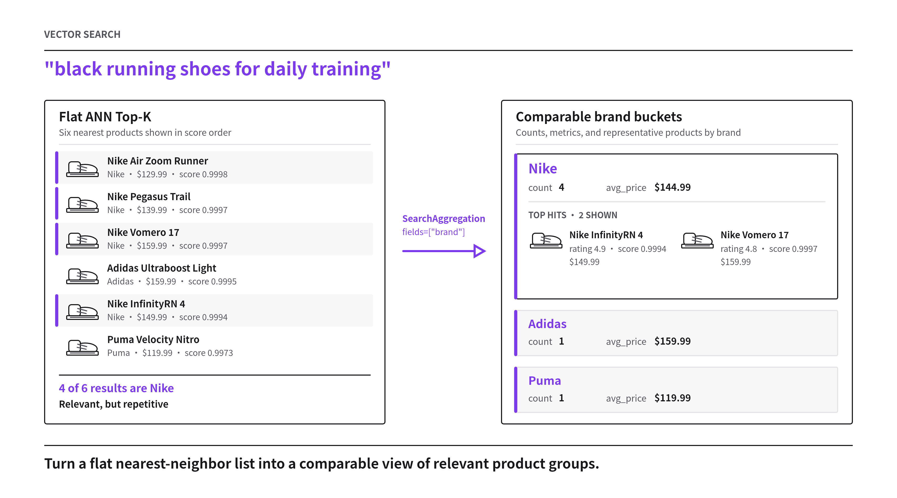
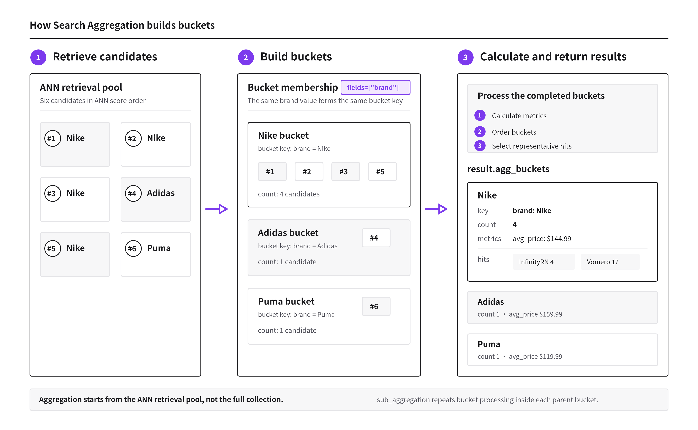

# Search Aggregation

When a shopper searches for "black running shoes for daily training," approximate nearest neighbor (ANN) search ranks products by vector similarity and returns a flat Top-K list. The results can be relevant but repetitive: in the example below, four of the first six results are Nike products, while Adidas and Puma appear once each.

A flat list cannot directly provide brand-level diversity or statistics. An application may need up to two representative products from each brand, the number of retrieved products for each brand, or the average price for each brand.

Search Aggregation organizes the retrieved entities into buckets based on a selected scalar field. In this example, each brand becomes a separate bucket. Milvus can then calculate statistics independently for each bucket and return representative products from each bucket, making the search results easier to compare and more diverse.



Search Aggregation summarizes the retrieved candidates rather than every entity in the collection. The bucket counts and metrics are therefore approximate and remain tied to vector relevance.

## How it works



1. **Retrieve candidates.** Milvus runs ANN search to create a retrieval pool of entities that are closest to the query vector. Search Aggregation operates on this pool rather than on every entity in the collection, so the pool determines which entities can contribute to the buckets.

2. **Build buckets.** `SearchAggregation.fields` specifies the scalar fields that form each bucket key. In the figure, `brand` places the six candidates into Nike, Adidas, and Puma buckets. When you specify multiple fields, entities share a bucket only when their field-value combinations match.

3. **Calculate and return results.** Milvus calculates the configured metrics for each bucket, orders the completed buckets, and uses `TopHits` to select representative entities. Each bucket in `result.agg_buckets` contains its key, count, metrics, hits, and optional child buckets.

With `sub_aggregation`, Milvus repeats steps 2 and 3 inside each parent bucket. Because every stage operates on the ANN retrieval pool, changes in search recall can change bucket counts, metrics, ordering, hits, and nested results.

## Limits

Before using Search Aggregation, note the following limits:

- **Nested aggregations:** A request can contain one root `SearchAggregation` and up to three nested `sub_aggregation` levels, for a maximum of four levels in total.

- **Fields used to create bucket keys:** `SearchAggregation.fields` does not support `FLOAT`, `DOUBLE`, vector, `JSON`, or dynamic fields.

- **Metric and sorting fields:** `metrics` and `TopHits.sort` do not support `JSON` or dynamic fields.

- **Repeated fields:** The same field cannot appear in more than one `SearchAggregation.fields` list. For example, if the root aggregation uses `fields=["category"]`, a nested `sub_aggregation` cannot also use `fields=["category"]`.

- **Unsupported combinations:** Search Aggregation cannot be combined with `offset`, Search Iterators, Hybrid Search, a Highlighter, `group_by_field`, or `group_by_fields`.

- **Returned entries:** Keep the configured maximum number of result entries at or below 10,000. Calculate this maximum as:

  `number of query vectors × size at every aggregation level × largest TopHits.size at any level`

  Use `1` for the last factor when no level configures `TopHits`. For example, one query vector, 10 root buckets, five child buckets per root bucket, and two hits per child bucket produce a configured maximum of:

  `1 × 10 × 5 × 2 = 100`

## Use Search Aggregation

Choose the example that matches what you want to configure:

| Goal | Key settings | Example |
|---|---|---|
| Build bucket keys | `fields`, `size` | [Build bucket keys](#build-bucket-keys) |
| Calculate statistics and order buckets | `metrics`, `order` | [Calculate metrics and order buckets](#calculate-metrics-and-order-buckets) |
| Return and sort representative hits | `top_hits`, `TopHits.size`, `TopHits.sort` | [Return and sort representative hits](#return-and-sort-representative-hits) |
| Create hierarchical results | `sub_aggregation` | [Create nested buckets](#create-nested-buckets) |

The examples below use a product collection with brand, category, color, price, and rating fields. Expand the following section to create the collection and define the shared search variables.

<details>

<summary>Set up the example collection</summary>

```python
from pymilvus import DataType, MilvusClient, SearchAggregation, TopHits

client = MilvusClient(
    uri="http://localhost:19530",
    token="root:Milvus",
)

collection_name = "product_search_aggregation"

if client.has_collection(collection_name):
    client.drop_collection(collection_name)

schema = client.create_schema(auto_id=False, enable_dynamic_field=False)
schema.add_field("id", DataType.INT64, is_primary=True)
schema.add_field("embedding", DataType.FLOAT_VECTOR, dim=5)
schema.add_field("name", DataType.VARCHAR, max_length=200)
schema.add_field("brand", DataType.VARCHAR, max_length=100)
schema.add_field("category", DataType.VARCHAR, max_length=100)
schema.add_field("color", DataType.VARCHAR, max_length=50)
schema.add_field("price", DataType.DOUBLE)
schema.add_field("rating", DataType.DOUBLE)
schema.add_field("in_stock", DataType.BOOL)

index_params = client.prepare_index_params()
index_params.add_index(
    field_name="embedding",
    index_type="AUTOINDEX",
    metric_type="COSINE",
)

client.create_collection(
    collection_name=collection_name,
    schema=schema,
    index_params=index_params,
)

client.insert(
    collection_name=collection_name,
    data=[
        {
            "id": 1,
            "embedding": [0.12, 0.42, 0.18, 0.66, 0.31],
            "name": "Nike Air Zoom Runner",
            "brand": "Nike",
            "category": "running_shoes",
            "color": "black",
            "price": 129.99,
            "rating": 4.7,
            "in_stock": True,
        },
        {
            "id": 2,
            "embedding": [0.10, 0.39, 0.20, 0.61, 0.29],
            "name": "Nike Pegasus Trail",
            "brand": "Nike",
            "category": "running_shoes",
            "color": "blue",
            "price": 139.99,
            "rating": 4.6,
            "in_stock": True,
        },
        {
            "id": 3,
            "embedding": [0.14, 0.44, 0.19, 0.68, 0.33],
            "name": "Adidas Ultraboost Light",
            "brand": "Adidas",
            "category": "running_shoes",
            "color": "white",
            "price": 159.99,
            "rating": 4.8,
            "in_stock": True,
        },
        {
            "id": 4,
            "embedding": [0.16, 0.41, 0.22, 0.62, 0.30],
            "name": "Puma Velocity Nitro",
            "brand": "Puma",
            "category": "running_shoes",
            "color": "red",
            "price": 119.99,
            "rating": 4.4,
            "in_stock": False,
        },
        {
            "id": 5,
            "embedding": [0.48, 0.20, 0.59, 0.15, 0.71],
            "name": "Nike Windrunner Jacket",
            "brand": "Nike",
            "category": "jackets",
            "color": "black",
            "price": 99.99,
            "rating": 4.5,
            "in_stock": True,
        },
        {
            "id": 6,
            "embedding": [0.45, 0.18, 0.55, 0.17, 0.69],
            "name": "Adidas Own The Run Jacket",
            "brand": "Adidas",
            "category": "jackets",
            "color": "blue",
            "price": 89.99,
            "rating": 4.3,
            "in_stock": True,
        },
        {
            "id": 7,
            "embedding": [0.09, 0.38, 0.17, 0.60, 0.27],
            "name": "Nike Vomero 17",
            "brand": "Nike",
            "category": "running_shoes",
            "color": "black",
            "price": 159.99,
            "rating": 4.8,
            "in_stock": True,
        },
        {
            "id": 8,
            "embedding": [0.13, 0.43, 0.21, 0.65, 0.32],
            "name": "Nike InfinityRN 4",
            "brand": "Nike",
            "category": "running_shoes",
            "color": "black",
            "price": 149.99,
            "rating": 4.9,
            "in_stock": True,
        },
    ],
)

client.flush(collection_name)
client.load_collection(collection_name)

query_vector = [0.11, 0.40, 0.19, 0.64, 0.30]
search_params = {
    "metric_type": "COSINE",
    "params": {},
}
```

</details>

The setup above configures `COSINE` for both the vector index and the search parameters. Therefore, later examples use `{"_score": "desc"}` to place higher cosine similarity first. For a distance metric such as `L2`, use `{"_score": "asc"}`.

### Build bucket keys

Start by creating a `SearchAggregation` object. The following configuration creates one bucket for each distinct `brand` value and selects up to three buckets to return:

```python
aggregation = SearchAggregation(
    # Form one bucket for each distinct brand value.
    fields=["brand"],
    # Return up to three buckets at this aggregation level.
    size=3,
)
```

The commonly used parameters are:

| Parameter | Value in this example | Purpose |
|---|---|---|
| `fields` | `["brand"]` | A non-empty list of scalar fields that form the bucket key. One field creates a one-part key. |
| `size` | `3` | The maximum number of buckets returned at this aggregation level. |

Pass the object to the `search_aggregation` parameter of `MilvusClient.search()`:

```python
result = client.search(
    collection_name=collection_name,
    data=[query_vector],
    anns_field="embedding",
    search_params=search_params,
    output_fields=[
        "name",
        "brand",
        "category",
        "color",
        "price",
        "rating",
        "in_stock",
    ],
    # highlight-next-line
    search_aggregation=aggregation,
)
```

<details>

<summary>View the example bucket output</summary>

The following output was captured from the request above and serialized as JSON for readability. PyMilvus returns `AggregationBucket` objects rather than JSON.

```json
[
  {
    "key": [
      {
        "field_id": 103,
        "field_name": "brand",
        "value": "Nike"
      }
    ],
    "count": 1,
    "metrics": {},
    "hits": [],
    "sub_groups": []
  },
  {
    "key": [
      {
        "field_id": 103,
        "field_name": "brand",
        "value": "Adidas"
      }
    ],
    "count": 1,
    "metrics": {},
    "hits": [],
    "sub_groups": []
  },
  {
    "key": [
      {
        "field_id": 103,
        "field_name": "brand",
        "value": "Puma"
      }
    ],
    "count": 1,
    "metrics": {},
    "hits": [],
    "sub_groups": []
  }
]
```

</details>

For the single query vector in this guide, read the returned top-level buckets from `result.agg_buckets[0]`. Each bucket exposes its `key`, retrieval-pool entity `count`, calculated `metrics`, representative `hits`, and nested buckets in `sub_groups`.

The following sections redefine `aggregation` for other use cases. Pass the updated object to the same `search_aggregation` parameter and rerun the search call.

Milvus ignores `limit` when `search_aggregation` is set. Use the root `SearchAggregation.size` value to control the number of top-level buckets.

To create a composite bucket key, pass multiple field names in the same list:

```python
aggregation = SearchAggregation(
    # Combine brand and color to form a composite bucket key.
    fields=["brand", "color"],
    size=6,
)
```

This configuration can produce keys such as `(Nike, black)`, `(Nike, blue)`, and `(Adidas, white)`. Two entities share a bucket only when both values match. Milvus preserves the list order, so `brand` is the first key component and `color` is the second. Pass multiple strings in one flat list; nested lists are not supported.

`size=6` is the maximum number of composite buckets returned at this aggregation level. The example data contains five distinct brand-color combinations, so all five can be returned. In the [returned-entry limit](#limits), this request contributes `1 query vector × 6 buckets × 1 = 6` configured result entries.

### Calculate metrics and order buckets

Add `metrics` and `order` when you need bucket statistics and a deterministic bucket order:

```python
aggregation = SearchAggregation(
    fields=["brand"],
    size=3,
    # highlight-start
    # Calculate named metrics for every selected bucket.
    metrics={
        "product_count": {"count": "*"},
        "avg_price": {"avg": "price"},
        "min_price": {"min": "price"},
    },
    # Sort buckets by average price, highest first.
    order=[
        {"avg_price": "desc"},
        # If average prices are equal, sort by bucket key in ascending order.
        {"_key": "asc"},
    ],
    # highlight-end
)
```

**Define bucket metrics.**

Each `SearchAggregation.metrics` entry maps a user-defined alias to `{operation: source}`:

| Alias | Operation | Source | Result |
|---|---|---|---|
| `product_count` | `count` | `"*"` | Counts every retrieval-pool entity assigned to the bucket. |
| `avg_price` | `avg` | `price` | Calculates the average of the non-null `price` values. |
| `min_price` | `min` | `price` | Returns the lowest non-null `price` value. |

Search Aggregation supports these metric operations:

- `count` accepts the special source `"*"` to count every entity in the bucket, or a field name to count entities whose field value is not `NULL`. For example, if a bucket contains 10 entities and two have `price` set to `NULL`, a `count` metric with source `"*"` returns 10, while one with source `"price"` returns 8.
- `sum`, `avg`, `min`, and `max` accept a supported numeric field or the built-in `_score` source, which represents the ANN similarity or distance. These operations skip `NULL` values.

To order buckets by a value derived from `_score`, define a metric alias based on `_score`, and then use that alias in `order`. `_score` is not a direct bucket-order key. For example, because this guide uses `COSINE`, define `"max_score": {"max": "_score"}` in `metrics`, and then use `{"max_score": "desc"}` in `order`. This places buckets whose best-matching entity has the higher similarity score first.

**Order buckets.**

`SearchAggregation.order` controls the order of the returned buckets. Each entry maps a sort key to `"asc"` or `"desc"`. Milvus evaluates multiple entries from first to last.

The sort key can be:

- a metric alias defined in `metrics` at the same aggregation level, such as `avg_price`;
- the built-in `_count` key, which represents the number of retrieval-pool entities in the bucket; or
- the built-in `_key` key, which represents the bucket key rather than a collection field named `_key`.

If you omit `order`, Milvus keeps the bucket discovery order from the retrieval pool. Set `order` when buckets must follow a metric, count, or key.

In this example:

| Entry | Effect |
|---|---|
| `{"avg_price": "desc"}` | Orders buckets from highest to lowest `avg_price`. |
| `{"_key": "asc"}` | Breaks ties in ascending bucket-key order. With `fields=["brand"]`, equal-price buckets follow lexical order: `Adidas`, `Nike`, then `Puma`. Buckets with different `avg_price` values are unaffected. With `fields=["brand", "color"]`, Milvus compares `brand` first and compares `color` only when the brand values are equal. |

### Return and sort representative hits

Use `TopHits` to return and sort representative entities from each selected bucket:

```python
aggregation = SearchAggregation(
    fields=["brand"],
    size=3,
    # highlight-start
    # Return and sort representative entities for each selected bucket.
    top_hits=TopHits(
        # Return up to two entities per bucket.
        size=2,
        # Apply sort criteria in list order.
        sort=[
            {"rating": "desc"},
            {"_score": "desc"},
        ],
    ),
    # highlight-end
)
```

<details>

<summary>View a bucket with representative hits</summary>

The following Nike bucket was captured from the request above and serialized as JSON for readability.

```json
{
  "key": [
    {
      "field_id": 103,
      "field_name": "brand",
      "value": "Nike"
    }
  ],
  "count": 2,
  "metrics": {},
  "hits": [
    {
      "pk": 1,
      "score": 0.9997663497924805,
      "fields": {
        "brand": "Nike",
        "name": "Nike Air Zoom Runner",
        "price": 129.99,
        "rating": 4.7
      }
    },
    {
      "pk": 2,
      "score": 0.9997047781944275,
      "fields": {
        "brand": "Nike",
        "name": "Nike Pegasus Trail",
        "price": 139.99,
        "rating": 4.6
      }
    }
  ],
  "sub_groups": []
}
```

</details>

| Parameter | Purpose |
|---|---|
| `top_hits` | Optional. Configures representative entities for this aggregation level. If omitted, Milvus still returns the bucket key, count, metrics, and child buckets, but `bucket.hits` is empty. |
| `TopHits.size` | Returns up to two representative entities from each selected bucket. |
| `TopHits.sort` | Orders entities inside each bucket using the listed criteria. |

Set `top_hits` only when the application needs representative entities from each bucket.

`SearchAggregation.order` sorts buckets, while `TopHits.sort` sorts entities inside each bucket. `TopHits.sort` accepts supported scalar field names and the built-in `_score` field, which represents the ANN similarity or distance. Milvus evaluates the `sort` entries from first to last. In this example, it orders products by `rating` from highest to lowest and uses `_score` only when two ratings are equal. Because the setup uses `COSINE`, descending `_score` places the more similar product first.

The fields used by `TopHits.sort` do not have to appear in `output_fields`. However, only fields in `output_fields` are included in each returned hit's `fields` mapping.

Each returned `AggregationHit` exposes its primary key in `pk`, vector score in `score`, and requested output fields in `fields`.

### Create nested buckets

Use `sub_aggregation` to run another aggregation within each parent bucket. The child aggregation receives only the entities assigned to its parent bucket. The following configuration first groups products by category and then groups the products in each category by brand:

```python
aggregation = SearchAggregation(
    fields=["category"],
    size=2,
    metrics={
        "product_count": {"count": "*"},
        "avg_price": {"avg": "price"},
    },
    order=[{"product_count": "desc"}],
    # highlight-start
    # For each category bucket, group only its entities by brand.
    sub_aggregation=SearchAggregation(
        fields=["brand"],
        size=3,
        metrics={
            "brand_count": {"count": "*"},
            "avg_rating": {"avg": "rating"},
        },
        order=[{"avg_rating": "desc"}],
        top_hits=TopHits(
            size=2,
            sort=[{"rating": "desc"}],
        ),
    ),
    # highlight-end
)
```

<details>

<summary>View a nested bucket result</summary>

The following serialized excerpt shows the `running_shoes` parent bucket and its Adidas child bucket. The Nike and Puma child buckets are omitted for brevity.

```json
{
  "key": [
    {
      "field_id": 104,
      "field_name": "category",
      "value": "running_shoes"
    }
  ],
  "count": 4,
  "metrics": {
    "avg_price": 137.49,
    "product_count": 4
  },
  "hits": [],
  "sub_groups": [
    {
      "key": [
        {
          "field_id": 103,
          "field_name": "brand",
          "value": "Adidas"
        }
      ],
      "count": 1,
      "metrics": {
        "avg_rating": 4.8,
        "brand_count": 1
      },
      "hits": [
        {
          "pk": 3,
          "score": 0.999454140663147,
          "fields": {
            "brand": "Adidas",
            "category": "running_shoes",
            "color": "white",
            "in_stock": true,
            "name": "Adidas Ultraboost Light",
            "price": 159.99,
            "rating": 4.8
          }
        }
      ],
      "sub_groups": []
    }
  ]
}
```

</details>

Milvus first selects up to two category buckets, ordered by `product_count`. It then runs `sub_aggregation` independently within each selected category and returns up to three brand buckets, ordered by `avg_rating`.

In the output above:

- The root `running_shoes` bucket contains four retrieval-pool entities. Its `metrics` contain the root-level `avg_price` and `product_count` values.
- The root bucket's `sub_groups` list contains the child brand buckets. The displayed Adidas bucket contains one entity and its own `avg_rating` and `brand_count` values.
- The root bucket's `hits` list is empty because the root aggregation does not configure `top_hits`. The Adidas child contains a representative hit because `top_hits` is configured in `sub_aggregation`.

## FAQ

### How accurate are bucket counts and metrics?

Search Aggregation summarizes the ANN retrieval pool. It does not run a full-collection aggregation.

For example, suppose a collection contains 5,000 Nike products, but the retrieval pool for one query contains 35 Nike products. A `product_count` metric in the Nike bucket describes those 35 retrieved products. It does not report 5,000.

Approximation matters most when `order` uses a metric alias. Changes in search recall can change the metric values and therefore change which buckets fit within `SearchAggregation.size`. Nested aggregation can amplify this effect because each child level operates on the entities available in its parent bucket.

If you need exact statistics over every matching entity, use an exact query aggregation workflow instead of Search Aggregation.

### How does Search Aggregation differ from Grouping Search?

Use [Grouping Search](grouping-search.md) when your goal is to improve result diversity and control how many entities each group returns.

Use Search Aggregation when you need structured bucket results, such as composite keys, per-bucket metrics, bucket ordering, independently sorted representative hits, or nested buckets. Search Aggregation uses a separate API and returns its results through `result.agg_buckets`.

Do not combine `search_aggregation` with `group_by_field` or `group_by_fields` in the same request.
